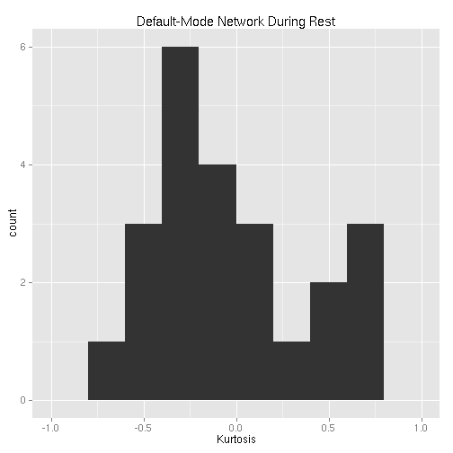
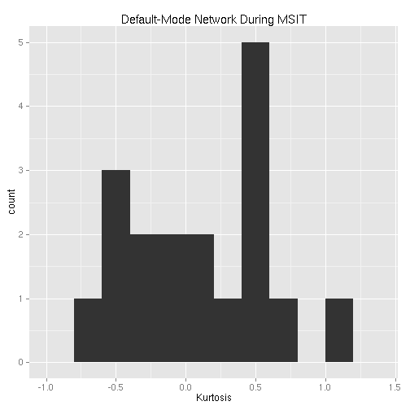
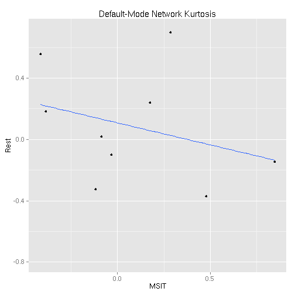
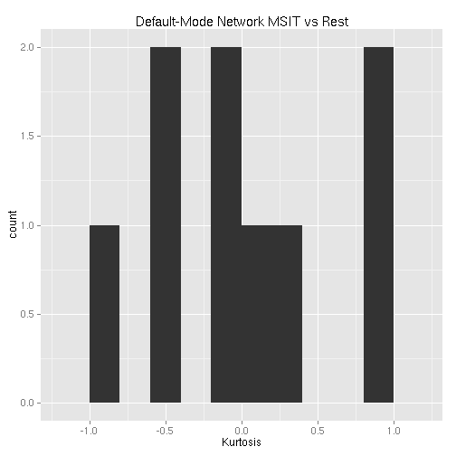
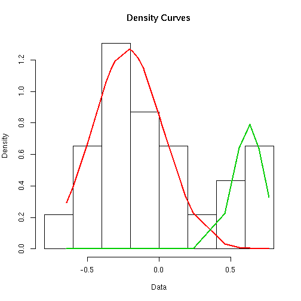

# Kurtosis

Note that actual code is loaded from a different file.


```r
read_chunk("02_kurtosis.R")
```


## Setup


```r
library(plyr)
library(e1071)
library(ggplot2)
basedir <- "/home2/data/Projects/CCD"
```


```r
network_names <- c("medial visual", "occipital pole visual", "lateral visual", 
    "default network", "cerebellum", "sensorimotor", "auditory", "executive control", 
    "right frontoparietal", "left frontoparietal")
network_names <- gsub(" ", ".", network_names)
dmn <- which(network_names == "default.network")
```


## Read in Data


```r
fname <- file.path(basedir, "behavior/ccd_totals_touse.csv")
phenos <- read.csv(fname, row.names = 1)
```


```r
# Rest
fnames <- sort(Sys.glob(file.path(basedir, "analysis/subjects/*/rest/run_01/rsn10.1D")))
rest_tcs <- laply(fnames, function(f) as.matrix(read.table(f)), .progress = "text")

# MSIT Run 1
fnames <- sort(Sys.glob(file.path(basedir, "analysis/subjects/*/msit/run_01/rsn10.1D")))
msit_run1_tcs <- laply(fnames, function(f) as.matrix(read.table(f)), .progress = "text")

# MSIT Run 2
fnames <- sort(Sys.glob(file.path(basedir, "analysis/subjects/*/msit/run_02/rsn10.1D")))
msit_run2_tcs <- laply(fnames, function(f) as.matrix(read.table(f)), .progress = "text")
```


Analyses will focus on the default-mode network so restrict time-series to only this network.


```r
rest_tcs <- rest_tcs[, , dmn]
msit_run1_tcs <- msit_run1_tcs[, , dmn]
msit_run2_tcs <- msit_run2_tcs[, , dmn]
```


## Calculate Kurtosis


```r
rest_kurtosis <- aaply(rest_tcs, 1, kurtosis, .progress = "text")
msit_run1_kurtosis <- aaply(msit_run1_tcs, 1, kurtosis, .progress = "text")
msit_run2_kurtosis <- aaply(msit_run2_tcs, 1, kurtosis, .progress = "text")
```


## Combine Phenotypic and Kurtosis Data


```r
# Rest
df.rest <- data.frame(phenos, kurtosis = rest_kurtosis)

# MSIT
n <- length(msit_run1_kurtosis)
df.msit <- data.frame(study_id = factor(rep(phenos$study_id[1:n], 2)), run = factor(rep(c(1, 
    2), each = n)), rbind(phenos[1:n, -1], phenos[1:n, -1]), kurtosis = c(msit_run1_kurtosis, 
    msit_run2_kurtosis))

# MSIT (average 2 runs) & Rest
df.msit_and_rest <- data.frame(study_id = factor(rep(phenos$study_id[1:n], 2)), 
    scan = factor(rep(c("msit", "rest"), each = n)), rbind(phenos[1:n, -1], 
        phenos[1:n, -1]), kurtosis = c((msit_run1_kurtosis + msit_run2_kurtosis)/2, 
        rest_kurtosis[1:n]))
mat.msit_and_rest <- data.frame(study_id = phenos$study_id[1:n], msit = (msit_run1_kurtosis + 
    msit_run2_kurtosis)/2, rest = rest_kurtosis[1:n])

# Difference between MSIT (average 2 runs) & Rest
df.msit_vs_rest <- data.frame(study_id = phenos$study_id[1:n], phenos[1:n, -1], 
    kurtosis = (msit_run1_kurtosis + msit_run2_kurtosis)/2 - rest_kurtosis[1:n])
```


### Bi-Modal Rest Kurtosis Distribution


```r
# Rest
ggplot(df.rest, aes(x = kurtosis)) + geom_histogram(binwidth = 0.2) + labs(title = "Default-Mode Network During Rest", 
    x = "Kurtosis")
```

 

```r
# MSIT
ggplot(df.msit, aes(x = kurtosis)) + geom_histogram(binwidth = 0.2) + labs(title = "Default-Mode Network During MSIT", 
    x = "Kurtosis")
```

 

```r
# Scan Effect (MSIT/Rest)
ggplot(mat.msit_and_rest, aes(x = msit, y = rest)) + geom_point() + geom_smooth(method = "lm") + 
    labs(title = "Default-Mode Network Kurtosis", x = "MSIT", y = "Rest")
```

 

```r
# MSIT vs Rest
ggplot(df.msit_vs_rest, aes(x = kurtosis)) + geom_histogram(binwidth = 0.2) + 
    labs(title = "Default-Mode Network MSIT vs Rest", x = "Kurtosis")
```

 

The distribution for the kurtosis values during rest appear bimodal (1st figure).Thus, we fit a Gaussian mixture model to the distribution, separating individuals based on the resulting clustering and running analyses separetly for each group. This would be in addition to running the analyses with all subjects together in one group.

I used the `mixtools` library with default settings. Group assignment was determined based on a posterior probability  greater than 0.5 for one group vs another.


```r
library(mixtools)

mixmdl <- normalmixEM(rest_kurtosis, k = 2)
```

```
## number of iterations= 42
```

```r
plot(mixmdl, which = 2)
```

 

```r

grps <- factor((mixmdl$posterior[, 1] > 0.5) * 1 + 1, labels = c("Positive", 
    "Negative"))
df.pos <- df.rest[grps == "Positive", ]
df.neg <- df.rest[grps == "Negative", ]

msg = paste("Mean Kurtosis of:\n", "positive group = ", mean(df.pos$kurtosis), 
    "\n", "negative group = ", mean(df.neg$kurtosis), "\n")
cat(msg)
```

```
## Mean Kurtosis of:
##  positive group =  0.6226538062082 
##  negative group =  -0.225985576243624
```


## ANOVAs

### For Total Scores

First, we will look at the relationship between total phenotypic scores and DMN kurtosis.


```r
# During Rest
summary(aov(kurtosis ~ Age + Sex + SIPI + RRS + ERQ + BDI + AIM, df.rest))
```

```
##             Df Sum Sq Mean Sq F value Pr(>F)
## Age          1   0.00  0.0001    0.00   0.99
## Sex          1   0.31  0.3142    1.40   0.25
## SIPI         1   0.08  0.0836    0.37   0.55
## RRS          1   0.06  0.0616    0.27   0.61
## ERQ          1   0.00  0.0012    0.01   0.94
## BDI          1   0.09  0.0924    0.41   0.53
## AIM          1   0.01  0.0094    0.04   0.84
## Residuals   15   3.36  0.2240
```

```r
# During MSIT
summary(aov(kurtosis ~ Age + Sex + SIPI + RRS + ERQ + BDI + AIM, df.msit))
```

```
##             Df Sum Sq Mean Sq F value Pr(>F)
## Age          1  0.509   0.509    2.31   0.16
## Sex          1  0.580   0.580    2.63   0.14
## SIPI         1  0.286   0.286    1.30   0.28
## RRS          1  0.085   0.085    0.39   0.55
## ERQ          1  0.535   0.535    2.43   0.15
## BDI          1  0.019   0.019    0.09   0.78
## AIM          1  0.002   0.002    0.01   0.92
## Residuals   10  2.207   0.221
```

```r
# Effects of Scan (MSIT/Rest)
summary(aov(kurtosis ~ Age + Sex + scan + Error(study_id), df.msit_and_rest))
```

```
## 
## Error: study_id
##           Df Sum Sq Mean Sq F value Pr(>F)
## Age        1  0.071  0.0714    0.56   0.48
## Sex        1  0.005  0.0049    0.04   0.85
## Residuals  6  0.760  0.1267               
## 
## Error: Within
##           Df Sum Sq Mean Sq F value Pr(>F)
## scan       1    0.0   0.000       0      1
## Residuals  8    1.6   0.201
```

```r
# MSIT vs REST
summary(aov(kurtosis ~ Age + Sex + SIPI + RRS + ERQ + BDI + AIM, df.msit_vs_rest))
```

```
##             Df Sum Sq Mean Sq F value Pr(>F)
## Age          1  0.398   0.398    0.84   0.53
## Sex          1  1.382   1.382    2.93   0.34
## SIPI         1  0.204   0.204    0.43   0.63
## RRS          1  0.446   0.446    0.94   0.51
## ERQ          1  0.023   0.023    0.05   0.86
## BDI          1  0.059   0.059    0.12   0.78
## AIM          1  0.225   0.225    0.48   0.62
## Residuals    1  0.472   0.472
```


### For Certain SubScales

Now, we will look at the relationship between subscale phenotypic scores and DMN kurtosis. I will only be looking at the following subscales:

* RRS
    * Brooding
    * Reflection
    * Depression
* PANAS
    * Positive
    * Negative


```r
# During Rest
summary(aov(kurtosis ~ Age + Sex + RRS_Brooding + RRS_Reflection + RRS_Depression + 
    PANAS_Positive + PANAS_Negative, df.rest))
```

```
##                Df Sum Sq Mean Sq F value Pr(>F)
## Age             1  0.000   0.000    0.00   0.99
## Sex             1  0.314   0.314    1.72   0.21
## RRS_Brooding    1  0.536   0.536    2.94   0.11
## RRS_Reflection  1  0.217   0.217    1.19   0.29
## RRS_Depression  1  0.017   0.017    0.09   0.76
## PANAS_Positive  1  0.018   0.018    0.10   0.76
## PANAS_Negative  1  0.084   0.084    0.46   0.51
## Residuals      15  2.736   0.182
```

```r
# During MSIT
summary(aov(kurtosis ~ Age + Sex + RRS_Brooding + RRS_Reflection + RRS_Depression + 
    PANAS_Positive + PANAS_Negative, df.msit))
```

```
##                Df Sum Sq Mean Sq F value Pr(>F)
## Age             1  0.509   0.509    2.69   0.13
## Sex             1  0.580   0.580    3.07   0.11
## RRS_Brooding    1  0.193   0.193    1.02   0.34
## RRS_Reflection  1  0.546   0.546    2.89   0.12
## RRS_Depression  1  0.462   0.462    2.45   0.15
## PANAS_Positive  1  0.039   0.039    0.21   0.66
## PANAS_Negative  1  0.005   0.005    0.02   0.88
## Residuals      10  1.889   0.189
```

```r
# MSIT vs REST
summary(aov(kurtosis ~ Age + Sex + SIPI + RRS_Brooding + RRS_Reflection + RRS_Depression + 
    PANAS_Positive + PANAS_Negative, df.msit_vs_rest))
```

```
##                Df Sum Sq Mean Sq
## Age             1  0.398   0.398
## Sex             1  1.382   1.382
## SIPI            1  0.204   0.204
## RRS_Brooding    1  0.125   0.125
## RRS_Reflection  1  0.525   0.525
## RRS_Depression  1  0.024   0.024
## PANAS_Positive  1  0.054   0.054
## PANAS_Negative  1  0.497   0.497
```


## ANOVAs for Bi-Modal Group Stratification

Note that due to small number of subjects in the positive group and the consequent decreased degrees of freedom, I had to run the analyses for the positive group in seperate regressions instead of one multiple regression.

### For Total Scores


```r
# Negative Group
summary(aov(kurtosis ~ Age + Sex + SIPI + RRS + ERQ + BDI + AIM, df.neg))
```

```
##             Df Sum Sq Mean Sq F value Pr(>F)
## Age          1  0.137  0.1368    2.65   0.13
## Sex          1  0.057  0.0565    1.09   0.32
## SIPI         1  0.142  0.1421    2.75   0.13
## RRS          1  0.052  0.0521    1.01   0.34
## ERQ          1  0.033  0.0325    0.63   0.45
## BDI          1  0.106  0.1062    2.05   0.18
## AIM          1  0.004  0.0037    0.07   0.80
## Residuals   10  0.517  0.0517
```

```r
# Positive Group
summary(aov(kurtosis ~ Age + Sex + SIPI, df.pos))
```

```
##             Df Sum Sq Mean Sq F value Pr(>F)
## Age          1 0.0080  0.0080    0.21   0.73
## Sex          1 0.0120  0.0120    0.31   0.67
## SIPI         1 0.0000  0.0000    0.00   0.99
## Residuals    1 0.0381  0.0381
```

```r
summary(aov(kurtosis ~ Age + Sex + RRS, df.pos))
```

```
##             Df  Sum Sq Mean Sq F value Pr(>F)
## Age          1 0.00799 0.00799    0.56   0.59
## Sex          1 0.01198 0.01198    0.84   0.53
## RRS          1 0.02379 0.02379    1.67   0.42
## Residuals    1 0.01427 0.01427
```

```r
summary(aov(kurtosis ~ Age + Sex + ERQ, df.pos))
```

```
##             Df Sum Sq Mean Sq F value Pr(>F)
## Age          1 0.0080  0.0080    5.85   0.25
## Sex          1 0.0120  0.0120    8.77   0.21
## ERQ          1 0.0367  0.0367   26.86   0.12
## Residuals    1 0.0014  0.0014
```

```r
summary(aov(kurtosis ~ Age + Sex + BDI, df.pos))
```

```
##             Df Sum Sq Mean Sq F value Pr(>F)
## Age          1 0.0080  0.0080    0.24   0.71
## Sex          1 0.0120  0.0120    0.36   0.66
## BDI          1 0.0048  0.0048    0.15   0.77
## Residuals    1 0.0332  0.0332
```

```r
summary(aov(kurtosis ~ Age + Sex + AIM, df.pos))
```

```
##             Df Sum Sq Mean Sq F value Pr(>F)
## Age          1 0.0080  0.0080    0.21   0.73
## Sex          1 0.0120  0.0120    0.32   0.67
## AIM          1 0.0003  0.0003    0.01   0.95
## Residuals    1 0.0378  0.0378
```


### For Certain SubScales

**Only one significant relationship, RRS Brooding with DMN Kurtosis.**


```r
# Negative Group
summary(aov(kurtosis ~ Age + Sex + RRS_Brooding + RRS_Reflection + RRS_Depression + 
    PANAS_Positive + PANAS_Negative, df.neg))
```

```
##                Df Sum Sq Mean Sq F value Pr(>F)  
## Age             1  0.137  0.1368    2.43  0.150  
## Sex             1  0.057  0.0565    1.00  0.340  
## RRS_Brooding    1  0.211  0.2107    3.74  0.082 .
## RRS_Reflection  1  0.010  0.0101    0.18  0.681  
## RRS_Depression  1  0.024  0.0242    0.43  0.527  
## PANAS_Positive  1  0.042  0.0419    0.74  0.409  
## PANAS_Negative  1  0.004  0.0036    0.06  0.806  
## Residuals      10  0.563  0.0563                 
## ---
## Signif. codes:  0 '***' 0.001 '**' 0.01 '*' 0.05 '.' 0.1 ' ' 1
```

```r
# Positive Group
summary(aov(kurtosis ~ Age + Sex + RRS_Brooding, df.pos))
```

```
##              Df  Sum Sq Mean Sq F value Pr(>F)
## Age           1 0.00799 0.00799    0.32   0.67
## Sex           1 0.01198 0.01198    0.49   0.61
## RRS_Brooding  1 0.01340 0.01340    0.54   0.60
## Residuals     1 0.02465 0.02465
```

```r
summary(aov(kurtosis ~ Age + Sex + RRS_Reflection, df.pos))
```

```
##                Df  Sum Sq Mean Sq F value Pr(>F)
## Age             1 0.00799 0.00799    0.56   0.59
## Sex             1 0.01198 0.01198    0.84   0.53
## RRS_Reflection  1 0.02386 0.02386    1.68   0.42
## Residuals       1 0.01420 0.01420
```

```r
summary(aov(kurtosis ~ Age + Sex + RRS_Depression, df.pos))
```

```
##                Df  Sum Sq Mean Sq F value Pr(>F)
## Age             1 0.00799 0.00799    0.47   0.62
## Sex             1 0.01198 0.01198    0.70   0.56
## RRS_Depression  1 0.02090 0.02090    1.22   0.47
## Residuals       1 0.01715 0.01715
```

```r
summary(aov(kurtosis ~ Age + Sex + PANAS_Positive, df.pos))
```

```
##                Df  Sum Sq Mean Sq F value Pr(>F)
## Age             1 0.00799 0.00799    0.40   0.64
## Sex             1 0.01198 0.01198    0.60   0.58
## PANAS_Positive  1 0.01819 0.01819    0.92   0.51
## Residuals       1 0.01986 0.01986
```

```r
summary(aov(kurtosis ~ Age + Sex + PANAS_Negative, df.pos))
```

```
##                Df Sum Sq Mean Sq F value Pr(>F)
## Age             1 0.0080  0.0080    1.77   0.41
## Sex             1 0.0120  0.0120    2.65   0.35
## PANAS_Negative  1 0.0335  0.0335    7.43   0.22
## Residuals       1 0.0045  0.0045
```

