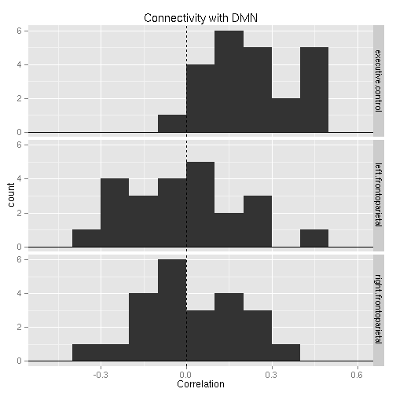
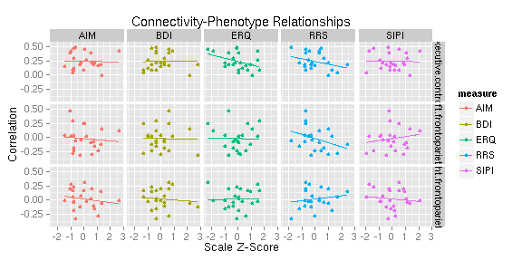
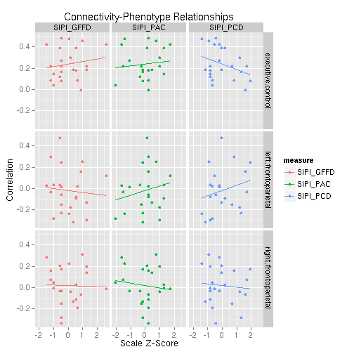
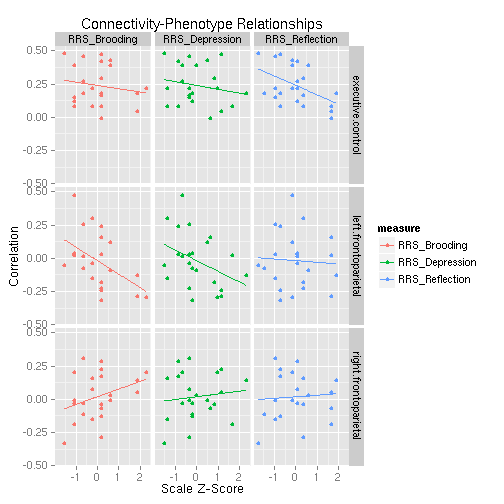
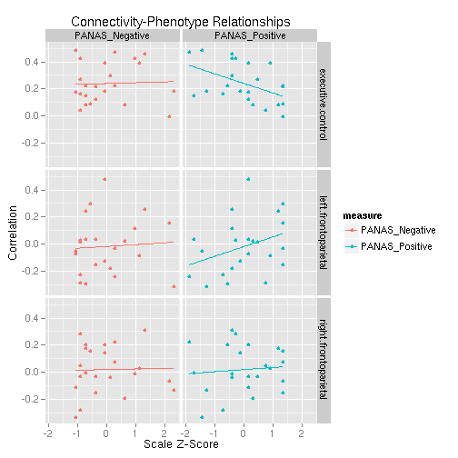

# Network Connectivity

Note that actual code is loaded from a different file.


```r
read_chunk("03_network_connectivity.R")
```


## Setup


```r
library(plyr)
library(reshape)
```

```
## Attaching package: 'reshape'
```

```
## The following object(s) are masked from 'package:plyr':
## 
## rename, round_any
```

```r
library(ggplot2)
```

```
## Loading required package: methods
```

```r
basedir <- "/home2/data/Projects/CCD"
```


```r
network_names <- c("medial visual", "occipital pole visual", "lateral visual", 
    "default network", "cerebellum", "sensorimotor", "auditory", "executive control", 
    "right frontoparietal", "left frontoparietal")
network_names <- gsub(" ", ".", network_names)
dmn <- which(network_names == "default.network")
tps <- 8:10
```


### Read in Data


```r
fname <- file.path(basedir, "behavior/ccd_totals_touse.csv")
phenos <- read.csv(fname, row.names = 1)
```


```r
fnames <- sort(Sys.glob(file.path(basedir, "analysis/subjects/*/rest/run_01/rsn10.1D")))
rest_tcs <- laply(fnames, function(f) as.matrix(read.table(f)))
rest_tcs <- rest_tcs[, , c(dmn, tps)]
```


Note since analyses will focus on the default-mode network and the task positive networks, time-series will be restricted to only those networks.


## Connectivity

For each subject, calculate the correlation between the DMN time-series and each of 3 TP time-series.


```r
rest_conn <- aaply(rest_tcs, 1, cor)
rest_conn <- rest_conn[, -1, 1]  # only look at DMN connectivity with TP networks
colnames(rest_conn) <- network_names[tps]
names(dimnames(rest_conn)) <- c("subjects", "networks")
rest_conn
```

```
##         networks
## subjects executive.control right.frontoparietal left.frontoparietal
##       1           0.083891            -0.191988             0.01978
##       2           0.084717             0.158241             0.29943
##       3           0.481685            -0.333323            -0.05599
##       4           0.473743             0.224075            -0.23917
##       5           0.455081             0.309532             0.25369
##       6           0.181667            -0.131148            -0.31457
##       7           0.268529            -0.034411             0.01492
##       8           0.294297            -0.039687            -0.18061
##       9           0.391924             0.201970             0.47545
##       10          0.424079            -0.010988             0.11693
##       11          0.121752            -0.030745             0.03444
##       12          0.040938             0.048803            -0.28633
##       13          0.422123             0.280951             0.02877
##       14          0.182321             0.141492            -0.13037
##       15          0.219550             0.072720            -0.03550
##       16          0.146454            -0.008729             0.03150
##       17         -0.008234            -0.066889             0.15641
##       18          0.078349             0.173039             0.24086
##       19          0.218871            -0.154438            -0.15270
##       20          0.220138             0.199491            -0.29388
##       21          0.390617             0.028109            -0.08993
##       22          0.175987            -0.113726            -0.07558
##       23          0.162978            -0.284650            -0.23095
```


### Distribution


```r
df <- melt(rest_conn)
colnames(df) <- c("subject", "network", "connectivity")
ggplot(df, aes(x = connectivity)) + geom_histogram(binwidth = 0.1) + facet_grid(network ~ 
    .) + geom_vline(aes(xintercept = 0), linetype = "dashed") + geom_hline(aes(yintercept = 0)) + 
    labs(title = "Connectivity with DMN", x = "Correlation")
```

 


## Brain-Behavior

Generally the approach below is to examine the relationship between each phenotypic measure and DMN/TP network connectivity via scatter plots and a table of Z-Scores assessing the significance of the relationships.

### Needed Functions


```r
# note: i am being lazy here and using global variables inside these
# function calls
brainbehavior.plot <- function(names) {
    zscore <- function(x) (x - mean(x))/sd(x)
    bb.df <- ddply(df, .(subject, network), function(sdf) {
        sid <- sdf$subject[[1]]
        sdf <- data.frame(sdf[rep(1, length(names)), ], measure = names, behavior = as.numeric(phenos[sid, 
            names]))
        sdf
    })
    bb.df <- ddply(bb.df, .(network, measure), function(sdf) {
        sdf$behavior <- zscore(sdf$behavior)
        sdf
    })
    
    p <- ggplot(bb.df, aes(x = behavior, y = connectivity)) + geom_point(aes(color = measure)) + 
        geom_smooth(aes(color = measure), method = "lm") + facet_grid(network ~ 
        measure) + labs(title = "Connectivity-Phenotype Relationships", x = "Scale Z-Score", 
        y = "Correlation")
    print(p)
    
    invisible(bb.df)
}

create_table <- function(tab) {
    tab <- cbind(rownames(tab), tab)
    cat(paste(colnames(tab), collapse = " | "), "\n")
    cat(paste(rep("---", ncol(tab)), collapse = " | "), "\n")
    cat(apply(tab, 1, function(x) paste(x, collapse = " | ")), sep = "\n")
}

brainbehavior.signif <- function(names) {
    brain.behavior <- aaply(rest_conn, 2, function(connectivity) {
        f <- paste("connectivity ~ Age + Sex +", paste(names, collapse = " + "))
        f <- as.formula(f)
        tab <- summary(aov(f, phenos))
        tab[[1]][names, "Pr(>F)"]
    })
    colnames(brain.behavior) <- names
    brain.behavior <- round(qt(brain.behavior, Inf, lower.tail = F), 2)
    brain.behavior
}
```


### For Each Total Score


```r
names <- c("SIPI", "RRS", "ERQ", "BDI", "AIM")
brainbehavior.plot(names)
```

 

```r
create_table(brainbehavior.signif(names))
```

 | SIPI | RRS | ERQ | BDI | AIM 
--- | --- | --- | --- | --- | --- 
executive.control | -1.4 | 0.84 | 1.15 | -1.77 | -0.28
right.frontoparietal | -0.71 | 0.5 | -0.35 | -2.25 | -0.34
left.frontoparietal | 0.83 | 1.03 | -0.69 | -1.41 | 0.31

```r
## TODO: indicate what is significant from above! (maybe in bold?)
```


### For SIPI SubScale


```r
names <- c("SIPI_PAC", "SIPI_GFFD", "SIPI_PCD")
brainbehavior.plot(names)
```

 

```r
brainbehavior.signif(names)
```

```
##                       
## networks               SIPI_PAC SIPI_GFFD SIPI_PCD
##   executive.control       -0.40     -0.12     0.59
##   right.frontoparietal    -0.16     -0.48    -1.09
##   left.frontoparietal      0.64      0.69     1.43
```


### For RRS SubScale


```r
names <- c("RRS_Brooding", "RRS_Reflection", "RRS_Depression")
brainbehavior.plot(names)
```

 

```r
brainbehavior.signif(names)
```

```
##                       
## networks               RRS_Brooding RRS_Reflection RRS_Depression
##   executive.control           -0.18           1.73           0.13
##   right.frontoparietal         1.54          -0.23          -1.19
##   left.frontoparietal          1.68           0.41           0.89
```


### For PANAS SubScale


```r
names <- c("PANAS_Positive", "PANAS_Negative")
brainbehavior.plot(names)
```

 

```r
brainbehavior.signif(names)
```

```
##                       
## networks               PANAS_Positive PANAS_Negative
##   executive.control              1.80          -0.69
##   right.frontoparietal          -0.39          -1.07
##   left.frontoparietal            1.43          -0.54
```


