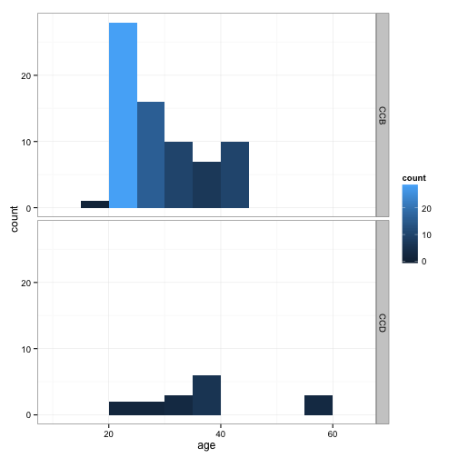
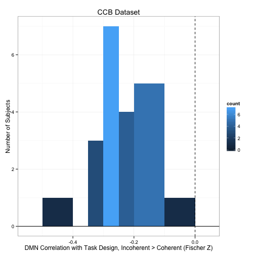
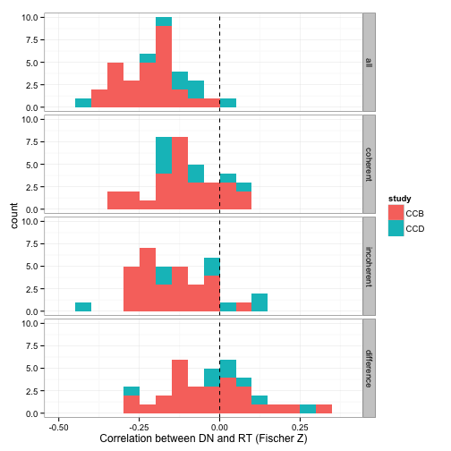
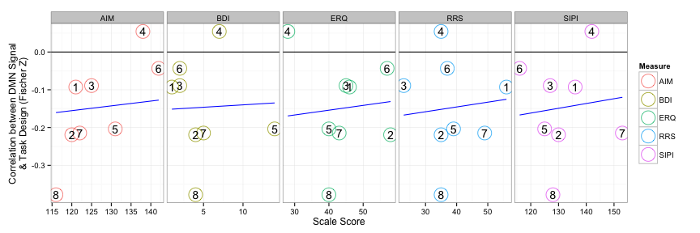
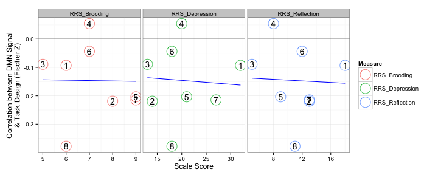

# Association between MSIT task design and DN signal

Note that actual code is loaded from a different file.


```r
read_chunk("04_msit_dmn_task.R")
```


## Setup


```r
library(plyr)
library(e1071)
library(ggplot2)
library(RColorBrewer)
library(robustbase)
library(reshape)
basedir <- dirname(dirname(getwd()))  # assume running in current direcotry
scriptdir <- file.path(basedir, "scripts/04_msit_task")
datadir <- file.path(basedir, "scripts/data")
oldtheme <- theme_set(theme_bw())
```


```r
network_names <- c("medial visual", "occipital pole visual", "lateral visual", 
    "default network", "cerebellum", "sensorimotor", "auditory", "executive control", 
    "right frontoparietal", "left frontoparietal")
network_names <- gsub(" ", ".", network_names)
dmn <- 4
tps <- 8:10
```


```r
# only CCD subjects with MSIT
phenos <- read.csv(file.path(datadir, "ccd_totals_touse.csv"))[1:9, -1]
subinfo <- read.csv(file.path(scriptdir, "z_predesign.csv"))
subinfo$study <- factor(subinfo$study, labels = c("CCB", "CCD"))
subinfo$scan <- factor(subinfo$scan)
subinfo$run <- factor(subinfo$run)
subinfo$sex <- factor(subinfo$sex)
# Plot Age
ggplot(subinfo, aes(x = age, fill = ..count..)) + geom_histogram(binwidth = 5) + 
    facet_grid(study ~ .)
```

 

```r
# Plot Sex
ggplot(subinfo, aes(x = sex, fill = study)) + geom_bar()
```

 


Note that negative signal here are the congruent trials and positive signal are the incongruent trials. What do you think would happen if the positives and negatives got together?


```r
# CCB
ccb_waver <- read.table(file.path(scriptdir, "level1_ccb_template.mat"), skip = 5)
ccb_waver <- as.matrix(ccb_waver)[, c(1, 3)]
ccb_waver <- ccb_waver[, 2] - ccb_waver[, 1]
tmpdf <- data.frame(time = seq(0, by = 1.75, length.out = length(ccb_waver)), 
    predicted_signal = ccb_waver)
ggplot(tmpdf, aes(time, predicted_signal)) + geom_line() + xlab("Time (secs)") + 
    ylab("Predicted Signal") + ggtitle("For CCB Subjects")
```

 

```r
# CCD
ccd_waver <- read.table(file.path(scriptdir, "level1_ccd_template.mat"), skip = 5)
ccd_waver <- as.matrix(ccd_waver)[, c(1, 3)]
ccd_waver <- ccd_waver[, 2] - ccd_waver[, 1]
tmpdf <- data.frame(time = seq(0, by = 2, length.out = length(ccd_waver)), predicted_signal = ccd_waver)
ggplot(tmpdf, aes(time, predicted_signal)) + geom_line() + xlab("Time (secs)") + 
    ylab("Predicted Signal") + ggtitle("For CCD Subjects")
```

 


```r
load(file.path(datadir, "ccb+ccd_rts_all.rda"))  # rts
rts$scan <- factor(rts$scan)
rts$run <- factor(rts$run)
```


```r
# this loads the 'tss' object with attr(tss, 'split_labels') to get how
# stuff should be organized
load(file.path(basedir, "scripts/data/ccb+ccd_time_series.rda"))
splitter <- attr(tss, "split_labels")
splitter$index <- 1:nrow(splitter)
# only look at time-series for MSIT with associated RT info note: there's
# proly a better
splitter <- ddply(splitter, .(study, subject, condition, scan, run), function(x) {
    if (x$condition == "REST") 
        return(x)
    has_any <- any(ddply(subset(rts, trial == 1), .(study, subject, condition, 
        scan, run), function(y) {
        as.character(x$subject) == as.character(y$subject) & x$scan == y$scan & 
            x$run == y$run
    })$V1)
    if (has_any) 
        return(x) else return(data.frame())
})
```


## Group Average

Get the xmin and xmax for showing blocks.


```r
# CCB
ccb_coherent <- read.table(file.path(scriptdir, "CCB_coherent.1D"))[, 1]
ccb_incoherent <- read.table(file.path(scriptdir, "CCB_incoherent.1D"))[, 1]
tmp <- diff(ccb_coherent - ccb_incoherent)
# +1 to adjust for relative; +3 to adjust for HRF delay
ccb_event_tpts <- data.frame(xmin = c(0, which(tmp != 0) + 1 + 3), xmax = c(which(tmp != 
    0) + 1 + 3, length(ccb_coherent)), block = factor(c("Fixation", rep(c("Coherent", 
    "Incoherent"), length.out = sum(tmp != 0) - 1), "Fixation")))
ccb_event_tpts$xmin <- ccb_event_tpts$xmin * 1.75
ccb_event_tpts$xmax <- ccb_event_tpts$xmax * 1.75
# CCD
ccd_coherent <- read.table(file.path(scriptdir, "CCD_coherent.1D"))[, 1]
ccd_incoherent <- read.table(file.path(scriptdir, "CCD_incoherent.1D"))[, 1]
tmp <- diff(ccd_coherent - ccd_incoherent)
# +1 to adjust for relative; +3 to adjust for HRF delay
ccd_event_tpts <- data.frame(xmin = c(0, which(tmp != 0) + 1 + 3), xmax = c(which(tmp != 
    0) + 1 + 3, length(ccd_coherent)), block = factor(c("Fixation", rep(c("Coherent", 
    "Incoherent"), length.out = sum(tmp != 0) - 1), "Fixation")))
ccd_event_tpts$xmin <- ccd_event_tpts$xmin * 2
ccd_event_tpts$xmax <- ccd_event_tpts$xmax * 2
```


### BOLD Time Series

Compute the group average MSIT BOLD signal.


```r
# CCB
sub_splitter <- subset(splitter, condition == "MSIT" & study == "CCB")
sub_splitter$subject <- factor(sub_splitter$subject)
ccb_msit_tcs <- daply(sub_splitter, .(subject), function(sdf) {
    tcs <- sapply(sdf$index, function(ii) {
        x <- tss[[ii]][, dmn]
        bad_trials <- is.na(subset(rts, subject == as.character(sdf$subject[ii]) & 
            scan == sdf$scan[ii] & run == sdf$run[ii])$rt)
        bad_trials <- c(rep(F, 18), bad_trials, rep(F, 14))
        x[bad_trials] <- NA
        x
    })
    tc <- rowMeans(tcs, na.rm = T)
    tc
})
ccb_msit_tc_ave <- data.frame(timepoint = (1:ncol(ccb_msit_tcs)) * 1.75, bold = colMeans(ccb_msit_tcs, 
    na.rm = T))
# CCD
sub_splitter <- subset(splitter, condition == "MSIT" & study == "CCD")
sub_splitter$subject <- factor(sub_splitter$subject)
ccd_msit_tcs <- daply(sub_splitter, .(subject), function(sdf) {
    tcs <- sapply(sdf$index, function(ii) {
        x <- tss[[ii]][, dmn]
        bad_trials <- is.na(subset(rts, subject == as.character(sdf$subject[ii]) & 
            scan == sdf$scan[ii] & run == sdf$run[ii])$rt)
        bad_trials <- c(rep(F, 16), bad_trials, rep(F, 11))
        x[bad_trials] <- NA
        x
    })
    tc <- rowMeans(tcs, na.rm = T)
    tc
})
ccd_msit_tc_ave <- data.frame(timepoint = (1:ncol(ccd_msit_tcs)) * 2, bold = colMeans(ccd_msit_tcs, 
    na.rm = T))
```


Let's see you work it ggplot. Shake it. Shake it good.


```r
# CCB
p <- ggplot(ccb_msit_tc_ave) + geom_rect(data = ccb_event_tpts, aes(xmin = xmin, 
    xmax = xmax, ymin = -Inf, ymax = Inf, fill = block)) + scale_fill_manual(name = "", 
    breaks = c("Fixation", "Coherent", "Incoherent"), values = brewer.pal(4, 
        "Pastel2")[-4]) + geom_hline(aes(xintercept = 0), linetype = "dotted", 
    size = 0.5) + geom_line(aes(x = timepoint, y = bold), color = "darkblue", 
    size = 0.75) + scale_x_continuous(name = "Time (secs)", limits = c(0, 224 * 
    1.75), breaks = c(0, 100, 200, 300, 224 * 1.75), expand = c(0, 0)) + scale_y_continuous(name = "BOLD Signal", 
    limits = c(-0.3, 0.3), breaks = round(seq(-0.3, 0.3, 0.1), 1), expand = c(0, 
        0))
print(p)
```

 

```r
# CCD
p <- ggplot(ccd_msit_tc_ave) + geom_rect(data = ccd_event_tpts, aes(xmin = xmin, 
    xmax = xmax, ymin = -Inf, ymax = Inf, fill = block)) + scale_fill_manual(name = "", 
    breaks = c("Fixation", "Coherent", "Incoherent"), values = brewer.pal(4, 
        "Pastel2")[-4]) + geom_hline(aes(xintercept = 0), linetype = "dotted", 
    size = 0.5) + geom_line(aes(x = timepoint, y = bold), color = "darkblue", 
    size = 0.75) + scale_x_continuous(name = "Time (secs)", limits = c(0, 153 * 
    2), expand = c(0, 0)) + scale_y_continuous(name = "BOLD Signal", limits = c(-0.3, 
    0.3), breaks = round(seq(-0.3, 0.3, 0.1), 1), expand = c(0, 0))
print(p)
```

 


### RT Time Series

Compute the group average RT 'signal'.


```r
# CCB
sub_rts <- subset(rts, study == "CCB")
sub_rts$subject <- factor(sub_rts$subject)
ccb_rts_ave <- daply(sub_rts, .(trial), function(sdf) {
    mean(sdf$rt, na.rm = T)
})
raw_ccb_rt_ave <- data.frame(timepoint = (1:ncol(ccb_msit_tcs)) * 1.75, rt = c(rep(0, 
    18), ccb_rts_ave, rep(0, 14)))
zscore_ccb_rt_ave <- data.frame(timepoint = (1:ncol(ccb_msit_tcs)) * 1, 75, 
    rt = c(rep(0, 18), scale(ccb_rts_ave), rep(0, 14)))
# CCD
sub_rts <- subset(rts, study == "CCD")
sub_rts$subject <- factor(sub_rts$subject)
ccd_rts_ave <- daply(sub_rts, .(trial), function(sdf) {
    mean(sdf$rt, na.rm = T)
})
raw_ccd_rt_ave <- data.frame(timepoint = (1:ncol(ccd_msit_tcs)) * 2, rt = c(rep(0, 
    16), ccd_rts_ave, rep(0, 11)))
zscore_ccd_rt_ave <- data.frame(timepoint = (1:ncol(ccd_msit_tcs)) * 2, rt = c(rep(0, 
    16), scale(ccd_rts_ave), rep(0, 11)))
```


Let's see you work it ggplot. Shake it. Shake it good.


```r
# CCB
p <- ggplot(raw_ccb_rt_ave) + geom_rect(data = ccb_event_tpts, aes(xmin = xmin, 
    xmax = xmax, ymin = -Inf, ymax = Inf, fill = block)) + scale_fill_manual(name = "", 
    breaks = c("Fixation", "Coherent", "Incoherent"), values = brewer.pal(4, 
        "Pastel2")[-4]) + geom_line(aes(x = timepoint, y = rt), color = "darkblue", 
    size = 0.75) + scale_x_continuous(name = "Time (secs)", limits = c(0, 224 * 
    1.75), breaks = c(0, 100, 200, 300, 224 * 1.75), expand = c(0, 0)) + scale_y_continuous(name = "RT (msecs)", 
    limits = c(0, 1400), breaks = seq(0, 1400, 200), expand = c(0, 0))
print(p)
```

 

```r
# CCD
p <- ggplot(raw_ccd_rt_ave) + geom_rect(data = ccd_event_tpts, aes(xmin = xmin, 
    xmax = xmax, ymin = -Inf, ymax = Inf, fill = block)) + scale_fill_manual(name = "", 
    breaks = c("Fixation", "Coherent", "Incoherent"), values = brewer.pal(4, 
        "Pastel2")[-4]) + geom_line(aes(x = timepoint, y = rt), color = "darkblue", 
    size = 0.75) + scale_x_continuous(name = "Time (secs)", limits = c(0, 153 * 
    2), expand = c(0, 0)) + scale_y_continuous(name = "RT (msecs)", limits = c(0, 
    1400), breaks = seq(0, 1400, 200), expand = c(0, 0))
print(p)
```

 


### BOLD & RT Time Series

Let's see you work it ggplot. Shake it. Shake it good.


```r
# CCB
tmpdf <- data.frame(timepoint = rep(ccb_msit_tc_ave$timepoint, 2), measure = rep(c("BOLD Signal", 
    "RT"), each = nrow(ccb_msit_tc_ave)), value = c(scale(ccb_msit_tc_ave$bold), 
    zscore_ccb_rt_ave$rt))
p <- ggplot(tmpdf) + geom_rect(data = ccb_event_tpts, aes(xmin = xmin, xmax = xmax, 
    ymin = -Inf, ymax = Inf, fill = block)) + scale_fill_manual(name = "", breaks = c("Fixation", 
    "Coherent", "Incoherent"), values = brewer.pal(4, "Pastel2")[-4]) + geom_hline(aes(xintercept = 0), 
    linetype = "dotted", size = 0.5) + geom_line(aes(x = timepoint, y = value, 
    color = measure), size = 0.75) + scale_x_continuous(name = "Time (secs)", 
    limits = c(0, 224 * 1.75), breaks = c(0, 100, 200, 300, 224 * 1.75), expand = c(0, 
        0)) + scale_y_continuous(name = "Z-Score", limits = c(-4, 4), expand = c(0, 
    0))
print(p)
```

 

```r
# CCD
tmpdf <- data.frame(timepoint = rep(ccd_msit_tc_ave$timepoint, 2), measure = rep(c("BOLD Signal", 
    "RT"), each = nrow(ccd_msit_tc_ave)), value = c(scale(ccd_msit_tc_ave$bold), 
    zscore_ccd_rt_ave$rt))
p <- ggplot(tmpdf) + geom_rect(data = ccd_event_tpts, aes(xmin = xmin, xmax = xmax, 
    ymin = -Inf, ymax = Inf, fill = block)) + scale_fill_manual(name = "", breaks = c("Fixation", 
    "Coherent", "Incoherent"), values = brewer.pal(4, "Pastel2")[-4]) + geom_hline(aes(xintercept = 0), 
    linetype = "dotted", size = 0.5) + geom_line(aes(x = timepoint, y = value, 
    color = measure), size = 0.75) + scale_x_continuous(name = "Time (secs)", 
    limits = c(0, 153 * 2), expand = c(0, 0)) + scale_y_continuous(name = "Z-Score", 
    limits = c(-4, 4), expand = c(0, 0))
print(p)
```

 


### Correlations Between DN and RT Signal


## Correlations Between Task Design and DN Signal


```r
sub_splitter <- subset(splitter, condition == "MSIT")
correlation_msit_dmn <- ddply(sub_splitter, .(subject, study, scan, run), function(sdf) {
    ts <- tss[[sdf$index]][, dmn]
    if (sdf$study == "CCB") 
        r <- cor(ts, ccb_waver) else r <- cor(ts, ccd_waver)
    z <- atanh(r)
    c(r = r, z = z)
})
# collapse across scan and run
correlation_msit_dmn <- ddply(correlation_msit_dmn, .(subject), numcolwise(mean))
# plot CCB
ggplot(correlation_msit_dmn[1:28, ], aes(x = z, fill = ..count..)) + geom_histogram(binwidth = 0.05) + 
    geom_hline(aes(yintercept = 0)) + geom_vline(aes(xintercept = 0), linetype = "dashed") + 
    xlab("DMN Correlation with Task Design, Incoherent > Coherent (Fischer Z)") + 
    ylab("Number of Subjects") + ggtitle("CCB Dataset")
```

 

```r
# plot CCD
ggplot(correlation_msit_dmn[29:37, ], aes(x = z, fill = ..count..)) + geom_histogram(binwidth = 0.1) + 
    geom_hline(aes(yintercept = 0)) + geom_vline(aes(xintercept = 0), linetype = "dashed") + 
    xlab("DMN Correlation with Task Design, Incoherent > Coherent (Fischer Z)") + 
    ylab("Number of Subjects") + ggtitle("CCD Dataset")
```

 

```r


## @knite msit-dmn-rt-correlation
sub_splitter <- subset(splitter, condition == "MSIT")
sub_splitter$subject <- factor(sub_splitter$subject)
bold_rt_cor <- ddply(sub_splitter, .(study, subject), function(sdf) {
    zs <- sapply(1:length(sdf$index), function(i) {
        x <- tss[[sdf$index[i]]][, dmn]
        rt_vals <- subset(rts, subject == as.character(sdf$subject[i]) & scan == 
            sdf$scan[i] & run == sdf$run[i])$rt
        if (sdf$study[i] == "CCB") {
            rt_vals <- c(rep(NA, 18), rt_vals, rep(NA, 14))
            ctrials <- ccb_coherent == 1
            itrials <- ccb_incoherent == 1
        } else {
            rt_vals <- c(rep(NA, 16), rt_vals, rep(NA, 11))
            ctrials <- ccd_coherent == 1
            itrials <- ccd_incoherent == 1
        }
        all_z <- atanh(cor(x, rt_vals, use = "complete.obs"))
        coherent_z <- atanh(cor(x[ctrials], rt_vals[ctrials], use = "complete.obs"))
        incoherent_z <- atanh(cor(x[itrials], rt_vals[itrials], use = "complete.obs"))
        c(all = all_z, coherent = coherent_z, incoherent = incoherent_z, difference = (incoherent_z - 
            coherent_z))
    })
    rowMeans(zs)
})
bold_rt_cor <- melt(bold_rt_cor, variable_name = "condition")
```

```
## Using study, subject as id variables
```

```r
# Means
ddply(bold_rt_cor, .(condition), numcolwise(mean))
```

```
##    condition    value
## 1        all -0.20292
## 2   coherent -0.11063
## 3 incoherent -0.13456
## 4 difference -0.02393
```

```r
# Variability
ddply(bold_rt_cor, .(condition), numcolwise(sd))
```

```
##    condition  value
## 1        all 0.1016
## 2   coherent 0.1042
## 3 incoherent 0.1246
## 4 difference 0.1457
```

```r
# Histogram
ggplot(bold_rt_cor, aes(x = value, fill = study)) + geom_histogram(binwidth = 0.05) + 
    geom_vline(aes(xintercept = 0), linetype = "dashed") + facet_grid(condition ~ 
    .) + xlab("Correlation between DN and RT (Fischer Z)")
```

 


```r
names(phenos)[1:3] <- c("subject", "age", "sex")
phenos$subject <- factor(toupper(phenos$subject))
phenos$sex <- factor(phenos$sex, labels = c("F", "M"))
df <- merge(correlation_msit_dmn, phenos)
names(df)[[3]] <- "correlation.dmn_with_task"
```


```r
to_outlier <- function(x) factor((x > 0.1) * 1, levels = c(0, 1), labels = c("yes", 
    "no"))
wrap_lmrob <- function(f, df) {
    reg <- summary(lmrob(f, df, maxit.scale = 500))
    print(reg)
    df$outlier <- to_outlier(reg$weights)
    df$weights <- reg$weights
    df
}
brainbehavior.multiple <- function(names, df) {
    # Significance
    f <- paste("correlation.dmn_with_task ~ age + sex +", paste(names, collapse = " + "))
    f <- as.formula(f)
    tdf <- wrap_lmrob(f, df)
    
    # Reorganize
    tdf$id <- 1:nrow(tdf)
    bb.df <- ddply(tdf, .(subject), function(sdf) {
        sdf <- data.frame(sdf[rep(1, length(names)), c("id", "subject", "correlation.dmn_with_task", 
            "outlier", "weights")], measure = names, behavior = as.numeric(sdf[, 
            names]))
        sdf
    })
    
    # Get best fit line
    model <- lmrob(correlation.dmn_with_task ~ behavior + measure, bb.df, maxit.scale = 500)
    grid <- ddply(bb.df, .(measure), function(sdf) {
        data.frame(behavior = seq(min(sdf$behavior), max(sdf$behavior), length = 20), 
            measure = rep(sdf$measure[1], 20))
    })
    grid$correlation.dmn_with_task <- predict(model, newdata = grid)
    
    # Plot
    p0 <- ggplot(bb.df, aes(x = behavior, y = correlation.dmn_with_task)) + 
        geom_hline(aes(yintercept = 0)) + xlab("Scale Score") + ylab("Correlation between DMN Signal\n& Task Design (Fischer Z)") + 
        facet_grid(. ~ measure, scales = "free_x")
    if (any(bb.df$outlier == "yes")) {
        p <- p0 + geom_point(data = bb.df[bb.df$outlier == "yes", ], size = 8, 
            color = brewer.pal(3, "Pastel1")[1]) + geom_point(aes(color = measure), 
            shape = 1, size = 8) + geom_text(aes(label = id), size = 5) + geom_line(data = grid, 
            color = "blue") + scale_color_discrete(name = "Measure")
    } else {
        p <- p0 + geom_point(aes(color = measure), shape = 1, size = 8) + geom_text(aes(label = id), 
            size = 5) + geom_line(data = grid, color = "blue") + scale_color_discrete(name = "Measure")
    }
    p
}
brainbehavior.single <- function(names, df) {
    # Significance
    bb.df <- ldply(names, function(name) {
        cat("\nRunning regression for", name, "\n")
        f <- paste("correlation.dmn_with_task ~ age + sex +", name)
        f <- as.formula(f)
        tdf <- wrap_lmrob(f, df)
        tdf$id <- 1:nrow(tdf)
        tdf$measure <- name
        tdf$behavior <- tdf[[name]]
        cat("\n")
        tdf[, c("id", "subject", "measure", "behavior", "correlation.dmn_with_task", 
            "outlier", "weights")]
    })
    bb.df$measure <- factor(bb.df$measure)
    bb.df$outlier <- factor(bb.df$outlier)
    
    
    # Get best fit line
    grid <- ddply(bb.df, .(measure), function(sdf) {
        model <- lmrob(correlation.dmn_with_task ~ behavior, sdf, maxit.scale = 500)
        sgrid <- data.frame(behavior = seq(min(sdf$behavior), max(sdf$behavior), 
            length = 20))
        sgrid$correlation.dmn_with_task <- predict(model, newdata = sgrid)
        sgrid$measure <- sdf$measure[1]
        sgrid
    })
    
    # Plot
    p0 <- ggplot(bb.df, aes(x = behavior, y = correlation.dmn_with_task)) + 
        geom_hline(aes(yintercept = 0)) + xlab("Scale Score") + ylab("Correlation between DMN Signal\n& Task Design (Fischer Z)") + 
        facet_grid(. ~ measure, scales = "free_x")
    if (any(bb.df$outlier == "yes")) {
        p <- p0 + geom_point(data = bb.df[bb.df$outlier == "yes", ], size = 8, 
            color = brewer.pal(3, "Pastel1")[1]) + geom_point(aes(color = measure), 
            shape = 1, size = 8) + geom_text(aes(label = id), size = 5) + geom_line(data = grid, 
            color = "blue") + scale_color_discrete(name = "Measure")
    } else {
        p <- p0 + geom_point(aes(color = measure), shape = 1, size = 8) + geom_text(aes(label = id), 
            size = 5) + geom_line(data = grid, color = "blue") + scale_color_discrete(name = "Measure")
    }
    p
}
```


### Total Scale Scores (with BDI, without PANAS)

#### Multiple Regression


```r
names <- c("SIPI", "RRS", "ERQ", "BDI", "AIM")
brainbehavior.multiple(names, df)
```

```
## Warning: NaNs produced
```

```
## 
## Call:
## lmrob(formula = f, data = df, maxit.scale = 500)
## 
## Residuals:
## [1] -4.44e-16  0.00e+00  1.33e-15  8.88e-16  1.33e-15  0.00e+00  0.00e+00
## [8]  1.33e-15
## 
## Coefficients:
##             Estimate Std. Error t value Pr(>|t|)
## (Intercept) -6.15459    0.00000    -Inf       NA
## age          0.00274    0.00000     Inf       NA
## sexM         0.36887    0.00000     Inf       NA
## SIPI         0.01764    0.00000     Inf       NA
## RRS         -0.00286    0.00000    -Inf       NA
## ERQ          0.01993    0.00000     Inf       NA
## BDI         -0.00422    0.00000    -Inf       NA
## AIM          0.02037    0.00000     Inf       NA
## 
## Robust residual standard error: 1e+20 
## Convergence in 2 IRWLS iterations
## 
## Robustness weights: 
## [1] 1 1 1 1 1 1 1 1
## Algorithmic parameters: 
## tuning.chi         bb tuning.psi refine.tol    rel.tol  solve.tol 
##   1.55e+00   5.00e-01   4.69e+00   1.00e-07   1.00e-07   1.00e-07 
##      nResample         max.it       best.r.s       k.fast.s          k.max 
##            500             50              2              1            200 
##    maxit.scale      trace.lev            mts     compute.rd fast.s.large.n 
##            500              0           1000              0           2000 
##           psi   subsampling        method           cov 
##    "bisquare" "nonsingular"          "MM" ".vcov.avar1" 
## seed : int(0)
```

 


#### Single Regressions


```r
names <- c("SIPI", "RRS", "ERQ", "BDI", "AIM")
brainbehavior.single(names, df)
```

```
## 
## Running regression for SIPI 
## 
## Call:
## lmrob(formula = f, data = df, maxit.scale = 500)
## 
## Weighted Residuals:
## [1]  0.0476 -0.0817  0.0596  0.1683 -0.0469  0.1268 -0.0424 -0.2463
## 
## Coefficients:
##             Estimate Std. Error t value Pr(>|t|)
## (Intercept) -0.50660    1.17853   -0.43     0.69
## age          0.00216    0.00626    0.35     0.75
## sexM         0.05067    0.15313    0.33     0.76
## SIPI         0.00188    0.00685    0.27     0.80
## 
## Robust residual standard error: 0.222 
## Convergence in 9 IRWLS iterations
## 
## Robustness weights: 
## [1] 0.996 0.988 0.993 0.948 0.996 0.971 0.997 0.891
## Algorithmic parameters: 
## tuning.chi         bb tuning.psi refine.tol    rel.tol  solve.tol 
##   1.55e+00   5.00e-01   4.69e+00   1.00e-07   1.00e-07   1.00e-07 
##      nResample         max.it       best.r.s       k.fast.s          k.max 
##            500             50              2              1            200 
##    maxit.scale      trace.lev            mts     compute.rd fast.s.large.n 
##            500              0           1000              0           2000 
##           psi   subsampling        method           cov 
##    "bisquare" "nonsingular"          "MM" ".vcov.avar1" 
## seed : int(0) 
## 
## 
## Running regression for RRS 
## 
## Call:
## lmrob(formula = f, data = df, maxit.scale = 500)
## 
## Weighted Residuals:
## [1]  0.0545 -0.0686  0.0467  0.1917 -0.0622  0.1094 -0.0392 -0.2429
## 
## Coefficients:
##              Estimate Std. Error t value Pr(>|t|)
## (Intercept) -0.174506   0.182399   -0.96     0.39
## age          0.000584   0.003006    0.19     0.86
## sexM         0.026580   0.096421    0.28     0.80
## RRS         -0.000280   0.002406   -0.12     0.91
## 
## Robust residual standard error: 0.229 
## Convergence in 8 IRWLS iterations
## 
## Robustness weights: 
## [1] 0.995 0.992 0.996 0.937 0.993 0.979 0.997 0.900
## Algorithmic parameters: 
## tuning.chi         bb tuning.psi refine.tol    rel.tol  solve.tol 
##   1.55e+00   5.00e-01   4.69e+00   1.00e-07   1.00e-07   1.00e-07 
##      nResample         max.it       best.r.s       k.fast.s          k.max 
##            500             50              2              1            200 
##    maxit.scale      trace.lev            mts     compute.rd fast.s.large.n 
##            500              0           1000              0           2000 
##           psi   subsampling        method           cov 
##    "bisquare" "nonsingular"          "MM" ".vcov.avar1" 
## seed : int(0) 
## 
## 
## Running regression for ERQ 
## 
## Call:
## lmrob(formula = f, data = df, maxit.scale = 500)
## 
## Weighted Residuals:
## [1]  0.0816 -0.0653  0.0701  0.1201 -0.0646  0.1131 -0.0437 -0.2620
## 
## Coefficients:
##             Estimate Std. Error t value Pr(>|t|)
## (Intercept) -0.01099    0.27682   -0.04     0.97
## age          0.00257    0.00388    0.66     0.54
## sexM        -0.00382    0.08969   -0.04     0.97
## ERQ         -0.00503    0.00730   -0.69     0.53
## 
## Robust residual standard error: 0.155 
## Convergence in 21 IRWLS iterations
## 
## Robustness weights: 
## [1] 0.975 0.984 0.982 0.946 0.984 0.952 0.993 0.757
## Algorithmic parameters: 
## tuning.chi         bb tuning.psi refine.tol    rel.tol  solve.tol 
##   1.55e+00   5.00e-01   4.69e+00   1.00e-07   1.00e-07   1.00e-07 
##      nResample         max.it       best.r.s       k.fast.s          k.max 
##            500             50              2              1            200 
##    maxit.scale      trace.lev            mts     compute.rd fast.s.large.n 
##            500              0           1000              0           2000 
##           psi   subsampling        method           cov 
##    "bisquare" "nonsingular"          "MM" ".vcov.avar1" 
## seed : int(0) 
## 
## 
## Running regression for BDI 
## 
## Call:
## lmrob(formula = f, data = df, maxit.scale = 500)
## 
## Weighted Residuals:
## [1]  0.0230 -0.0637  0.0304  0.1995 -0.0181  0.1025 -0.0372 -0.2508
## 
## Coefficients:
##             Estimate Std. Error t value Pr(>|t|)
## (Intercept) -0.16030    0.10428   -1.54     0.20
## age          0.00046    0.00268    0.17     0.87
## sexM         0.03708    0.09949    0.37     0.73
## BDI         -0.00543    0.00477   -1.14     0.32
## 
## Robust residual standard error: 0.206 
## Convergence in 8 IRWLS iterations
## 
## Robustness weights: 
## [1] 0.999 0.991 0.998 0.917 0.999 0.978 0.997 0.870
## Algorithmic parameters: 
## tuning.chi         bb tuning.psi refine.tol    rel.tol  solve.tol 
##   1.55e+00   5.00e-01   4.69e+00   1.00e-07   1.00e-07   1.00e-07 
##      nResample         max.it       best.r.s       k.fast.s          k.max 
##            500             50              2              1            200 
##    maxit.scale      trace.lev            mts     compute.rd fast.s.large.n 
##            500              0           1000              0           2000 
##           psi   subsampling        method           cov 
##    "bisquare" "nonsingular"          "MM" ".vcov.avar1" 
## seed : int(0) 
## 
## 
## Running regression for AIM 
## 
## Call:
## lmrob(formula = f, data = df, maxit.scale = 500)
## 
## Weighted Residuals:
## [1]  0.1004  0.0483  0.0639  0.0632 -0.1216 -0.0305 -0.0175 -0.1132
## 
## Coefficients:
##             Estimate Std. Error t value Pr(>|t|)  
## (Intercept) -1.55734    0.37141   -4.19    0.014 *
## age         -0.00132    0.00180   -0.74    0.503  
## sexM         0.02321    0.05670    0.41    0.703  
## AIM          0.01139    0.00330    3.45    0.026 *
## ---
## Signif. codes:  0 '***' 0.001 '**' 0.01 '*' 0.05 '.' 0.1 ' ' 1 
## 
## Robust residual standard error: 0.146 
## Convergence in 7 IRWLS iterations
## 
## Robustness weights: 
## [1] 0.957 0.990 0.982 0.983 0.937 0.996 0.999 0.946
## Algorithmic parameters: 
## tuning.chi         bb tuning.psi refine.tol    rel.tol  solve.tol 
##   1.55e+00   5.00e-01   4.69e+00   1.00e-07   1.00e-07   1.00e-07 
##      nResample         max.it       best.r.s       k.fast.s          k.max 
##            500             50              2              1            200 
##    maxit.scale      trace.lev            mts     compute.rd fast.s.large.n 
##            500              0           1000              0           2000 
##           psi   subsampling        method           cov 
##    "bisquare" "nonsingular"          "MM" ".vcov.avar1" 
## seed : int(0)
```

 


### Total Scale Scores (with PANAS, without BDI)

#### Multiple Regression


```r
names <- c("SIPI", "RRS", "ERQ", "AIM", "PANAS_Positive", "PANAS_Negative")
brainbehavior.multiple(names, df)
```

```
## Error: BLAS/LAPACK routine 'DGELS ' gave error code -8
```


#### Single Regressions

Of course there is no point in re-running this here.

### RRS SubScales

#### Multiple Regression


```r
names <- c("RRS_Brooding", "RRS_Reflection", "RRS_Depression")
brainbehavior.multiple(names, df)
```

```
## 
## Call:
## lmrob(formula = f, data = df, maxit.scale = 500)
## 
## Weighted Residuals:
## [1]  0.0504  0.0811  0.0485  0.0475 -0.0114 -0.0581 -0.0223 -0.1404
## 
## Coefficients:
##                Estimate Std. Error t value Pr(>|t|)  
## (Intercept)    -0.75925    0.26006   -2.92    0.100  
## age             0.01756    0.00452    3.88    0.060 .
## sexM           -0.09705    0.06259   -1.55    0.261  
## RRS_Brooding   -0.04594    0.01420   -3.24    0.084 .
## RRS_Reflection -0.07987    0.02314   -3.45    0.075 .
## RRS_Depression  0.06046    0.01734    3.49    0.073 .
## ---
## Signif. codes:  0 '***' 0.001 '**' 0.01 '*' 0.05 '.' 0.1 ' ' 1 
## 
## Robust residual standard error: 0.199 
## Convergence in 6 IRWLS iterations
## 
## Robustness weights: 
## [1] 0.994 0.985 0.995 0.995 1.000 0.992 0.999 0.955
## Algorithmic parameters: 
## tuning.chi         bb tuning.psi refine.tol    rel.tol  solve.tol 
##   1.55e+00   5.00e-01   4.69e+00   1.00e-07   1.00e-07   1.00e-07 
##      nResample         max.it       best.r.s       k.fast.s          k.max 
##            500             50              2              1            200 
##    maxit.scale      trace.lev            mts     compute.rd fast.s.large.n 
##            500              0           1000              0           2000 
##           psi   subsampling        method           cov 
##    "bisquare" "nonsingular"          "MM" ".vcov.avar1" 
## seed : int(0)
```

 


#### Single Regressions


```r
names <- c("RRS_Brooding", "RRS_Depression", "RRS_Reflection")
brainbehavior.single(names, df)
```

```
## 
## Running regression for RRS_Brooding 
## 
## Call:
## lmrob(formula = f, data = df, maxit.scale = 500)
## 
## Weighted Residuals:
## [1]  0.0316 -0.0570  0.0142  0.2022 -0.0128  0.0961 -0.0376 -0.2513
## 
## Coefficients:
##               Estimate Std. Error t value Pr(>|t|)
## (Intercept)   0.025599   0.165371    0.15     0.88
## age          -0.000198   0.002540   -0.08     0.94
## sexM         -0.012280   0.099316   -0.12     0.91
## RRS_Brooding -0.022015   0.016586   -1.33     0.26
## 
## Robust residual standard error: 0.202 
## Convergence in 9 IRWLS iterations
## 
## Robustness weights: 
## [1] 0.998 0.993 1.000 0.911 1.000 0.979 0.997 0.863
## Algorithmic parameters: 
## tuning.chi         bb tuning.psi refine.tol    rel.tol  solve.tol 
##   1.55e+00   5.00e-01   4.69e+00   1.00e-07   1.00e-07   1.00e-07 
##      nResample         max.it       best.r.s       k.fast.s          k.max 
##            500             50              2              1            200 
##    maxit.scale      trace.lev            mts     compute.rd fast.s.large.n 
##            500              0           1000              0           2000 
##           psi   subsampling        method           cov 
##    "bisquare" "nonsingular"          "MM" ".vcov.avar1" 
## seed : int(0) 
## 
## 
## Running regression for RRS_Depression 
## 
## Call:
## lmrob(formula = f, data = df, maxit.scale = 500)
## 
## Weighted Residuals:
## [1]  0.0180 -0.0662  0.0788  0.1922 -0.0592  0.1018 -0.0343 -0.2412
## 
## Coefficients:
##                Estimate Std. Error t value Pr(>|t|)
## (Intercept)    -0.31636    0.18747   -1.69     0.17
## age             0.00199    0.00313    0.64     0.56
## sexM            0.04040    0.09077    0.45     0.68
## RRS_Depression  0.00342    0.00448    0.76     0.49
## 
## Robust residual standard error: 0.227 
## Convergence in 7 IRWLS iterations
## 
## Robustness weights: 
## [1] 0.999 0.992 0.989 0.936 0.994 0.982 0.998 0.899
## Algorithmic parameters: 
## tuning.chi         bb tuning.psi refine.tol    rel.tol  solve.tol 
##   1.55e+00   5.00e-01   4.69e+00   1.00e-07   1.00e-07   1.00e-07 
##      nResample         max.it       best.r.s       k.fast.s          k.max 
##            500             50              2              1            200 
##    maxit.scale      trace.lev            mts     compute.rd fast.s.large.n 
##            500              0           1000              0           2000 
##           psi   subsampling        method           cov 
##    "bisquare" "nonsingular"          "MM" ".vcov.avar1" 
## seed : int(0) 
## 
## 
## Running regression for RRS_Reflection 
## 
## Call:
## lmrob(formula = f, data = df, maxit.scale = 500)
## 
## Weighted Residuals:
## [1]  0.0900 -0.0639  0.0234  0.1811 -0.0692  0.1080 -0.0424 -0.2371
## 
## Coefficients:
##                Estimate Std. Error t value Pr(>|t|)
## (Intercept)    -0.11383    0.17996   -0.63     0.56
## age             0.00047    0.00280    0.17     0.87
## sexM            0.01286    0.10296    0.12     0.91
## RRS_Reflection -0.00528    0.00924   -0.57     0.60
## 
## Robust residual standard error: 0.228 
## Convergence in 8 IRWLS iterations
## 
## Robustness weights: 
## [1] 0.986 0.993 0.999 0.943 0.992 0.980 0.997 0.904
## Algorithmic parameters: 
## tuning.chi         bb tuning.psi refine.tol    rel.tol  solve.tol 
##   1.55e+00   5.00e-01   4.69e+00   1.00e-07   1.00e-07   1.00e-07 
##      nResample         max.it       best.r.s       k.fast.s          k.max 
##            500             50              2              1            200 
##    maxit.scale      trace.lev            mts     compute.rd fast.s.large.n 
##            500              0           1000              0           2000 
##           psi   subsampling        method           cov 
##    "bisquare" "nonsingular"          "MM" ".vcov.avar1" 
## seed : int(0)
```

 


### SIPI SubScales

#### Multiple Regression


```r
names <- c("SIPI_PAC", "SIPI_GFFD", "SIPI_PCD")
brainbehavior.multiple(names, df)
```

```
## Warning: find_scale() did not converge in 'maxit.scale' (= 500) iterations
```

```
## Warning: find_scale() did not converge in 'maxit.scale' (= 500) iterations
```

```
## Error: dgels: weighted design matrix not of full rank (column 6). Exiting.
```


#### Single Regressions


```r
names <- c("SIPI_PAC", "SIPI_GFFD", "SIPI_PCD")
brainbehavior.single(names, df)
```

```
## 
## Running regression for SIPI_PAC
```

```
## Warning: find_scale() did not converge in 'maxit.scale' (= 500) iterations
```

```
## Warning: find_scale() did not converge in 'maxit.scale' (= 500) iterations
```

```
## Warning: find_scale() did not converge in 'maxit.scale' (= 500) iterations
```

```
## Warning: find_scale() did not converge in 'maxit.scale' (= 500) iterations
```

```
## 
## Call:
## lmrob(formula = f, data = df, maxit.scale = 500)
## 
## Weighted Residuals:
## [1]  0.0473 -0.0570  0.0507  0.2037 -0.0717  0.0931 -0.0349 -0.2409
## 
## Coefficients:
##              Estimate Std. Error t value Pr(>|t|)
## (Intercept) -7.38e-02   4.98e-01   -0.15     0.89
## age          9.77e-05   4.58e-03    0.02     0.98
## sexM         2.50e-02   1.43e-01    0.18     0.87
## SIPI_PAC    -2.00e-03   6.68e-03   -0.30     0.78
## 
## Robust residual standard error: 0.213 
## Convergence in 10 IRWLS iterations
## 
## Robustness weights: 
## [1] 0.996 0.993 0.995 0.918 0.990 0.983 0.998 0.886
## Algorithmic parameters: 
## tuning.chi         bb tuning.psi refine.tol    rel.tol  solve.tol 
##   1.55e+00   5.00e-01   4.69e+00   1.00e-07   1.00e-07   1.00e-07 
##      nResample         max.it       best.r.s       k.fast.s          k.max 
##            500             50              2              1            200 
##    maxit.scale      trace.lev            mts     compute.rd fast.s.large.n 
##            500              0           1000              0           2000 
##           psi   subsampling        method           cov 
##    "bisquare" "nonsingular"          "MM" ".vcov.avar1" 
## seed : int(0) 
## 
## 
## Running regression for SIPI_GFFD 
## 
## Call:
## lmrob(formula = f, data = df, maxit.scale = 500)
## 
## Weighted Residuals:
## [1]  0.02236  0.00788  0.33200 -0.00370 -0.01513 -0.00597 -0.00188 -0.00274
## 
## Coefficients:
##              Estimate Std. Error t value Pr(>|t|)    
## (Intercept) -1.603086   0.018912   -84.8  1.2e-07 ***
## age          0.011100   0.000207    53.8  7.2e-07 ***
## sexM        -0.128265   0.005654   -22.7  2.2e-05 ***
## SIPI_GFFD    0.031840   0.000471    67.7  2.9e-07 ***
## ---
## Signif. codes:  0 '***' 0.001 '**' 0.01 '*' 0.05 '.' 0.1 ' ' 1 
## 
## Robust residual standard error: 0.0295 
## Convergence in 5 IRWLS iterations
## 
## Robustness weights: 
## [1] 0.948 0.994 0.000 0.999 0.976 0.996 1.000 0.999
## Algorithmic parameters: 
## tuning.chi         bb tuning.psi refine.tol    rel.tol  solve.tol 
##   1.55e+00   5.00e-01   4.69e+00   1.00e-07   1.00e-07   1.00e-07 
##      nResample         max.it       best.r.s       k.fast.s          k.max 
##            500             50              2              1            200 
##    maxit.scale      trace.lev            mts     compute.rd fast.s.large.n 
##            500              0           1000              0           2000 
##           psi   subsampling        method           cov 
##    "bisquare" "nonsingular"          "MM" ".vcov.avar1" 
## seed : int(0) 
## 
## 
## Running regression for SIPI_PCD 
## 
## Call:
## lmrob(formula = f, data = df, maxit.scale = 500)
## 
## Weighted Residuals:
## [1]  0.03175  0.00944  0.09106  0.14991 -0.16597 -0.00551 -0.00393 -0.11217
## 
## Coefficients:
##             Estimate Std. Error t value Pr(>|t|)
## (Intercept)  1.28718    0.75662    1.70     0.16
## age         -0.00241    0.00237   -1.02     0.37
## sexM        -0.24344    0.13502   -1.80     0.15
## SIPI_PCD    -0.02293    0.01122   -2.04     0.11
## 
## Robust residual standard error: 0.173 
## Convergence in 8 IRWLS iterations
## 
## Robustness weights: 
## [1] 0.997 1.000 0.975 0.933 0.918 1.000 1.000 0.962
## Algorithmic parameters: 
## tuning.chi         bb tuning.psi refine.tol    rel.tol  solve.tol 
##   1.55e+00   5.00e-01   4.69e+00   1.00e-07   1.00e-07   1.00e-07 
##      nResample         max.it       best.r.s       k.fast.s          k.max 
##            500             50              2              1            200 
##    maxit.scale      trace.lev            mts     compute.rd fast.s.large.n 
##            500              0           1000              0           2000 
##           psi   subsampling        method           cov 
##    "bisquare" "nonsingular"          "MM" ".vcov.avar1" 
## seed : int(0)
```

 


### ERQ SubScales

#### Multiple Regression


```r
names <- c("ERQ_Reappraisal", "ERQ_Suppression")
brainbehavior.multiple(names, df)
```

```
## 
## Call:
## lmrob(formula = f, data = df, maxit.scale = 500)
## 
## Weighted Residuals:
## [1]  0.0579 -0.0918  0.0825  0.0696 -0.1594  0.1043 -0.0118 -0.0570
## 
## Coefficients:
##                  Estimate Std. Error t value Pr(>|t|)  
## (Intercept)      6.17e-01   3.03e-01    2.04    0.135  
## age             -7.86e-05   2.84e-03   -0.03    0.980  
## sexM            -3.77e-01   1.36e-01   -2.77    0.070 .
## ERQ_Reappraisal -2.54e-02   8.98e-03   -2.83    0.066 .
## ERQ_Suppression  2.05e-02   1.11e-02    1.85    0.161  
## ---
## Signif. codes:  0 '***' 0.001 '**' 0.01 '*' 0.05 '.' 0.1 ' ' 1 
## 
## Robust residual standard error: 0.208 
## Convergence in 7 IRWLS iterations
## 
## Robustness weights: 
## [1] 0.993 0.982 0.986 0.990 0.947 0.977 1.000 0.993
## Algorithmic parameters: 
## tuning.chi         bb tuning.psi refine.tol    rel.tol  solve.tol 
##   1.55e+00   5.00e-01   4.69e+00   1.00e-07   1.00e-07   1.00e-07 
##      nResample         max.it       best.r.s       k.fast.s          k.max 
##            500             50              2              1            200 
##    maxit.scale      trace.lev            mts     compute.rd fast.s.large.n 
##            500              0           1000              0           2000 
##           psi   subsampling        method           cov 
##    "bisquare" "nonsingular"          "MM" ".vcov.avar1" 
## seed : int(0)
```

 


#### Single Regressions


```r
names <- c("ERQ_Reappraisal", "ERQ_Suppression")
brainbehavior.single(names, df)
```

```
## 
## Running regression for ERQ_Reappraisal 
## 
## Call:
## lmrob(formula = f, data = df, maxit.scale = 500)
## 
## Weighted Residuals:
## [1]  0.1143 -0.0677  0.1065  0.0463 -0.0909  0.1168 -0.0467 -0.1851
## 
## Coefficients:
##                 Estimate Std. Error t value Pr(>|t|)
## (Intercept)      0.42323    0.36290    1.17     0.31
## age              0.00292    0.00258    1.13     0.32
## sexM            -0.19839    0.17735   -1.12     0.33
## ERQ_Reappraisal -0.01771    0.00917   -1.93     0.13
## 
## Robust residual standard error: 0.207 
## Convergence in 8 IRWLS iterations
## 
## Robustness weights: 
## [1] 0.972 0.990 0.976 0.995 0.983 0.971 0.995 0.929
## Algorithmic parameters: 
## tuning.chi         bb tuning.psi refine.tol    rel.tol  solve.tol 
##   1.55e+00   5.00e-01   4.69e+00   1.00e-07   1.00e-07   1.00e-07 
##      nResample         max.it       best.r.s       k.fast.s          k.max 
##            500             50              2              1            200 
##    maxit.scale      trace.lev            mts     compute.rd fast.s.large.n 
##            500              0           1000              0           2000 
##           psi   subsampling        method           cov 
##    "bisquare" "nonsingular"          "MM" ".vcov.avar1" 
## seed : int(0) 
## 
## 
## Running regression for ERQ_Suppression 
## 
## Call:
## lmrob(formula = f, data = df, maxit.scale = 500)
## 
## Weighted Residuals:
## [1]  0.0190 -0.0783  0.0357  0.2350 -0.0810  0.1032 -0.0230 -0.1931
## 
## Coefficients:
##                 Estimate Std. Error t value Pr(>|t|)  
## (Intercept)     -0.22155    0.06185   -3.58    0.023 *
## age             -0.00104    0.00707   -0.15    0.891  
## sexM            -0.01078    0.21266   -0.05    0.962  
## ERQ_Suppression  0.00880    0.02603    0.34    0.752  
## ---
## Signif. codes:  0 '***' 0.001 '**' 0.01 '*' 0.05 '.' 0.1 ' ' 1 
## 
## Robust residual standard error: 0.17 
## Convergence in 14 IRWLS iterations
## 
## Robustness weights: 
## [1] 0.999 0.981 0.996 0.833 0.979 0.967 0.998 0.886
## Algorithmic parameters: 
## tuning.chi         bb tuning.psi refine.tol    rel.tol  solve.tol 
##   1.55e+00   5.00e-01   4.69e+00   1.00e-07   1.00e-07   1.00e-07 
##      nResample         max.it       best.r.s       k.fast.s          k.max 
##            500             50              2              1            200 
##    maxit.scale      trace.lev            mts     compute.rd fast.s.large.n 
##            500              0           1000              0           2000 
##           psi   subsampling        method           cov 
##    "bisquare" "nonsingular"          "MM" ".vcov.avar1" 
## seed : int(0)
```

 


### PANAS SubScales

#### Multiple Regression


```r
names <- c("PANAS_Positive", "PANAS_Negative")
brainbehavior.multiple(names, df)
```

```
## 
## Call:
## lmrob(formula = f, data = df, maxit.scale = 500)
## 
## Weighted Residuals:
## [1]  0.0992 -0.0538  0.0235  0.1908 -0.0998  0.0923 -0.0379 -0.2174
## 
## Coefficients:
##                Estimate Std. Error t value Pr(>|t|)
## (Intercept)    -0.01426    0.26744   -0.05     0.96
## age             0.00263    0.00355    0.74     0.51
## sexM           -0.00109    0.11647   -0.01     0.99
## PANAS_Positive -0.00660    0.00936   -0.71     0.53
## PANAS_Negative  0.00103    0.00688    0.15     0.89
## 
## Robust residual standard error: 0.283 
## Convergence in 8 IRWLS iterations
## 
## Robustness weights: 
## [1] 0.989 0.997 0.999 0.959 0.989 0.990 0.998 0.947
## Algorithmic parameters: 
## tuning.chi         bb tuning.psi refine.tol    rel.tol  solve.tol 
##   1.55e+00   5.00e-01   4.69e+00   1.00e-07   1.00e-07   1.00e-07 
##      nResample         max.it       best.r.s       k.fast.s          k.max 
##            500             50              2              1            200 
##    maxit.scale      trace.lev            mts     compute.rd fast.s.large.n 
##            500              0           1000              0           2000 
##           psi   subsampling        method           cov 
##    "bisquare" "nonsingular"          "MM" ".vcov.avar1" 
## seed : int(0)
```

 


#### Single Regression


```r
names <- c("PANAS_Positive", "PANAS_Negative")
brainbehavior.single(names, df)
```

```
## 
## Running regression for PANAS_Positive 
## 
## Call:
## lmrob(formula = f, data = df, maxit.scale = 500)
## 
## Weighted Residuals:
## [1]  0.0965 -0.0531  0.0141  0.1948 -0.0893  0.0917 -0.0376 -0.2217
## 
## Coefficients:
##                 Estimate Std. Error t value Pr(>|t|)
## (Intercept)    -0.000832   0.320135    0.00     1.00
## age             0.002429   0.002925    0.83     0.45
## sexM            0.004974   0.113714    0.04     0.97
## PANAS_Positive -0.006376   0.008983   -0.71     0.52
## 
## Robust residual standard error: 0.229 
## Convergence in 9 IRWLS iterations
## 
## Robustness weights: 
## [1] 0.984 0.995 1.000 0.935 0.986 0.985 0.998 0.916
## Algorithmic parameters: 
## tuning.chi         bb tuning.psi refine.tol    rel.tol  solve.tol 
##   1.55e+00   5.00e-01   4.69e+00   1.00e-07   1.00e-07   1.00e-07 
##      nResample         max.it       best.r.s       k.fast.s          k.max 
##            500             50              2              1            200 
##    maxit.scale      trace.lev            mts     compute.rd fast.s.large.n 
##            500              0           1000              0           2000 
##           psi   subsampling        method           cov 
##    "bisquare" "nonsingular"          "MM" ".vcov.avar1" 
## seed : int(0) 
## 
## 
## Running regression for PANAS_Negative 
## 
## Call:
## lmrob(formula = f, data = df, maxit.scale = 500)
## 
## Weighted Residuals:
## [1]  0.0502 -0.0696  0.0553  0.1901 -0.0666  0.1094 -0.0382 -0.2418
## 
## Coefficients:
##                 Estimate Std. Error t value Pr(>|t|)
## (Intercept)    -0.201286   0.147859   -1.36     0.25
## age             0.000794   0.002685    0.30     0.78
## sexM            0.027269   0.103280    0.26     0.80
## PANAS_Negative  0.000442   0.006507    0.07     0.95
## 
## Robust residual standard error: 0.223 
## Convergence in 8 IRWLS iterations
## 
## Robustness weights: 
## [1] 0.995 0.991 0.994 0.935 0.992 0.978 0.997 0.895
## Algorithmic parameters: 
## tuning.chi         bb tuning.psi refine.tol    rel.tol  solve.tol 
##   1.55e+00   5.00e-01   4.69e+00   1.00e-07   1.00e-07   1.00e-07 
##      nResample         max.it       best.r.s       k.fast.s          k.max 
##            500             50              2              1            200 
##    maxit.scale      trace.lev            mts     compute.rd fast.s.large.n 
##            500              0           1000              0           2000 
##           psi   subsampling        method           cov 
##    "bisquare" "nonsingular"          "MM" ".vcov.avar1" 
## seed : int(0)
```

 


