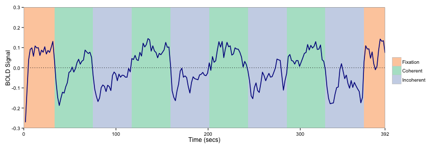
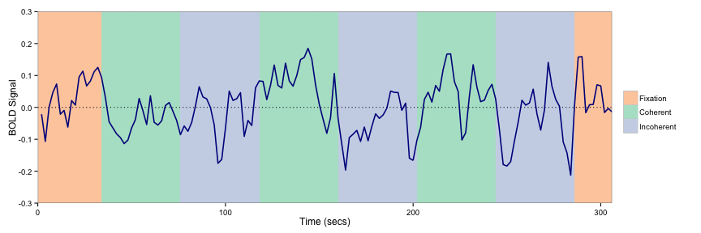
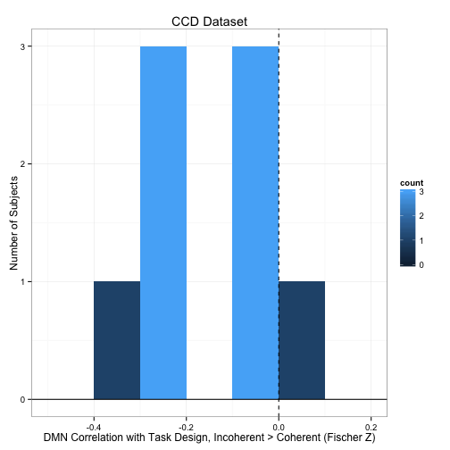
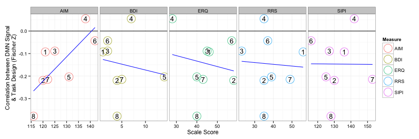
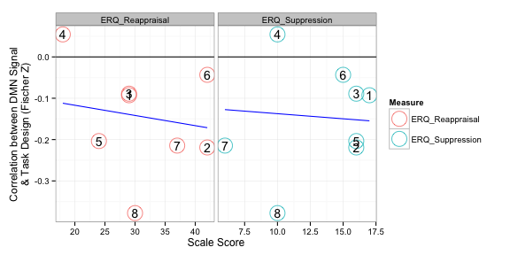
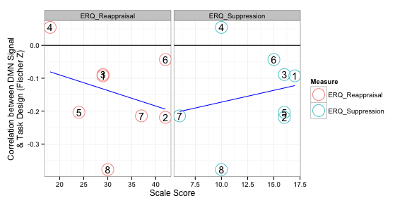
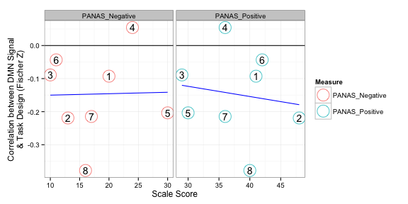

# Association between MSIT task design and DN signal

Note that actual code is loaded from a different file.


```r
read_chunk("04_msit_dmn_task.R")
```


## Setup


```r
library(plyr)
library(e1071)
library(ggplot2)
library(RColorBrewer)
library(robustbase)
basedir <- "/home2/data/Projects/CCD"
scriptdir <- file.path(basedir, "scripts/04_msit_task")
oldtheme <- theme_set(theme_bw())
```


```r
network_names <- c("medial visual", "occipital pole visual", "lateral visual", 
    "default network", "cerebellum", "sensorimotor", "auditory", "executive control", 
    "right frontoparietal", "left frontoparietal")
network_names <- gsub(" ", ".", network_names)
dmn <- 4
tps <- 8:10
```


```r
phenos <- read.csv(file.path(basedir, "scripts/data/ccd_totals_touse.csv"))[1:9, 
    -1]  # only CCD subjects with MSIT
subinfo <- read.csv(file.path(scriptdir, "z_predesign.csv"))
subinfo$study <- factor(subinfo$study, labels = c("CCB", "CCD"))
subinfo$scan <- factor(subinfo$scan)
subinfo$run <- factor(subinfo$run)
subinfo$sex <- factor(subinfo$sex)
# Remove CCD participants with high errors
subinfo <- subinfo[!((subinfo$subject == "CCD004" | subinfo$subject == "CCD008") & 
    (subinfo$run == 1)), ]
# Plot Age
ggplot(subinfo, aes(x = age, fill = ..count..)) + geom_histogram(binwidth = 5) + 
    facet_grid(study ~ .)
```

 

```r
# Plot Sex
ggplot(subinfo, aes(x = sex, fill = study)) + geom_bar()
```

 


Note that negative signal here are the congruent trials and positive signal are the incongruent trials. What do you think would happen if the positives and negatives got together?


```r
# CCB
ccb_waver <- read.table(file.path(scriptdir, "level1_ccb_template.mat"), skip = 5)
ccb_waver <- as.matrix(ccb_waver)[, c(1, 3)]
ccb_waver <- ccb_waver[, 2] - ccb_waver[, 1]
tmpdf <- data.frame(time = seq(0, by = 1.75, length.out = length(ccb_waver)), 
    predicted_signal = ccb_waver)
ggplot(tmpdf, aes(time, predicted_signal)) + geom_line() + xlab("Time (secs)") + 
    ylab("Predicted Signal") + ggtitle("For CCB Subjects")
```

 

```r
# CCD
ccd_waver <- read.table(file.path(scriptdir, "level1_ccd_template.mat"), skip = 5)
ccd_waver <- as.matrix(ccd_waver)[, c(1, 3)]
ccd_waver <- ccd_waver[, 2] - ccd_waver[, 1]
tmpdf <- data.frame(time = seq(0, by = 2, length.out = length(ccd_waver)), predicted_signal = ccd_waver)
ggplot(tmpdf, aes(time, predicted_signal)) + geom_line() + xlab("Time (secs)") + 
    ylab("Predicted Signal") + ggtitle("For CCD Subjects")
```

 


```r
# this loads the 'tss' object with attr(tss, 'split_labels') to get how
# stuff should be organized
load(file.path(basedir, "scripts/data/ccb+ccd_time_series.rda"))
splitter <- attr(tss, "split_labels")
splitter$index <- 1:nrow(splitter)
```


## Group Average TS

Get the xmin and xmax for showing blocks.


```r
# CCB
ccb_coherent <- read.table(file.path(scriptdir, "CCB_coherent.1D"))[, 1]
ccb_incoherent <- read.table(file.path(scriptdir, "CCB_incoherent.1D"))[, 1]
tmp <- diff(ccb_coherent - ccb_incoherent)
# +1 to adjust for relative; +3 to adjust for HRF delay
ccb_event_tpts <- data.frame(xmin = c(0, which(tmp != 0) + 1 + 3), xmax = c(which(tmp != 
    0) + 1 + 3, length(ccb_coherent)), block = factor(c("Fixation", rep(c("Coherent", 
    "Incoherent"), length.out = sum(tmp != 0) - 1), "Fixation")))
ccb_event_tpts$xmin <- ccb_event_tpts$xmin * 1.75
ccb_event_tpts$xmax <- ccb_event_tpts$xmax * 1.75
# CCD
ccd_coherent <- read.table(file.path(scriptdir, "CCD_coherent.1D"))[, 1]
ccd_incoherent <- read.table(file.path(scriptdir, "CCD_incoherent.1D"))[, 1]
tmp <- diff(ccd_coherent - ccd_incoherent)
# +1 to adjust for relative; +3 to adjust for HRF delay
ccd_event_tpts <- data.frame(xmin = c(0, which(tmp != 0) + 1 + 3), xmax = c(which(tmp != 
    0) + 1 + 3, length(ccd_coherent)), block = factor(c("Fixation", rep(c("Coherent", 
    "Incoherent"), length.out = sum(tmp != 0) - 1), "Fixation")))
ccd_event_tpts$xmin <- ccd_event_tpts$xmin * 2
ccd_event_tpts$xmax <- ccd_event_tpts$xmax * 2
```


Compute the group average MSIT BOLD signal.


```r
# CCB
sub_splitter <- subset(splitter, condition == "MSIT" & study == "CCB")
sub_splitter$subject <- factor(sub_splitter$subject)
ccb_msit_tcs <- daply(sub_splitter, .(subject), function(sdf) {
    tcs <- sapply(tss[sdf$index], function(x) x[, dmn])
    tc <- rowMeans(tcs)
    tc
})
ccb_msit_tc_ave <- data.frame(timepoint = (1:ncol(ccb_msit_tcs)) * 1.75, bold = colMeans(ccb_msit_tcs))
# CCD
sub_splitter <- subset(splitter, condition == "MSIT" & study == "CCD")
sub_splitter$subject <- factor(sub_splitter$subject)
ccd_msit_tcs <- daply(sub_splitter, .(subject), function(sdf) {
    tcs <- sapply(tss[sdf$index], function(x) x[, dmn])
    tc <- rowMeans(tcs)
    tc
})
ccd_msit_tc_ave <- data.frame(timepoint = (1:ncol(ccd_msit_tcs)) * 2, bold = colMeans(ccd_msit_tcs))
```


Let's see you work it ggplot. Shake it. Shake it good.


```r
# CCB
p <- ggplot(ccb_msit_tc_ave) + geom_rect(data = ccb_event_tpts, aes(xmin = xmin, 
    xmax = xmax, ymin = -Inf, ymax = Inf, fill = block)) + scale_fill_manual(name = "", 
    breaks = c("Fixation", "Coherent", "Incoherent"), values = brewer.pal(4, 
        "Pastel2")[-4]) + geom_line(aes(x = timepoint, y = bold), color = "darkblue", 
    size = 0.75) + scale_x_discrete(name = "Time (secs)", limits = c(0, 224 * 
    1.75), expand = c(0, 0)) + scale_y_continuous(name = "BOLD Signal", limits = c(-0.3, 
    0.3), expand = c(0, 0))
print(p)
```

 

```r
# CCD
p <- ggplot(ccd_msit_tc_ave) + geom_rect(data = ccd_event_tpts, aes(xmin = xmin, 
    xmax = xmax, ymin = -Inf, ymax = Inf, fill = block)) + scale_fill_manual(name = "", 
    breaks = c("Fixation", "Coherent", "Incoherent"), values = brewer.pal(4, 
        "Pastel2")[-4]) + geom_line(aes(x = timepoint, y = bold), color = "darkblue", 
    size = 0.75) + scale_x_discrete(name = "Time (secs)", limits = c(0, 153 * 
    2), expand = c(0, 0)) + scale_y_continuous(name = "BOLD Signal", limits = c(-0.3, 
    0.3), expand = c(0, 0))
print(p)
```

 


## Correlations Between Task Design and DN Signal


```r
sub_splitter <- subset(splitter, condition == "MSIT")
correlation_msit_dmn <- ddply(sub_splitter, .(subject, study, scan, run), function(sdf) {
    ts <- tss[[sdf$index]][, dmn]
    if (sdf$study == "CCB") 
        r <- cor(ts, ccb_waver) else r <- cor(ts, ccd_waver)
    z <- atanh(r)
    c(r = r, z = z)
})
# collapse across scan and run
correlation_msit_dmn <- ddply(correlation_msit_dmn, .(subject), numcolwise(mean))
# plot CCB
ggplot(correlation_msit_dmn[1:28, ], aes(x = z, fill = ..count..)) + geom_histogram(binwidth = 0.05) + 
    geom_hline(aes(yintercept = 0)) + geom_vline(aes(xintercept = 0), linetype = "dashed") + 
    xlab("DMN Correlation with Task Design, Incoherent > Coherent (Fischer Z)") + 
    ylab("Number of Subjects") + ggtitle("CCB Dataset")
```

 

```r
# plot CCD
ggplot(correlation_msit_dmn[29:37, ], aes(x = z, fill = ..count..)) + geom_histogram(binwidth = 0.1) + 
    geom_hline(aes(yintercept = 0)) + geom_vline(aes(xintercept = 0), linetype = "dashed") + 
    xlab("DMN Correlation with Task Design, Incoherent > Coherent (Fischer Z)") + 
    ylab("Number of Subjects") + ggtitle("CCD Dataset")
```

 


```r
names(phenos)[1:3] <- c("subject", "age", "sex")
phenos$subject <- factor(toupper(phenos$subject))
phenos$sex <- factor(phenos$sex, labels = c("F", "M"))
df <- merge(correlation_msit_dmn, phenos)
names(df)[[3]] <- "correlation.dmn_with_task"
```


```r
to_outlier <- function(x) factor((x > 0.1) * 1, levels = c(0, 1), labels = c("yes", 
    "no"))
wrap_lmrob <- function(f, df) {
    reg <- summary(lmrob(f, df, maxit.scale = 500))
    print(reg)
    df$outlier <- to_outlier(reg$weights)
    df$weights <- reg$weights
    df
}
brainbehavior.multiple <- function(names, df) {
    # Significance
    f <- paste("correlation.dmn_with_task ~ age + sex +", paste(names, collapse = " + "))
    f <- as.formula(f)
    tdf <- wrap_lmrob(f, df)
    
    # Reorganize
    tdf$id <- 1:nrow(tdf)
    bb.df <- ddply(tdf, .(subject), function(sdf) {
        sdf <- data.frame(sdf[rep(1, length(names)), c("id", "subject", "correlation.dmn_with_task", 
            "outlier", "weights")], measure = names, behavior = as.numeric(sdf[, 
            names]))
        sdf
    })
    
    # Get best fit line
    model <- lmrob(correlation.dmn_with_task ~ behavior + measure, bb.df, maxit.scale = 500)
    grid <- ddply(bb.df, .(measure), function(sdf) {
        data.frame(behavior = seq(min(sdf$behavior), max(sdf$behavior), length = 20), 
            measure = rep(sdf$measure[1], 20))
    })
    grid$correlation.dmn_with_task <- predict(model, newdata = grid)
    
    # Plot
    p0 <- ggplot(bb.df, aes(x = behavior, y = correlation.dmn_with_task)) + 
        geom_hline(aes(yintercept = 0)) + xlab("Scale Score") + ylab("Correlation between DMN Signal\n& Task Design (Fischer Z)") + 
        facet_grid(. ~ measure, scales = "free_x")
    if (any(bb.df$outlier == "yes")) {
        p <- p0 + geom_point(data = bb.df[bb.df$outlier == "yes", ], size = 8, 
            color = brewer.pal(3, "Pastel1")[1]) + geom_point(aes(color = measure), 
            shape = 1, size = 8) + geom_text(aes(label = id), size = 5) + geom_line(data = grid, 
            color = "blue") + scale_color_discrete(name = "Measure")
    } else {
        p <- p0 + geom_point(aes(color = measure), shape = 1, size = 8) + geom_text(aes(label = id), 
            size = 5) + geom_line(data = grid, color = "blue") + scale_color_discrete(name = "Measure")
    }
    p
}
brainbehavior.single <- function(names, df) {
    # Significance
    bb.df <- ldply(names, function(name) {
        cat("\nRunning regression for", name, "\n")
        f <- paste("correlation.dmn_with_task ~ age + sex +", name)
        f <- as.formula(f)
        tdf <- wrap_lmrob(f, df)
        tdf$id <- 1:nrow(tdf)
        tdf$measure <- name
        tdf$behavior <- tdf[[name]]
        cat("\n")
        tdf[, c("id", "subject", "measure", "behavior", "correlation.dmn_with_task", 
            "outlier", "weights")]
    })
    bb.df$measure <- factor(bb.df$measure)
    bb.df$outlier <- factor(bb.df$outlier)
    
    
    # Get best fit line
    grid <- ddply(bb.df, .(measure), function(sdf) {
        model <- lmrob(correlation.dmn_with_task ~ behavior, sdf, maxit.scale = 500)
        sgrid <- data.frame(behavior = seq(min(sdf$behavior), max(sdf$behavior), 
            length = 20))
        sgrid$correlation.dmn_with_task <- predict(model, newdata = sgrid)
        sgrid$measure <- sdf$measure[1]
        sgrid
    })
    
    # Plot
    p0 <- ggplot(bb.df, aes(x = behavior, y = correlation.dmn_with_task)) + 
        geom_hline(aes(yintercept = 0)) + xlab("Scale Score") + ylab("Correlation between DMN Signal\n& Task Design (Fischer Z)") + 
        facet_grid(. ~ measure, scales = "free_x")
    if (any(bb.df$outlier == "yes")) {
        p <- p0 + geom_point(data = bb.df[bb.df$outlier == "yes", ], size = 8, 
            color = brewer.pal(3, "Pastel1")[1]) + geom_point(aes(color = measure), 
            shape = 1, size = 8) + geom_text(aes(label = id), size = 5) + geom_line(data = grid, 
            color = "blue") + scale_color_discrete(name = "Measure")
    } else {
        p <- p0 + geom_point(aes(color = measure), shape = 1, size = 8) + geom_text(aes(label = id), 
            size = 5) + geom_line(data = grid, color = "blue") + scale_color_discrete(name = "Measure")
    }
    p
}
```


### Total Scale Scores (with BDI, without PANAS)

#### Multiple Regression


```r
names <- c("SIPI", "RRS", "ERQ", "BDI", "AIM")
brainbehavior.multiple(names, df)
```

```
## Error: dgels: weighted design matrix not of full rank (column 8). Exiting.
```


#### Single Regressions


```r
names <- c("SIPI", "RRS", "ERQ", "BDI", "AIM")
brainbehavior.single(names, df)
```

```
## 
## Running regression for SIPI 
## 
## Call:
## lmrob(formula = f, data = df, maxit.scale = 500)
## 
## Weighted Residuals:
## [1]  0.0519 -0.0135  0.0412  0.0704  0.2179 -0.0817  0.0123 -0.0691 -0.2390
## 
## Coefficients:
##              Estimate Std. Error t value Pr(>|t|)
## (Intercept)  0.186387   0.515001    0.36     0.73
## age         -0.000946   0.003138   -0.30     0.78
## sexM        -0.028099   0.101634   -0.28     0.79
## SIPI        -0.002033   0.003292   -0.62     0.56
## 
## Robust residual standard error: 0.18 
## Convergence in 10 IRWLS iterations
## 
## Robustness weights: 
## [1] 0.992 0.999 0.995 0.986 0.870 0.981 1.000 0.987 0.845
## Algorithmic parameters: 
## tuning.chi         bb tuning.psi refine.tol    rel.tol  solve.tol 
##   1.55e+00   5.00e-01   4.69e+00   1.00e-07   1.00e-07   1.00e-07 
##      nResample         max.it       best.r.s       k.fast.s          k.max 
##            500             50              2              1            200 
##    maxit.scale      trace.lev            mts     compute.rd fast.s.large.n 
##            500              0           1000              0           2000 
##           psi   subsampling        method           cov 
##    "bisquare" "nonsingular"          "MM" ".vcov.avar1" 
## seed : int(0) 
## 
## 
## Running regression for RRS 
## 
## Call:
## lmrob(formula = f, data = df, maxit.scale = 500)
## 
## Weighted Residuals:
## [1]  0.0425 -0.0362  0.0549  0.1154  0.1940 -0.0662  0.0212 -0.0993 -0.2393
## 
## Coefficients:
##              Estimate Std. Error t value Pr(>|t|)
## (Intercept) -0.135084   0.233786   -0.58     0.59
## age          0.000256   0.003508    0.07     0.94
## sexM        -0.023552   0.109785   -0.21     0.84
## RRS          0.000290   0.002372    0.12     0.91
## 
## Robust residual standard error: 0.199 
## Convergence in 9 IRWLS iterations
## 
## Robustness weights: 
## [1] 0.996 0.997 0.993 0.970 0.915 0.990 0.999 0.977 0.873
## Algorithmic parameters: 
## tuning.chi         bb tuning.psi refine.tol    rel.tol  solve.tol 
##   1.55e+00   5.00e-01   4.69e+00   1.00e-07   1.00e-07   1.00e-07 
##      nResample         max.it       best.r.s       k.fast.s          k.max 
##            500             50              2              1            200 
##    maxit.scale      trace.lev            mts     compute.rd fast.s.large.n 
##            500              0           1000              0           2000 
##           psi   subsampling        method           cov 
##    "bisquare" "nonsingular"          "MM" ".vcov.avar1" 
## seed : int(0) 
## 
## 
## Running regression for ERQ 
## 
## Call:
## lmrob(formula = f, data = df, maxit.scale = 500)
## 
## Weighted Residuals:
## [1]  0.00121 -0.04487  0.05629  0.18011  0.55217  0.02000  0.00767 -0.11071
## [9] -0.08005
## 
## Coefficients:
##              Estimate Std. Error t value Pr(>|t|)
## (Intercept) -0.759190   0.432091   -1.76     0.14
## age         -0.007987   0.005077   -1.57     0.18
## sexM        -0.000201   0.103198    0.00     1.00
## ERQ          0.019328   0.010253    1.89     0.12
## 
## Robust residual standard error: 0.107 
## Convergence in 18 IRWLS iterations
## 
## Robustness weights: 
## [1] 1.000 0.984 0.975 0.759 0.000 0.997 1.000 0.905 0.950
## Algorithmic parameters: 
## tuning.chi         bb tuning.psi refine.tol    rel.tol  solve.tol 
##   1.55e+00   5.00e-01   4.69e+00   1.00e-07   1.00e-07   1.00e-07 
##      nResample         max.it       best.r.s       k.fast.s          k.max 
##            500             50              2              1            200 
##    maxit.scale      trace.lev            mts     compute.rd fast.s.large.n 
##            500              0           1000              0           2000 
##           psi   subsampling        method           cov 
##    "bisquare" "nonsingular"          "MM" ".vcov.avar1" 
## seed : int(0) 
## 
## 
## Running regression for BDI 
## 
## Call:
## lmrob(formula = f, data = df, maxit.scale = 500)
## 
## Weighted Residuals:
## [1]  0.0184 -0.0299  0.0284  0.1116  0.2011 -0.0191  0.0154 -0.0958 -0.2482
## 
## Coefficients:
##              Estimate Std. Error t value Pr(>|t|)
## (Intercept) -8.77e-02   1.62e-01   -0.54     0.61
## age         -9.52e-05   3.15e-03   -0.03     0.98
## sexM        -1.50e-02   1.12e-01   -0.13     0.90
## BDI         -5.80e-03   4.68e-03   -1.24     0.27
## 
## Robust residual standard error: 0.177 
## Convergence in 10 IRWLS iterations
## 
## Robustness weights: 
## [1] 0.999 0.997 0.998 0.964 0.886 0.999 0.999 0.974 0.829
## Algorithmic parameters: 
## tuning.chi         bb tuning.psi refine.tol    rel.tol  solve.tol 
##   1.55e+00   5.00e-01   4.69e+00   1.00e-07   1.00e-07   1.00e-07 
##      nResample         max.it       best.r.s       k.fast.s          k.max 
##            500             50              2              1            200 
##    maxit.scale      trace.lev            mts     compute.rd fast.s.large.n 
##            500              0           1000              0           2000 
##           psi   subsampling        method           cov 
##    "bisquare" "nonsingular"          "MM" ".vcov.avar1" 
## seed : int(0) 
## 
## 
## Running regression for AIM 
## 
## Call:
## lmrob(formula = f, data = df, maxit.scale = 500)
## 
## Weighted Residuals:
## [1]  0.0801  0.0376  0.0599  0.1450  0.1094 -0.1057 -0.0767 -0.1022 -0.1498
## 
## Coefficients:
##             Estimate Std. Error t value Pr(>|t|)
## (Intercept) -1.00262    0.55951   -1.79     0.13
## age         -0.00157    0.00334   -0.47     0.66
## sexM        -0.04355    0.09471   -0.46     0.66
## AIM          0.00758    0.00457    1.66     0.16
## 
## Robust residual standard error: 0.193 
## Convergence in 7 IRWLS iterations
## 
## Robustness weights: 
## [1] 0.984 0.997 0.991 0.949 0.971 0.973 0.986 0.975 0.946
## Algorithmic parameters: 
## tuning.chi         bb tuning.psi refine.tol    rel.tol  solve.tol 
##   1.55e+00   5.00e-01   4.69e+00   1.00e-07   1.00e-07   1.00e-07 
##      nResample         max.it       best.r.s       k.fast.s          k.max 
##            500             50              2              1            200 
##    maxit.scale      trace.lev            mts     compute.rd fast.s.large.n 
##            500              0           1000              0           2000 
##           psi   subsampling        method           cov 
##    "bisquare" "nonsingular"          "MM" ".vcov.avar1" 
## seed : int(0)
```

 


### Total Scale Scores (with PANAS, without BDI)

#### Multiple Regression


```r
names <- c("SIPI", "RRS", "ERQ", "AIM", "PANAS_Positive", "PANAS_Negative")
brainbehavior.multiple(names, df)
```

```
## Warning: S refinements did not converge (to tol=1e-07) in 200 iterations
```

```
## Warning: S refinements did not converge (to tol=1e-07) in 200 iterations
```

```
##                Length Class      Mode   
## coefficients    9     -none-     numeric
## scale           1     -none-     numeric
## k.iter          1     -none-     numeric
## converged       1     -none-     logical
## fitted.values   9     -none-     numeric
## residuals       9     -none-     numeric
## weights         9     -none-     numeric
## control        26     -none-     list   
## qr              4     qr         list   
## rank            1     -none-     numeric
## cov             1     -none-     logical
## degree.freedom  1     -none-     logical
## df              1     -none-     logical
## contrasts       1     -none-     list   
## xlevels         1     -none-     list   
## call            4     -none-     call   
## terms           3     terms      call   
## model           9     data.frame list   
## x              81     -none-     numeric
```

```
## Error: $ operator is invalid for atomic vectors
```


#### Single Regressions

Of course there is no point in re-running this here.

### RRS SubScales

#### Multiple Regression


```r
names <- c("RRS_Brooding", "RRS_Reflection", "RRS_Depression")
brainbehavior.multiple(names, df)
```

```
## 
## Call:
## lmrob(formula = f, data = df, maxit.scale = 500)
## 
## Weighted Residuals:
## [1]  0.04949  0.05573  0.02983 -0.04655  0.14082 -0.02125 -0.00756 -0.00144
## [9] -0.21736
## 
## Coefficients:
##                Estimate Std. Error t value Pr(>|t|)  
## (Intercept)    -0.33857    0.15731   -2.15    0.120  
## age             0.00737    0.00204    3.61    0.037 *
## sexM           -0.01703    0.07120   -0.24    0.826  
## RRS_Brooding   -0.02697    0.01205   -2.24    0.111  
## RRS_Reflection -0.02908    0.00922   -3.15    0.051 .
## RRS_Depression  0.02163    0.00573    3.78    0.033 *
## ---
## Signif. codes:  0 '***' 0.001 '**' 0.01 '*' 0.05 '.' 0.1 ' ' 1 
## 
## Robust residual standard error: 0.187 
## Convergence in 7 IRWLS iterations
## 
## Robustness weights: 
## [1] 0.994 0.992 0.998 0.994 0.949 0.999 1.000 1.000 0.880
## Algorithmic parameters: 
## tuning.chi         bb tuning.psi refine.tol    rel.tol  solve.tol 
##   1.55e+00   5.00e-01   4.69e+00   1.00e-07   1.00e-07   1.00e-07 
##      nResample         max.it       best.r.s       k.fast.s          k.max 
##            500             50              2              1            200 
##    maxit.scale      trace.lev            mts     compute.rd fast.s.large.n 
##            500              0           1000              0           2000 
##           psi   subsampling        method           cov 
##    "bisquare" "nonsingular"          "MM" ".vcov.avar1" 
## seed : int(0)
```

 


#### Single Regressions


```r
names <- c("RRS_Brooding", "RRS_Depression", "RRS_Reflection")
brainbehavior.single(names, df)
```

```
## 
## Running regression for RRS_Brooding 
## 
## Call:
## lmrob(formula = f, data = df, maxit.scale = 500)
## 
## Weighted Residuals:
## [1]  0.0402 -0.0322  0.0368  0.1196  0.1974 -0.0477  0.0159 -0.1018 -0.2420
## 
## Coefficients:
##               Estimate Std. Error t value Pr(>|t|)
## (Intercept)  -0.032602   0.248065   -0.13     0.90
## age          -0.000267   0.003291   -0.08     0.94
## sexM         -0.043315   0.114916   -0.38     0.72
## RRS_Brooding -0.008250   0.020202   -0.41     0.70
## 
## Robust residual standard error: 0.191 
## Convergence in 9 IRWLS iterations
## 
## Robustness weights: 
## [1] 0.996 0.997 0.997 0.965 0.905 0.994 0.999 0.974 0.859
## Algorithmic parameters: 
## tuning.chi         bb tuning.psi refine.tol    rel.tol  solve.tol 
##   1.55e+00   5.00e-01   4.69e+00   1.00e-07   1.00e-07   1.00e-07 
##      nResample         max.it       best.r.s       k.fast.s          k.max 
##            500             50              2              1            200 
##    maxit.scale      trace.lev            mts     compute.rd fast.s.large.n 
##            500              0           1000              0           2000 
##           psi   subsampling        method           cov 
##    "bisquare" "nonsingular"          "MM" ".vcov.avar1" 
## seed : int(0) 
## 
## 
## Running regression for RRS_Depression 
## 
## Call:
## lmrob(formula = f, data = df, maxit.scale = 500)
## 
## Weighted Residuals:
## [1] -0.00637 -0.02694  0.09836  0.09144  0.19299 -0.06027  0.01456 -0.07839
## [9] -0.23786
## 
## Coefficients:
##                Estimate Std. Error t value Pr(>|t|)
## (Intercept)    -0.35097    0.24947   -1.41     0.22
## age             0.00258    0.00354    0.73     0.50
## sexM            0.00500    0.09774    0.05     0.96
## RRS_Depression  0.00586    0.00519    1.13     0.31
## 
## Robust residual standard error: 0.19 
## Convergence in 8 IRWLS iterations
## 
## Robustness weights: 
## [1] 1.000 0.998 0.976 0.979 0.908 0.991 0.999 0.985 0.863
## Algorithmic parameters: 
## tuning.chi         bb tuning.psi refine.tol    rel.tol  solve.tol 
##   1.55e+00   5.00e-01   4.69e+00   1.00e-07   1.00e-07   1.00e-07 
##      nResample         max.it       best.r.s       k.fast.s          k.max 
##            500             50              2              1            200 
##    maxit.scale      trace.lev            mts     compute.rd fast.s.large.n 
##            500              0           1000              0           2000 
##           psi   subsampling        method           cov 
##    "bisquare" "nonsingular"          "MM" ".vcov.avar1" 
## seed : int(0) 
## 
## 
## Running regression for RRS_Reflection 
## 
## Call:
## lmrob(formula = f, data = df, maxit.scale = 500)
## 
## Weighted Residuals:
## [1]  0.565193 -0.003397 -0.075342 -0.006517  0.208988  0.007479  0.010718
## [8] -0.000797 -0.084242
## 
## Coefficients:
##                Estimate Std. Error t value Pr(>|t|)  
## (Intercept)     0.37946    0.14407    2.63    0.046 *
## age             0.00197    0.00057    3.45    0.018 *
## sexM           -0.21122    0.09076   -2.33    0.067 .
## RRS_Reflection -0.04896    0.01250   -3.92    0.011 *
## ---
## Signif. codes:  0 '***' 0.001 '**' 0.01 '*' 0.05 '.' 0.1 ' ' 1 
## 
## Robust residual standard error: 0.108 
## Convergence in 10 IRWLS iterations
## 
## Robustness weights: 
## [1] 0.000 1.000 0.957 1.000 0.690 1.000 0.999 1.000 0.946
## Algorithmic parameters: 
## tuning.chi         bb tuning.psi refine.tol    rel.tol  solve.tol 
##   1.55e+00   5.00e-01   4.69e+00   1.00e-07   1.00e-07   1.00e-07 
##      nResample         max.it       best.r.s       k.fast.s          k.max 
##            500             50              2              1            200 
##    maxit.scale      trace.lev            mts     compute.rd fast.s.large.n 
##            500              0           1000              0           2000 
##           psi   subsampling        method           cov 
##    "bisquare" "nonsingular"          "MM" ".vcov.avar1" 
## seed : int(0)
```

 


### SIPI SubScales

#### Multiple Regression


```r
names <- c("SIPI_PAC", "SIPI_GFFD", "SIPI_PCD")
brainbehavior.multiple(names, df)
```

```
## 
## Call:
## lmrob(formula = f, data = df, maxit.scale = 500)
## 
## Weighted Residuals:
## [1]  0.05118 -0.02058  0.13116 -0.01205  0.00593 -0.09721  0.04540 -0.01220
## [9] -0.08543
## 
## Coefficients:
##             Estimate Std. Error t value Pr(>|t|)  
## (Intercept)  0.30739    0.71129    0.43    0.695  
## age          0.00473    0.00312    1.52    0.227  
## sexM        -0.27396    0.07802   -3.51    0.039 *
## SIPI_PAC     0.01860    0.00726    2.56    0.083 .
## SIPI_GFFD    0.00360    0.01132    0.32    0.771  
## SIPI_PCD    -0.02774    0.00995   -2.79    0.068 .
## ---
## Signif. codes:  0 '***' 0.001 '**' 0.01 '*' 0.05 '.' 0.1 ' ' 1 
## 
## Robust residual standard error: 0.114 
## Convergence in 11 IRWLS iterations
## 
## Robustness weights: 
## [1] 0.982 0.997 0.883 0.999 1.000 0.935 0.986 0.999 0.950
## Algorithmic parameters: 
## tuning.chi         bb tuning.psi refine.tol    rel.tol  solve.tol 
##   1.55e+00   5.00e-01   4.69e+00   1.00e-07   1.00e-07   1.00e-07 
##      nResample         max.it       best.r.s       k.fast.s          k.max 
##            500             50              2              1            200 
##    maxit.scale      trace.lev            mts     compute.rd fast.s.large.n 
##            500              0           1000              0           2000 
##           psi   subsampling        method           cov 
##    "bisquare" "nonsingular"          "MM" ".vcov.avar1" 
## seed : int(0)
```

 


#### Single Regressions


```r
names <- c("SIPI_PAC", "SIPI_GFFD", "SIPI_PCD")
brainbehavior.single(names, df)
```

```
## 
## Running regression for SIPI_PAC 
## 
## Call:
## lmrob(formula = f, data = df, maxit.scale = 500)
## 
## Weighted Residuals:
## [1]  0.044320 -0.001056  0.050837  0.066022  0.217300 -0.084329 -0.000711
## [8] -0.064190 -0.237515
## 
## Coefficients:
##              Estimate Std. Error t value Pr(>|t|)
## (Intercept)  0.092191   0.270881    0.34     0.75
## age         -0.000678   0.002649   -0.26     0.81
## sexM        -0.012169   0.094449   -0.13     0.90
## SIPI_PAC    -0.004215   0.004646   -0.91     0.41
## 
## Robust residual standard error: 0.18 
## Convergence in 10 IRWLS iterations
## 
## Robustness weights: 
## [1] 0.994 1.000 0.993 0.988 0.871 0.980 1.000 0.988 0.847
## Algorithmic parameters: 
## tuning.chi         bb tuning.psi refine.tol    rel.tol  solve.tol 
##   1.55e+00   5.00e-01   4.69e+00   1.00e-07   1.00e-07   1.00e-07 
##      nResample         max.it       best.r.s       k.fast.s          k.max 
##            500             50              2              1            200 
##    maxit.scale      trace.lev            mts     compute.rd fast.s.large.n 
##            500              0           1000              0           2000 
##           psi   subsampling        method           cov 
##    "bisquare" "nonsingular"          "MM" ".vcov.avar1" 
## seed : int(0) 
## 
## 
## Running regression for SIPI_GFFD 
## 
## Call:
## lmrob(formula = f, data = df, maxit.scale = 500)
## 
## Weighted Residuals:
## [1]  0.00241  0.02438  0.21091  0.08000  0.03432 -0.06159 -0.04538 -0.05614
## [9] -0.10809
## 
## Coefficients:
##             Estimate Std. Error t value Pr(>|t|)
## (Intercept) -1.08600    1.29148   -0.84     0.44
## age          0.00734    0.00996    0.74     0.49
## sexM        -0.08722    0.22338   -0.39     0.71
## SIPI_GFFD    0.02128    0.02834    0.75     0.49
## 
## Robust residual standard error: 0.0889 
## Convergence in 30 IRWLS iterations
## 
## Robustness weights: 
## [1] 1.000 0.993 0.553 0.928 0.986 0.957 0.976 0.964 0.870
## Algorithmic parameters: 
## tuning.chi         bb tuning.psi refine.tol    rel.tol  solve.tol 
##   1.55e+00   5.00e-01   4.69e+00   1.00e-07   1.00e-07   1.00e-07 
##      nResample         max.it       best.r.s       k.fast.s          k.max 
##            500             50              2              1            200 
##    maxit.scale      trace.lev            mts     compute.rd fast.s.large.n 
##            500              0           1000              0           2000 
##           psi   subsampling        method           cov 
##    "bisquare" "nonsingular"          "MM" ".vcov.avar1" 
## seed : int(0) 
## 
## 
## Running regression for SIPI_PCD 
## 
## Call:
## lmrob(formula = f, data = df, maxit.scale = 500)
## 
## Weighted Residuals:
## [1]  0.045332  0.030881  0.071980 -0.026085  0.169016 -0.114075 -0.004068
## [8] -0.000672 -0.182694
## 
## Coefficients:
##              Estimate Std. Error t value Pr(>|t|)  
## (Intercept)  5.12e-01   2.68e-01    1.91     0.11  
## age          5.77e-05   1.61e-03    0.04     0.97  
## sexM        -9.76e-02   9.51e-02   -1.03     0.35  
## SIPI_PCD    -1.15e-02   3.86e-03   -2.99     0.03 *
## ---
## Signif. codes:  0 '***' 0.001 '**' 0.01 '*' 0.05 '.' 0.1 ' ' 1 
## 
## Robust residual standard error: 0.138 
## Convergence in 10 IRWLS iterations
## 
## Robustness weights: 
## [1] 0.990 0.995 0.975 0.997 0.868 0.939 1.000 1.000 0.847
## Algorithmic parameters: 
## tuning.chi         bb tuning.psi refine.tol    rel.tol  solve.tol 
##   1.55e+00   5.00e-01   4.69e+00   1.00e-07   1.00e-07   1.00e-07 
##      nResample         max.it       best.r.s       k.fast.s          k.max 
##            500             50              2              1            200 
##    maxit.scale      trace.lev            mts     compute.rd fast.s.large.n 
##            500              0           1000              0           2000 
##           psi   subsampling        method           cov 
##    "bisquare" "nonsingular"          "MM" ".vcov.avar1" 
## seed : int(0)
```

 


### ERQ SubScales

#### Multiple Regression


```r
names <- c("ERQ_Reappraisal", "ERQ_Suppression")
brainbehavior.multiple(names, df)
```

```
## 
## Call:
## lmrob(formula = f, data = df, maxit.scale = 500)
## 
## Weighted Residuals:
## [1]  0.0597 -0.0189  0.0735 -0.0504  0.0985 -0.1338  0.0568  0.0130 -0.1159
## 
## Coefficients:
##                 Estimate Std. Error t value Pr(>|t|)  
## (Intercept)      0.34287    0.23130    1.48    0.212  
## age              0.00122    0.00317    0.39    0.720  
## sexM            -0.24463    0.09566   -2.56    0.063 .
## ERQ_Reappraisal -0.01856    0.00709   -2.62    0.059 .
## ERQ_Suppression  0.01490    0.01048    1.42    0.228  
## ---
## Signif. codes:  0 '***' 0.001 '**' 0.01 '*' 0.05 '.' 0.1 ' ' 1 
## 
## Robust residual standard error: 0.108 
## Convergence in 13 IRWLS iterations
## 
## Robustness weights: 
## [1] 0.972 0.997 0.958 0.980 0.925 0.864 0.975 0.999 0.897
## Algorithmic parameters: 
## tuning.chi         bb tuning.psi refine.tol    rel.tol  solve.tol 
##   1.55e+00   5.00e-01   4.69e+00   1.00e-07   1.00e-07   1.00e-07 
##      nResample         max.it       best.r.s       k.fast.s          k.max 
##            500             50              2              1            200 
##    maxit.scale      trace.lev            mts     compute.rd fast.s.large.n 
##            500              0           1000              0           2000 
##           psi   subsampling        method           cov 
##    "bisquare" "nonsingular"          "MM" ".vcov.avar1" 
## seed : int(0)
```

 


#### Single Regressions


```r
names <- c("ERQ_Reappraisal", "ERQ_Suppression")
brainbehavior.single(names, df)
```

```
## 
## Running regression for ERQ_Reappraisal 
## 
## Call:
## lmrob(formula = f, data = df, maxit.scale = 500)
## 
## Weighted Residuals:
## [1]  0.11127 -0.01710  0.10017  0.00484  0.04031 -0.09661  0.05126 -0.03845
## [9] -0.19734
## 
## Coefficients:
##                 Estimate Std. Error t value Pr(>|t|)  
## (Intercept)      0.38786    0.25987    1.49    0.196  
## age              0.00373    0.00190    1.96    0.108  
## sexM            -0.18996    0.16382   -1.16    0.299  
## ERQ_Reappraisal -0.01746    0.00700   -2.50    0.055 .
## ---
## Signif. codes:  0 '***' 0.001 '**' 0.01 '*' 0.05 '.' 0.1 ' ' 1 
## 
## Robust residual standard error: 0.11 
## Convergence in 13 IRWLS iterations
## 
## Robustness weights: 
## [1] 0.909 0.998 0.926 1.000 0.988 0.931 0.980 0.989 0.729
## Algorithmic parameters: 
## tuning.chi         bb tuning.psi refine.tol    rel.tol  solve.tol 
##   1.55e+00   5.00e-01   4.69e+00   1.00e-07   1.00e-07   1.00e-07 
##      nResample         max.it       best.r.s       k.fast.s          k.max 
##            500             50              2              1            200 
##    maxit.scale      trace.lev            mts     compute.rd fast.s.large.n 
##            500              0           1000              0           2000 
##           psi   subsampling        method           cov 
##    "bisquare" "nonsingular"          "MM" ".vcov.avar1" 
## seed : int(0) 
## 
## 
## Running regression for ERQ_Suppression 
## 
## Call:
## lmrob(formula = f, data = df, maxit.scale = 500)
## 
## Weighted Residuals:
## [1]  0.00228 -0.03841  0.06135  0.01168  0.41142 -0.06750  0.03240 -0.00592
## [9]  0.00297
## 
## Coefficients:
##                  Estimate Std. Error t value Pr(>|t|)    
## (Intercept)     -0.266648   0.024544  -10.86  0.00011 ***
## age             -0.005946   0.000927   -6.41  0.00137 ** 
## sexM            -0.197018   0.017328  -11.37  9.2e-05 ***
## ERQ_Suppression  0.031480   0.002133   14.76  2.6e-05 ***
## ---
## Signif. codes:  0 '***' 0.001 '**' 0.01 '*' 0.05 '.' 0.1 ' ' 1 
## 
## Robust residual standard error: 0.0868 
## Convergence in 5 IRWLS iterations
## 
## Robustness weights: 
## [1] 1.000 0.982 0.955 0.998 0.000 0.946 0.987 1.000 1.000
## Algorithmic parameters: 
## tuning.chi         bb tuning.psi refine.tol    rel.tol  solve.tol 
##   1.55e+00   5.00e-01   4.69e+00   1.00e-07   1.00e-07   1.00e-07 
##      nResample         max.it       best.r.s       k.fast.s          k.max 
##            500             50              2              1            200 
##    maxit.scale      trace.lev            mts     compute.rd fast.s.large.n 
##            500              0           1000              0           2000 
##           psi   subsampling        method           cov 
##    "bisquare" "nonsingular"          "MM" ".vcov.avar1" 
## seed : int(0)
```

 


### PANAS SubScales

#### Multiple Regression


```r
names <- c("PANAS_Positive", "PANAS_Negative")
brainbehavior.multiple(names, df)
```

```
## 
## Call:
## lmrob(formula = f, data = df, maxit.scale = 500)
## 
## Weighted Residuals:
## [1]  0.11111 -0.00328  0.02599  0.03529  0.18610 -0.11743  0.02034 -0.05251
## [9] -0.21133
## 
## Coefficients:
##                Estimate Std. Error t value Pr(>|t|)
## (Intercept)     0.01529    0.16359    0.09     0.93
## age             0.00342    0.00299    1.14     0.32
## sexM           -0.02861    0.08093   -0.35     0.74
## PANAS_Positive -0.00799    0.00464   -1.72     0.16
## PANAS_Negative  0.00207    0.00680    0.30     0.78
## 
## Robust residual standard error: 0.227 
## Convergence in 8 IRWLS iterations
## 
## Robustness weights: 
## [1] 0.978 1.000 0.999 0.998 0.939 0.976 0.999 0.995 0.922
## Algorithmic parameters: 
## tuning.chi         bb tuning.psi refine.tol    rel.tol  solve.tol 
##   1.55e+00   5.00e-01   4.69e+00   1.00e-07   1.00e-07   1.00e-07 
##      nResample         max.it       best.r.s       k.fast.s          k.max 
##            500             50              2              1            200 
##    maxit.scale      trace.lev            mts     compute.rd fast.s.large.n 
##            500              0           1000              0           2000 
##           psi   subsampling        method           cov 
##    "bisquare" "nonsingular"          "MM" ".vcov.avar1" 
## seed : int(0)
```

 


#### Single Regression


```r
names <- c("PANAS_Positive", "PANAS_Negative")
brainbehavior.single(names, df)
```

```
## 
## Running regression for PANAS_Positive 
## 
## Call:
## lmrob(formula = f, data = df, maxit.scale = 500)
## 
## Weighted Residuals:
## [1]  0.10966 -0.00158  0.00461  0.03925  0.19492 -0.09810  0.01668 -0.05462
## [9] -0.21757
## 
## Coefficients:
##                Estimate Std. Error t value Pr(>|t|)
## (Intercept)     0.06123    0.15285    0.40     0.71
## age             0.00310    0.00263    1.18     0.29
## sexM           -0.02092    0.08806   -0.24     0.82
## PANAS_Positive -0.00804    0.00477   -1.68     0.15
## 
## Robust residual standard error: 0.183 
## Convergence in 10 IRWLS iterations
## 
## Robustness weights: 
## [1] 0.968 1.000 1.000 0.996 0.899 0.974 0.999 0.992 0.875
## Algorithmic parameters: 
## tuning.chi         bb tuning.psi refine.tol    rel.tol  solve.tol 
##   1.55e+00   5.00e-01   4.69e+00   1.00e-07   1.00e-07   1.00e-07 
##      nResample         max.it       best.r.s       k.fast.s          k.max 
##            500             50              2              1            200 
##    maxit.scale      trace.lev            mts     compute.rd fast.s.large.n 
##            500              0           1000              0           2000 
##           psi   subsampling        method           cov 
##    "bisquare" "nonsingular"          "MM" ".vcov.avar1" 
## seed : int(0) 
## 
## 
## Running regression for PANAS_Negative 
## 
## Call:
## lmrob(formula = f, data = df, maxit.scale = 500)
## 
## Weighted Residuals:
## [1]  0.0492 -0.0387  0.0744  0.1111  0.1830 -0.0888  0.0249 -0.0964 -0.2325
## 
## Coefficients:
##                 Estimate Std. Error t value Pr(>|t|)
## (Intercept)    -0.170668   0.211342   -0.81     0.46
## age             0.000557   0.003181    0.17     0.87
## sexM           -0.034207   0.110803   -0.31     0.77
## PANAS_Negative  0.002369   0.007200    0.33     0.76
## 
## Robust residual standard error: 0.198 
## Convergence in 8 IRWLS iterations
## 
## Robustness weights: 
## [1] 0.994 0.997 0.987 0.972 0.924 0.982 0.999 0.979 0.879
## Algorithmic parameters: 
## tuning.chi         bb tuning.psi refine.tol    rel.tol  solve.tol 
##   1.55e+00   5.00e-01   4.69e+00   1.00e-07   1.00e-07   1.00e-07 
##      nResample         max.it       best.r.s       k.fast.s          k.max 
##            500             50              2              1            200 
##    maxit.scale      trace.lev            mts     compute.rd fast.s.large.n 
##            500              0           1000              0           2000 
##           psi   subsampling        method           cov 
##    "bisquare" "nonsingular"          "MM" ".vcov.avar1" 
## seed : int(0)
```

 


