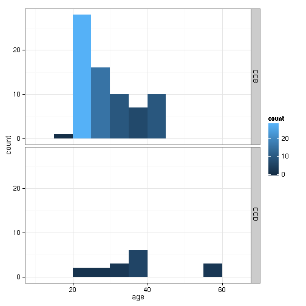
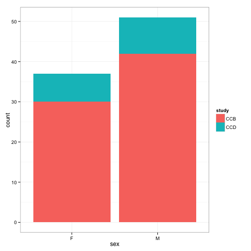
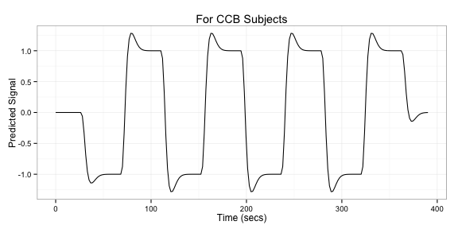
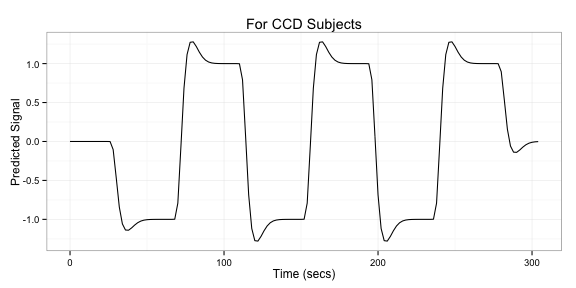
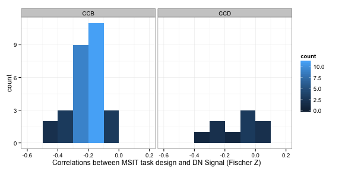
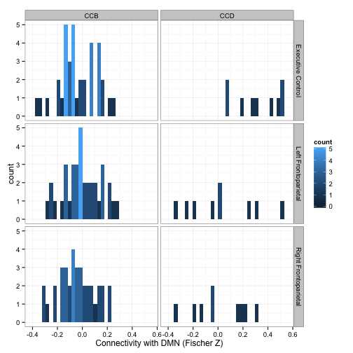
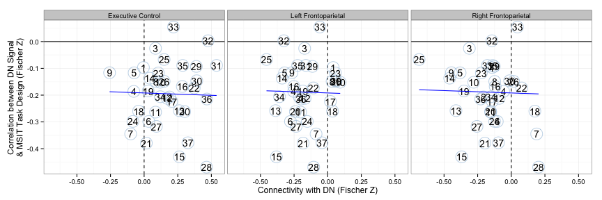

# Associations between MSIT-DMN and Rest-DMN-Kurtosis

Note that actual code is loaded from a different file.


```r
read_chunk("05_connectivity_vs_msit.R")
```


## Overview

Only the connectivity between DN and Right Frontoparietal is marginally related to MSIT-DN correlation. 

## Setup


```r
library(plyr)
library(e1071)
library(ggplot2)
library(robustbase)
library(RColorBrewer)
basedir <- dirname(dirname(getwd()))  # assume running in current direcotry
scriptdir <- file.path(basedir, "scripts")
datadir <- file.path(basedir, "scripts/data")
oldtheme <- theme_set(theme_bw())
```


```r
orig_network_names <- c("Medial Visual", "Occipital Pole Visual", "Lateral Visual", 
    "Default Network", "Cerebellum", "Sensorimotor", "Auditory", "Executive Control", 
    "Right Frontoparietal", "Left Frontoparietal")
network_names <- gsub(" ", ".", tolower(orig_network_names))
dmn <- which(network_names == "default.network")
tps <- 8:10
```


Read in subject information.


```r
fname <- file.path(scriptdir, "04_msit_task/z_predesign.csv")
subinfo <- read.csv(fname)
subinfo$study <- factor(subinfo$study, labels = c("CCB", "CCD"))
subinfo$sex <- factor(subinfo$sex)
# Plot Age
ggplot(subinfo, aes(x = age, fill = ..count..)) + geom_histogram(binwidth = 5) + 
    facet_grid(study ~ .)
```

 

```r
# Plot Sex
ggplot(subinfo, aes(x = sex, fill = study)) + geom_bar()
```

 


Get the incoherent > coherent predicted task signal together.


```r
# CCB
ccb_waver <- read.table(file.path(scriptdir, "04_msit_task/level1_ccb_template.mat"), 
    skip = 5)
ccb_waver <- as.matrix(ccb_waver)[, c(1, 3)]
ccb_waver <- ccb_waver[, 2] - ccb_waver[, 1]
tmpdf <- data.frame(time = seq(0, by = 1.75, length.out = length(ccb_waver)), 
    predicted_signal = ccb_waver)
ggplot(tmpdf, aes(time, predicted_signal)) + geom_line() + xlab("Time (secs)") + 
    ylab("Predicted Signal") + ggtitle("For CCB Subjects")
```

 

```r
# CCD
ccd_waver <- read.table(file.path(scriptdir, "04_msit_task/level1_ccd_template.mat"), 
    skip = 5)
ccd_waver <- as.matrix(ccd_waver)[, c(1, 3)]
ccd_waver <- ccd_waver[, 2] - ccd_waver[, 1]
tmpdf <- data.frame(time = seq(0, by = 2, length.out = length(ccd_waver)), predicted_signal = ccd_waver)
ggplot(tmpdf, aes(time, predicted_signal)) + geom_line() + xlab("Time (secs)") + 
    ylab("Predicted Signal") + ggtitle("For CCD Subjects")
```

 


Read in the time-series data.


```r
# this loads the 'tss' object with attr(tss, 'split_labels') to get how
# stuff should be organized
load(file.path(datadir, "ccb+ccd_time_series.rda"))
splitter <- attr(tss, "split_labels")
splitter$index <- 1:nrow(splitter)
```


## Pre-Analysis Calculations

Get the correlation (Fischer Z transformed) between the MSIT predicted task signal and the DMN signal. For each subject, collapse this measure across scans/runs (i.e., get the mean). Note that this time, I have flipped the MSIT task to DMN signal correlation so it is generally negative.


```r
sub_splitter <- subset(splitter, condition == "MSIT")
correlation_msit_dmn <- ddply(sub_splitter, .(subject, study, scan, run), function(sdf) {
    ts <- tss[[sdf$index]][, dmn]
    if (sdf$study == "CCB") 
        r <- cor(ts, ccb_waver) else r <- cor(ts, ccd_waver)
    z <- atanh(r)
    c(msit.r = r, msit.z = z)
})
# collapse across scan and run
correlation_msit_dmn <- ddply(correlation_msit_dmn, .(study, subject), numcolwise(mean))
# plot
ggplot(correlation_msit_dmn, aes(x = msit.z)) + geom_histogram(aes(fill = ..count..), 
    binwidth = 0.1) + facet_grid(. ~ study) + xlab("Correlations between MSIT task design and DN Signal (Fischer Z)")
```

 


Get the connectivity between the DN and TP networks at rest. For each subject, collapse this measure across scans/runs (i.e., get the mean).


```r
connectivity_rest <- ddply(sub_splitter, .(study, subject, scan, run), function(sdf) {
    ts <- tss[[sdf$index]][, c(dmn, tps)]
    rs <- cor(ts)[-1, 1]
    zs <- atanh(rs)
    data.frame(network = orig_network_names[tps], connectivity.r = rs, connectivity.z = zs)
})
# collapse across scan and run
connectivity_rest <- ddply(connectivity_rest, .(study, subject, network), numcolwise(mean))
# plot
ggplot(connectivity_rest, aes(x = connectivity.z)) + geom_histogram(aes(fill = ..count..), 
    binwidth = 0.1) + facet_grid(network ~ study) + xlab("Connectivity with DMN (Fischer Z)")
```

 


```r
df <- merge(correlation_msit_dmn, connectivity_rest, by = c("study", "subject"))
```


## Plot and Significate


```r
to_outlier <- function(x) factor((x > 0.1) * 1, levels = c(0, 1), labels = c("yes", 
    "no"))
wrap_lmrob <- function(f, df) {
    reg <- summary(lmrob(f, df, maxit.scale = 500))
    print(reg)
    df$outlier <- to_outlier(reg$weights)
    df$weights <- reg$weights
    df$id <- 1:nrow(df)
    df
}
```


Ugh, not significant.


```r
tmpdf <- ddply(df, .(network), function(sdf) {
    cat("\nConnectivity between DN and", as.character(sdf$network[1]), "\n")
    wrap_lmrob(msit.z ~ connectivity.z, sdf)
})
```

```
## 
## Connectivity between DN and Executive Control 
## 
## Call:
## lmrob(formula = f, data = df, maxit.scale = 500)
## 
## Weighted Residuals:
##     Min      1Q  Median      3Q     Max 
## -0.2982 -0.0741  0.0143  0.0768  0.2410 
## 
## Coefficients:
##                Estimate Std. Error t value Pr(>|t|)    
## (Intercept)     -0.2008     0.0236   -8.49  5.1e-10 ***
## connectivity.z   0.0651     0.1165    0.56     0.58    
## ---
## Signif. codes:  0 '***' 0.001 '**' 0.01 '*' 0.05 '.' 0.1 ' ' 1 
## 
## Robust residual standard error: 0.115 
## Convergence in 11 IRWLS iterations
## 
## Robustness weights: 
##  one weight is ~= 1. The remaining 36 ones are summarized as
##    Min. 1st Qu.  Median    Mean 3rd Qu.    Max. 
##   0.484   0.900   0.958   0.912   0.988   0.999 
## Algorithmic parameters: 
## tuning.chi         bb tuning.psi refine.tol    rel.tol  solve.tol 
##   1.55e+00   5.00e-01   4.69e+00   1.00e-07   1.00e-07   1.00e-07 
##      nResample         max.it       best.r.s       k.fast.s          k.max 
##            500             50              2              1            200 
##    maxit.scale      trace.lev            mts     compute.rd fast.s.large.n 
##            500              0           1000              0           2000 
##           psi   subsampling        method           cov 
##    "bisquare" "nonsingular"          "MM" ".vcov.avar1" 
## seed : int(0) 
## 
## Connectivity between DN and Left Frontoparietal 
## 
## Call:
## lmrob(formula = f, data = df, maxit.scale = 500)
## 
## Weighted Residuals:
##      Min       1Q   Median       3Q      Max 
## -0.27997 -0.07051  0.00903  0.07933  0.24133 
## 
## Coefficients:
##                Estimate Std. Error t value Pr(>|t|)    
## (Intercept)     -0.1845     0.0249   -7.41  1.1e-08 ***
## connectivity.z   0.0417     0.1213    0.34     0.73    
## ---
## Signif. codes:  0 '***' 0.001 '**' 0.01 '*' 0.05 '.' 0.1 ' ' 1 
## 
## Robust residual standard error: 0.114 
## Convergence in 10 IRWLS iterations
## 
## Robustness weights: 
##  3 weights are ~= 1. The remaining 34 ones are summarized as
##    Min. 1st Qu.  Median    Mean 3rd Qu.    Max. 
##   0.523   0.879   0.955   0.904   0.991   0.999 
## Algorithmic parameters: 
## tuning.chi         bb tuning.psi refine.tol    rel.tol  solve.tol 
##   1.55e+00   5.00e-01   4.69e+00   1.00e-07   1.00e-07   1.00e-07 
##      nResample         max.it       best.r.s       k.fast.s          k.max 
##            500             50              2              1            200 
##    maxit.scale      trace.lev            mts     compute.rd fast.s.large.n 
##            500              0           1000              0           2000 
##           psi   subsampling        method           cov 
##    "bisquare" "nonsingular"          "MM" ".vcov.avar1" 
## seed : int(0) 
## 
## Connectivity between DN and Right Frontoparietal 
## 
## Call:
## lmrob(formula = f, data = df, maxit.scale = 500)
## 
## Weighted Residuals:
##      Min       1Q   Median       3Q      Max 
## -0.27447 -0.06770  0.00267  0.06559  0.28698 
## 
## Coefficients:
##                Estimate Std. Error t value Pr(>|t|)    
## (Intercept)     -0.2240     0.0278   -8.06  1.7e-09 ***
## connectivity.z  -0.1849     0.0946   -1.95    0.059 .  
## ---
## Signif. codes:  0 '***' 0.001 '**' 0.01 '*' 0.05 '.' 0.1 ' ' 1 
## 
## Robust residual standard error: 0.106 
## Convergence in 11 IRWLS iterations
## 
## Robustness weights: 
##  4 weights are ~= 1. The remaining 33 ones are summarized as
##    Min. 1st Qu.  Median    Mean 3rd Qu.    Max. 
##   0.441   0.904   0.950   0.894   0.990   0.997 
## Algorithmic parameters: 
## tuning.chi         bb tuning.psi refine.tol    rel.tol  solve.tol 
##   1.55e+00   5.00e-01   4.69e+00   1.00e-07   1.00e-07   1.00e-07 
##      nResample         max.it       best.r.s       k.fast.s          k.max 
##            500             50              2              1            200 
##    maxit.scale      trace.lev            mts     compute.rd fast.s.large.n 
##            500              0           1000              0           2000 
##           psi   subsampling        method           cov 
##    "bisquare" "nonsingular"          "MM" ".vcov.avar1" 
## seed : int(0)
```


Plot doesn't look good either.


```r
grid <- ddply(df, .(network), function(sdf) {
    grid <- data.frame(connectivity.z = seq(min(sdf$connectivity.z), max(sdf$connectivity.z), 
        length = 20))
    grid$msit.z <- predict(lmrob(msit.z ~ connectivity.z, tmpdf, maxit.scale = 500), 
        newdata = grid)
    grid
})
p0 <- ggplot(tmpdf, aes(x = connectivity.z, y = msit.z)) + geom_hline(aes(yintercept = 0)) + 
    geom_vline(aes(yintercept = 0), linetype = "dashed") + facet_grid(. ~ network) + 
    xlab("Connectivity with DN (Fischer Z)") + ylab("Correlation between DN Signal\n& MSIT Task Design (Fischer Z)")
if (any(df$outlier == "yes")) {
    p <- p0 + geom_point(data = tmpdf[tmpdf$outlier == "yes", ], size = 8, color = brewer.pal(3, 
        "Pastel1")[1]) + geom_point(shape = 1, size = 8, color = brewer.pal(3, 
        "Pastel1")[2]) + geom_text(aes(label = id), size = 5) + geom_line(data = grid, 
        color = "blue")
} else {
    p <- p0 + geom_point(shape = 1, size = 8, color = brewer.pal(3, "Pastel1")[2]) + 
        geom_text(aes(label = id), size = 5) + geom_line(data = grid, color = "blue") + 
        scale_color_discrete(name = "Measure")
}
print(p)
```

 

