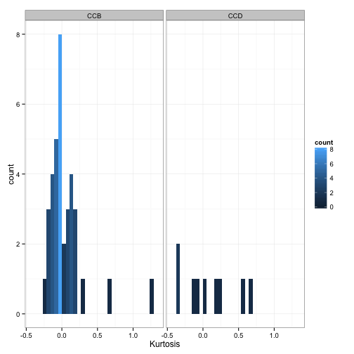
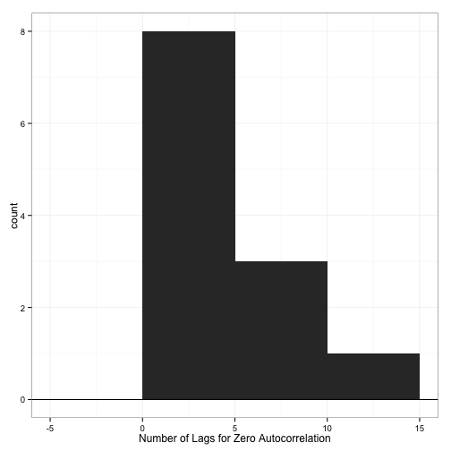
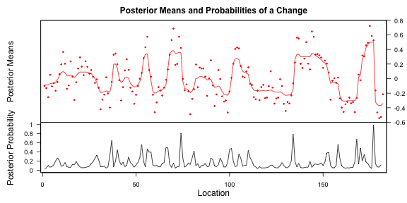
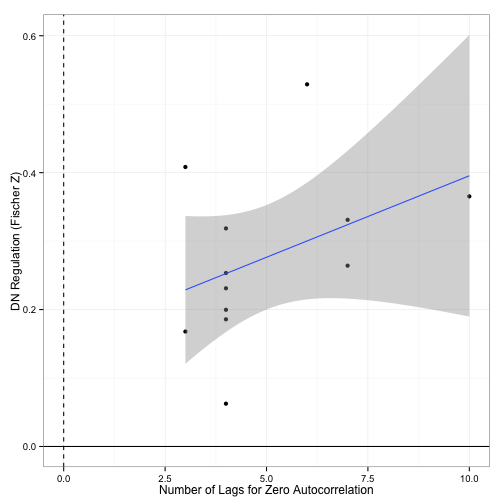
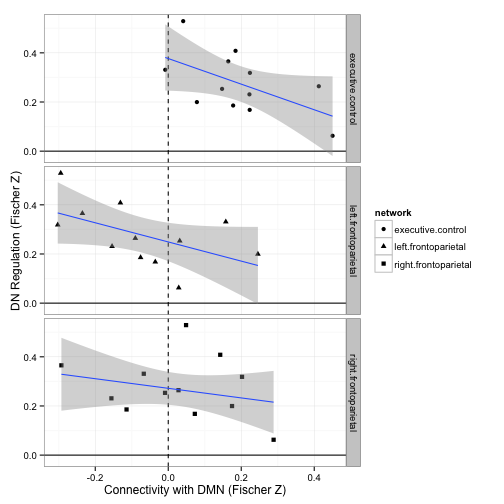
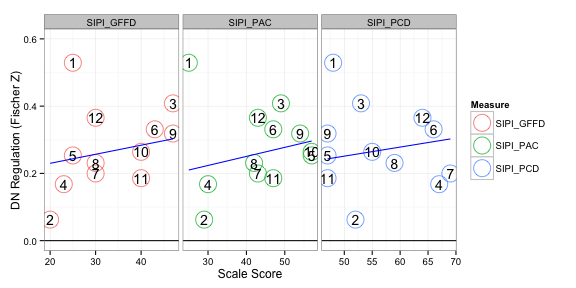
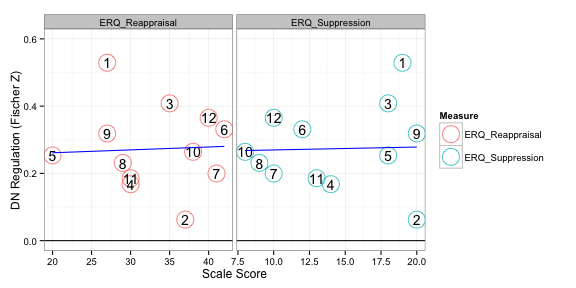
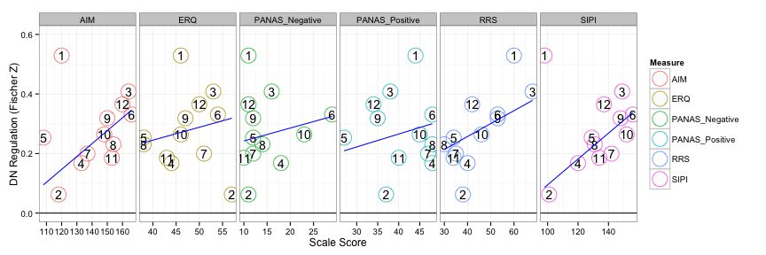
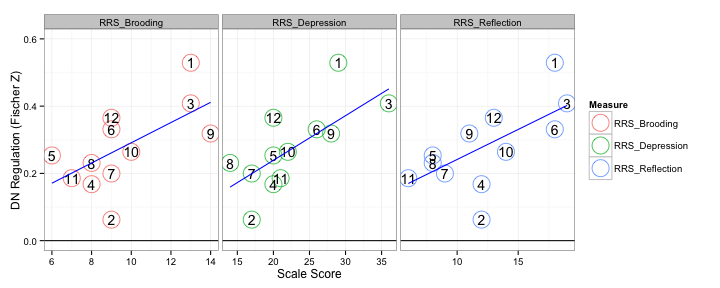
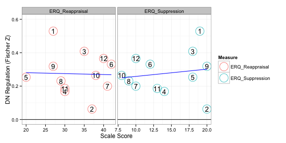

# Associations with DN Regulation

Note that actual code is loaded from a different file.


```r
read_chunk("05_dn_regulation.R")
```


## Overview

There were several interesting results that emerged from these analyses:

* Scores on the RRS Brooding sub-scale are highly and significantly related to DN regulation.
* Connectivity between the DMN and TP networks are marginally related to real-time prediction accuracy.
* The number of change points in an individual's DMN time-series is significantly related to real-time prediction accuracy. More on change points below.

## Setup


```r
library(plyr)
library(reshape)
library(e1071)
library(ggplot2)
library(vegan)
library(bcp)
library(RColorBrewer)
library(robustbase)
library(MASS)
basedir <- dirname(dirname(getwd()))
datadir <- file.path(basedir, "scripts/data")
oldtheme <- theme_set(theme_bw())
```


```r
network_names <- c("medial visual", "occipital pole visual", "lateral visual", 
    "default network", "cerebellum", "sensorimotor", "auditory", "executive control", 
    "right frontoparietal", "left frontoparietal")
network_names <- gsub(" ", ".", network_names)
dmn <- which(network_names == "default.network")
tps <- 8:10
```


```r
fname <- file.path(datadir, "ccd_totals.csv")
phenos <- read.csv(fname, row.names = 1)
phenos <- phenos[14:27, ][-c(8, 13), ]  # CCD014 ... CCD027 (NO CCD021 and CCD026)
```


## Brain Measures

### Network Connectivity


```r
# Read in time-series
load(file.path(datadir, "ccb+ccd_time_series_all.rda"))
splitter <- attr(tss, "split_labels")
splitter$index <- 1:nrow(splitter)
sub_splitter <- subset(splitter, subject %in% toupper(phenos$study_id))
tcs <- laply(tss[sub_splitter$index], function(x) x)
# Calculate correlations
rest_conn_all <- aaply(tcs, 1, cor)
rest_conn <- rest_conn_all[, tps, dmn]  # only look at DMN connectivity with TP networks
colnames(rest_conn) <- network_names[tps]
names(dimnames(rest_conn)) <- c("subjects", "networks")
# Mean
colMeans(rest_conn)
```

```
##    executive.control right.frontoparietal  left.frontoparietal 
##              0.18751              0.02635             -0.06981
```


This is the group average connectivity with the DMN.

### Kurtosis


```r
# only for DMN
rest_kurtosis <- aaply(tcs[, , dmn], 1, kurtosis)
# distribution
ggplot(data.frame(x = rest_kurtosis), aes(x = x)) + geom_histogram(binwidth = 0.2) + 
    geom_hline(aes(yintercept = 0)) + labs(x = "Kurtosis")
```

 


### Autocorrelation

As another measure of stability of the DMN time-series, I looked at it's autocorrelation. I wasn't totally sure how to summarize it, so I calculated the number of lags it took for an individuals DMN time-series to have a correlation of zero.


```r
# only for DMN
rest_lags <- aaply(tcs[, , dmn], 1, function(vec) {
    acors <- acf(vec, plot = F)
    lags <- c(acors$lag)
    acors <- c(acors$acf)
    for (i in 1:length(lags)) {
        if (acors[i] < 0) 
            break
    }
    lags[i]
})
# distribution
ggplot(data.frame(x = rest_lags), aes(x = x)) + geom_histogram(binwidth = 5) + 
    geom_hline(aes(yintercept = 0)) + labs(x = "Number of Lags for Zero Autocorrelation")
```

 


### Change Points

As another measure of the stability of the DMN time-series and to capture changes in brain state that might occur during rest, I used bayesian change point analysis. Essentially, it looks in a time-series for points in time when there is a significant change signal. Another motivation for using this was based on the finding that real-time prediction accuracy was significantly related to an individual's RRS Brooding subscale. I made the reverse inference that since 'brooding' engages the DMN, one might expect that at rest those individuals with higher RRS Brooding scores to have less state changes in the DMN. There are probably a dozen ways to summarize the results from the change point analysis, I determined a change point to be a time with a posterior probability greater than 0.5 and simply calculated the number of such 'change points' in each individual's time-series. Incidently, though the change point summary measure I use is significantly related to prediction accuracy, it isn't significantly related to RRS Brooding (but it's close p=0.2). 


```r
rest_changes <- aaply(tcs[, , dmn], 1, function(vec) {
    bcp.0 <- bcp(vec)
    sum(bcp.0$posterior.prob > 0.5, na.rm = T)
})
# distribution
ggplot(data.frame(x = rest_changes), aes(x = x)) + geom_histogram(binwidth = 5) + 
    geom_hline(aes(yintercept = 0)) + labs(x = "Kurtosis")
```

 

```r
# sample subject
plot(bcp(tcs[1, , dmn]))
```

 


### Prediction


```r
fname <- file.path(datadir, "CCD_full_dframe.csv")
preds <- read.csv(fname)
preds <- preds[-c(23, 24), c(2, 6, 10)]  # no CCD026; only look at DMN
colnames(preds)[3] <- "R"
preds$Z <- atanh(preds$R)
# Plot distribution
ggplot(preds, aes(x = R)) + geom_histogram(binwidth = 0.1) + geom_vline(aes(xintercept = 0), 
    linetype = "dashed") + geom_hline(aes(yintercept = 0)) + facet_grid(ScanType ~ 
    .) + labs(title = "Real-Time Prediction Accuracies", x = "Correlation")
```

 


Quick plot showing that the with feedback condition seems to have slightly greater real-time prediction accuracy than the no feedback condition. For all later analyses, I will ignore the feedback condition.


```r
# Plot
mat <- cast(preds, Subject ~ ScanType, value = "R")
mat$diff <- apply(mat[, 2:3], 1, diff)
ggplot(mat, aes(x = diff)) + geom_histogram(binwidth = 0.1) + geom_vline(aes(xintercept = 0), 
    linetype = "dashed") + geom_hline(aes(yintercept = 0)) + labs(title = "Real-Time Prediction Accuracies", 
    x = "Difference between FB and NoFB")
```

 

```r
# Significance
t.test(Z ~ ScanType, preds, paired = T)
```

```
## 
## 	Paired t-test
## 
## data:  Z by ScanType 
## t = -0.2769, df = 11, p-value = 0.787
## alternative hypothesis: true difference in means is not equal to 0 
## 95 percent confidence interval:
##  -0.12473  0.09685 
## sample estimates:
## mean of the differences 
##                -0.01394
```


```r
# Moving forward only look at Feedback condition
preds <- subset(preds, ScanType == "FB")
# Combine phenotype info, kurtosis, and prediction accuracy
df <- data.frame(phenos, prediction = preds$Z, kurtosis = rest_kurtosis, lag = rest_lags, 
    nchanges = rest_changes, rest_conn)
colnames(df)[[1]] <- "Subject"
# Save
write.csv(df, file = "z_data1.csv")
# Needed functions
to_outlier <- function(x) factor((x > 0.1) * 1, levels = c(0, 1), labels = c("yes", 
    "no"))
wrap_lmrob <- function(f, df) {
    reg <- summary(lmrob(f, df, maxit.scale = 500))
    print(reg)
    df$outlier <- to_outlier(reg$weights)
    df$weights <- reg$weights
    df
}
```


## Prediction Accuracy Associations

### with Brain Measures

#### Kurtosis

Nope not significant.


```r
# Significance
tdf <- wrap_lmrob(prediction ~ kurtosis, df)
```

```
## 
## Call:
## lmrob(formula = f, data = df, maxit.scale = 500)
## 
## Weighted Residuals:
##      Min       1Q   Median       3Q      Max 
## -0.20612 -0.08370 -0.00792  0.06580  0.22546 
## 
## Coefficients:
##             Estimate Std. Error t value Pr(>|t|)    
## (Intercept)   0.2693     0.0335    8.04  1.1e-05 ***
## kurtosis     -0.0701     0.0634   -1.11     0.29    
## ---
## Signif. codes:  0 '***' 0.001 '**' 0.01 '*' 0.05 '.' 0.1 ' ' 1 
## 
## Robust residual standard error: 0.136 
## Convergence in 8 IRWLS iterations
## 
## Robustness weights: 
##  one weight is ~= 1. The remaining 11 ones are summarized as
##    Min. 1st Qu.  Median    Mean 3rd Qu.    Max. 
##   0.766   0.927   0.965   0.934   0.986   0.996 
## Algorithmic parameters: 
## tuning.chi         bb tuning.psi refine.tol    rel.tol  solve.tol 
##   1.55e+00   5.00e-01   4.69e+00   1.00e-07   1.00e-07   1.00e-07 
##      nResample         max.it       best.r.s       k.fast.s          k.max 
##            500             50              2              1            200 
##    maxit.scale      trace.lev            mts     compute.rd fast.s.large.n 
##            500              0           1000              0           2000 
##           psi   subsampling        method           cov 
##    "bisquare" "nonsingular"          "MM" ".vcov.avar1" 
## seed : int(0)
```

```r
# Plot
p <- ggplot(tdf, aes(x = kurtosis, y = prediction)) + geom_vline(aes(xintercept = 0), 
    linetype = "dashed") + geom_hline(aes(yintercept = 0)) + labs(x = "DMN Kurtosis", 
    y = "DN Regulation (Fischer Z)")
if (any(tdf$outlier == "yes")) {
    p <- p + geom_point(aes(color = outlier)) + geom_smooth(data = tdf[tdf$outlier == 
        "no", ], method = rlm) + scale_color_manual(values = c("black", "red"))
} else {
    p <- p + geom_point() + geom_smooth(method = "lm")
}
print(p)
```

 


#### Autocorrelation

Significant. Again here I took the number of lags until the autocorrelation of the DMN time-series was 0 or below 0. Thus, someone who is good at regulating their DMN activity also is less likely to see slower changes in their DMN time-series (or at least I think that's what it means).


```r
tdf <- wrap_lmrob(prediction ~ lag, df)
```

```
## 
## Call:
## lmrob(formula = f, data = df, maxit.scale = 500)
## 
## Weighted Residuals:
##      Min       1Q   Median       3Q      Max 
## -0.17532 -0.04318 -0.00773  0.03903  0.24577 
## 
## Coefficients:
##             Estimate Std. Error t value Pr(>|t|)  
## (Intercept)  0.14705    0.08210    1.79    0.104  
## lag          0.02270    0.00909    2.50    0.032 *
## ---
## Signif. codes:  0 '***' 0.001 '**' 0.01 '*' 0.05 '.' 0.1 ' ' 1 
## 
## Robust residual standard error: 0.0796 
## Convergence in 14 IRWLS iterations
## 
## Robustness weights: 
##  one weight is ~= 1. The remaining 11 ones are summarized as
##    Min. 1st Qu.  Median    Mean 3rd Qu.    Max. 
##   0.320   0.758   0.968   0.840   0.985   0.999 
## Algorithmic parameters: 
## tuning.chi         bb tuning.psi refine.tol    rel.tol  solve.tol 
##   1.55e+00   5.00e-01   4.69e+00   1.00e-07   1.00e-07   1.00e-07 
##      nResample         max.it       best.r.s       k.fast.s          k.max 
##            500             50              2              1            200 
##    maxit.scale      trace.lev            mts     compute.rd fast.s.large.n 
##            500              0           1000              0           2000 
##           psi   subsampling        method           cov 
##    "bisquare" "nonsingular"          "MM" ".vcov.avar1" 
## seed : int(0)
```

```r
# Plot
p <- ggplot(tdf, aes(x = lag, y = prediction)) + geom_vline(aes(xintercept = 0), 
    linetype = "dashed") + geom_hline(aes(yintercept = 0)) + xlab("Number of Lags for Zero Autocorrelation") + 
    ylab("DN Regulation (Fischer Z)")
if (any(tdf$outlier == "yes")) {
    p <- p + geom_point(aes(color = outlier)) + geom_smooth(data = tdf[tdf$outlier == 
        "no", ], method = rlm) + scale_color_manual(values = c("black", "red"))
} else {
    p <- p + geom_point() + geom_smooth(method = "lm")
}
print(p)
```

 


#### Change Points

Strange that this is no longer significant since the plot looks pretty good. As before, it probably isn't helpful that a bunch of individuals have the same number of change points. Again here I calculated the number of points in the DMN time-series that a significant change in the signal occured.


```r
tdf <- wrap_lmrob(prediction ~ nchanges, df)
```

```
## 
## Call:
## lmrob(formula = f, data = df, maxit.scale = 500)
## 
## Weighted Residuals:
##      Min       1Q   Median       3Q      Max 
## -0.16257 -0.08202  0.00443  0.06347  0.18069 
## 
## Coefficients:
##             Estimate Std. Error t value Pr(>|t|)  
## (Intercept)   0.5238     0.1716    3.05    0.012 *
## nchanges     -0.0176     0.0115   -1.52    0.159  
## ---
## Signif. codes:  0 '***' 0.001 '**' 0.01 '*' 0.05 '.' 0.1 ' ' 1 
## 
## Robust residual standard error: 0.102 
## Convergence in 15 IRWLS iterations
## 
## Robustness weights: 
##    Min. 1st Qu.  Median    Mean 3rd Qu.    Max. 
##   0.737   0.916   0.937   0.921   0.976   0.998 
## Algorithmic parameters: 
## tuning.chi         bb tuning.psi refine.tol    rel.tol  solve.tol 
##   1.55e+00   5.00e-01   4.69e+00   1.00e-07   1.00e-07   1.00e-07 
##      nResample         max.it       best.r.s       k.fast.s          k.max 
##            500             50              2              1            200 
##    maxit.scale      trace.lev            mts     compute.rd fast.s.large.n 
##            500              0           1000              0           2000 
##           psi   subsampling        method           cov 
##    "bisquare" "nonsingular"          "MM" ".vcov.avar1" 
## seed : int(0)
```

```r
# Plot
p <- ggplot(tdf, aes(x = nchanges, y = prediction)) + geom_vline(aes(xintercept = 0), 
    linetype = "dashed") + geom_hline(aes(yintercept = 0)) + xlab("Number of Change Points in DMN Time-Series") + 
    ylab("DN Regulation (Fischer Z)")
if (any(tdf$outlier == "yes")) {
    p <- p + geom_point(aes(color = outlier)) + geom_smooth(data = tdf[tdf$outlier == 
        "no", ], method = rlm) + scale_color_manual(values = c("black", "red"))
} else {
    p <- p + geom_point() + geom_smooth(method = "lm")
}
print(p)
```

 


### TP Connectivity

DMN connectivity with the left fronto-parietal is significant with the others coming close (there does appear to be an outlier with the right frontoporietal network).


```r
# Combine
tmpdf <- data.frame(df[rep(1:nrow(df), length(network_names[tps])), c("Subject", 
    "Age", "Sex", "prediction")], network = rep(network_names[tps], each = nrow(df)), 
    connectivity = atanh(c(rest_conn)))
# Outliers
tmpdf <- ddply(tmpdf, .(network), function(sdf) {
    wrap_lmrob(prediction ~ Age + Sex + connectivity, sdf)
})
```

```
## 
## Call:
## lmrob(formula = f, data = df, maxit.scale = 500)
## 
## Weighted Residuals:
##     Min      1Q  Median      3Q     Max 
## -0.1910 -0.0488 -0.0264  0.0683  0.1818 
## 
## Coefficients:
##              Estimate Std. Error t value Pr(>|t|)  
## (Intercept)   0.26856    0.32996    0.81    0.439  
## Age           0.00418    0.01641    0.25    0.805  
## SexMale       0.08792    0.15409    0.57    0.584  
## connectivity -0.62993    0.32440   -1.94    0.088 .
## ---
## Signif. codes:  0 '***' 0.001 '**' 0.01 '*' 0.05 '.' 0.1 ' ' 1 
## 
## Robust residual standard error: 0.0791 
## Convergence in 21 IRWLS iterations
## 
## Robustness weights: 
##    Min. 1st Qu.  Median    Mean 3rd Qu.    Max. 
##   0.540   0.901   0.956   0.887   0.987   0.998 
## Algorithmic parameters: 
## tuning.chi         bb tuning.psi refine.tol    rel.tol  solve.tol 
##   1.55e+00   5.00e-01   4.69e+00   1.00e-07   1.00e-07   1.00e-07 
##      nResample         max.it       best.r.s       k.fast.s          k.max 
##            500             50              2              1            200 
##    maxit.scale      trace.lev            mts     compute.rd fast.s.large.n 
##            500              0           1000              0           2000 
##           psi   subsampling        method           cov 
##    "bisquare" "nonsingular"          "MM" ".vcov.avar1" 
## seed : int(0) 
## 
## Call:
## lmrob(formula = f, data = df, maxit.scale = 500)
## 
## Weighted Residuals:
##      Min       1Q   Median       3Q      Max 
## -0.10799 -0.06937 -0.00653  0.06526  0.18125 
## 
## Coefficients:
##              Estimate Std. Error t value Pr(>|t|)   
## (Intercept)   0.53055    0.14566    3.64   0.0066 **
## Age          -0.01302    0.00571   -2.28   0.0521 . 
## SexMale       0.05229    0.05109    1.02   0.3360   
## connectivity -0.48495    0.17892   -2.71   0.0266 * 
## ---
## Signif. codes:  0 '***' 0.001 '**' 0.01 '*' 0.05 '.' 0.1 ' ' 1 
## 
## Robust residual standard error: 0.117 
## Convergence in 9 IRWLS iterations
## 
## Robustness weights: 
##  3 weights are ~= 1. The remaining 9 ones are
##     1     2     3     4     5     6     8    10    11 
## 0.793 0.973 0.975 0.943 0.961 0.878 0.950 0.984 0.924 
## Algorithmic parameters: 
## tuning.chi         bb tuning.psi refine.tol    rel.tol  solve.tol 
##   1.55e+00   5.00e-01   4.69e+00   1.00e-07   1.00e-07   1.00e-07 
##      nResample         max.it       best.r.s       k.fast.s          k.max 
##            500             50              2              1            200 
##    maxit.scale      trace.lev            mts     compute.rd fast.s.large.n 
##            500              0           1000              0           2000 
##           psi   subsampling        method           cov 
##    "bisquare" "nonsingular"          "MM" ".vcov.avar1" 
## seed : int(0) 
## 
## Call:
## lmrob(formula = f, data = df, maxit.scale = 500)
## 
## Weighted Residuals:
##      Min       1Q   Median       3Q      Max 
## -0.08384 -0.06453 -0.00897  0.03694  0.31194 
## 
## Coefficients:
##              Estimate Std. Error t value Pr(>|t|)  
## (Intercept)   0.11672    0.15119    0.77    0.462  
## Age           0.00488    0.00542    0.90    0.394  
## SexMale       0.11976    0.07294    1.64    0.139  
## connectivity -0.44168    0.18803   -2.35    0.047 *
## ---
## Signif. codes:  0 '***' 0.001 '**' 0.01 '*' 0.05 '.' 0.1 ' ' 1 
## 
## Robust residual standard error: 0.111 
## Convergence in 11 IRWLS iterations
## 
## Robustness weights: 
##  one weight is ~= 1. The remaining 11 ones are summarized as
##    Min. 1st Qu.  Median    Mean 3rd Qu.    Max. 
##   0.411   0.947   0.961   0.914   0.986   0.998 
## Algorithmic parameters: 
## tuning.chi         bb tuning.psi refine.tol    rel.tol  solve.tol 
##   1.55e+00   5.00e-01   4.69e+00   1.00e-07   1.00e-07   1.00e-07 
##      nResample         max.it       best.r.s       k.fast.s          k.max 
##            500             50              2              1            200 
##    maxit.scale      trace.lev            mts     compute.rd fast.s.large.n 
##            500              0           1000              0           2000 
##           psi   subsampling        method           cov 
##    "bisquare" "nonsingular"          "MM" ".vcov.avar1" 
## seed : int(0)
```

```r
# Plot
ggplot(tmpdf, aes(x = connectivity, y = prediction, shape = network)) + geom_vline(aes(xintercept = 0), 
    linetype = "dashed") + geom_hline(aes(yintercept = 0)) + geom_point() + 
    geom_smooth(method = rlm) + facet_grid(network ~ .) + labs(x = "Connectivity with DMN (Fischer Z)", 
    y = "DN Regulation (Fischer Z)")
```

 


### MDMR

Had to throw this in. The first analysis is significant, so the pattern of connectivity between the DMN and the other networks significantly predicts real-time prediction accuracy.


```r
# CWAS between DMN and all networks
d <- as.dist(1 - cor(t(rest_conn_all[, -4, 4])))
adonis(d ~ Age + Sex + prediction, df, permutations = 4999)
```

```
## 
## Call:
## adonis(formula = d ~ Age + Sex + prediction, data = df, permutations = 4999) 
## 
## Terms added sequentially (first to last)
## 
##            Df SumsOfSqs MeanSqs F.Model    R2 Pr(>F)    
## Age         1     0.386   0.386    3.45 0.136 0.0414 *  
## Sex         1     0.922   0.922    8.24 0.325 0.0004 ***
## prediction  1     0.634   0.634    5.66 0.223 0.0054 ** 
## Residuals   8     0.895   0.112         0.316           
## Total      11     2.837                 1.000           
## ---
## Signif. codes:  0 '***' 0.001 '**' 0.01 '*' 0.05 '.' 0.1 ' ' 1
```

```r
# CWAS between DMN and TP networks
d <- as.dist(1 - cor(t(rest_conn)))
adonis(d ~ Age + Sex + prediction, df, permutations = 4999)
```

```
## 
## Call:
## adonis(formula = d ~ Age + Sex + prediction, data = df, permutations = 4999) 
## 
## Terms added sequentially (first to last)
## 
##            Df SumsOfSqs MeanSqs F.Model     R2 Pr(>F)  
## Age         1      1.68   1.684    4.06  0.308  0.064 .
## Sex         1      0.59   0.594    1.43  0.109  0.261  
## prediction  1     -0.13  -0.130   -0.31 -0.024  0.950  
## Residuals   8      3.31   0.414          0.607         
## Total      11      5.46                  1.000         
## ---
## Signif. codes:  0 '***' 0.001 '**' 0.01 '*' 0.05 '.' 0.1 ' ' 1
```


### with Phenotypic Measures


```r
brainbehavior.multiple <- function(names, with_age_sex = TRUE) {
    # Significance
    if (with_age_sex) 
        f <- paste("prediction ~ Age + Sex +", paste(names, collapse = " + ")) else f <- paste("prediction ~", paste(names, collapse = " + "))
    f <- as.formula(f)
    tdf <- wrap_lmrob(f, df)
    
    # Reorganize
    tdf$id <- 1:nrow(tdf)
    bb.df <- ddply(tdf, .(Subject), function(sdf) {
        sdf <- data.frame(sdf[rep(1, length(names)), c("id", "Subject", "prediction", 
            "outlier", "weights")], measure = names, behavior = as.numeric(sdf[, 
            names]))
        sdf
    })
    
    # Get best fit line
    model <- lmrob(prediction ~ behavior + measure, bb.df, maxit.scale = 500)
    grid <- ddply(bb.df[bb.df$outlier == "no", ], .(measure), function(sdf) {
        data.frame(behavior = seq(min(sdf$behavior), max(sdf$behavior), length = 20), 
            measure = rep(sdf$measure[1], 20))
    })
    grid$prediction <- predict(model, newdata = grid)
    
    # Plot
    p0 <- ggplot(bb.df, aes(x = behavior, y = prediction)) + geom_hline(aes(yintercept = 0)) + 
        ylim(0, 0.6) + xlab("Scale Score") + ylab("DN Regulation (Fischer Z)") + 
        facet_grid(. ~ measure, scales = "free_x")
    if (any(bb.df$outlier == "yes")) {
        p <- p0 + geom_point(data = bb.df[bb.df$outlier == "yes", ], size = 8, 
            color = brewer.pal(3, "Pastel1")[1]) + geom_point(aes(color = measure), 
            shape = 1, size = 8) + geom_text(aes(label = id), size = 5) + geom_line(data = grid, 
            color = "blue") + scale_color_discrete(name = "Measure")
    } else {
        p <- p0 + geom_point(aes(color = measure), shape = 1, size = 8) + geom_text(aes(label = id), 
            size = 5) + geom_line(data = grid, color = "blue") + scale_color_discrete(name = "Measure")
    }
    p
}
brainbehavior.single <- function(names, with_age_sex = TRUE) {
    # Significance
    bb.df <- ldply(names, function(name) {
        cat("\nRunning regression for", name, "\n")
        if (with_age_sex) 
            f <- paste("prediction ~ Age + Sex +", name) else f <- paste("prediction ~", name)
        f <- as.formula(f)
        tdf <- wrap_lmrob(f, df)
        tdf$id <- 1:nrow(tdf)
        tdf$measure <- name
        tdf$behavior <- tdf[[name]]
        cat("\n")
        tdf[, c("id", "Subject", "measure", "behavior", "prediction", "outlier", 
            "weights")]
    })
    bb.df$measure <- factor(bb.df$measure)
    bb.df$outlier <- factor(bb.df$outlier)
    
    
    # Get best fit line
    grid <- ddply(bb.df[bb.df$outlier == "no", ], .(measure), function(sdf) {
        model <- lmrob(prediction ~ behavior, sdf, maxit.scale = 500)
        sgrid <- data.frame(behavior = seq(min(sdf$behavior), max(sdf$behavior), 
            length = 20))
        sgrid$prediction <- predict(model, newdata = sgrid)
        sgrid$measure <- sdf$measure[1]
        sgrid
    })
    
    # Plot
    p0 <- ggplot(bb.df, aes(x = behavior, y = prediction)) + geom_hline(aes(yintercept = 0)) + 
        ylim(0, 0.6) + xlab("Scale Score") + ylab("DN Regulation (Fischer Z)") + 
        facet_grid(. ~ measure, scales = "free_x")
    if (any(bb.df$outlier == "yes")) {
        p <- p0 + geom_point(data = bb.df[bb.df$outlier == "yes", ], size = 8, 
            color = brewer.pal(3, "Pastel1")[1]) + geom_point(aes(color = measure), 
            shape = 1, size = 8) + geom_text(aes(label = id), size = 5) + geom_line(data = grid, 
            color = "blue") + scale_color_discrete(name = "Measure")
    } else {
        p <- p0 + geom_point(aes(color = measure), shape = 1, size = 8) + geom_text(aes(label = id), 
            size = 5) + geom_line(data = grid, color = "blue") + scale_color_discrete(name = "Measure")
    }
    p
}
```


#### Total Scale Scores (with BDI, without PANAS)

##### Multiple Regression

Here, only RRS is significant and there are no outliers.


```r
names <- c("SIPI", "RRS", "ERQ", "BDI", "AIM")
brainbehavior.multiple(names)
```

```
## 
## Call:
## lmrob(formula = f, data = df, maxit.scale = 500)
## 
## Weighted Residuals:
##  [1]  0.06852 -0.03118 -0.06311 -0.11458  0.00576  0.00660  0.04756
##  [8]  0.02620  0.02813 -0.01335 -0.05456  0.08936
## 
## Coefficients:
##              Estimate Std. Error t value Pr(>|t|)  
## (Intercept) -0.000170   0.949732    0.00    1.000  
## Age         -0.004226   0.008257   -0.51    0.636  
## SexMale     -0.109856   0.167760   -0.65    0.548  
## SIPI         0.001894   0.003943    0.48    0.656  
## RRS          0.009706   0.002759    3.52    0.024 *
## ERQ         -0.005241   0.006807   -0.77    0.484  
## BDI         -0.013251   0.023601   -0.56    0.604  
## AIM          0.000329   0.001672    0.20    0.854  
## ---
## Signif. codes:  0 '***' 0.001 '**' 0.01 '*' 0.05 '.' 0.1 ' ' 1 
## 
## Robust residual standard error: 0.121 
## Convergence in 9 IRWLS iterations
## 
## Robustness weights: 
##  2 weights are ~= 1. The remaining 10 ones are
##     1     2     3     4     7     8     9    10    11    12 
## 0.971 0.994 0.975 0.920 0.986 0.996 0.995 0.999 0.982 0.951 
## Algorithmic parameters: 
## tuning.chi         bb tuning.psi refine.tol    rel.tol  solve.tol 
##   1.55e+00   5.00e-01   4.69e+00   1.00e-07   1.00e-07   1.00e-07 
##      nResample         max.it       best.r.s       k.fast.s          k.max 
##            500             50              2              1            200 
##    maxit.scale      trace.lev            mts     compute.rd fast.s.large.n 
##            500              0           1000              0           2000 
##           psi   subsampling        method           cov 
##    "bisquare" "nonsingular"          "MM" ".vcov.avar1" 
## seed : int(0)
```

 


##### Single Regressions

Here, SIPI and RRS are both significant and subject 1 is an outlier in the AIM and SIPI analyses.


```r
names <- c("SIPI", "RRS", "ERQ", "BDI", "AIM")
brainbehavior.single(names)
```

```
## 
## Running regression for SIPI 
## 
## Call:
## lmrob(formula = f, data = df, maxit.scale = 500)
## 
## Weighted Residuals:
##       Min        1Q    Median        3Q       Max 
## -0.056703 -0.038443 -0.000399  0.040699  0.486238 
## 
## Coefficients:
##              Estimate Std. Error t value Pr(>|t|)    
## (Intercept) -0.656847   0.170801   -3.85  0.00491 ** 
## Age          0.004349   0.003662    1.19  0.26911    
## SexMale     -0.048656   0.054240   -0.90  0.39589    
## SIPI         0.006030   0.000966    6.24  0.00025 ***
## ---
## Signif. codes:  0 '***' 0.001 '**' 0.01 '*' 0.05 '.' 0.1 ' ' 1 
## 
## Robust residual standard error: 0.0706 
## Convergence in 10 IRWLS iterations
## 
## Robustness weights: 
##  observation 1 is an outlier with |weight| = 0 ( < 0.0083); 
##  3 weights are ~= 1. The remaining 8 ones are
##     2     3     5     6     7    10    11    12 
## 0.993 0.772 0.993 0.971 0.974 0.953 0.942 0.809 
## Algorithmic parameters: 
## tuning.chi         bb tuning.psi refine.tol    rel.tol  solve.tol 
##   1.55e+00   5.00e-01   4.69e+00   1.00e-07   1.00e-07   1.00e-07 
##      nResample         max.it       best.r.s       k.fast.s          k.max 
##            500             50              2              1            200 
##    maxit.scale      trace.lev            mts     compute.rd fast.s.large.n 
##            500              0           1000              0           2000 
##           psi   subsampling        method           cov 
##    "bisquare" "nonsingular"          "MM" ".vcov.avar1" 
## seed : int(0) 
## 
## 
## Running regression for RRS 
## 
## Call:
## lmrob(formula = f, data = df, maxit.scale = 500)
## 
## Weighted Residuals:
##     Min      1Q  Median      3Q     Max 
## -0.1359 -0.0514  0.0053  0.0565  0.1107 
## 
## Coefficients:
##             Estimate Std. Error t value Pr(>|t|)   
## (Intercept)  0.05104    0.17156    0.30    0.774   
## Age         -0.00601    0.00904   -0.67    0.525   
## SexMale     -0.04153    0.04694   -0.88    0.402   
## RRS          0.00863    0.00240    3.60    0.007 **
## ---
## Signif. codes:  0 '***' 0.001 '**' 0.01 '*' 0.05 '.' 0.1 ' ' 1 
## 
## Robust residual standard error: 0.0933 
## Convergence in 12 IRWLS iterations
## 
## Robustness weights: 
##  2 weights are ~= 1. The remaining 10 ones are
##     1     2     3     4     5     6     8     9    11    12 
## 0.876 0.816 0.975 0.906 0.956 0.966 0.970 0.985 0.989 0.937 
## Algorithmic parameters: 
## tuning.chi         bb tuning.psi refine.tol    rel.tol  solve.tol 
##   1.55e+00   5.00e-01   4.69e+00   1.00e-07   1.00e-07   1.00e-07 
##      nResample         max.it       best.r.s       k.fast.s          k.max 
##            500             50              2              1            200 
##    maxit.scale      trace.lev            mts     compute.rd fast.s.large.n 
##            500              0           1000              0           2000 
##           psi   subsampling        method           cov 
##    "bisquare" "nonsingular"          "MM" ".vcov.avar1" 
## seed : int(0) 
## 
## 
## Running regression for ERQ 
## 
## Call:
## lmrob(formula = f, data = df, maxit.scale = 500)
## 
## Weighted Residuals:
##      Min       1Q   Median       3Q      Max 
## -0.16287 -0.08157 -0.00641  0.06959  0.28302 
## 
## Coefficients:
##              Estimate Std. Error t value Pr(>|t|)
## (Intercept)  0.351317   0.515347    0.68     0.51
## Age         -0.004685   0.012260   -0.38     0.71
## SexMale      0.049373   0.090821    0.54     0.60
## ERQ          0.000257   0.006696    0.04     0.97
## 
## Robust residual standard error: 0.121 
## Convergence in 19 IRWLS iterations
## 
## Robustness weights: 
##    Min. 1st Qu.  Median    Mean 3rd Qu.    Max. 
##   0.567   0.931   0.956   0.922   0.986   0.999 
## Algorithmic parameters: 
## tuning.chi         bb tuning.psi refine.tol    rel.tol  solve.tol 
##   1.55e+00   5.00e-01   4.69e+00   1.00e-07   1.00e-07   1.00e-07 
##      nResample         max.it       best.r.s       k.fast.s          k.max 
##            500             50              2              1            200 
##    maxit.scale      trace.lev            mts     compute.rd fast.s.large.n 
##            500              0           1000              0           2000 
##           psi   subsampling        method           cov 
##    "bisquare" "nonsingular"          "MM" ".vcov.avar1" 
## seed : int(0) 
## 
## 
## Running regression for BDI 
## 
## Call:
## lmrob(formula = f, data = df, maxit.scale = 500)
## 
## Weighted Residuals:
##     Min      1Q  Median      3Q     Max 
## -0.1602 -0.0927 -0.0167  0.0968  0.2400 
## 
## Coefficients:
##             Estimate Std. Error t value Pr(>|t|)
## (Intercept)  0.42626    0.42136    1.01     0.34
## Age         -0.00549    0.01245   -0.44     0.67
## SexMale      0.03153    0.11557    0.27     0.79
## BDI         -0.00648    0.03010   -0.22     0.84
## 
## Robust residual standard error: 0.13 
## Convergence in 16 IRWLS iterations
## 
## Robustness weights: 
##  one weight is ~= 1. The remaining 11 ones are summarized as
##    Min. 1st Qu.  Median    Mean 3rd Qu.    Max. 
##   0.713   0.923   0.948   0.927   0.969   0.995 
## Algorithmic parameters: 
## tuning.chi         bb tuning.psi refine.tol    rel.tol  solve.tol 
##   1.55e+00   5.00e-01   4.69e+00   1.00e-07   1.00e-07   1.00e-07 
##      nResample         max.it       best.r.s       k.fast.s          k.max 
##            500             50              2              1            200 
##    maxit.scale      trace.lev            mts     compute.rd fast.s.large.n 
##            500              0           1000              0           2000 
##           psi   subsampling        method           cov 
##    "bisquare" "nonsingular"          "MM" ".vcov.avar1" 
## seed : int(0) 
## 
## 
## Running regression for AIM 
## 
## Call:
## lmrob(formula = f, data = df, maxit.scale = 500)
## 
## Weighted Residuals:
##      Min       1Q   Median       3Q      Max 
## -0.07685 -0.03773 -0.00355  0.06127  0.39123 
## 
## Coefficients:
##             Estimate Std. Error t value Pr(>|t|)
## (Intercept) -0.38101    0.53227   -0.72     0.49
## Age          0.00164    0.00426    0.39     0.71
## SexMale      0.04185    0.03873    1.08     0.31
## AIM          0.00398    0.00327    1.22     0.26
## 
## Robust residual standard error: 0.0788 
## Convergence in 21 IRWLS iterations
## 
## Robustness weights: 
##  observation 1 is an outlier with |weight| = 0 ( < 0.0083); 
##  The remaining 11 ones are summarized as
##    Min. 1st Qu.  Median    Mean 3rd Qu.    Max. 
##   0.653   0.919   0.977   0.936   0.993   0.999 
## Algorithmic parameters: 
## tuning.chi         bb tuning.psi refine.tol    rel.tol  solve.tol 
##   1.55e+00   5.00e-01   4.69e+00   1.00e-07   1.00e-07   1.00e-07 
##      nResample         max.it       best.r.s       k.fast.s          k.max 
##            500             50              2              1            200 
##    maxit.scale      trace.lev            mts     compute.rd fast.s.large.n 
##            500              0           1000              0           2000 
##           psi   subsampling        method           cov 
##    "bisquare" "nonsingular"          "MM" ".vcov.avar1" 
## seed : int(0)
```

 


#### Total Scale Scores (with PANAS, without BDI)

##### Multiple Regression

RRS is significant and ERQ is marginally significant.

**BELOW IS RELEVANT FOR A MODEL WITHOUT PANAS**
Not sure why BDI had such a huge effect since now every measure except ERQ is significant. However, oddly subjects 3 and 5 are outliers even though they seem to fit the data fairly well. Note there is a disconnect with the way I run the regression to get significance and the way I get build the best fit lines...I can explain this more in person or on the phone.
**ABOVE IS RELEVANT FOR A MODEL WITHOUT PANAS**


```r
names <- c("SIPI", "RRS", "ERQ", "AIM", "PANAS_Positive", "PANAS_Negative")
brainbehavior.multiple(names)
```

```
## 
## Call:
## lmrob(formula = f, data = df, maxit.scale = 500)
## 
## Weighted Residuals:
##  [1]  0.05622 -0.01664 -0.06432 -0.08005 -0.00453  0.00756  0.01611
##  [8]  0.02955  0.00111  0.04634 -0.07332  0.08034
## 
## Coefficients:
##                Estimate Std. Error t value Pr(>|t|)   
## (Intercept)    -0.01424    0.49425   -0.03   0.9788   
## Age            -0.00710    0.00570   -1.25   0.3012   
## SexMale        -0.11188    0.07740   -1.45   0.2441   
## SIPI            0.00393    0.00315    1.25   0.3008   
## RRS             0.01283    0.00201    6.40   0.0077 **
## ERQ            -0.00615    0.00210   -2.92   0.0614 . 
## AIM            -0.00199    0.00192   -1.04   0.3757   
## PANAS_Positive  0.00343    0.00550    0.62   0.5769   
## PANAS_Negative -0.01089    0.00658   -1.66   0.1964   
## ---
## Signif. codes:  0 '***' 0.001 '**' 0.01 '*' 0.05 '.' 0.1 ' ' 1 
## 
## Robust residual standard error: 0.139 
## Convergence in 7 IRWLS iterations
## 
## Robustness weights: 
##  3 weights are ~= 1. The remaining 9 ones are
##     1     2     3     4     7     8    10    11    12 
## 0.985 0.999 0.981 0.970 0.999 0.996 0.990 0.975 0.970 
## Algorithmic parameters: 
## tuning.chi         bb tuning.psi refine.tol    rel.tol  solve.tol 
##   1.55e+00   5.00e-01   4.69e+00   1.00e-07   1.00e-07   1.00e-07 
##      nResample         max.it       best.r.s       k.fast.s          k.max 
##            500             50              2              1            200 
##    maxit.scale      trace.lev            mts     compute.rd fast.s.large.n 
##            500              0           1000              0           2000 
##           psi   subsampling        method           cov 
##    "bisquare" "nonsingular"          "MM" ".vcov.avar1" 
## seed : int(0)
```

 


##### Single Regressions

Of course there is no point in re-running this here.

#### RRS SubScales

##### Multiple Regression

Only the RRS Brooding is significant here. I am not sure why subject 5 is chosen as an outlier here. 


```r
names <- c("RRS_Brooding", "RRS_Reflection", "RRS_Depression")
brainbehavior.multiple(names)
```

```
## 
## Call:
## lmrob(formula = f, data = df, maxit.scale = 500)
## 
## Weighted Residuals:
##       Min        1Q    Median        3Q       Max 
## -0.047243 -0.020432 -0.000989  0.027870  0.314537 
## 
## Coefficients:
##                 Estimate Std. Error t value Pr(>|t|)    
## (Intercept)     0.225500   0.065991    3.42  0.01419 *  
## Age            -0.028091   0.003653   -7.69  0.00025 ***
## SexMale        -0.125407   0.044672   -2.81  0.03087 *  
## RRS_Brooding    0.083479   0.010451    7.99  0.00021 ***
## RRS_Reflection -0.000753   0.004454   -0.17  0.87124    
## RRS_Depression -0.002556   0.003112   -0.82  0.44272    
## ---
## Signif. codes:  0 '***' 0.001 '**' 0.01 '*' 0.05 '.' 0.1 ' ' 1 
## 
## Robust residual standard error: 0.0608 
## Convergence in 9 IRWLS iterations
## 
## Robustness weights: 
##  observation 5 is an outlier with |weight| = 0 ( < 0.0083); 
##  3 weights are ~= 1. The remaining 8 ones are
##     1     2     3     4     7    10    11    12 
## 0.998 0.991 0.985 0.946 0.962 0.882 0.986 0.962 
## Algorithmic parameters: 
## tuning.chi         bb tuning.psi refine.tol    rel.tol  solve.tol 
##   1.55e+00   5.00e-01   4.69e+00   1.00e-07   1.00e-07   1.00e-07 
##      nResample         max.it       best.r.s       k.fast.s          k.max 
##            500             50              2              1            200 
##    maxit.scale      trace.lev            mts     compute.rd fast.s.large.n 
##            500              0           1000              0           2000 
##           psi   subsampling        method           cov 
##    "bisquare" "nonsingular"          "MM" ".vcov.avar1" 
## seed : int(0)
```

 


##### Single Regressions

I am not sure why it crashes with RRS_Reflection. It doesn't converge in the RRS Reflection case but from what I can tell there is nothing weird about this data.


```r
names <- c("RRS_Brooding", "RRS_Depression", "RRS_Reflection")
brainbehavior.single(names)
```

```
## 
## Running regression for RRS_Brooding 
## 
## Call:
## lmrob(formula = f, data = df, maxit.scale = 500)
## 
## Weighted Residuals:
##      Min       1Q   Median       3Q      Max 
## -0.05124 -0.02476  0.00818  0.02299  0.28660 
## 
## Coefficients:
##              Estimate Std. Error t value Pr(>|t|)    
## (Intercept)   0.19299    0.04810    4.01   0.0039 ** 
## Age          -0.02588    0.00264   -9.81  9.8e-06 ***
## SexMale      -0.11872    0.03117   -3.81   0.0052 ** 
## RRS_Brooding  0.07443    0.00570   13.07  1.1e-06 ***
## ---
## Signif. codes:  0 '***' 0.001 '**' 0.01 '*' 0.05 '.' 0.1 ' ' 1 
## 
## Robust residual standard error: 0.0585 
## Convergence in 8 IRWLS iterations
## 
## Robustness weights: 
##  observation 5 is an outlier with |weight| = 0 ( < 0.0083); 
##  one weight is ~= 1. The remaining 10 ones are
##     1     2     3     4     6     7     8    10    11    12 
## 0.994 0.985 0.961 0.931 0.995 0.981 0.996 0.885 0.994 0.945 
## Algorithmic parameters: 
## tuning.chi         bb tuning.psi refine.tol    rel.tol  solve.tol 
##   1.55e+00   5.00e-01   4.69e+00   1.00e-07   1.00e-07   1.00e-07 
##      nResample         max.it       best.r.s       k.fast.s          k.max 
##            500             50              2              1            200 
##    maxit.scale      trace.lev            mts     compute.rd fast.s.large.n 
##            500              0           1000              0           2000 
##           psi   subsampling        method           cov 
##    "bisquare" "nonsingular"          "MM" ".vcov.avar1" 
## seed : int(0) 
## 
## 
## Running regression for RRS_Depression 
## 
## Call:
## lmrob(formula = f, data = df, maxit.scale = 500)
## 
## Weighted Residuals:
##     Min      1Q  Median      3Q     Max 
## -0.0979 -0.0683  0.0151  0.0369  0.1476 
## 
## Coefficients:
##                Estimate Std. Error t value Pr(>|t|)   
## (Intercept)     0.08689    0.14515    0.60   0.5660   
## Age            -0.00646    0.00596   -1.08   0.3100   
## SexMale        -0.03554    0.04808   -0.74   0.4810   
## RRS_Depression  0.01572    0.00463    3.40   0.0094 **
## ---
## Signif. codes:  0 '***' 0.001 '**' 0.01 '*' 0.05 '.' 0.1 ' ' 1 
## 
## Robust residual standard error: 0.112 
## Convergence in 9 IRWLS iterations
## 
## Robustness weights: 
##  one weight is ~= 1. The remaining 11 ones are summarized as
##    Min. 1st Qu.  Median    Mean 3rd Qu.    Max. 
##   0.847   0.933   0.968   0.955   0.993   0.997 
## Algorithmic parameters: 
## tuning.chi         bb tuning.psi refine.tol    rel.tol  solve.tol 
##   1.55e+00   5.00e-01   4.69e+00   1.00e-07   1.00e-07   1.00e-07 
##      nResample         max.it       best.r.s       k.fast.s          k.max 
##            500             50              2              1            200 
##    maxit.scale      trace.lev            mts     compute.rd fast.s.large.n 
##            500              0           1000              0           2000 
##           psi   subsampling        method           cov 
##    "bisquare" "nonsingular"          "MM" ".vcov.avar1" 
## seed : int(0) 
## 
## 
## Running regression for RRS_Reflection
```

```
## Warning: M-step did NOT converge. Returning unconverged SM-estimate.
```

```
## Error: missing value where TRUE/FALSE needed
```


#### SIPI SubScales

##### Multiple Regression

The Guilt and Fear of Failure of Day Dreaming questionnaire is marginally significant.


```r
names <- c("SIPI_PAC", "SIPI_GFFD", "SIPI_PCD")
brainbehavior.multiple(names)
```

```
## 
## Call:
## lmrob(formula = f, data = df, maxit.scale = 500)
## 
## Weighted Residuals:
##      Min       1Q   Median       3Q      Max 
## -0.21059 -0.03714  0.00342  0.03413  0.20033 
## 
## Coefficients:
##             Estimate Std. Error t value Pr(>|t|)  
## (Intercept)  0.91100    2.01806    0.45     0.67  
## Age         -0.01317    0.02927   -0.45     0.67  
## SexMale      0.01409    0.06075    0.23     0.82  
## SIPI_PAC    -0.00383    0.01004   -0.38     0.72  
## SIPI_GFFD    0.00619    0.00268    2.31     0.06 .
## SIPI_PCD    -0.00650    0.01707   -0.38     0.72  
## ---
## Signif. codes:  0 '***' 0.001 '**' 0.01 '*' 0.05 '.' 0.1 ' ' 1 
## 
## Robust residual standard error: 0.112 
## Convergence in 39 IRWLS iterations
## 
## Robustness weights: 
##    Min. 1st Qu.  Median    Mean 3rd Qu.    Max. 
##   0.706   0.888   0.988   0.929   0.995   0.998 
## Algorithmic parameters: 
## tuning.chi         bb tuning.psi refine.tol    rel.tol  solve.tol 
##   1.55e+00   5.00e-01   4.69e+00   1.00e-07   1.00e-07   1.00e-07 
##      nResample         max.it       best.r.s       k.fast.s          k.max 
##            500             50              2              1            200 
##    maxit.scale      trace.lev            mts     compute.rd fast.s.large.n 
##            500              0           1000              0           2000 
##           psi   subsampling        method           cov 
##    "bisquare" "nonsingular"          "MM" ".vcov.avar1" 
## seed : int(0)
```

 


##### Single Regressions

None of them are significant!


```r
names <- c("SIPI_PAC", "SIPI_GFFD", "SIPI_PCD")
brainbehavior.single(names)
```

```
## 
## Running regression for SIPI_PAC 
## 
## Call:
## lmrob(formula = f, data = df, maxit.scale = 500)
## 
## Weighted Residuals:
##     Min      1Q  Median      3Q     Max 
## -0.1467 -0.0818 -0.0176  0.0658  0.3003 
## 
## Coefficients:
##             Estimate Std. Error t value Pr(>|t|)
## (Intercept)  0.32095    0.30470    1.05     0.32
## Age         -0.00476    0.01106   -0.43     0.68
## SexMale      0.03912    0.06467    0.60     0.56
## SIPI_PAC     0.00107    0.00807    0.13     0.90
## 
## Robust residual standard error: 0.134 
## Convergence in 19 IRWLS iterations
## 
## Robustness weights: 
##  one weight is ~= 1. The remaining 11 ones are summarized as
##    Min. 1st Qu.  Median    Mean 3rd Qu.    Max. 
##   0.596   0.942   0.963   0.929   0.987   0.995 
## Algorithmic parameters: 
## tuning.chi         bb tuning.psi refine.tol    rel.tol  solve.tol 
##   1.55e+00   5.00e-01   4.69e+00   1.00e-07   1.00e-07   1.00e-07 
##      nResample         max.it       best.r.s       k.fast.s          k.max 
##            500             50              2              1            200 
##    maxit.scale      trace.lev            mts     compute.rd fast.s.large.n 
##            500              0           1000              0           2000 
##           psi   subsampling        method           cov 
##    "bisquare" "nonsingular"          "MM" ".vcov.avar1" 
## seed : int(0) 
## 
## 
## Running regression for SIPI_GFFD 
## 
## Call:
## lmrob(formula = f, data = df, maxit.scale = 500)
## 
## Weighted Residuals:
##     Min      1Q  Median      3Q     Max 
## -0.1313 -0.0403 -0.0140  0.0523  0.3193 
## 
## Coefficients:
##             Estimate Std. Error t value Pr(>|t|)
## (Intercept)  0.13602    0.12541    1.08     0.31
## Age         -0.00332    0.00635   -0.52     0.62
## SexMale     -0.01441    0.05131   -0.28     0.79
## SIPI_GFFD    0.00627    0.00393    1.59     0.15
## 
## Robust residual standard error: 0.112 
## Convergence in 12 IRWLS iterations
## 
## Robustness weights: 
##  2 weights are ~= 1. The remaining 10 ones are
##     1     2     3     4     5     7     8    10    11    12 
## 0.397 0.930 0.966 0.989 0.984 0.986 0.997 0.994 0.879 0.913 
## Algorithmic parameters: 
## tuning.chi         bb tuning.psi refine.tol    rel.tol  solve.tol 
##   1.55e+00   5.00e-01   4.69e+00   1.00e-07   1.00e-07   1.00e-07 
##      nResample         max.it       best.r.s       k.fast.s          k.max 
##            500             50              2              1            200 
##    maxit.scale      trace.lev            mts     compute.rd fast.s.large.n 
##            500              0           1000              0           2000 
##           psi   subsampling        method           cov 
##    "bisquare" "nonsingular"          "MM" ".vcov.avar1" 
## seed : int(0) 
## 
## 
## Running regression for SIPI_PCD 
## 
## Call:
## lmrob(formula = f, data = df, maxit.scale = 500)
## 
## Weighted Residuals:
##     Min      1Q  Median      3Q     Max 
## -0.1696 -0.0556 -0.0315  0.0728  0.2380 
## 
## Coefficients:
##             Estimate Std. Error t value Pr(>|t|)
## (Intercept)  0.95858    0.79201    1.21     0.26
## Age         -0.01449    0.01651   -0.88     0.41
## SexMale      0.05036    0.05797    0.87     0.41
## SIPI_PCD    -0.00636    0.00743   -0.86     0.42
## 
## Robust residual standard error: 0.156 
## Convergence in 12 IRWLS iterations
## 
## Robustness weights: 
##    Min. 1st Qu.  Median    Mean 3rd Qu.    Max. 
##   0.799   0.946   0.979   0.956   0.992   0.997 
## Algorithmic parameters: 
## tuning.chi         bb tuning.psi refine.tol    rel.tol  solve.tol 
##   1.55e+00   5.00e-01   4.69e+00   1.00e-07   1.00e-07   1.00e-07 
##      nResample         max.it       best.r.s       k.fast.s          k.max 
##            500             50              2              1            200 
##    maxit.scale      trace.lev            mts     compute.rd fast.s.large.n 
##            500              0           1000              0           2000 
##           psi   subsampling        method           cov 
##    "bisquare" "nonsingular"          "MM" ".vcov.avar1" 
## seed : int(0)
```

 


#### ERQ SubScales

##### Multiple Regression

Nothing.


```r
names <- c("ERQ_Reappraisal", "ERQ_Suppression")
brainbehavior.multiple(names)
```

```
## 
## Call:
## lmrob(formula = f, data = df, maxit.scale = 500)
## 
## Weighted Residuals:
##     Min      1Q  Median      3Q     Max 
## -0.1329 -0.1078  0.0182  0.0493  0.2290 
## 
## Coefficients:
##                 Estimate Std. Error t value Pr(>|t|)
## (Intercept)      0.58711    0.52297    1.12     0.30
## Age             -0.01908    0.01714   -1.11     0.30
## SexMale          0.07467    0.06719    1.11     0.30
## ERQ_Reappraisal -0.00223    0.00690   -0.32     0.76
## ERQ_Suppression  0.01317    0.01057    1.25     0.25
## 
## Robust residual standard error: 0.124 
## Convergence in 15 IRWLS iterations
## 
## Robustness weights: 
##  one weight is ~= 1. The remaining 11 ones are summarized as
##    Min. 1st Qu.  Median    Mean 3rd Qu.    Max. 
##   0.711   0.906   0.935   0.929   0.989   0.996 
## Algorithmic parameters: 
## tuning.chi         bb tuning.psi refine.tol    rel.tol  solve.tol 
##   1.55e+00   5.00e-01   4.69e+00   1.00e-07   1.00e-07   1.00e-07 
##      nResample         max.it       best.r.s       k.fast.s          k.max 
##            500             50              2              1            200 
##    maxit.scale      trace.lev            mts     compute.rd fast.s.large.n 
##            500              0           1000              0           2000 
##           psi   subsampling        method           cov 
##    "bisquare" "nonsingular"          "MM" ".vcov.avar1" 
## seed : int(0)
```

 


##### Single Regressions

The Reappraisal subscale was significant and it choose subject 2 as an outlier.


```r
names <- c("ERQ_Reappraisal", "ERQ_Suppression")
brainbehavior.single(names)
```

```
## 
## Running regression for ERQ_Reappraisal 
## 
## Call:
## lmrob(formula = f, data = df, maxit.scale = 500)
## 
## Weighted Residuals:
##      Min       1Q   Median       3Q      Max 
## -0.48777 -0.04345 -0.01970  0.00877  0.22713 
## 
## Coefficients:
##                 Estimate Std. Error t value Pr(>|t|)  
## (Intercept)      -0.6816     0.3847   -1.77    0.114  
## Age               0.0272     0.0123    2.22    0.058 .
## SexMale          -0.0959     0.0854   -1.12    0.294  
## ERQ_Reappraisal   0.0112     0.0042    2.68    0.028 *
## ---
## Signif. codes:  0 '***' 0.001 '**' 0.01 '*' 0.05 '.' 0.1 ' ' 1 
## 
## Robust residual standard error: 0.0856 
## Convergence in 12 IRWLS iterations
## 
## Robustness weights: 
##  observation 2 is an outlier with |weight| = 0 ( < 0.0083); 
##  2 weights are ~= 1. The remaining 9 ones are
##     1     3     4     7     8     9    10    11    12 
## 0.461 0.684 0.910 0.990 0.998 0.968 0.982 0.979 0.992 
## Algorithmic parameters: 
## tuning.chi         bb tuning.psi refine.tol    rel.tol  solve.tol 
##   1.55e+00   5.00e-01   4.69e+00   1.00e-07   1.00e-07   1.00e-07 
##      nResample         max.it       best.r.s       k.fast.s          k.max 
##            500             50              2              1            200 
##    maxit.scale      trace.lev            mts     compute.rd fast.s.large.n 
##            500              0           1000              0           2000 
##           psi   subsampling        method           cov 
##    "bisquare" "nonsingular"          "MM" ".vcov.avar1" 
## seed : int(0) 
## 
## 
## Running regression for ERQ_Suppression 
## 
## Call:
## lmrob(formula = f, data = df, maxit.scale = 500)
## 
## Weighted Residuals:
##     Min      1Q  Median      3Q     Max 
## -0.1625 -0.1035  0.0227  0.0457  0.2276 
## 
## Coefficients:
##                 Estimate Std. Error t value Pr(>|t|)  
## (Intercept)      0.47647    0.23038    2.07    0.072 .
## Age             -0.01823    0.01194   -1.53    0.165  
## SexMale          0.06249    0.06508    0.96    0.365  
## ERQ_Suppression  0.01477    0.00876    1.69    0.130  
## ---
## Signif. codes:  0 '***' 0.001 '**' 0.01 '*' 0.05 '.' 0.1 ' ' 1 
## 
## Robust residual standard error: 0.156 
## Convergence in 9 IRWLS iterations
## 
## Robustness weights: 
##  one weight is ~= 1. The remaining 11 ones are summarized as
##    Min. 1st Qu.  Median    Mean 3rd Qu.    Max. 
##   0.815   0.944   0.963   0.954   0.993   0.998 
## Algorithmic parameters: 
## tuning.chi         bb tuning.psi refine.tol    rel.tol  solve.tol 
##   1.55e+00   5.00e-01   4.69e+00   1.00e-07   1.00e-07   1.00e-07 
##      nResample         max.it       best.r.s       k.fast.s          k.max 
##            500             50              2              1            200 
##    maxit.scale      trace.lev            mts     compute.rd fast.s.large.n 
##            500              0           1000              0           2000 
##           psi   subsampling        method           cov 
##    "bisquare" "nonsingular"          "MM" ".vcov.avar1" 
## seed : int(0)
```

 


#### PANAS SubScales

##### Multiple Regression

Nothing.


```r
names <- c("PANAS_Positive", "PANAS_Negative")
brainbehavior.multiple(names)
```

```
## 
## Call:
## lmrob(formula = f, data = df, maxit.scale = 500)
## 
## Weighted Residuals:
##     Min      1Q  Median      3Q     Max 
## -0.1215 -0.0579 -0.0104  0.0632  0.3438 
## 
## Coefficients:
##                Estimate Std. Error t value Pr(>|t|)
## (Intercept)     0.70880    0.52021    1.36     0.22
## Age            -0.01042    0.01421   -0.73     0.49
## SexMale         0.06298    0.07716    0.82     0.44
## PANAS_Positive -0.00726    0.00853   -0.85     0.42
## PANAS_Negative  0.00514    0.00725    0.71     0.50
## 
## Robust residual standard error: 0.129 
## Convergence in 16 IRWLS iterations
## 
## Robustness weights: 
##    Min. 1st Qu.  Median    Mean 3rd Qu.    Max. 
##   0.456   0.970   0.978   0.933   0.986   0.996 
## Algorithmic parameters: 
## tuning.chi         bb tuning.psi refine.tol    rel.tol  solve.tol 
##   1.55e+00   5.00e-01   4.69e+00   1.00e-07   1.00e-07   1.00e-07 
##      nResample         max.it       best.r.s       k.fast.s          k.max 
##            500             50              2              1            200 
##    maxit.scale      trace.lev            mts     compute.rd fast.s.large.n 
##            500              0           1000              0           2000 
##           psi   subsampling        method           cov 
##    "bisquare" "nonsingular"          "MM" ".vcov.avar1" 
## seed : int(0)
```

 


##### Single Regression

Nothing.


```r
names <- c("PANAS_Positive", "PANAS_Negative")
brainbehavior.single(names)
```

```
## 
## Running regression for PANAS_Positive 
## 
## Call:
## lmrob(formula = f, data = df, maxit.scale = 500)
## 
## Weighted Residuals:
##     Min      1Q  Median      3Q     Max 
## -0.1375 -0.0693 -0.0103  0.0640  0.3111 
## 
## Coefficients:
##                Estimate Std. Error t value Pr(>|t|)
## (Intercept)     0.68186    0.54252    1.26     0.24
## Age            -0.01021    0.01596   -0.64     0.54
## SexMale         0.06289    0.09403    0.67     0.52
## PANAS_Positive -0.00474    0.00582   -0.82     0.44
## 
## Robust residual standard error: 0.129 
## Convergence in 13 IRWLS iterations
## 
## Robustness weights: 
##  one weight is ~= 1. The remaining 11 ones are summarized as
##    Min. 1st Qu.  Median    Mean 3rd Qu.    Max. 
##   0.543   0.940   0.967   0.926   0.982   0.997 
## Algorithmic parameters: 
## tuning.chi         bb tuning.psi refine.tol    rel.tol  solve.tol 
##   1.55e+00   5.00e-01   4.69e+00   1.00e-07   1.00e-07   1.00e-07 
##      nResample         max.it       best.r.s       k.fast.s          k.max 
##            500             50              2              1            200 
##    maxit.scale      trace.lev            mts     compute.rd fast.s.large.n 
##            500              0           1000              0           2000 
##           psi   subsampling        method           cov 
##    "bisquare" "nonsingular"          "MM" ".vcov.avar1" 
## seed : int(0) 
## 
## 
## Running regression for PANAS_Negative 
## 
## Call:
## lmrob(formula = f, data = df, maxit.scale = 500)
## 
## Weighted Residuals:
##     Min      1Q  Median      3Q     Max 
## -0.1672 -0.0824 -0.0123  0.0626  0.2805 
## 
## Coefficients:
##                Estimate Std. Error t value Pr(>|t|)
## (Intercept)     0.32941    0.28403    1.16     0.28
## Age            -0.00375    0.01120   -0.33     0.75
## SexMale         0.04192    0.07404    0.57     0.59
## PANAS_Negative  0.00116    0.00461    0.25     0.81
## 
## Robust residual standard error: 0.158 
## Convergence in 9 IRWLS iterations
## 
## Robustness weights: 
##  one weight is ~= 1. The remaining 11 ones are summarized as
##    Min. 1st Qu.  Median    Mean 3rd Qu.    Max. 
##   0.733   0.958   0.964   0.948   0.992   0.996 
## Algorithmic parameters: 
## tuning.chi         bb tuning.psi refine.tol    rel.tol  solve.tol 
##   1.55e+00   5.00e-01   4.69e+00   1.00e-07   1.00e-07   1.00e-07 
##      nResample         max.it       best.r.s       k.fast.s          k.max 
##            500             50              2              1            200 
##    maxit.scale      trace.lev            mts     compute.rd fast.s.large.n 
##            500              0           1000              0           2000 
##           psi   subsampling        method           cov 
##    "bisquare" "nonsingular"          "MM" ".vcov.avar1" 
## seed : int(0)
```

 


### with Phenotypic Measures but NO Age and Sex


```r
brainbehavior.multiple <- function(names, with_age_sex = TRUE) {
    # Significance
    if (with_age_sex) 
        f <- paste("prediction ~ Age + Sex +", paste(names, collapse = " + ")) else f <- paste("prediction ~", paste(names, collapse = " + "))
    f <- as.formula(f)
    tdf <- wrap_lmrob(f, df)
    
    # Reorganize
    tdf$id <- 1:nrow(tdf)
    bb.df <- ddply(tdf, .(Subject), function(sdf) {
        sdf <- data.frame(sdf[rep(1, length(names)), c("id", "Subject", "prediction", 
            "outlier", "weights")], measure = names, behavior = as.numeric(sdf[, 
            names]))
        sdf
    })
    
    # Get best fit line
    model <- lmrob(prediction ~ behavior + measure, bb.df, maxit.scale = 500)
    grid <- ddply(bb.df[bb.df$outlier == "no", ], .(measure), function(sdf) {
        data.frame(behavior = seq(min(sdf$behavior), max(sdf$behavior), length = 20), 
            measure = rep(sdf$measure[1], 20))
    })
    grid$prediction <- predict(model, newdata = grid)
    
    # Plot
    p0 <- ggplot(bb.df, aes(x = behavior, y = prediction)) + geom_hline(aes(yintercept = 0)) + 
        ylim(0, 0.6) + xlab("Scale Score") + ylab("DN Regulation (Fischer Z)") + 
        facet_grid(. ~ measure, scales = "free_x")
    if (any(bb.df$outlier == "yes")) {
        p <- p0 + geom_point(data = bb.df[bb.df$outlier == "yes", ], size = 8, 
            color = brewer.pal(3, "Pastel1")[1]) + geom_point(aes(color = measure), 
            shape = 1, size = 8) + geom_text(aes(label = id), size = 5) + geom_line(data = grid, 
            color = "blue") + scale_color_discrete(name = "Measure")
    } else {
        p <- p0 + geom_point(aes(color = measure), shape = 1, size = 8) + geom_text(aes(label = id), 
            size = 5) + geom_line(data = grid, color = "blue") + scale_color_discrete(name = "Measure")
    }
    p
}
brainbehavior.single <- function(names, with_age_sex = TRUE) {
    # Significance
    bb.df <- ldply(names, function(name) {
        cat("\nRunning regression for", name, "\n")
        if (with_age_sex) 
            f <- paste("prediction ~ Age + Sex +", name) else f <- paste("prediction ~", name)
        f <- as.formula(f)
        tdf <- wrap_lmrob(f, df)
        tdf$id <- 1:nrow(tdf)
        tdf$measure <- name
        tdf$behavior <- tdf[[name]]
        cat("\n")
        tdf[, c("id", "Subject", "measure", "behavior", "prediction", "outlier", 
            "weights")]
    })
    bb.df$measure <- factor(bb.df$measure)
    bb.df$outlier <- factor(bb.df$outlier)
    
    
    # Get best fit line
    grid <- ddply(bb.df[bb.df$outlier == "no", ], .(measure), function(sdf) {
        model <- lmrob(prediction ~ behavior, sdf, maxit.scale = 500)
        sgrid <- data.frame(behavior = seq(min(sdf$behavior), max(sdf$behavior), 
            length = 20))
        sgrid$prediction <- predict(model, newdata = sgrid)
        sgrid$measure <- sdf$measure[1]
        sgrid
    })
    
    # Plot
    p0 <- ggplot(bb.df, aes(x = behavior, y = prediction)) + geom_hline(aes(yintercept = 0)) + 
        ylim(0, 0.6) + xlab("Scale Score") + ylab("DN Regulation (Fischer Z)") + 
        facet_grid(. ~ measure, scales = "free_x")
    if (any(bb.df$outlier == "yes")) {
        p <- p0 + geom_point(data = bb.df[bb.df$outlier == "yes", ], size = 8, 
            color = brewer.pal(3, "Pastel1")[1]) + geom_point(aes(color = measure), 
            shape = 1, size = 8) + geom_text(aes(label = id), size = 5) + geom_line(data = grid, 
            color = "blue") + scale_color_discrete(name = "Measure")
    } else {
        p <- p0 + geom_point(aes(color = measure), shape = 1, size = 8) + geom_text(aes(label = id), 
            size = 5) + geom_line(data = grid, color = "blue") + scale_color_discrete(name = "Measure")
    }
    p
}
```


#### Total Scale Scores (with BDI, without PANAS)

##### Multiple Regression


```r
names <- c("SIPI", "RRS", "ERQ", "BDI", "AIM")
brainbehavior.multiple(names, with_age_sex = FALSE)
```

```
## 
## Call:
## lmrob(formula = f, data = df, maxit.scale = 500)
## 
## Weighted Residuals:
##     Min      1Q  Median      3Q     Max 
## -0.0954 -0.0406 -0.0142  0.0369  0.1255 
## 
## Coefficients:
##              Estimate Std. Error t value Pr(>|t|)   
## (Intercept)  0.253335   0.233538    1.08   0.3197   
## SIPI        -0.000843   0.001500   -0.56   0.5943   
## RRS          0.009815   0.002457    4.00   0.0072 **
## ERQ         -0.009272   0.003912   -2.37   0.0555 . 
## BDI          0.000570   0.006169    0.09   0.9295   
## AIM          0.000934   0.001400    0.67   0.5294   
## ---
## Signif. codes:  0 '***' 0.001 '**' 0.01 '*' 0.05 '.' 0.1 ' ' 1 
## 
## Robust residual standard error: 0.0921 
## Convergence in 10 IRWLS iterations
## 
## Robustness weights: 
##  one weight is ~= 1. The remaining 11 ones are summarized as
##    Min. 1st Qu.  Median    Mean 3rd Qu.    Max. 
##   0.838   0.940   0.973   0.955   0.989   0.994 
## Algorithmic parameters: 
## tuning.chi         bb tuning.psi refine.tol    rel.tol  solve.tol 
##   1.55e+00   5.00e-01   4.69e+00   1.00e-07   1.00e-07   1.00e-07 
##      nResample         max.it       best.r.s       k.fast.s          k.max 
##            500             50              2              1            200 
##    maxit.scale      trace.lev            mts     compute.rd fast.s.large.n 
##            500              0           1000              0           2000 
##           psi   subsampling        method           cov 
##    "bisquare" "nonsingular"          "MM" ".vcov.avar1" 
## seed : int(0)
```

 


##### Single Regressions


```r
names <- c("SIPI", "RRS", "ERQ", "BDI", "AIM")
brainbehavior.single(names, with_age_sex = FALSE)
```

```
## 
## Running regression for SIPI 
## 
## Call:
## lmrob(formula = f, data = df, maxit.scale = 500)
## 
## Weighted Residuals:
##       Min        1Q    Median        3Q       Max 
## -0.080078 -0.026553  0.000434  0.051478  0.464433 
## 
## Coefficients:
##              Estimate Std. Error t value Pr(>|t|)    
## (Intercept) -0.414612   0.088319   -4.69  0.00085 ***
## SIPI         0.004890   0.000733    6.67  5.6e-05 ***
## ---
## Signif. codes:  0 '***' 0.001 '**' 0.01 '*' 0.05 '.' 0.1 ' ' 1 
## 
## Robust residual standard error: 0.0765 
## Convergence in 8 IRWLS iterations
## 
## Robustness weights: 
##  observation 1 is an outlier with |weight| = 0 ( < 0.0083); 
##  2 weights are ~= 1. The remaining 9 ones are
##     2     3     5     6     7     9    10    11    12 
## 0.996 0.866 0.979 0.995 0.903 0.999 0.936 0.954 0.820 
## Algorithmic parameters: 
## tuning.chi         bb tuning.psi refine.tol    rel.tol  solve.tol 
##   1.55e+00   5.00e-01   4.69e+00   1.00e-07   1.00e-07   1.00e-07 
##      nResample         max.it       best.r.s       k.fast.s          k.max 
##            500             50              2              1            200 
##    maxit.scale      trace.lev            mts     compute.rd fast.s.large.n 
##            500              0           1000              0           2000 
##           psi   subsampling        method           cov 
##    "bisquare" "nonsingular"          "MM" ".vcov.avar1" 
## seed : int(0) 
## 
## 
## Running regression for RRS 
## 
## Call:
## lmrob(formula = f, data = df, maxit.scale = 500)
## 
## Weighted Residuals:
##     Min      1Q  Median      3Q     Max 
## -0.1694 -0.0282 -0.0142  0.0517  0.1398 
## 
## Coefficients:
##             Estimate Std. Error t value Pr(>|t|)  
## (Intercept) -0.03981    0.10622   -0.37    0.716  
## RRS          0.00715    0.00239    3.00    0.013 *
## ---
## Signif. codes:  0 '***' 0.001 '**' 0.01 '*' 0.05 '.' 0.1 ' ' 1 
## 
## Robust residual standard error: 0.0697 
## Convergence in 11 IRWLS iterations
## 
## Robustness weights: 
##    Min. 1st Qu.  Median    Mean 3rd Qu.    Max. 
##   0.535   0.867   0.963   0.894   0.993   0.999 
## Algorithmic parameters: 
## tuning.chi         bb tuning.psi refine.tol    rel.tol  solve.tol 
##   1.55e+00   5.00e-01   4.69e+00   1.00e-07   1.00e-07   1.00e-07 
##      nResample         max.it       best.r.s       k.fast.s          k.max 
##            500             50              2              1            200 
##    maxit.scale      trace.lev            mts     compute.rd fast.s.large.n 
##            500              0           1000              0           2000 
##           psi   subsampling        method           cov 
##    "bisquare" "nonsingular"          "MM" ".vcov.avar1" 
## seed : int(0) 
## 
## 
## Running regression for ERQ 
## 
## Call:
## lmrob(formula = f, data = df, maxit.scale = 500)
## 
## Weighted Residuals:
##      Min       1Q   Median       3Q      Max 
## -0.23448 -0.07929 -0.00265  0.05520  0.25812 
## 
## Coefficients:
##             Estimate Std. Error t value Pr(>|t|)
## (Intercept)  0.16172    0.36379    0.44     0.67
## ERQ          0.00237    0.00830    0.29     0.78
## 
## Robust residual standard error: 0.109 
## Convergence in 16 IRWLS iterations
## 
## Robustness weights: 
##  2 weights are ~= 1. The remaining 10 ones are
##     1     2     3     4     6     7     8     9    11    12 
## 0.556 0.625 0.892 0.928 0.987 0.948 0.997 0.984 0.954 0.946 
## Algorithmic parameters: 
## tuning.chi         bb tuning.psi refine.tol    rel.tol  solve.tol 
##   1.55e+00   5.00e-01   4.69e+00   1.00e-07   1.00e-07   1.00e-07 
##      nResample         max.it       best.r.s       k.fast.s          k.max 
##            500             50              2              1            200 
##    maxit.scale      trace.lev            mts     compute.rd fast.s.large.n 
##            500              0           1000              0           2000 
##           psi   subsampling        method           cov 
##    "bisquare" "nonsingular"          "MM" ".vcov.avar1" 
## seed : int(0) 
## 
## 
## Running regression for BDI 
## 
## Call:
## lmrob(formula = f, data = df, maxit.scale = 500)
## 
## Weighted Residuals:
##     Min      1Q  Median      3Q     Max 
## -0.2070 -0.0851 -0.0236  0.1033  0.2209 
## 
## Coefficients:
##             Estimate Std. Error t value Pr(>|t|)  
## (Intercept)  0.30810    0.12055    2.56    0.029 *
## BDI         -0.00643    0.01931   -0.33    0.746  
## ---
## Signif. codes:  0 '***' 0.001 '**' 0.01 '*' 0.05 '.' 0.1 ' ' 1 
## 
## Robust residual standard error: 0.12 
## Convergence in 14 IRWLS iterations
## 
## Robustness weights: 
##    Min. 1st Qu.  Median    Mean 3rd Qu.    Max. 
##   0.714   0.917   0.942   0.920   0.990   0.998 
## Algorithmic parameters: 
## tuning.chi         bb tuning.psi refine.tol    rel.tol  solve.tol 
##   1.55e+00   5.00e-01   4.69e+00   1.00e-07   1.00e-07   1.00e-07 
##      nResample         max.it       best.r.s       k.fast.s          k.max 
##            500             50              2              1            200 
##    maxit.scale      trace.lev            mts     compute.rd fast.s.large.n 
##            500              0           1000              0           2000 
##           psi   subsampling        method           cov 
##    "bisquare" "nonsingular"          "MM" ".vcov.avar1" 
## seed : int(0) 
## 
## 
## Running regression for AIM 
## 
## Call:
## lmrob(formula = f, data = df, maxit.scale = 500)
## 
## Weighted Residuals:
##      Min       1Q   Median       3Q      Max 
## -0.09784 -0.04085 -0.00201  0.06046  0.37754 
## 
## Coefficients:
##             Estimate Std. Error t value Pr(>|t|)
## (Intercept) -0.32893    0.54189   -0.61     0.56
## AIM          0.00400    0.00358    1.12     0.29
## 
## Robust residual standard error: 0.0737 
## Convergence in 22 IRWLS iterations
## 
## Robustness weights: 
##  observation 1 is an outlier with |weight| = 0 ( < 0.0083); 
##  2 weights are ~= 1. The remaining 9 ones are
##     2     3     4     5     7     8     9    11    12 
## 0.893 0.894 0.979 0.659 0.993 0.947 0.963 0.846 0.952 
## Algorithmic parameters: 
## tuning.chi         bb tuning.psi refine.tol    rel.tol  solve.tol 
##   1.55e+00   5.00e-01   4.69e+00   1.00e-07   1.00e-07   1.00e-07 
##      nResample         max.it       best.r.s       k.fast.s          k.max 
##            500             50              2              1            200 
##    maxit.scale      trace.lev            mts     compute.rd fast.s.large.n 
##            500              0           1000              0           2000 
##           psi   subsampling        method           cov 
##    "bisquare" "nonsingular"          "MM" ".vcov.avar1" 
## seed : int(0)
```

 


#### Total Scale Scores (with PANAS, without BDI)

##### Multiple Regression


```r
names <- c("SIPI", "RRS", "ERQ", "AIM", "PANAS_Positive", "PANAS_Negative")
brainbehavior.multiple(names, with_age_sex = FALSE)
```

```
## 
## Call:
## lmrob(formula = f, data = df, maxit.scale = 500)
## 
## Weighted Residuals:
##  [1]  0.08418 -0.06069 -0.06088 -0.08165  0.02660  0.05351  0.04824
##  [8]  0.00196 -0.05225 -0.01555 -0.04552  0.11610
## 
## Coefficients:
##                 Estimate Std. Error t value Pr(>|t|)  
## (Intercept)     0.191362   0.203802    0.94    0.391  
## SIPI           -0.000305   0.001877   -0.16    0.877  
## RRS             0.009965   0.002544    3.92    0.011 *
## ERQ            -0.008815   0.003516   -2.51    0.054 .
## AIM             0.000873   0.001735    0.50    0.636  
## PANAS_Positive  0.000397   0.003911    0.10    0.923  
## PANAS_Negative -0.002836   0.004632   -0.61    0.567  
## ---
## Signif. codes:  0 '***' 0.001 '**' 0.01 '*' 0.05 '.' 0.1 ' ' 1 
## 
## Robust residual standard error: 0.0864 
## Convergence in 12 IRWLS iterations
## 
## Robustness weights: 
##  one weight is ~= 1. The remaining 11 ones are summarized as
##    Min. 1st Qu.  Median    Mean 3rd Qu.    Max. 
##   0.842   0.938   0.965   0.951   0.973   0.997 
## Algorithmic parameters: 
## tuning.chi         bb tuning.psi refine.tol    rel.tol  solve.tol 
##   1.55e+00   5.00e-01   4.69e+00   1.00e-07   1.00e-07   1.00e-07 
##      nResample         max.it       best.r.s       k.fast.s          k.max 
##            500             50              2              1            200 
##    maxit.scale      trace.lev            mts     compute.rd fast.s.large.n 
##            500              0           1000              0           2000 
##           psi   subsampling        method           cov 
##    "bisquare" "nonsingular"          "MM" ".vcov.avar1" 
## seed : int(0)
```

 


##### Single Regressions

Of course there is no point in re-running this here.

#### RRS SubScales

##### Multiple Regression


```r
names <- c("RRS_Brooding", "RRS_Reflection", "RRS_Depression")
brainbehavior.multiple(names, with_age_sex = FALSE)
```

```
## 
## Call:
## lmrob(formula = f, data = df, maxit.scale = 500)
## 
## Weighted Residuals:
##     Min      1Q  Median      3Q     Max 
## -0.1661 -0.0305 -0.0116  0.0570  0.1341 
## 
## Coefficients:
##                Estimate Std. Error t value Pr(>|t|)
## (Intercept)    -0.05865    0.10439   -0.56     0.59
## RRS_Brooding    0.00764    0.01041    0.73     0.48
## RRS_Reflection  0.00752    0.00637    1.18     0.27
## RRS_Depression  0.00755    0.00770    0.98     0.36
## 
## Robust residual standard error: 0.0996 
## Convergence in 10 IRWLS iterations
## 
## Robustness weights: 
##  one weight is ~= 1. The remaining 11 ones are summarized as
##    Min. 1st Qu.  Median    Mean 3rd Qu.    Max. 
##   0.762   0.923   0.972   0.941   0.995   0.999 
## Algorithmic parameters: 
## tuning.chi         bb tuning.psi refine.tol    rel.tol  solve.tol 
##   1.55e+00   5.00e-01   4.69e+00   1.00e-07   1.00e-07   1.00e-07 
##      nResample         max.it       best.r.s       k.fast.s          k.max 
##            500             50              2              1            200 
##    maxit.scale      trace.lev            mts     compute.rd fast.s.large.n 
##            500              0           1000              0           2000 
##           psi   subsampling        method           cov 
##    "bisquare" "nonsingular"          "MM" ".vcov.avar1" 
## seed : int(0)
```

 


##### Single Regressions


```r
names <- c("RRS_Brooding", "RRS_Depression", "RRS_Reflection")
brainbehavior.single(names, with_age_sex = FALSE)
```

```
## 
## Running regression for RRS_Brooding 
## 
## Call:
## lmrob(formula = f, data = df, maxit.scale = 500)
## 
## Weighted Residuals:
##      Min       1Q   Median       3Q      Max 
## -0.19849 -0.06178 -0.00752  0.07318  0.14777 
## 
## Coefficients:
##              Estimate Std. Error t value Pr(>|t|)  
## (Intercept)   -0.0095     0.1110   -0.09    0.934  
## RRS_Brooding   0.0301     0.0121    2.49    0.032 *
## ---
## Signif. codes:  0 '***' 0.001 '**' 0.01 '*' 0.05 '.' 0.1 ' ' 1 
## 
## Robust residual standard error: 0.109 
## Convergence in 10 IRWLS iterations
## 
## Robustness weights: 
##  one weight is ~= 1. The remaining 11 ones are summarized as
##    Min. 1st Qu.  Median    Mean 3rd Qu.    Max. 
##   0.722   0.927   0.963   0.932   0.983   0.998 
## Algorithmic parameters: 
## tuning.chi         bb tuning.psi refine.tol    rel.tol  solve.tol 
##   1.55e+00   5.00e-01   4.69e+00   1.00e-07   1.00e-07   1.00e-07 
##      nResample         max.it       best.r.s       k.fast.s          k.max 
##            500             50              2              1            200 
##    maxit.scale      trace.lev            mts     compute.rd fast.s.large.n 
##            500              0           1000              0           2000 
##           psi   subsampling        method           cov 
##    "bisquare" "nonsingular"          "MM" ".vcov.avar1" 
## seed : int(0) 
## 
## 
## Running regression for RRS_Depression 
## 
## Call:
## lmrob(formula = f, data = df, maxit.scale = 500)
## 
## Weighted Residuals:
##       Min        1Q    Median        3Q       Max 
## -0.136569 -0.048847 -0.000383  0.028797  0.170671 
## 
## Coefficients:
##                Estimate Std. Error t value Pr(>|t|)  
## (Intercept)    -0.02650    0.10731   -0.25    0.810  
## RRS_Depression  0.01327    0.00469    2.83    0.018 *
## ---
## Signif. codes:  0 '***' 0.001 '**' 0.01 '*' 0.05 '.' 0.1 ' ' 1 
## 
## Robust residual standard error: 0.0799 
## Convergence in 11 IRWLS iterations
## 
## Robustness weights: 
##  2 weights are ~= 1. The remaining 10 ones are
##     1     2     3     4     5     6     8     9    11    12 
## 0.627 0.751 0.974 0.929 0.997 0.998 0.928 0.990 0.938 0.785 
## Algorithmic parameters: 
## tuning.chi         bb tuning.psi refine.tol    rel.tol  solve.tol 
##   1.55e+00   5.00e-01   4.69e+00   1.00e-07   1.00e-07   1.00e-07 
##      nResample         max.it       best.r.s       k.fast.s          k.max 
##            500             50              2              1            200 
##    maxit.scale      trace.lev            mts     compute.rd fast.s.large.n 
##            500              0           1000              0           2000 
##           psi   subsampling        method           cov 
##    "bisquare" "nonsingular"          "MM" ".vcov.avar1" 
## seed : int(0) 
## 
## 
## Running regression for RRS_Reflection 
## 
## Call:
## lmrob(formula = f, data = df, maxit.scale = 500)
## 
## Weighted Residuals:
##     Min      1Q  Median      3Q     Max 
## -0.2146 -0.0498  0.0110  0.0506  0.1448 
## 
## Coefficients:
##                Estimate Std. Error t value Pr(>|t|)   
## (Intercept)     0.06285    0.05795    1.08   0.3036   
## RRS_Reflection  0.01785    0.00496    3.60   0.0048 **
## ---
## Signif. codes:  0 '***' 0.001 '**' 0.01 '*' 0.05 '.' 0.1 ' ' 1 
## 
## Robust residual standard error: 0.0861 
## Convergence in 9 IRWLS iterations
## 
## Robustness weights: 
##  one weight is ~= 1. The remaining 11 ones are summarized as
##    Min. 1st Qu.  Median    Mean 3rd Qu.    Max. 
##   0.514   0.899   0.966   0.902   0.982   0.997 
## Algorithmic parameters: 
## tuning.chi         bb tuning.psi refine.tol    rel.tol  solve.tol 
##   1.55e+00   5.00e-01   4.69e+00   1.00e-07   1.00e-07   1.00e-07 
##      nResample         max.it       best.r.s       k.fast.s          k.max 
##            500             50              2              1            200 
##    maxit.scale      trace.lev            mts     compute.rd fast.s.large.n 
##            500              0           1000              0           2000 
##           psi   subsampling        method           cov 
##    "bisquare" "nonsingular"          "MM" ".vcov.avar1" 
## seed : int(0)
```

 


#### SIPI SubScales

##### Multiple Regression


```r
names <- c("SIPI_PAC", "SIPI_GFFD", "SIPI_PCD")
brainbehavior.multiple(names, with_age_sex = FALSE)
```

```
## 
## Call:
## lmrob(formula = f, data = df, maxit.scale = 500)
## 
## Weighted Residuals:
##       Min        1Q    Median        3Q       Max 
## -0.070611 -0.033417  0.000531  0.047217  0.452550 
## 
## Coefficients:
##             Estimate Std. Error t value Pr(>|t|)  
## (Intercept) -0.36204    0.23759   -1.52    0.166  
## SIPI_PAC     0.00460    0.00381    1.21    0.261  
## SIPI_GFFD    0.00515    0.00269    1.91    0.093 .
## SIPI_PCD     0.00406    0.00275    1.48    0.178  
## ---
## Signif. codes:  0 '***' 0.001 '**' 0.01 '*' 0.05 '.' 0.1 ' ' 1 
## 
## Robust residual standard error: 0.101 
## Convergence in 15 IRWLS iterations
## 
## Robustness weights: 
##  observation 1 is an outlier with |weight| <= 0.008 ( < 0.0083); 
##  3 weights are ~= 1. The remaining 8 ones are
##     2     3     5     6     7    10    11    12 
## 0.995 0.933 0.990 0.999 0.956 0.963 0.963 0.885 
## Algorithmic parameters: 
## tuning.chi         bb tuning.psi refine.tol    rel.tol  solve.tol 
##   1.55e+00   5.00e-01   4.69e+00   1.00e-07   1.00e-07   1.00e-07 
##      nResample         max.it       best.r.s       k.fast.s          k.max 
##            500             50              2              1            200 
##    maxit.scale      trace.lev            mts     compute.rd fast.s.large.n 
##            500              0           1000              0           2000 
##           psi   subsampling        method           cov 
##    "bisquare" "nonsingular"          "MM" ".vcov.avar1" 
## seed : int(0)
```

 


##### Single Regressions


```r
names <- c("SIPI_PAC", "SIPI_GFFD", "SIPI_PCD")
brainbehavior.single(names, with_age_sex = FALSE)
```

```
## 
## Running regression for SIPI_PAC 
## 
## Call:
## lmrob(formula = f, data = df, maxit.scale = 500)
## 
## Weighted Residuals:
##     Min      1Q  Median      3Q     Max 
## -0.1373 -0.0530 -0.0269  0.0752  0.3444 
## 
## Coefficients:
##             Estimate Std. Error t value Pr(>|t|)
## (Intercept)   0.0895     0.5862    0.15     0.88
## SIPI_PAC      0.0038     0.0115    0.33     0.75
## 
## Robust residual standard error: 0.106 
## Convergence in 35 IRWLS iterations
## 
## Robustness weights: 
##    Min. 1st Qu.  Median    Mean 3rd Qu.    Max. 
##   0.273   0.892   0.973   0.894   0.987   0.997 
## Algorithmic parameters: 
## tuning.chi         bb tuning.psi refine.tol    rel.tol  solve.tol 
##   1.55e+00   5.00e-01   4.69e+00   1.00e-07   1.00e-07   1.00e-07 
##      nResample         max.it       best.r.s       k.fast.s          k.max 
##            500             50              2              1            200 
##    maxit.scale      trace.lev            mts     compute.rd fast.s.large.n 
##            500              0           1000              0           2000 
##           psi   subsampling        method           cov 
##    "bisquare" "nonsingular"          "MM" ".vcov.avar1" 
## seed : int(0) 
## 
## 
## Running regression for SIPI_GFFD 
## 
## Call:
## lmrob(formula = f, data = df, maxit.scale = 500)
## 
## Weighted Residuals:
##      Min       1Q   Median       3Q      Max 
## -0.11138 -0.03155 -0.00798  0.05806  0.33151 
## 
## Coefficients:
##             Estimate Std. Error t value Pr(>|t|)  
## (Intercept)  0.03146    0.14080    0.22    0.828  
## SIPI_GFFD    0.00664    0.00342    1.94    0.081 .
## ---
## Signif. codes:  0 '***' 0.001 '**' 0.01 '*' 0.05 '.' 0.1 ' ' 1 
## 
## Robust residual standard error: 0.0912 
## Convergence in 15 IRWLS iterations
## 
## Robustness weights: 
##  one weight is ~= 1. The remaining 11 ones are summarized as
##    Min. 1st Qu.  Median    Mean 3rd Qu.    Max. 
##   0.159   0.879   0.966   0.874   0.991   0.998 
## Algorithmic parameters: 
## tuning.chi         bb tuning.psi refine.tol    rel.tol  solve.tol 
##   1.55e+00   5.00e-01   4.69e+00   1.00e-07   1.00e-07   1.00e-07 
##      nResample         max.it       best.r.s       k.fast.s          k.max 
##            500             50              2              1            200 
##    maxit.scale      trace.lev            mts     compute.rd fast.s.large.n 
##            500              0           1000              0           2000 
##           psi   subsampling        method           cov 
##    "bisquare" "nonsingular"          "MM" ".vcov.avar1" 
## seed : int(0) 
## 
## 
## Running regression for SIPI_PCD 
## 
## Call:
## lmrob(formula = f, data = df, maxit.scale = 500)
## 
## Weighted Residuals:
##     Min      1Q  Median      3Q     Max 
## -0.2216 -0.0560 -0.0255  0.0853  0.2361 
## 
## Coefficients:
##             Estimate Std. Error t value Pr(>|t|)
## (Intercept)  0.39882    0.23621    1.69     0.12
## SIPI_PCD    -0.00221    0.00384   -0.58     0.58
## 
## Robust residual standard error: 0.137 
## Convergence in 10 IRWLS iterations
## 
## Robustness weights: 
##  one weight is ~= 1. The remaining 11 ones are summarized as
##    Min. 1st Qu.  Median    Mean 3rd Qu.    Max. 
##   0.747   0.933   0.967   0.931   0.990   0.997 
## Algorithmic parameters: 
## tuning.chi         bb tuning.psi refine.tol    rel.tol  solve.tol 
##   1.55e+00   5.00e-01   4.69e+00   1.00e-07   1.00e-07   1.00e-07 
##      nResample         max.it       best.r.s       k.fast.s          k.max 
##            500             50              2              1            200 
##    maxit.scale      trace.lev            mts     compute.rd fast.s.large.n 
##            500              0           1000              0           2000 
##           psi   subsampling        method           cov 
##    "bisquare" "nonsingular"          "MM" ".vcov.avar1" 
## seed : int(0)
```

 


#### ERQ SubScales

##### Multiple Regression


```r
names <- c("ERQ_Reappraisal", "ERQ_Suppression")
brainbehavior.multiple(names, with_age_sex = FALSE)
```

```
## 
## Call:
## lmrob(formula = f, data = df, maxit.scale = 500)
## 
## Weighted Residuals:
##      Min       1Q   Median       3Q      Max 
## -0.26544 -0.07081  0.00501  0.05991  0.23044 
## 
## Coefficients:
##                 Estimate Std. Error t value Pr(>|t|)
## (Intercept)      0.10682    0.52260    0.20     0.84
## ERQ_Reappraisal  0.00225    0.00943    0.24     0.82
## ERQ_Suppression  0.00690    0.01888    0.37     0.72
## 
## Robust residual standard error: 0.116 
## Convergence in 23 IRWLS iterations
## 
## Robustness weights: 
##  one weight is ~= 1. The remaining 11 ones are summarized as
##    Min. 1st Qu.  Median    Mean 3rd Qu.    Max. 
##   0.579   0.932   0.959   0.905   0.991   0.999 
## Algorithmic parameters: 
## tuning.chi         bb tuning.psi refine.tol    rel.tol  solve.tol 
##   1.55e+00   5.00e-01   4.69e+00   1.00e-07   1.00e-07   1.00e-07 
##      nResample         max.it       best.r.s       k.fast.s          k.max 
##            500             50              2              1            200 
##    maxit.scale      trace.lev            mts     compute.rd fast.s.large.n 
##            500              0           1000              0           2000 
##           psi   subsampling        method           cov 
##    "bisquare" "nonsingular"          "MM" ".vcov.avar1" 
## seed : int(0)
```

 


##### Single Regressions


```r
names <- c("ERQ_Reappraisal", "ERQ_Suppression")
brainbehavior.single(names, with_age_sex = FALSE)
```

```
## 
## Running regression for ERQ_Reappraisal 
## 
## Call:
## lmrob(formula = f, data = df, maxit.scale = 500)
## 
## Weighted Residuals:
##     Min      1Q  Median      3Q     Max 
## -0.2083 -0.0740 -0.0166  0.0713  0.2526 
## 
## Coefficients:
##                  Estimate Std. Error t value Pr(>|t|)  
## (Intercept)      0.291623   0.146853    1.99    0.075 .
## ERQ_Reappraisal -0.000561   0.004227   -0.13    0.897  
## ---
## Signif. codes:  0 '***' 0.001 '**' 0.01 '*' 0.05 '.' 0.1 ' ' 1 
## 
## Robust residual standard error: 0.132 
## Convergence in 8 IRWLS iterations
## 
## Robustness weights: 
##  one weight is ~= 1. The remaining 11 ones are summarized as
##    Min. 1st Qu.  Median    Mean 3rd Qu.    Max. 
##   0.695   0.923   0.959   0.925   0.985   0.996 
## Algorithmic parameters: 
## tuning.chi         bb tuning.psi refine.tol    rel.tol  solve.tol 
##   1.55e+00   5.00e-01   4.69e+00   1.00e-07   1.00e-07   1.00e-07 
##      nResample         max.it       best.r.s       k.fast.s          k.max 
##            500             50              2              1            200 
##    maxit.scale      trace.lev            mts     compute.rd fast.s.large.n 
##            500              0           1000              0           2000 
##           psi   subsampling        method           cov 
##    "bisquare" "nonsingular"          "MM" ".vcov.avar1" 
## seed : int(0) 
## 
## 
## Running regression for ERQ_Suppression 
## 
## Call:
## lmrob(formula = f, data = df, maxit.scale = 500)
## 
## Weighted Residuals:
##      Min       1Q   Median       3Q      Max 
## -0.23889 -0.06505 -0.00387  0.07516  0.23195 
## 
## Coefficients:
##                 Estimate Std. Error t value Pr(>|t|)  
## (Intercept)      0.21455    0.10936    1.96    0.078 .
## ERQ_Suppression  0.00434    0.00962    0.45    0.661  
## ---
## Signif. codes:  0 '***' 0.001 '**' 0.01 '*' 0.05 '.' 0.1 ' ' 1 
## 
## Robust residual standard error: 0.133 
## Convergence in 10 IRWLS iterations
## 
## Robustness weights: 
##    Min. 1st Qu.  Median    Mean 3rd Qu.    Max. 
##   0.726   0.939   0.971   0.933   0.993   0.999 
## Algorithmic parameters: 
## tuning.chi         bb tuning.psi refine.tol    rel.tol  solve.tol 
##   1.55e+00   5.00e-01   4.69e+00   1.00e-07   1.00e-07   1.00e-07 
##      nResample         max.it       best.r.s       k.fast.s          k.max 
##            500             50              2              1            200 
##    maxit.scale      trace.lev            mts     compute.rd fast.s.large.n 
##            500              0           1000              0           2000 
##           psi   subsampling        method           cov 
##    "bisquare" "nonsingular"          "MM" ".vcov.avar1" 
## seed : int(0)
```

 


#### PANAS SubScales

##### Multiple Regression


```r
names <- c("PANAS_Positive", "PANAS_Negative")
brainbehavior.multiple(names, with_age_sex = FALSE)
```

```
## 
## Call:
## lmrob(formula = f, data = df, maxit.scale = 500)
## 
## Weighted Residuals:
##     Min      1Q  Median      3Q     Max 
## -0.2008 -0.0582 -0.0140  0.0534  0.2954 
## 
## Coefficients:
##                Estimate Std. Error t value Pr(>|t|)  
## (Intercept)     0.36230    0.17305    2.09    0.066 .
## PANAS_Positive -0.00425    0.00581   -0.73    0.484  
## PANAS_Negative  0.00528    0.00598    0.88    0.400  
## ---
## Signif. codes:  0 '***' 0.001 '**' 0.01 '*' 0.05 '.' 0.1 ' ' 1 
## 
## Robust residual standard error: 0.116 
## Convergence in 8 IRWLS iterations
## 
## Robustness weights: 
##  one weight is ~= 1. The remaining 11 ones are summarized as
##    Min. 1st Qu.  Median    Mean 3rd Qu.    Max. 
##   0.497   0.924   0.976   0.906   0.991   0.997 
## Algorithmic parameters: 
## tuning.chi         bb tuning.psi refine.tol    rel.tol  solve.tol 
##   1.55e+00   5.00e-01   4.69e+00   1.00e-07   1.00e-07   1.00e-07 
##      nResample         max.it       best.r.s       k.fast.s          k.max 
##            500             50              2              1            200 
##    maxit.scale      trace.lev            mts     compute.rd fast.s.large.n 
##            500              0           1000              0           2000 
##           psi   subsampling        method           cov 
##    "bisquare" "nonsingular"          "MM" ".vcov.avar1" 
## seed : int(0)
```

 


##### Single Regression


```r
names <- c("PANAS_Positive", "PANAS_Negative")
brainbehavior.single(names, with_age_sex = FALSE)
```

```
## 
## Running regression for PANAS_Positive 
## 
## Call:
## lmrob(formula = f, data = df, maxit.scale = 500)
## 
## Weighted Residuals:
##     Min      1Q  Median      3Q     Max 
## -0.2167 -0.0693 -0.0158  0.0729  0.2615 
## 
## Coefficients:
##                Estimate Std. Error t value Pr(>|t|)  
## (Intercept)     0.34103    0.14554    2.34    0.041 *
## PANAS_Positive -0.00167    0.00348   -0.48    0.642  
## ---
## Signif. codes:  0 '***' 0.001 '**' 0.01 '*' 0.05 '.' 0.1 ' ' 1 
## 
## Robust residual standard error: 0.128 
## Convergence in 8 IRWLS iterations
## 
## Robustness weights: 
##  one weight is ~= 1. The remaining 11 ones are summarized as
##    Min. 1st Qu.  Median    Mean 3rd Qu.    Max. 
##   0.655   0.930   0.964   0.920   0.984   0.995 
## Algorithmic parameters: 
## tuning.chi         bb tuning.psi refine.tol    rel.tol  solve.tol 
##   1.55e+00   5.00e-01   4.69e+00   1.00e-07   1.00e-07   1.00e-07 
##      nResample         max.it       best.r.s       k.fast.s          k.max 
##            500             50              2              1            200 
##    maxit.scale      trace.lev            mts     compute.rd fast.s.large.n 
##            500              0           1000              0           2000 
##           psi   subsampling        method           cov 
##    "bisquare" "nonsingular"          "MM" ".vcov.avar1" 
## seed : int(0) 
## 
## 
## Running regression for PANAS_Negative 
## 
## Call:
## lmrob(formula = f, data = df, maxit.scale = 500)
## 
## Weighted Residuals:
##     Min      1Q  Median      3Q     Max 
## -0.1998 -0.0673 -0.0186  0.0662  0.2667 
## 
## Coefficients:
##                Estimate Std. Error t value Pr(>|t|)  
## (Intercept)     0.23697    0.09574    2.48    0.033 *
## PANAS_Negative  0.00231    0.00428    0.54    0.602  
## ---
## Signif. codes:  0 '***' 0.001 '**' 0.01 '*' 0.05 '.' 0.1 ' ' 1 
## 
## Robust residual standard error: 0.13 
## Convergence in 10 IRWLS iterations
## 
## Robustness weights: 
##  one weight is ~= 1. The remaining 11 ones are summarized as
##    Min. 1st Qu.  Median    Mean 3rd Qu.    Max. 
##   0.652   0.920   0.970   0.922   0.988   0.996 
## Algorithmic parameters: 
## tuning.chi         bb tuning.psi refine.tol    rel.tol  solve.tol 
##   1.55e+00   5.00e-01   4.69e+00   1.00e-07   1.00e-07   1.00e-07 
##      nResample         max.it       best.r.s       k.fast.s          k.max 
##            500             50              2              1            200 
##    maxit.scale      trace.lev            mts     compute.rd fast.s.large.n 
##            500              0           1000              0           2000 
##           psi   subsampling        method           cov 
##    "bisquare" "nonsingular"          "MM" ".vcov.avar1" 
## seed : int(0)
```

 


### with Phenotypic Measures but NO Age and Sex and NO Subject 1 (CCD014)

#### Total Scale Scores (with BDI, without PANAS)

##### Multiple Regression


```r
df <- df[-1, ]
names <- c("SIPI", "RRS", "ERQ", "BDI", "AIM")
brainbehavior.multiple(names, with_age_sex = FALSE)
```

```
## 
## Call:
## lmrob(formula = f, data = df, maxit.scale = 500)
## 
## Weighted Residuals:
##  [1] -0.01450  0.01976 -0.03416  0.04639 -0.01383  0.00474  0.00552
##  [8] -0.01536 -0.04494 -0.04028  0.11906
## 
## Coefficients:
##              Estimate Std. Error t value Pr(>|t|)  
## (Intercept) -0.164692   0.186544   -0.88    0.418  
## SIPI         0.002398   0.000965    2.48    0.056 .
## RRS          0.005155   0.001579    3.27    0.022 *
## ERQ         -0.004931   0.002185   -2.26    0.074 .
## BDI          0.002065   0.003003    0.69    0.522  
## AIM          0.000613   0.001684    0.36    0.731  
## ---
## Signif. codes:  0 '***' 0.001 '**' 0.01 '*' 0.05 '.' 0.1 ' ' 1 
## 
## Robust residual standard error: 0.064 
## Convergence in 11 IRWLS iterations
## 
## Robustness weights: 
##  2 weights are ~= 1. The remaining 9 ones are
##     1     2     3     4     5     8     9    10    11 
## 0.995 0.991 0.974 0.953 0.996 0.995 0.956 0.964 0.710 
## Algorithmic parameters: 
## tuning.chi         bb tuning.psi refine.tol    rel.tol  solve.tol 
##   1.55e+00   5.00e-01   4.69e+00   1.00e-07   1.00e-07   1.00e-07 
##      nResample         max.it       best.r.s       k.fast.s          k.max 
##            500             50              2              1            200 
##    maxit.scale      trace.lev            mts     compute.rd fast.s.large.n 
##            500              0           1000              0           2000 
##           psi   subsampling        method           cov 
##    "bisquare" "nonsingular"          "MM" ".vcov.avar1" 
## seed : int(0)
```

 


##### Single Regressions


```r
names <- c("SIPI", "RRS", "ERQ", "BDI", "AIM")
brainbehavior.single(names, with_age_sex = FALSE)
```

```
## 
## Running regression for SIPI 
## 
## Call:
## lmrob(formula = f, data = df, maxit.scale = 500)
## 
## Weighted Residuals:
##      Min       1Q   Median       3Q      Max 
## -0.07939 -0.03538 -0.00381  0.02399  0.11071 
## 
## Coefficients:
##              Estimate Std. Error t value Pr(>|t|)    
## (Intercept) -0.413710   0.088351   -4.68   0.0011 ** 
## SIPI         0.004879   0.000738    6.61  9.8e-05 ***
## ---
## Signif. codes:  0 '***' 0.001 '**' 0.01 '*' 0.05 '.' 0.1 ' ' 1 
## 
## Robust residual standard error: 0.0666 
## Convergence in 9 IRWLS iterations
## 
## Robustness weights: 
##  2 weights are ~= 1. The remaining 9 ones are
##     1     2     4     5     6     8     9    10    11 
## 0.994 0.823 0.971 0.995 0.875 0.998 0.918 0.941 0.764 
## Algorithmic parameters: 
## tuning.chi         bb tuning.psi refine.tol    rel.tol  solve.tol 
##   1.55e+00   5.00e-01   4.69e+00   1.00e-07   1.00e-07   1.00e-07 
##      nResample         max.it       best.r.s       k.fast.s          k.max 
##            500             50              2              1            200 
##    maxit.scale      trace.lev            mts     compute.rd fast.s.large.n 
##            500              0           1000              0           2000 
##           psi   subsampling        method           cov 
##    "bisquare" "nonsingular"          "MM" ".vcov.avar1" 
## seed : int(0) 
## 
## 
## Running regression for RRS 
## 
## Call:
## lmrob(formula = f, data = df, maxit.scale = 500)
## 
## Weighted Residuals:
##       Min        1Q    Median        3Q       Max 
## -0.169331 -0.019000  0.000321  0.028699  0.110472 
## 
## Coefficients:
##             Estimate Std. Error t value Pr(>|t|)    
## (Intercept) 0.013061   0.061039    0.21  0.83534    
## RRS         0.005758   0.000974    5.91  0.00023 ***
## ---
## Signif. codes:  0 '***' 0.001 '**' 0.01 '*' 0.05 '.' 0.1 ' ' 1 
## 
## Robust residual standard error: 0.0579 
## Convergence in 13 IRWLS iterations
## 
## Robustness weights: 
##  2 weights are ~= 1. The remaining 9 ones are
##     1     3     4     5     6     7     9    10    11 
## 0.372 0.851 0.947 0.996 0.994 0.945 0.995 0.986 0.696 
## Algorithmic parameters: 
## tuning.chi         bb tuning.psi refine.tol    rel.tol  solve.tol 
##   1.55e+00   5.00e-01   4.69e+00   1.00e-07   1.00e-07   1.00e-07 
##      nResample         max.it       best.r.s       k.fast.s          k.max 
##            500             50              2              1            200 
##    maxit.scale      trace.lev            mts     compute.rd fast.s.large.n 
##            500              0           1000              0           2000 
##           psi   subsampling        method           cov 
##    "bisquare" "nonsingular"          "MM" ".vcov.avar1" 
## seed : int(0) 
## 
## 
## Running regression for ERQ 
## 
## Call:
## lmrob(formula = f, data = df, maxit.scale = 500)
## 
## Weighted Residuals:
##      Min       1Q   Median       3Q      Max 
## -0.22885 -0.06716  0.00741  0.05392  0.12948 
## 
## Coefficients:
##             Estimate Std. Error t value Pr(>|t|)
## (Intercept)  0.11176    0.39945    0.28     0.79
## ERQ          0.00315    0.00938    0.34     0.74
## 
## Robust residual standard error: 0.0952 
## Convergence in 21 IRWLS iterations
## 
## Robustness weights: 
##  2 weights are ~= 1. The remaining 9 ones are
##     1     2     3     4     5     6     8    10    11 
## 0.542 0.838 0.933 0.995 0.976 0.947 0.966 0.962 0.909 
## Algorithmic parameters: 
## tuning.chi         bb tuning.psi refine.tol    rel.tol  solve.tol 
##   1.55e+00   5.00e-01   4.69e+00   1.00e-07   1.00e-07   1.00e-07 
##      nResample         max.it       best.r.s       k.fast.s          k.max 
##            500             50              2              1            200 
##    maxit.scale      trace.lev            mts     compute.rd fast.s.large.n 
##            500              0           1000              0           2000 
##           psi   subsampling        method           cov 
##    "bisquare" "nonsingular"          "MM" ".vcov.avar1" 
## seed : int(0) 
## 
## 
## Running regression for BDI 
## 
## Call:
## lmrob(formula = f, data = df, maxit.scale = 500)
## 
## Weighted Residuals:
##      Min       1Q   Median       3Q      Max 
## -0.19449 -0.05459  0.00932  0.04835  0.17069 
## 
## Coefficients:
##             Estimate Std. Error t value Pr(>|t|)   
## (Intercept)  0.21813    0.05638    3.87   0.0038 **
## BDI          0.00648    0.00690    0.94   0.3724   
## ---
## Signif. codes:  0 '***' 0.001 '**' 0.01 '*' 0.05 '.' 0.1 ' ' 1 
## 
## Robust residual standard error: 0.104 
## Convergence in 9 IRWLS iterations
## 
## Robustness weights: 
##  one weight is ~= 1. The remaining 10 ones are
##     1     2     3     5     6     7     8     9    10    11 
## 0.706 0.769 0.952 0.993 0.988 0.991 0.961 0.997 0.958 0.914 
## Algorithmic parameters: 
## tuning.chi         bb tuning.psi refine.tol    rel.tol  solve.tol 
##   1.55e+00   5.00e-01   4.69e+00   1.00e-07   1.00e-07   1.00e-07 
##      nResample         max.it       best.r.s       k.fast.s          k.max 
##            500             50              2              1            200 
##    maxit.scale      trace.lev            mts     compute.rd fast.s.large.n 
##            500              0           1000              0           2000 
##           psi   subsampling        method           cov 
##    "bisquare" "nonsingular"          "MM" ".vcov.avar1" 
## seed : int(0) 
## 
## 
## Running regression for AIM 
## 
## Call:
## lmrob(formula = f, data = df, maxit.scale = 500)
## 
## Weighted Residuals:
##      Min       1Q   Median       3Q      Max 
## -0.10054 -0.02125  0.00885  0.04325  0.24625 
## 
## Coefficients:
##             Estimate Std. Error t value Pr(>|t|)    
## (Intercept) -0.66289    0.12706   -5.22  0.00055 ***
## AIM          0.00620    0.00104    5.99  0.00020 ***
## ---
## Signif. codes:  0 '***' 0.001 '**' 0.01 '*' 0.05 '.' 0.1 ' ' 1 
## 
## Robust residual standard error: 0.0456 
## Convergence in 12 IRWLS iterations
## 
## Robustness weights: 
##  observation 4 is an outlier with |weight| = 0 ( < 0.0091); 
##  The remaining 10 ones are
##     1     2     3     5     6     7     8     9    10    11 
## 0.998 0.878 0.999 0.944 0.993 0.841 0.890 0.997 0.606 0.945 
## Algorithmic parameters: 
## tuning.chi         bb tuning.psi refine.tol    rel.tol  solve.tol 
##   1.55e+00   5.00e-01   4.69e+00   1.00e-07   1.00e-07   1.00e-07 
##      nResample         max.it       best.r.s       k.fast.s          k.max 
##            500             50              2              1            200 
##    maxit.scale      trace.lev            mts     compute.rd fast.s.large.n 
##            500              0           1000              0           2000 
##           psi   subsampling        method           cov 
##    "bisquare" "nonsingular"          "MM" ".vcov.avar1" 
## seed : int(0)
```

 


#### Total Scale Scores (with PANAS, without BDI)

##### Multiple Regression


```r
names <- c("SIPI", "RRS", "ERQ", "AIM", "PANAS_Positive", "PANAS_Negative")
brainbehavior.multiple(names, with_age_sex = FALSE)
```

```
## 
## Call:
## lmrob(formula = f, data = df, maxit.scale = 500)
## 
## Weighted Residuals:
##  [1]  0.00112 -0.00969  0.00251 -0.00641 -0.01238  0.32223  0.01477
##  [8]  0.01356  0.01354 -0.04191  0.02335
## 
## Coefficients:
##                Estimate Std. Error t value Pr(>|t|)   
## (Intercept)     0.75111    0.17829    4.21   0.0136 * 
## SIPI           -0.00534    0.00159   -3.35   0.0285 * 
## RRS             0.00525    0.00105    5.01   0.0075 **
## ERQ            -0.01277    0.00175   -7.29   0.0019 **
## AIM             0.00732    0.00105    6.95   0.0022 **
## PANAS_Positive -0.01823    0.00272   -6.71   0.0026 **
## PANAS_Negative  0.01708    0.00367    4.65   0.0097 **
## ---
## Signif. codes:  0 '***' 0.001 '**' 0.01 '*' 0.05 '.' 0.1 ' ' 1 
## 
## Robust residual standard error: 0.057 
## Convergence in 6 IRWLS iterations
## 
## Robustness weights: 
##  observation 6 is an outlier with |weight| = 0 ( < 0.0091); 
##  2 weights are ~= 1. The remaining 8 ones are
##     2     4     5     7     8     9    10    11 
## 0.997 0.999 0.996 0.994 0.995 0.995 0.951 0.985 
## Algorithmic parameters: 
## tuning.chi         bb tuning.psi refine.tol    rel.tol  solve.tol 
##   1.55e+00   5.00e-01   4.69e+00   1.00e-07   1.00e-07   1.00e-07 
##      nResample         max.it       best.r.s       k.fast.s          k.max 
##            500             50              2              1            200 
##    maxit.scale      trace.lev            mts     compute.rd fast.s.large.n 
##            500              0           1000              0           2000 
##           psi   subsampling        method           cov 
##    "bisquare" "nonsingular"          "MM" ".vcov.avar1" 
## seed : int(0)
```

 


##### Single Regressions

Of course there is no point in re-running this here.

#### RRS SubScales

##### Multiple Regression


```r
names <- c("RRS_Brooding", "RRS_Reflection", "RRS_Depression")
brainbehavior.multiple(names, with_age_sex = FALSE)
```

```
## 
## Call:
## lmrob(formula = f, data = df, maxit.scale = 500)
## 
## Weighted Residuals:
##       Min        1Q    Median        3Q       Max 
## -0.148162 -0.021230  0.000277  0.024073  0.123525 
## 
## Coefficients:
##                Estimate Std. Error t value Pr(>|t|)
## (Intercept)    0.003942   0.065934    0.06     0.95
## RRS_Brooding   0.000708   0.007883    0.09     0.93
## RRS_Reflection 0.003769   0.006331    0.60     0.57
## RRS_Depression 0.009126   0.007316    1.25     0.25
## 
## Robust residual standard error: 0.0832 
## Convergence in 13 IRWLS iterations
## 
## Robustness weights: 
##  4 weights are ~= 1. The remaining 7 ones are
##     1     3     4     5     7    10    11 
## 0.732 0.938 0.986 0.997 0.948 0.982 0.809 
## Algorithmic parameters: 
## tuning.chi         bb tuning.psi refine.tol    rel.tol  solve.tol 
##   1.55e+00   5.00e-01   4.69e+00   1.00e-07   1.00e-07   1.00e-07 
##      nResample         max.it       best.r.s       k.fast.s          k.max 
##            500             50              2              1            200 
##    maxit.scale      trace.lev            mts     compute.rd fast.s.large.n 
##            500              0           1000              0           2000 
##           psi   subsampling        method           cov 
##    "bisquare" "nonsingular"          "MM" ".vcov.avar1" 
## seed : int(0)
```

 


##### Single Regressions


```r
names <- c("RRS_Brooding", "RRS_Depression", "RRS_Reflection")
brainbehavior.single(names, with_age_sex = FALSE)
```

```
## 
## Running regression for RRS_Brooding 
## 
## Call:
## lmrob(formula = f, data = df, maxit.scale = 500)
## 
## Weighted Residuals:
##     Min      1Q  Median      3Q     Max 
## -0.1886 -0.0446 -0.0080  0.0692  0.1143 
## 
## Coefficients:
##              Estimate Std. Error t value Pr(>|t|)  
## (Intercept)   0.06170    0.07626    0.81    0.439  
## RRS_Brooding  0.02104    0.00758    2.78    0.022 *
## ---
## Signif. codes:  0 '***' 0.001 '**' 0.01 '*' 0.05 '.' 0.1 ' ' 1 
## 
## Robust residual standard error: 0.0984 
## Convergence in 7 IRWLS iterations
## 
## Robustness weights: 
##  2 weights are ~= 1. The remaining 9 ones are
##     1     2     3     4     5     6     8    10    11 
## 0.693 0.950 0.964 0.960 0.941 0.975 0.987 0.995 0.881 
## Algorithmic parameters: 
## tuning.chi         bb tuning.psi refine.tol    rel.tol  solve.tol 
##   1.55e+00   5.00e-01   4.69e+00   1.00e-07   1.00e-07   1.00e-07 
##      nResample         max.it       best.r.s       k.fast.s          k.max 
##            500             50              2              1            200 
##    maxit.scale      trace.lev            mts     compute.rd fast.s.large.n 
##            500              0           1000              0           2000 
##           psi   subsampling        method           cov 
##    "bisquare" "nonsingular"          "MM" ".vcov.avar1" 
## seed : int(0) 
## 
## 
## Running regression for RRS_Depression 
## 
## Call:
## lmrob(formula = f, data = df, maxit.scale = 500)
## 
## Weighted Residuals:
##       Min        1Q    Median        3Q       Max 
## -1.37e-01 -3.07e-02  3.98e-05  2.60e-02  1.32e-01 
## 
## Coefficients:
##                Estimate Std. Error t value Pr(>|t|)   
## (Intercept)     0.01091    0.08068    0.14   0.8954   
## RRS_Depression  0.01110    0.00273    4.07   0.0028 **
## ---
## Signif. codes:  0 '***' 0.001 '**' 0.01 '*' 0.05 '.' 0.1 ' ' 1 
## 
## Robust residual standard error: 0.0668 
## Convergence in 13 IRWLS iterations
## 
## Robustness weights: 
##  3 weights are ~= 1. The remaining 8 ones are
##     1     3     4     5     7     9    10    11 
## 0.653 0.916 0.991 0.980 0.916 0.998 0.932 0.674 
## Algorithmic parameters: 
## tuning.chi         bb tuning.psi refine.tol    rel.tol  solve.tol 
##   1.55e+00   5.00e-01   4.69e+00   1.00e-07   1.00e-07   1.00e-07 
##      nResample         max.it       best.r.s       k.fast.s          k.max 
##            500             50              2              1            200 
##    maxit.scale      trace.lev            mts     compute.rd fast.s.large.n 
##            500              0           1000              0           2000 
##           psi   subsampling        method           cov 
##    "bisquare" "nonsingular"          "MM" ".vcov.avar1" 
## seed : int(0) 
## 
## 
## Running regression for RRS_Reflection 
## 
## Call:
## lmrob(formula = f, data = df, maxit.scale = 500)
## 
## Weighted Residuals:
##      Min       1Q   Median       3Q      Max 
## -0.20339 -0.02722  0.00158  0.04446  0.08582 
## 
## Coefficients:
##                Estimate Std. Error t value Pr(>|t|)    
## (Intercept)      0.1024     0.0340    3.01  0.01474 *  
## RRS_Reflection   0.0136     0.0026    5.24  0.00053 ***
## ---
## Signif. codes:  0 '***' 0.001 '**' 0.01 '*' 0.05 '.' 0.1 ' ' 1 
## 
## Robust residual standard error: 0.0755 
## Convergence in 9 IRWLS iterations
## 
## Robustness weights: 
##  one weight is ~= 1. The remaining 10 ones are
##     1     2     3     4     5     6     7     8     9    11 
## 0.448 0.965 0.852 0.972 0.996 0.990 0.994 0.931 0.987 0.886 
## Algorithmic parameters: 
## tuning.chi         bb tuning.psi refine.tol    rel.tol  solve.tol 
##   1.55e+00   5.00e-01   4.69e+00   1.00e-07   1.00e-07   1.00e-07 
##      nResample         max.it       best.r.s       k.fast.s          k.max 
##            500             50              2              1            200 
##    maxit.scale      trace.lev            mts     compute.rd fast.s.large.n 
##            500              0           1000              0           2000 
##           psi   subsampling        method           cov 
##    "bisquare" "nonsingular"          "MM" ".vcov.avar1" 
## seed : int(0)
```

 


#### SIPI SubScales

##### Multiple Regression


```r
names <- c("SIPI_PAC", "SIPI_GFFD", "SIPI_PCD")
brainbehavior.multiple(names, with_age_sex = FALSE)
```

```
## 
## Call:
## lmrob(formula = f, data = df, maxit.scale = 500)
## 
## Weighted Residuals:
##       Min        1Q    Median        3Q       Max 
## -0.070694 -0.041567  0.000359  0.019873  0.115726 
## 
## Coefficients:
##             Estimate Std. Error t value Pr(>|t|)  
## (Intercept) -0.37332    0.16970   -2.20    0.064 .
## SIPI_PAC     0.00477    0.00230    2.07    0.077 .
## SIPI_GFFD    0.00509    0.00232    2.19    0.064 .
## SIPI_PCD     0.00414    0.00246    1.68    0.136  
## ---
## Signif. codes:  0 '***' 0.001 '**' 0.01 '*' 0.05 '.' 0.1 ' ' 1 
## 
## Robust residual standard error: 0.0851 
## Convergence in 8 IRWLS iterations
## 
## Robustness weights: 
##  3 weights are ~= 1. The remaining 8 ones are
##     1     2     4     5     6     9    10    11 
## 0.995 0.903 0.987 0.998 0.938 0.946 0.950 0.839 
## Algorithmic parameters: 
## tuning.chi         bb tuning.psi refine.tol    rel.tol  solve.tol 
##   1.55e+00   5.00e-01   4.69e+00   1.00e-07   1.00e-07   1.00e-07 
##      nResample         max.it       best.r.s       k.fast.s          k.max 
##            500             50              2              1            200 
##    maxit.scale      trace.lev            mts     compute.rd fast.s.large.n 
##            500              0           1000              0           2000 
##           psi   subsampling        method           cov 
##    "bisquare" "nonsingular"          "MM" ".vcov.avar1" 
## seed : int(0)
```

 


##### Single Regressions


```r
names <- c("SIPI_PAC", "SIPI_GFFD", "SIPI_PCD")
brainbehavior.single(names, with_age_sex = FALSE)
```

```
## 
## Running regression for SIPI_PAC 
## 
## Call:
## lmrob(formula = f, data = df, maxit.scale = 500)
## 
## Weighted Residuals:
##      Min       1Q   Median       3Q      Max 
## -0.08627 -0.06482  0.00113  0.04182  0.13462 
## 
## Coefficients:
##             Estimate Std. Error t value Pr(>|t|)  
## (Intercept) -0.03222    0.10314   -0.31    0.762  
## SIPI_PAC     0.00624    0.00228    2.74    0.023 *
## ---
## Signif. codes:  0 '***' 0.001 '**' 0.01 '*' 0.05 '.' 0.1 ' ' 1 
## 
## Robust residual standard error: 0.0912 
## Convergence in 9 IRWLS iterations
## 
## Robustness weights: 
##  one weight is ~= 1. The remaining 10 ones are
##     1     2     3     4     5     6     8     9    10    11 
## 0.920 0.811 0.998 0.947 0.947 0.985 0.998 0.962 0.939 0.826 
## Algorithmic parameters: 
## tuning.chi         bb tuning.psi refine.tol    rel.tol  solve.tol 
##   1.55e+00   5.00e-01   4.69e+00   1.00e-07   1.00e-07   1.00e-07 
##      nResample         max.it       best.r.s       k.fast.s          k.max 
##            500             50              2              1            200 
##    maxit.scale      trace.lev            mts     compute.rd fast.s.large.n 
##            500              0           1000              0           2000 
##           psi   subsampling        method           cov 
##    "bisquare" "nonsingular"          "MM" ".vcov.avar1" 
## seed : int(0) 
## 
## 
## Running regression for SIPI_GFFD 
## 
## Call:
## lmrob(formula = f, data = df, maxit.scale = 500)
## 
## Weighted Residuals:
##      Min       1Q   Median       3Q      Max 
## -0.10895 -0.02886 -0.00294  0.03854  0.14352 
## 
## Coefficients:
##             Estimate Std. Error t value Pr(>|t|)   
## (Intercept)  0.00329    0.08205    0.04    0.969   
## SIPI_GFFD    0.00729    0.00215    3.39    0.008 **
## ---
## Signif. codes:  0 '***' 0.001 '**' 0.01 '*' 0.05 '.' 0.1 ' ' 1 
## 
## Robust residual standard error: 0.0798 
## Convergence in 10 IRWLS iterations
## 
## Robustness weights: 
##  one weight is ~= 1. The remaining 10 ones are
##     1     2     4     5     6     7     8     9    10    11 
## 0.896 0.945 0.935 0.997 0.993 0.999 0.989 0.987 0.838 0.727 
## Algorithmic parameters: 
## tuning.chi         bb tuning.psi refine.tol    rel.tol  solve.tol 
##   1.55e+00   5.00e-01   4.69e+00   1.00e-07   1.00e-07   1.00e-07 
##      nResample         max.it       best.r.s       k.fast.s          k.max 
##            500             50              2              1            200 
##    maxit.scale      trace.lev            mts     compute.rd fast.s.large.n 
##            500              0           1000              0           2000 
##           psi   subsampling        method           cov 
##    "bisquare" "nonsingular"          "MM" ".vcov.avar1" 
## seed : int(0) 
## 
## 
## Running regression for SIPI_PCD 
## 
## Call:
## lmrob(formula = f, data = df, maxit.scale = 500)
## 
## Weighted Residuals:
##       Min        1Q    Median        3Q       Max 
## -0.191217 -0.062201  0.000599  0.070198  0.154318 
## 
## Coefficients:
##             Estimate Std. Error t value Pr(>|t|)
## (Intercept) 0.243682   0.180752    1.35     0.21
## SIPI_PCD    0.000194   0.003080    0.06     0.95
## 
## Robust residual standard error: 0.122 
## Convergence in 7 IRWLS iterations
## 
## Robustness weights: 
##  2 weights are ~= 1. The remaining 9 ones are
##     1     2     3     5     6     7     8    10    11 
## 0.788 0.859 0.952 0.966 0.980 0.996 0.974 0.973 0.928 
## Algorithmic parameters: 
## tuning.chi         bb tuning.psi refine.tol    rel.tol  solve.tol 
##   1.55e+00   5.00e-01   4.69e+00   1.00e-07   1.00e-07   1.00e-07 
##      nResample         max.it       best.r.s       k.fast.s          k.max 
##            500             50              2              1            200 
##    maxit.scale      trace.lev            mts     compute.rd fast.s.large.n 
##            500              0           1000              0           2000 
##           psi   subsampling        method           cov 
##    "bisquare" "nonsingular"          "MM" ".vcov.avar1" 
## seed : int(0)
```

 


#### ERQ SubScales

##### Multiple Regression


```r
names <- c("ERQ_Reappraisal", "ERQ_Suppression")
brainbehavior.multiple(names, with_age_sex = FALSE)
```

```
## 
## Call:
## lmrob(formula = f, data = df, maxit.scale = 500)
## 
## Weighted Residuals:
##      Min       1Q   Median       3Q      Max 
## -0.21690 -0.06680  0.00444  0.05958  0.13794 
## 
## Coefficients:
##                 Estimate Std. Error t value Pr(>|t|)
## (Intercept)      0.14262    0.50501    0.28     0.78
## ERQ_Reappraisal  0.00269    0.00881    0.31     0.77
## ERQ_Suppression  0.00187    0.01910    0.10     0.92
## 
## Robust residual standard error: 0.102 
## Convergence in 24 IRWLS iterations
## 
## Robustness weights: 
##  2 weights are ~= 1. The remaining 9 ones are
##     1     2     3     4     5     6     8    10    11 
## 0.628 0.839 0.942 0.995 0.975 0.955 0.962 0.967 0.919 
## Algorithmic parameters: 
## tuning.chi         bb tuning.psi refine.tol    rel.tol  solve.tol 
##   1.55e+00   5.00e-01   4.69e+00   1.00e-07   1.00e-07   1.00e-07 
##      nResample         max.it       best.r.s       k.fast.s          k.max 
##            500             50              2              1            200 
##    maxit.scale      trace.lev            mts     compute.rd fast.s.large.n 
##            500              0           1000              0           2000 
##           psi   subsampling        method           cov 
##    "bisquare" "nonsingular"          "MM" ".vcov.avar1" 
## seed : int(0)
```

 


##### Single Regressions


```r
names <- c("ERQ_Reappraisal", "ERQ_Suppression")
brainbehavior.single(names, with_age_sex = FALSE)
```

```
## 
## Running regression for ERQ_Reappraisal 
## 
## Call:
## lmrob(formula = f, data = df, maxit.scale = 500)
## 
## Weighted Residuals:
##       Min        1Q    Median        3Q       Max 
## -0.199790 -0.066718 -0.000125  0.067319  0.149798 
## 
## Coefficients:
##                 Estimate Std. Error t value Pr(>|t|)  
## (Intercept)      0.19093    0.09001    2.12    0.063 .
## ERQ_Reappraisal  0.00193    0.00304    0.63    0.542  
## ---
## Signif. codes:  0 '***' 0.001 '**' 0.01 '*' 0.05 '.' 0.1 ' ' 1 
## 
## Robust residual standard error: 0.119 
## Convergence in 8 IRWLS iterations
## 
## Robustness weights: 
##  one weight is ~= 1. The remaining 10 ones are
##     1     2     3     4     5     6     7     8    10    11 
## 0.759 0.860 0.958 0.996 0.978 0.968 0.998 0.963 0.974 0.940 
## Algorithmic parameters: 
## tuning.chi         bb tuning.psi refine.tol    rel.tol  solve.tol 
##   1.55e+00   5.00e-01   4.69e+00   1.00e-07   1.00e-07   1.00e-07 
##      nResample         max.it       best.r.s       k.fast.s          k.max 
##            500             50              2              1            200 
##    maxit.scale      trace.lev            mts     compute.rd fast.s.large.n 
##            500              0           1000              0           2000 
##           psi   subsampling        method           cov 
##    "bisquare" "nonsingular"          "MM" ".vcov.avar1" 
## seed : int(0) 
## 
## 
## Running regression for ERQ_Suppression 
## 
## Call:
## lmrob(formula = f, data = df, maxit.scale = 500)
## 
## Weighted Residuals:
##      Min       1Q   Median       3Q      Max 
## -0.18329 -0.06449  0.00224  0.07364  0.15976 
## 
## Coefficients:
##                 Estimate Std. Error t value Pr(>|t|)  
## (Intercept)      0.27260    0.09862    2.76    0.022 *
## ERQ_Suppression -0.00134    0.00847   -0.16    0.878  
## ---
## Signif. codes:  0 '***' 0.001 '**' 0.01 '*' 0.05 '.' 0.1 ' ' 1 
## 
## Robust residual standard error: 0.119 
## Convergence in 10 IRWLS iterations
## 
## Robustness weights: 
##  2 weights are ~= 1. The remaining 9 ones are
##     1     2     3     5     6     7     8    10    11 
## 0.795 0.842 0.953 0.964 0.977 0.994 0.966 0.969 0.929 
## Algorithmic parameters: 
## tuning.chi         bb tuning.psi refine.tol    rel.tol  solve.tol 
##   1.55e+00   5.00e-01   4.69e+00   1.00e-07   1.00e-07   1.00e-07 
##      nResample         max.it       best.r.s       k.fast.s          k.max 
##            500             50              2              1            200 
##    maxit.scale      trace.lev            mts     compute.rd fast.s.large.n 
##            500              0           1000              0           2000 
##           psi   subsampling        method           cov 
##    "bisquare" "nonsingular"          "MM" ".vcov.avar1" 
## seed : int(0)
```

 


#### PANAS SubScales

##### Multiple Regression


```r
names <- c("PANAS_Positive", "PANAS_Negative")
brainbehavior.multiple(names, with_age_sex = FALSE)
```

```
## 
## Call:
## lmrob(formula = f, data = df, maxit.scale = 500)
## 
## Weighted Residuals:
##      Min       1Q   Median       3Q      Max 
## -0.18045 -0.04579  0.00481  0.04488  0.12815 
## 
## Coefficients:
##                Estimate Std. Error t value Pr(>|t|)   
## (Intercept)     0.39810    0.15835    2.51   0.0361 * 
## PANAS_Positive -0.00680    0.00341   -1.99   0.0814 . 
## PANAS_Negative  0.00879    0.00254    3.45   0.0087 **
## ---
## Signif. codes:  0 '***' 0.001 '**' 0.01 '*' 0.05 '.' 0.1 ' ' 1 
## 
## Robust residual standard error: 0.0982 
## Convergence in 10 IRWLS iterations
## 
## Robustness weights: 
##  one weight is ~= 1. The remaining 10 ones are
##     1     2     3     4     6     7     8     9    10    11 
## 0.716 0.851 0.964 0.959 0.998 0.987 0.973 0.992 0.993 0.904 
## Algorithmic parameters: 
## tuning.chi         bb tuning.psi refine.tol    rel.tol  solve.tol 
##   1.55e+00   5.00e-01   4.69e+00   1.00e-07   1.00e-07   1.00e-07 
##      nResample         max.it       best.r.s       k.fast.s          k.max 
##            500             50              2              1            200 
##    maxit.scale      trace.lev            mts     compute.rd fast.s.large.n 
##            500              0           1000              0           2000 
##           psi   subsampling        method           cov 
##    "bisquare" "nonsingular"          "MM" ".vcov.avar1" 
## seed : int(0)
```

 


##### Single Regression


```r
names <- c("PANAS_Positive", "PANAS_Negative")
brainbehavior.single(names, with_age_sex = FALSE)
```

```
## 
## Running regression for PANAS_Positive 
## 
## Call:
## lmrob(formula = f, data = df, maxit.scale = 500)
## 
## Weighted Residuals:
##      Min       1Q   Median       3Q      Max 
## -0.20383 -0.05429 -0.00386  0.06845  0.14476 
## 
## Coefficients:
##                Estimate Std. Error t value Pr(>|t|)  
## (Intercept)     0.37209    0.13904    2.68    0.025 *
## PANAS_Positive -0.00286    0.00307   -0.93    0.377  
## ---
## Signif. codes:  0 '***' 0.001 '**' 0.01 '*' 0.05 '.' 0.1 ' ' 1 
## 
## Robust residual standard error: 0.114 
## Convergence in 8 IRWLS iterations
## 
## Robustness weights: 
##  one weight is ~= 1. The remaining 10 ones are
##     1     2     3     4     5     6     8     9    10    11 
## 0.731 0.859 0.969 0.988 0.937 0.990 0.985 0.997 0.964 0.944 
## Algorithmic parameters: 
## tuning.chi         bb tuning.psi refine.tol    rel.tol  solve.tol 
##   1.55e+00   5.00e-01   4.69e+00   1.00e-07   1.00e-07   1.00e-07 
##      nResample         max.it       best.r.s       k.fast.s          k.max 
##            500             50              2              1            200 
##    maxit.scale      trace.lev            mts     compute.rd fast.s.large.n 
##            500              0           1000              0           2000 
##           psi   subsampling        method           cov 
##    "bisquare" "nonsingular"          "MM" ".vcov.avar1" 
## seed : int(0) 
## 
## 
## Running regression for PANAS_Negative 
## 
## Call:
## lmrob(formula = f, data = df, maxit.scale = 500)
## 
## Weighted Residuals:
##     Min      1Q  Median      3Q     Max 
## -0.1709 -0.0407 -0.0163  0.0479  0.1516 
## 
## Coefficients:
##                Estimate Std. Error t value Pr(>|t|)  
## (Intercept)     0.18233    0.06774    2.69    0.025 *
## PANAS_Negative  0.00464    0.00299    1.55    0.154  
## ---
## Signif. codes:  0 '***' 0.001 '**' 0.01 '*' 0.05 '.' 0.1 ' ' 1 
## 
## Robust residual standard error: 0.111 
## Convergence in 9 IRWLS iterations
## 
## Robustness weights: 
##    Min. 1st Qu.  Median    Mean 3rd Qu.    Max. 
##   0.796   0.903   0.986   0.942   0.997   0.999 
## Algorithmic parameters: 
## tuning.chi         bb tuning.psi refine.tol    rel.tol  solve.tol 
##   1.55e+00   5.00e-01   4.69e+00   1.00e-07   1.00e-07   1.00e-07 
##      nResample         max.it       best.r.s       k.fast.s          k.max 
##            500             50              2              1            200 
##    maxit.scale      trace.lev            mts     compute.rd fast.s.large.n 
##            500              0           1000              0           2000 
##           psi   subsampling        method           cov 
##    "bisquare" "nonsingular"          "MM" ".vcov.avar1" 
## seed : int(0)
```

 


