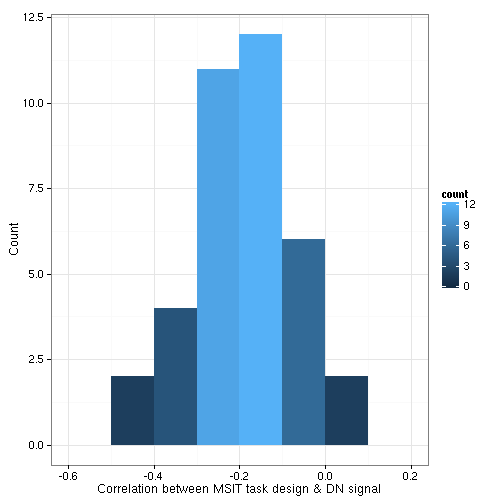
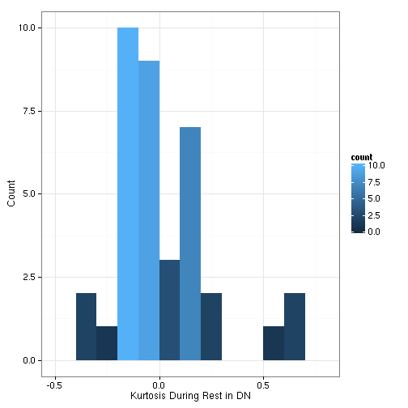

# Associations between MSIT-DMN and Rest-DMN-Kurtosis

Note that actual code is loaded from a different file.


```r
read_chunk("05_kurtosis_vs_msit.R")
```


## Setup


```r
library(plyr)
library(e1071)
library(ggplot2)
library(robustbase)
library(RColorBrewer)
basedir <- "/home2/data/Projects/CCD"
scriptdir <- file.path(basedir, "scripts/04_msit_task")
oldtheme <- theme_set(theme_bw())
```


```r
network_names <- c("medial visual", "occipital pole visual", "lateral visual", 
    "default network", "cerebellum", "sensorimotor", "auditory", "executive control", 
    "right frontoparietal", "left frontoparietal")
network_names <- gsub(" ", ".", network_names)
dmn <- which(network_names == "default.network")
tps <- 8:10
```


Read in subject information.


```r
fname <- file.path(scriptdir, "z_predesign.csv")
subinfo <- read.csv(fname)
subinfo$study <- factor(subinfo$study, labels = c("CCB", "CCD"))
subinfo$sex <- factor(subinfo$sex)
# Remove CCD participants with high errors
subinfo <- subinfo[!((subinfo$subject == "CCD004" | subinfo$subject == "CCD008") & 
    (subinfo$run == 1)), ]
# Plot Age
ggplot(subinfo, aes(x = age, fill = ..count..)) + geom_histogram(binwidth = 5) + 
    facet_grid(study ~ .)
```

 

```r
# Plot Sex
ggplot(subinfo, aes(x = sex, fill = study)) + geom_bar()
```

 


Get the incoherent > coherent predicted task signal together.


```r
# CCB
ccb_waver <- read.table(file.path(scriptdir, "level1_ccb_template.mat"), skip = 5)
ccb_waver <- as.matrix(ccb_waver)[, c(1, 3)]
ccb_waver <- ccb_waver[, 2] - ccb_waver[, 1]
tmpdf <- data.frame(time = seq(0, by = 1.75, length.out = length(ccb_waver)), 
    predicted_signal = ccb_waver)
ggplot(tmpdf, aes(time, predicted_signal)) + geom_line() + xlab("Time (secs)") + 
    ylab("Predicted Signal") + ggtitle("For CCB Subjects")
```

 

```r
# CCD
ccd_waver <- read.table(file.path(scriptdir, "level1_ccd_template.mat"), skip = 5)
ccd_waver <- as.matrix(ccd_waver)[, c(1, 3)]
ccd_waver <- ccd_waver[, 2] - ccd_waver[, 1]
tmpdf <- data.frame(time = seq(0, by = 2, length.out = length(ccd_waver)), predicted_signal = ccd_waver)
ggplot(tmpdf, aes(time, predicted_signal)) + geom_line() + xlab("Time (secs)") + 
    ylab("Predicted Signal") + ggtitle("For CCD Subjects")
```

 


Read in the time-series data.


```r
# this loads the 'tss' object with attr(tss, 'split_labels') to get how
# stuff should be organized
load(file.path(basedir, "scripts/data/ccb+ccd_time_series.rda"))
splitter <- attr(tss, "split_labels")
splitter$index <- 1:nrow(splitter)
```


## Pre-Analysis Calculations

Get the correlation (Fischer Z transformed) between the MSIT predicted task signal and the DMN signal. For each subject, collapse this measure across scans/runs (i.e., get the mean). Note that this time, I have flipped the MSIT task to DMN signal correlation so it is generally negative.


```r
sub_splitter <- subset(splitter, condition == "MSIT")
correlation_msit_dmn <- ddply(sub_splitter, .(subject, study, scan, run), function(sdf) {
    ts <- tss[[sdf$index]][, dmn]
    if (sdf$study == "CCB") 
        r <- cor(ts, ccb_waver) else r <- cor(ts, ccd_waver)
    z <- atanh(r)
    c(r = r, z = z)
})
# collapse across scan and run
correlation_msit_dmn <- ddply(correlation_msit_dmn, .(subject), numcolwise(mean))
```


Get the kurtosis of the DMN signal at rest. For each subject, collapse this measure across scans/runs (i.e., get the mean).


```r
sub_splitter <- subset(splitter, condition == "REST")
kurtosis_rest <- ddply(sub_splitter, .(subject, study, scan, run), function(sdf) {
    ts <- tss[[sdf$index]][, dmn]
    c(kurtosis = kurtosis(ts))
})
# collapse across scan and run
kurtosis_rest <- ddply(kurtosis_rest, .(subject), numcolwise(mean))
```


Make some plots of these 2 measures.


```r
df <- merge(correlation_msit_dmn, kurtosis_rest, by = "subject")
# plot msit-dmn
ggplot(df, aes(x = z, fill = ..count..)) + geom_histogram(binwidth = 5) + labs(x = "Correlation between MSIT task design & DN signal", 
    y = "Count")
```

 

```r
# plot kurtosis
ggplot(df, aes(x = kurtosis, fill = ..count..)) + geom_histogram(binwidth = 5) + 
    labs(x = "Kurtosis During Rest in DN", y = "Count")
```

 


## Plot and Significate


```r
to_outlier <- function(x) factor((x > 0.1) * 1, levels = c(0, 1), labels = c("yes", 
    "no"))
wrap_lmrob <- function(f, df) {
    reg <- summary(lmrob(f, df, maxit.scale = 500))
    print(reg)
    df$outlier <- to_outlier(reg$weights)
    df$weights <- reg$weights
    df$id <- 1:nrow(df)
    df
}
```


Ugh, not significant.


```r
tmpdf <- wrap_lmrob(z ~ kurtosis, df)
```

```
## 
## Call:
## lmrob(formula = f, data = df, maxit.scale = 500)
## 
## Weighted Residuals:
##     Min      1Q  Median      3Q     Max 
## -0.2772 -0.0754  0.0108  0.0717  0.2270 
## 
## Coefficients:
##             Estimate Std. Error t value Pr(>|t|)    
## (Intercept)  -0.1907     0.0213   -8.96  1.4e-10 ***
## kurtosis      0.0260     0.1162    0.22     0.82    
## ---
## Signif. codes:  0 '***' 0.001 '**' 0.01 '*' 0.05 '.' 0.1 ' ' 1 
## 
## Robust residual standard error: 0.113 
## Convergence in 15 IRWLS iterations
## 
## Robustness weights: 
##  2 weights are ~= 1. The remaining 35 ones are summarized as
##    Min. 1st Qu.  Median    Mean 3rd Qu.    Max. 
##   0.527   0.893   0.954   0.906   0.987   0.999 
## Algorithmic parameters: 
## tuning.chi         bb tuning.psi refine.tol    rel.tol  solve.tol 
##   1.55e+00   5.00e-01   4.69e+00   1.00e-07   1.00e-07   1.00e-07 
##      nResample         max.it       best.r.s       k.fast.s          k.max 
##            500             50              2              1            200 
##    maxit.scale      trace.lev            mts     compute.rd fast.s.large.n 
##            500              0           1000              0           2000 
##           psi   subsampling        method           cov 
##    "bisquare" "nonsingular"          "MM" ".vcov.avar1" 
## seed : int(0)
```


Plot doesn't look good either. 


```r
grid <- data.frame(kurtosis = seq(min(df$kurtosis), max(df$kurtosis), length = 20))
grid$z <- predict(lmrob(z ~ kurtosis, tmpdf, maxit.scale = 500), newdata = grid)
p0 <- ggplot(tmpdf, aes(x = kurtosis, y = z)) + geom_hline(aes(yintercept = 0)) + 
    geom_vline(aes(yintercept = 0), linetype = "dashed") + xlab("DN Kurtosis During Rest") + 
    ylab("Correlation between DN Signal\n& MSIT Task Design")
if (any(df$outlier == "yes")) {
    p <- p0 + geom_point(data = tmpdf[tmpdf$outlier == "yes", ], size = 8, color = brewer.pal(3, 
        "Pastel1")[1]) + geom_point(shape = 1, size = 8, color = brewer.pal(3, 
        "Pastel1")[2]) + geom_text(aes(label = id), size = 5) + geom_line(data = grid, 
        color = "blue")
} else {
    p <- p0 + geom_point(shape = 1, size = 8, color = brewer.pal(3, "Pastel1")[2]) + 
        geom_text(aes(label = id), size = 5) + geom_line(data = grid, color = "blue") + 
        scale_color_discrete(name = "Measure")
}
p
```

 

