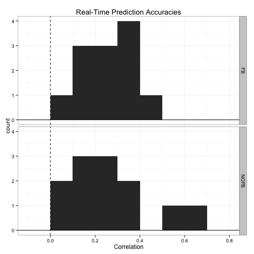
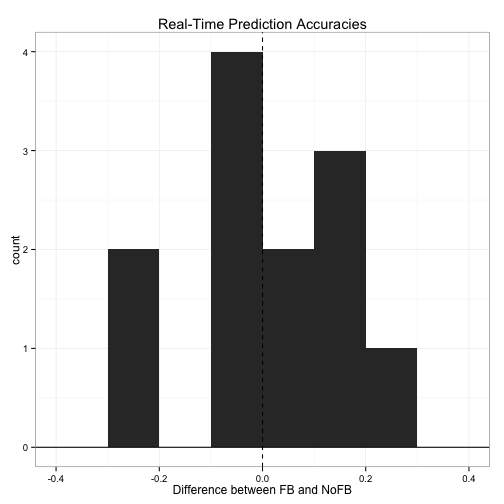
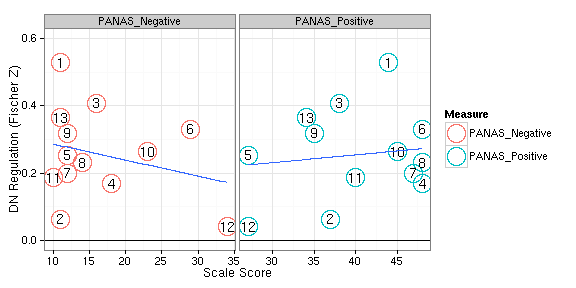

# Associations with Real-Time Prediction Accuracy

Note that actual code is loaded from a different file.


```r
read_chunk("05_realtime_prediction.R")
```


## Overview

There were several interesting results that emerged from these analyses:

* Scores on the RRS Brooding sub-scale are highly and significantly related to real-time prediction accuracy.
* Connectivity between the DMN and TP networks are marginally related to real-time prediction accuracy.
* The number of change points in an individual's DMN time-series is significantly related to real-time prediction accuracy. More on change points below.

## Setup


```r
library(plyr)
library(reshape)
library(e1071)
library(ggplot2)
library(vegan)
library(bcp)
library(RColorBrewer)
library(robustbase)
library(MASS)
basedir <- "/home2/data/Projects/CCD"
oldtheme <- theme_set(theme_bw())
```


```r
network_names <- c("medial visual", "occipital pole visual", "lateral visual", 
    "default network", "cerebellum", "sensorimotor", "auditory", "executive control", 
    "right frontoparietal", "left frontoparietal")
network_names <- gsub(" ", ".", network_names)
dmn <- which(network_names == "default.network")
tps <- 8:10
```


```r
fname <- file.path(basedir, "behavior/ccd_totals.csv")
phenos <- read.csv(fname, row.names = 1)
phenos <- phenos[14:27, ][-8, ]  # CCD014 ... CCD027
```


## Brain Measures

### Network Connectivity


```r
# Read in time-series
fnames <- sort(Sys.glob(file.path(basedir, "analysis/subjects/*/rest/run_01/rsn10.1D")))
tcs <- laply(fnames, function(f) as.matrix(read.table(f)))
tcs <- tcs[12:24, , ]  # CCD014 ... CCD027
# Calculate correlations
rest_conn_all <- aaply(tcs, 1, cor)
rest_conn <- rest_conn_all[, tps, 1]  # only look at DMN connectivity with TP networks
colnames(rest_conn) <- network_names[tps]
names(dimnames(rest_conn)) <- c("subjects", "networks")
# Mean
colMeans(rest_conn)
```

```
##    executive.control right.frontoparietal  left.frontoparietal 
##              0.22718              0.05133              0.05152
```


This is the group average connectivity with the DMN.

### Kurtosis


```r
# only for DMN
rest_kurtosis <- aaply(tcs[, , 4], 1, kurtosis)
# distribution
ggplot(data.frame(x = rest_kurtosis), aes(x = x)) + geom_histogram(binwidth = 0.2) + 
    geom_hline(aes(yintercept = 0)) + labs(x = "Kurtosis")
```

 


### Autocorrelation

As another measure of stability of the DMN time-series, I looked at it's autocorrelation. I wasn't totally sure how to summarize it, so I calculated the number of lags it took for an individuals DMN time-series to have a correlation of zero.


```r
# only for DMN
rest_lags <- aaply(tcs[, , 4], 1, function(vec) {
    acors <- acf(vec, plot = F)
    lags <- c(acors$lag)
    acors <- c(acors$acf)
    for (i in 1:length(lags)) {
        if (acors[i] < 0) 
            break
    }
    lags[i]
})
# distribution
ggplot(data.frame(x = rest_lags), aes(x = x)) + geom_histogram(binwidth = 5) + 
    geom_hline(aes(yintercept = 0)) + labs(x = "Number of Lags for Zero Autocorrelation")
```

 


### Change Points

As another measure of the stability of the DMN time-series and to capture changes in brain state that might occur during rest, I used bayesian change point analysis. Essentially, it looks in a time-series for points in time when there is a significant change signal. Another motivation for using this was based on the finding that real-time prediction accuracy was significantly related to an individual's RRS Brooding subscale. I made the reverse inference that since 'brooding' engages the DMN, one might expect that at rest those individuals with higher RRS Brooding scores to have less state changes in the DMN. There are probably a dozen ways to summarize the results from the change point analysis, I determined a change point to be a time with a posterior probability greater than 0.5 and simply calculated the number of such 'change points' in each individual's time-series. Incidently, though the change point summary measure I use is significantly related to prediction accuracy, it isn't significantly related to RRS Brooding (but it's close p=0.2). 


```r
rest_changes <- aaply(tcs[, , 4], 1, function(vec) {
    bcp.0 <- bcp(vec)
    sum(bcp.0$posterior.prob > 0.5, na.rm = T)
})
# distribution
ggplot(data.frame(x = rest_changes), aes(x = x)) + geom_histogram(binwidth = 5) + 
    geom_hline(aes(yintercept = 0)) + labs(x = "Kurtosis")
```

 

```r
# sample subject
plot(bcp(tcs[1, , 4]))
```

 


### Prediction


```r
fname <- file.path(basedir, "behavior/CCD_full_dframe.csv")
preds <- read.csv(fname)
preds <- preds[, c(2, 6, 10)]  # only look at DMN
colnames(preds)[3] <- "R"
preds$Z <- atanh(preds$R)
# Plot distribution
ggplot(preds, aes(x = R)) + geom_histogram(binwidth = 0.1) + geom_vline(aes(xintercept = 0), 
    linetype = "dashed") + geom_hline(aes(yintercept = 0)) + facet_grid(ScanType ~ 
    .) + labs(title = "Real-Time Prediction Accuracies", x = "Correlation")
```

 


Quick plot showing that the with feedback condition seems to have slightly greater real-time prediction accuracy than the no feedback condition. For all later analyses, I will ignore the feedback condition.


```r
# Plot
mat <- cast(preds, Subject ~ ScanType, value = "R")
mat$diff <- apply(mat[, 2:3], 1, diff)
ggplot(mat, aes(x = diff)) + geom_histogram(binwidth = 0.1) + geom_vline(aes(xintercept = 0), 
    linetype = "dashed") + geom_hline(aes(yintercept = 0)) + labs(title = "Real-Time Prediction Accuracies", 
    x = "Difference between FB and NoFB")
```

 

```r
# Significance
t.test(Z ~ ScanType, preds, paired = T)
```

```
## 
## 	Paired t-test
## 
## data:  Z by ScanType 
## t = -0.295, df = 12, p-value = 0.773
## alternative hypothesis: true difference in means is not equal to 0 
## 95 percent confidence interval:
##  -0.11455  0.08722 
## sample estimates:
## mean of the differences 
##                -0.01366
```


```r
# Moving forward only look at Feedback condition
preds <- subset(preds, ScanType == "FB")
# Combine phenotype info, kurtosis, and prediction accuracy
df <- data.frame(phenos, prediction = preds$Z, kurtosis = rest_kurtosis, lag = rest_lags, 
    nchanges = rest_changes, rest_conn)
colnames(df)[[1]] <- "Subject"
# Needed functions
to_outlier <- function(x) factor((x > 0.1) * 1, levels = c(0, 1), labels = c("yes", 
    "no"))
wrap_lmrob <- function(f, df) {
    reg <- summary(lmrob(f, df, maxit.scale = 500))
    print(reg)
    df$outlier <- to_outlier(reg$weights)
    df$weights <- reg$weights
    df
}
```


## Prediction Accuracy Associations

### with Brain Measures

#### Kurtosis

Nope not significant.


```r
# Significance
tdf <- wrap_lmrob(prediction ~ kurtosis, df)
```

```
## 
## Call:
## lmrob(formula = f, data = df, maxit.scale = 500)
## 
## Weighted Residuals:
##     Min      1Q  Median      3Q     Max 
## -0.2115 -0.0708 -0.0141  0.0712  0.2393 
## 
## Coefficients:
##             Estimate Std. Error t value Pr(>|t|)    
## (Intercept)   0.2521     0.0362    6.96  2.4e-05 ***
## kurtosis     -0.0770     0.0532   -1.45     0.18    
## ---
## Signif. codes:  0 '***' 0.001 '**' 0.01 '*' 0.05 '.' 0.1 ' ' 1 
## 
## Robust residual standard error: 0.15 
## Convergence in 10 IRWLS iterations
## 
## Robustness weights: 
##  one weight is ~= 1. The remaining 12 ones are summarized as
##    Min. 1st Qu.  Median    Mean 3rd Qu.    Max. 
##   0.780   0.899   0.978   0.934   0.983   0.997 
## Algorithmic parameters: 
## tuning.chi         bb tuning.psi refine.tol    rel.tol  solve.tol 
##   1.55e+00   5.00e-01   4.69e+00   1.00e-07   1.00e-07   1.00e-07 
##      nResample         max.it       best.r.s       k.fast.s          k.max 
##            500             50              2              1            200 
##    maxit.scale      trace.lev            mts     compute.rd fast.s.large.n 
##            500              0           1000              0           2000 
##           psi   subsampling        method           cov 
##    "bisquare" "nonsingular"          "MM" ".vcov.avar1" 
## seed : int(0)
```

```r
# Plot
p <- ggplot(tdf, aes(x = kurtosis, y = prediction)) + geom_vline(aes(xintercept = 0), 
    linetype = "dashed") + geom_hline(aes(yintercept = 0)) + labs(x = "DMN Kurtosis", 
    y = "DN Regulation (Fischer Z)")
if (any(tdf$outlier == "yes")) {
    p <- p + geom_point(aes(color = outlier)) + geom_smooth(data = tdf[tdf$outlier == 
        "no", ], method = "lm") + scale_color_manual(values = c("black", "red"))
} else {
    p <- p + geom_point() + geom_smooth(method = "lm")
}
print(p)
```

 


#### Autocorrelation

Not signficant, but it probably doesn't help that a bunch of individuals have the same number of lags. Again here I took the number of lags until the autocorrelation of the DMN time-series was 0 or below 0.


```r
tdf <- wrap_lmrob(prediction ~ lag, df)
```

```
## 
## Call:
## lmrob(formula = f, data = df, maxit.scale = 500)
## 
## Weighted Residuals:
##      Min       1Q   Median       3Q      Max 
## -0.25599 -0.05403 -0.00871  0.04878  0.26089 
## 
## Coefficients:
##             Estimate Std. Error t value Pr(>|t|)
## (Intercept)   0.1831     0.1104    1.66     0.13
## lag           0.0142     0.0205    0.69     0.50
## 
## Robust residual standard error: 0.0995 
## Convergence in 12 IRWLS iterations
## 
## Robustness weights: 
##  one weight is ~= 1. The remaining 12 ones are summarized as
##    Min. 1st Qu.  Median    Mean 3rd Qu.    Max. 
##   0.472   0.728   0.971   0.853   0.985   0.998 
## Algorithmic parameters: 
## tuning.chi         bb tuning.psi refine.tol    rel.tol  solve.tol 
##   1.55e+00   5.00e-01   4.69e+00   1.00e-07   1.00e-07   1.00e-07 
##      nResample         max.it       best.r.s       k.fast.s          k.max 
##            500             50              2              1            200 
##    maxit.scale      trace.lev            mts     compute.rd fast.s.large.n 
##            500              0           1000              0           2000 
##           psi   subsampling        method           cov 
##    "bisquare" "nonsingular"          "MM" ".vcov.avar1" 
## seed : int(0)
```

```r
# Plot
p <- ggplot(tdf, aes(x = lag, y = prediction)) + geom_vline(aes(xintercept = 0), 
    linetype = "dashed") + geom_hline(aes(yintercept = 0)) + xlab("Number of Lags for Zero Autocorrelation") + 
    ylab("DN Regulation (Fischer Z)")
if (any(tdf$outlier == "yes")) {
    p <- p + geom_point(aes(color = outlier)) + geom_smooth(data = tdf[tdf$outlier == 
        "no", ], method = "lm") + scale_color_manual(values = c("black", "red"))
} else {
    p <- p + geom_point() + geom_smooth(method = "lm")
}
print(p)
```

 


#### Change Points

I win. As before, it probably isn't helpful that a bunch of individuals have the same number of change points. Again here I calculated the number of points in the DMN time-series that a significant change in the signal occured.


```r
tdf <- wrap_lmrob(prediction ~ nchanges, df)
```

```
## 
## Call:
## lmrob(formula = f, data = df, maxit.scale = 500)
## 
## Weighted Residuals:
##      Min       1Q   Median       3Q      Max 
## -0.14910 -0.08470  0.00432  0.05875  0.17540 
## 
## Coefficients:
##             Estimate Std. Error t value Pr(>|t|)   
## (Intercept)   0.5225     0.1423    3.67   0.0037 **
## nchanges     -0.0188     0.0106   -1.78   0.1034   
## ---
## Signif. codes:  0 '***' 0.001 '**' 0.01 '*' 0.05 '.' 0.1 ' ' 1 
## 
## Robust residual standard error: 0.106 
## Convergence in 13 IRWLS iterations
## 
## Robustness weights: 
##  one weight is ~= 1. The remaining 12 ones are summarized as
##    Min. 1st Qu.  Median    Mean 3rd Qu.    Max. 
##   0.768   0.888   0.938   0.917   0.973   0.999 
## Algorithmic parameters: 
## tuning.chi         bb tuning.psi refine.tol    rel.tol  solve.tol 
##   1.55e+00   5.00e-01   4.69e+00   1.00e-07   1.00e-07   1.00e-07 
##      nResample         max.it       best.r.s       k.fast.s          k.max 
##            500             50              2              1            200 
##    maxit.scale      trace.lev            mts     compute.rd fast.s.large.n 
##            500              0           1000              0           2000 
##           psi   subsampling        method           cov 
##    "bisquare" "nonsingular"          "MM" ".vcov.avar1" 
## seed : int(0)
```

```r
# Plot
p <- ggplot(tdf, aes(x = nchanges, y = prediction)) + geom_vline(aes(xintercept = 0), 
    linetype = "dashed") + geom_hline(aes(yintercept = 0)) + xlab("Number of Change Points in DMN Time-Series") + 
    ylab("DN Regulation (Fischer Z)")
if (any(tdf$outlier == "yes")) {
    p <- p + geom_point(aes(color = outlier)) + geom_smooth(data = tdf[tdf$outlier == 
        "no", ], method = "lm") + scale_color_manual(values = c("black", "red"))
} else {
    p <- p + geom_point() + geom_smooth(method = "lm")
}
print(p)
```

 


### TP Connectivity

DMN connectivity with the left fronto-parietal is significant with the others coming close (there does appear to be an outlier with the right frontoporietal network).


```r
# Combine
tmpdf <- data.frame(df[rep(1:nrow(df), length(network_names[tps])), c("Subject", 
    "Age", "Sex", "prediction")], network = rep(network_names[tps], each = nrow(df)), 
    connectivity = atanh(c(rest_conn)))
# Outliers
tmpdf <- ddply(tmpdf, .(network), function(sdf) {
    wrap_lmrob(connectivity ~ Age + Sex + prediction, sdf)
})
```

```
## 
## Call:
## lmrob(formula = f, data = df, maxit.scale = 500)
## 
## Weighted Residuals:
##     Min      1Q  Median      3Q     Max 
## -0.2508 -0.0427  0.0319  0.0763  0.1740 
## 
## Coefficients:
##             Estimate Std. Error t value Pr(>|t|)
## (Intercept) -0.04738    0.44455   -0.11     0.92
## Age          0.00726    0.01446    0.50     0.63
## SexMale      0.06219    0.08530    0.73     0.48
## prediction   0.37421    0.30337    1.23     0.25
## 
## Robust residual standard error: 0.128 
## Convergence in 18 IRWLS iterations
## 
## Robustness weights: 
##    Min. 1st Qu.  Median    Mean 3rd Qu.    Max. 
##   0.681   0.911   0.968   0.916   0.990   0.994 
## Algorithmic parameters: 
## tuning.chi         bb tuning.psi refine.tol    rel.tol  solve.tol 
##   1.55e+00   5.00e-01   4.69e+00   1.00e-07   1.00e-07   1.00e-07 
##      nResample         max.it       best.r.s       k.fast.s          k.max 
##            500             50              2              1            200 
##    maxit.scale      trace.lev            mts     compute.rd fast.s.large.n 
##            500              0           1000              0           2000 
##           psi   subsampling        method           cov 
##    "bisquare" "nonsingular"          "MM" ".vcov.avar1" 
## seed : int(0) 
## 
## Call:
## lmrob(formula = f, data = df, maxit.scale = 500)
## 
## Weighted Residuals:
##     Min      1Q  Median      3Q     Max 
## -0.2849 -0.0552 -0.0302  0.0743  0.1903 
## 
## Coefficients:
##              Estimate Std. Error t value Pr(>|t|)
## (Intercept) -0.103489   0.709535   -0.15     0.89
## Age          0.000337   0.024872    0.01     0.99
## SexMale      0.061435   0.148925    0.41     0.69
## prediction   0.510536   0.436828    1.17     0.27
## 
## Robust residual standard error: 0.114 
## Convergence in 29 IRWLS iterations
## 
## Robustness weights: 
##    Min. 1st Qu.  Median    Mean 3rd Qu.    Max. 
##   0.509   0.783   0.961   0.881   0.984   0.994 
## Algorithmic parameters: 
## tuning.chi         bb tuning.psi refine.tol    rel.tol  solve.tol 
##   1.55e+00   5.00e-01   4.69e+00   1.00e-07   1.00e-07   1.00e-07 
##      nResample         max.it       best.r.s       k.fast.s          k.max 
##            500             50              2              1            200 
##    maxit.scale      trace.lev            mts     compute.rd fast.s.large.n 
##            500              0           1000              0           2000 
##           psi   subsampling        method           cov 
##    "bisquare" "nonsingular"          "MM" ".vcov.avar1" 
## seed : int(0) 
## 
## Call:
## lmrob(formula = f, data = df, maxit.scale = 500)
## 
## Weighted Residuals:
##      Min       1Q   Median       3Q      Max 
## -0.16361 -0.07807 -0.00758  0.10044  0.18071 
## 
## Coefficients:
##             Estimate Std. Error t value Pr(>|t|)  
## (Intercept)   0.1666     0.2410    0.69    0.507  
## Age          -0.0125     0.0117   -1.07    0.311  
## SexMale       0.1797     0.0674    2.66    0.026 *
## prediction    0.4238     0.2382    1.78    0.109  
## ---
## Signif. codes:  0 '***' 0.001 '**' 0.01 '*' 0.05 '.' 0.1 ' ' 1 
## 
## Robust residual standard error: 0.151 
## Convergence in 11 IRWLS iterations
## 
## Robustness weights: 
##  one weight is ~= 1. The remaining 12 ones are summarized as
##    Min. 1st Qu.  Median    Mean 3rd Qu.    Max. 
##   0.873   0.924   0.963   0.952   0.989   0.998 
## Algorithmic parameters: 
## tuning.chi         bb tuning.psi refine.tol    rel.tol  solve.tol 
##   1.55e+00   5.00e-01   4.69e+00   1.00e-07   1.00e-07   1.00e-07 
##      nResample         max.it       best.r.s       k.fast.s          k.max 
##            500             50              2              1            200 
##    maxit.scale      trace.lev            mts     compute.rd fast.s.large.n 
##            500              0           1000              0           2000 
##           psi   subsampling        method           cov 
##    "bisquare" "nonsingular"          "MM" ".vcov.avar1" 
## seed : int(0)
```

```r
# Plot
ggplot(tmpdf, aes(x = connectivity, y = prediction, shape = network)) + geom_vline(aes(xintercept = 0), 
    linetype = "dashed") + geom_hline(aes(yintercept = 0)) + geom_point() + 
    geom_smooth(method = "lm") + facet_grid(network ~ .) + labs(x = "Connectivity with DMN (Fischer Z)", 
    y = "DN Regulation (Fischer Z)")
```

 


### MDMR

Had to throw this in. The first analysis is significant, so the pattern of connectivity between the DMN and the other networks significantly predicts real-time prediction accuracy.


```r
# CWAS between DMN and all networks
d <- as.dist(1 - cor(t(rest_conn_all[, -4, 4])))
adonis(d ~ Age + Sex + prediction, df, permutations = 4999)
```

```
## 
## Call:
## adonis(formula = d ~ Age + Sex + prediction, data = df, permutations = 4999) 
## 
## Terms added sequentially (first to last)
## 
##            Df SumsOfSqs MeanSqs F.Model    R2 Pr(>F)    
## Age         1      0.42   0.421    3.61 0.133 0.0284 *  
## Sex         1      0.83   0.826    7.08 0.261 0.0012 ** 
## prediction  1      0.87   0.873    7.48 0.275 0.0004 ***
## Residuals   9      1.05   0.117         0.331           
## Total      12      3.17                 1.000           
## ---
## Signif. codes:  0 '***' 0.001 '**' 0.01 '*' 0.05 '.' 0.1 ' ' 1
```

```r
# CWAS between DMN and TP networks
d <- as.dist(1 - cor(t(rest_conn)))
adonis(d ~ Age + Sex + prediction, df, permutations = 4999)
```

```
## 
## Call:
## adonis(formula = d ~ Age + Sex + prediction, data = df, permutations = 4999) 
## 
## Terms added sequentially (first to last)
## 
##            Df SumsOfSqs MeanSqs F.Model     R2 Pr(>F)
## Age         1      0.39   0.388   0.906  0.083   0.42
## Sex         1      0.46   0.461   1.077  0.098   0.44
## prediction  1      0.00  -0.003  -0.006 -0.001   0.80
## Residuals   9      3.85   0.428          0.820       
## Total      12      4.70                  1.000
```


### with Phenotypic Measures


```r
brainbehavior <- function(names) {
    # Significance
    f <- paste("prediction ~ Age + Sex +", paste(names, collapse = " + "))
    f <- as.formula(f)
    tdf <- wrap_lmrob(f, df)
    
    # Reorganize
    tdf$id <- 1:nrow(tdf)
    bb.df <- ddply(tdf, .(Subject), function(sdf) {
        sdf <- data.frame(sdf[rep(1, length(names)), c("id", "Subject", "prediction", 
            "outlier", "weights")], measure = names, behavior = as.numeric(sdf[, 
            names]))
        sdf
    })
    
    ## Get best fit line model <- lmrob(prediction ~ measure, bb.df) grid <-
    ## ddply(bb.df, .(measure), function(sdf) { data.frame(
    ## behavior=seq(min(sdf$behavior), max(sdf$behavior), length=20),
    ## measure=rep(sdf$measure[1], 20) ) }) grid$prediction <- predict(model,
    ## newdata=grid)
    
    # Plot
    p <- ggplot(bb.df, aes(x = behavior, y = prediction, label = id)) + geom_hline(aes(yintercept = 0)) + 
        ylim(0, 0.6) + xlab("Scale Score") + ylab("DN Regulation (Fischer Z)") + 
        facet_grid(. ~ measure, scales = "free_x")
    if (any(bb.df$outlier == "yes")) {
        p <- p + geom_point(data = bb.df[bb.df$outlier == "yes", ], size = 8, 
            color = brewer.pal(3, "Pastel1")[1]) + geom_point(aes(color = measure), 
            shape = 1, size = 8) + geom_text(size = 5) + geom_smooth(method = rlm) + 
            scale_color_discrete(name = "Measure")
    } else {
        p <- p + geom_point(aes(color = measure), shape = 1, size = 8) + geom_text(size = 5) + 
            geom_smooth(method = rlm) + scale_color_discrete(name = "Measure")
    }
    p
}
```


#### Total Scale Scores

The RRS is significant with the ERQ and BDI being marginally significant.


```r
names <- c("SIPI", "RRS", "ERQ", "BDI", "AIM")
brainbehavior(names)
```

```
## 
## Call:
## lmrob(formula = f, data = df, maxit.scale = 500)
## 
## Weighted Residuals:
##  [1]  0.070063 -0.030865 -0.064694 -0.114349  0.003674  0.010037  0.048796
##  [8]  0.029570  0.028299 -0.012624 -0.057697 -0.000848  0.083644
## 
## Coefficients:
##              Estimate Std. Error t value Pr(>|t|)   
## (Intercept) -0.112053   0.209162   -0.54   0.6151   
## Age         -0.003273   0.004218   -0.78   0.4728   
## SexMale     -0.130954   0.025004   -5.24   0.0034 **
## SIPI         0.002420   0.000836    2.90   0.0340 * 
## RRS          0.009442   0.001716    5.50   0.0027 **
## ERQ         -0.004468   0.002098   -2.13   0.0865 . 
## BDI         -0.016443   0.002851   -5.77   0.0022 **
## AIM          0.000456   0.000882    0.52   0.6272   
## ---
## Signif. codes:  0 '***' 0.001 '**' 0.01 '*' 0.05 '.' 0.1 ' ' 1 
## 
## Robust residual standard error: 0.106 
## Convergence in 9 IRWLS iterations
## 
## Robustness weights: 
##  3 weights are ~= 1. The remaining 10 ones are
##     1     2     3     4     7     8     9    10    11    13 
## 0.961 0.992 0.966 0.897 0.981 0.993 0.994 0.999 0.973 0.944 
## Algorithmic parameters: 
## tuning.chi         bb tuning.psi refine.tol    rel.tol  solve.tol 
##   1.55e+00   5.00e-01   4.69e+00   1.00e-07   1.00e-07   1.00e-07 
##      nResample         max.it       best.r.s       k.fast.s          k.max 
##            500             50              2              1            200 
##    maxit.scale      trace.lev            mts     compute.rd fast.s.large.n 
##            500              0           1000              0           2000 
##           psi   subsampling        method           cov 
##    "bisquare" "nonsingular"          "MM" ".vcov.avar1" 
## seed : int(0)
```

 


### RRS SubScales

The plot looks weird in that the subscales look so similar to each other. Since only the RRS Brooding is significant in the multiple regression, I am guessing only it has unique variance associated with real-time prediction accuracy.


```r
names <- c("RRS_Brooding", "RRS_Reflection", "RRS_Depression")
brainbehavior(names)
```

```
## 
## Call:
## lmrob(formula = f, data = df, maxit.scale = 500)
## 
## Weighted Residuals:
##       Min        1Q    Median        3Q       Max 
## -4.42e-02 -2.45e-02  9.45e-05  2.76e-02  3.78e-01 
## 
## Coefficients:
##                 Estimate Std. Error t value Pr(>|t|)    
## (Intercept)     2.43e-01   8.08e-02    3.00    0.020 *  
## Age            -3.12e-02   3.90e-03   -7.99  9.2e-05 ***
## SexMale        -1.51e-01   4.40e-02   -3.43    0.011 *  
## RRS_Brooding    1.02e-01   9.77e-03   10.46  1.6e-05 ***
## RRS_Reflection -3.92e-05   6.65e-03   -0.01    0.995    
## RRS_Depression -8.49e-03   4.12e-03   -2.06    0.078 .  
## ---
## Signif. codes:  0 '***' 0.001 '**' 0.01 '*' 0.05 '.' 0.1 ' ' 1 
## 
## Robust residual standard error: 0.0615 
## Convergence in 11 IRWLS iterations
## 
## Robustness weights: 
##  observation 5 is an outlier with |weight| = 0 ( < 0.0077); 
##  one weight is ~= 1. The remaining 11 ones are summarized as
##    Min. 1st Qu.  Median    Mean 3rd Qu.    Max. 
##   0.832   0.956   0.982   0.961   0.992   0.997 
## Algorithmic parameters: 
## tuning.chi         bb tuning.psi refine.tol    rel.tol  solve.tol 
##   1.55e+00   5.00e-01   4.69e+00   1.00e-07   1.00e-07   1.00e-07 
##      nResample         max.it       best.r.s       k.fast.s          k.max 
##            500             50              2              1            200 
##    maxit.scale      trace.lev            mts     compute.rd fast.s.large.n 
##            500              0           1000              0           2000 
##           psi   subsampling        method           cov 
##    "bisquare" "nonsingular"          "MM" ".vcov.avar1" 
## seed : int(0)
```

 


#### SIPI SubScales


```r
names <- c("SIPI_PAC", "SIPI_GFFD", "SIPI_PCD")
brainbehavior(names)
```

```
## 
## Call:
## lmrob(formula = f, data = df, maxit.scale = 500)
## 
## Weighted Residuals:
##      Min       1Q   Median       3Q      Max 
## -0.05161 -0.03719 -0.00554  0.02503  0.49880 
## 
## Coefficients:
##             Estimate Std. Error t value Pr(>|t|)    
## (Intercept) -0.79591    0.10358   -7.68  0.00012 ***
## Age          0.00640    0.00226    2.83  0.02533 *  
## SexMale     -0.05798    0.03712   -1.56  0.16220    
## SIPI_PAC     0.00622    0.00232    2.68  0.03142 *  
## SIPI_GFFD    0.00652    0.00304    2.14  0.06916 .  
## SIPI_PCD     0.00724    0.00117    6.18  0.00046 ***
## ---
## Signif. codes:  0 '***' 0.001 '**' 0.01 '*' 0.05 '.' 0.1 ' ' 1 
## 
## Robust residual standard error: 0.0828 
## Convergence in 8 IRWLS iterations
## 
## Robustness weights: 
##  observation 1 is an outlier with |weight| = 0 ( < 0.0077); 
##  4 weights are ~= 1. The remaining 8 ones are
##     2     3     5     6     7    10    11    13 
## 0.994 0.818 0.992 0.965 0.982 0.968 0.972 0.871 
## Algorithmic parameters: 
## tuning.chi         bb tuning.psi refine.tol    rel.tol  solve.tol 
##   1.55e+00   5.00e-01   4.69e+00   1.00e-07   1.00e-07   1.00e-07 
##      nResample         max.it       best.r.s       k.fast.s          k.max 
##            500             50              2              1            200 
##    maxit.scale      trace.lev            mts     compute.rd fast.s.large.n 
##            500              0           1000              0           2000 
##           psi   subsampling        method           cov 
##    "bisquare" "nonsingular"          "MM" ".vcov.avar1" 
## seed : int(0)
```

 


#### ERQ SubScales


```r
names <- c("ERQ_Reappraisal", "ERQ_Suppression")
brainbehavior(names)
```

```
## 
## Call:
## lmrob(formula = f, data = df, maxit.scale = 500)
## 
## Weighted Residuals:
##     Min      1Q  Median      3Q     Max 
## -0.6215 -0.0613 -0.0145  0.0289  0.1614 
## 
## Coefficients:
##                 Estimate Std. Error t value Pr(>|t|)  
## (Intercept)     -1.02806    0.40080   -2.57    0.033 *
## Age              0.02575    0.00833    3.09    0.015 *
## SexMale         -0.13095    0.05397   -2.43    0.041 *
## ERQ_Reappraisal  0.01726    0.00521    3.31    0.011 *
## ERQ_Suppression  0.01505    0.00981    1.53    0.163  
## ---
## Signif. codes:  0 '***' 0.001 '**' 0.01 '*' 0.05 '.' 0.1 ' ' 1 
## 
## Robust residual standard error: 0.103 
## Convergence in 11 IRWLS iterations
## 
## Robustness weights: 
##  observation 2 is an outlier with |weight| = 0 ( < 0.0077); 
##  one weight is ~= 1. The remaining 11 ones are summarized as
##    Min. 1st Qu.  Median    Mean 3rd Qu.    Max. 
##   0.787   0.926   0.972   0.951   0.994   0.999 
## Algorithmic parameters: 
## tuning.chi         bb tuning.psi refine.tol    rel.tol  solve.tol 
##   1.55e+00   5.00e-01   4.69e+00   1.00e-07   1.00e-07   1.00e-07 
##      nResample         max.it       best.r.s       k.fast.s          k.max 
##            500             50              2              1            200 
##    maxit.scale      trace.lev            mts     compute.rd fast.s.large.n 
##            500              0           1000              0           2000 
##           psi   subsampling        method           cov 
##    "bisquare" "nonsingular"          "MM" ".vcov.avar1" 
## seed : int(0)
```

 


#### PANAS SubScales


```r
names <- c("PANAS_Positive", "PANAS_Negative")
brainbehavior(names)
```

```
## 
## Call:
## lmrob(formula = f, data = df, maxit.scale = 500)
## 
## Weighted Residuals:
##     Min      1Q  Median      3Q     Max 
## -0.2074 -0.0973  0.0151  0.1073  0.2370 
## 
## Coefficients:
##                Estimate Std. Error t value Pr(>|t|)
## (Intercept)     0.19657    0.43654    0.45     0.66
## Age             0.00021    0.01418    0.01     0.99
## SexMale         0.01451    0.08558    0.17     0.87
## PANAS_Positive  0.00331    0.00395    0.84     0.43
## PANAS_Negative -0.00505    0.00561   -0.90     0.39
## 
## Robust residual standard error: 0.147 
## Convergence in 15 IRWLS iterations
## 
## Robustness weights: 
##  one weight is ~= 1. The remaining 12 ones are summarized as
##    Min. 1st Qu.  Median    Mean 3rd Qu.    Max. 
##   0.776   0.934   0.954   0.934   0.969   0.998 
## Algorithmic parameters: 
## tuning.chi         bb tuning.psi refine.tol    rel.tol  solve.tol 
##   1.55e+00   5.00e-01   4.69e+00   1.00e-07   1.00e-07   1.00e-07 
##      nResample         max.it       best.r.s       k.fast.s          k.max 
##            500             50              2              1            200 
##    maxit.scale      trace.lev            mts     compute.rd fast.s.large.n 
##            500              0           1000              0           2000 
##           psi   subsampling        method           cov 
##    "bisquare" "nonsingular"          "MM" ".vcov.avar1" 
## seed : int(0)
```

 


