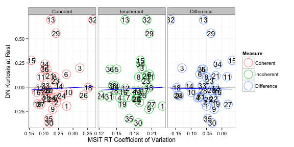
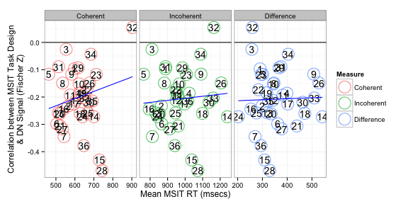
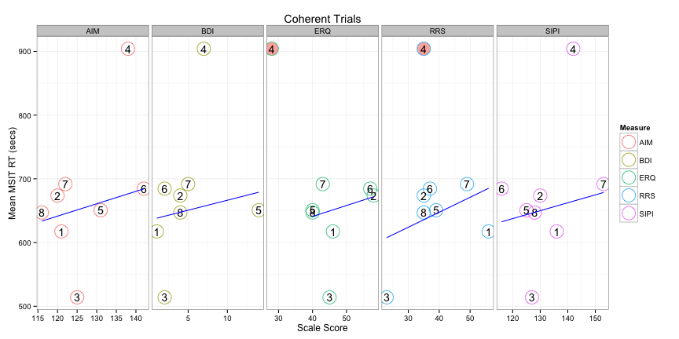
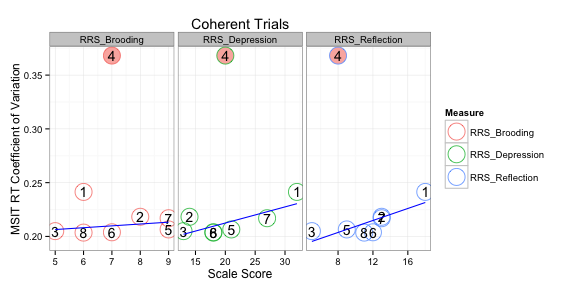
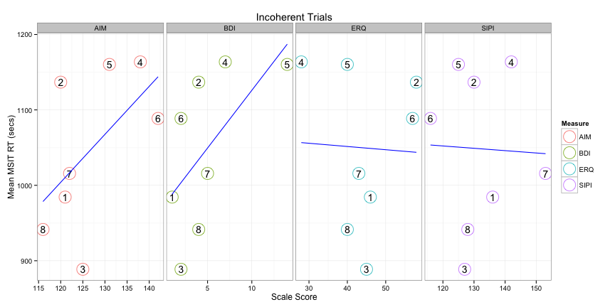
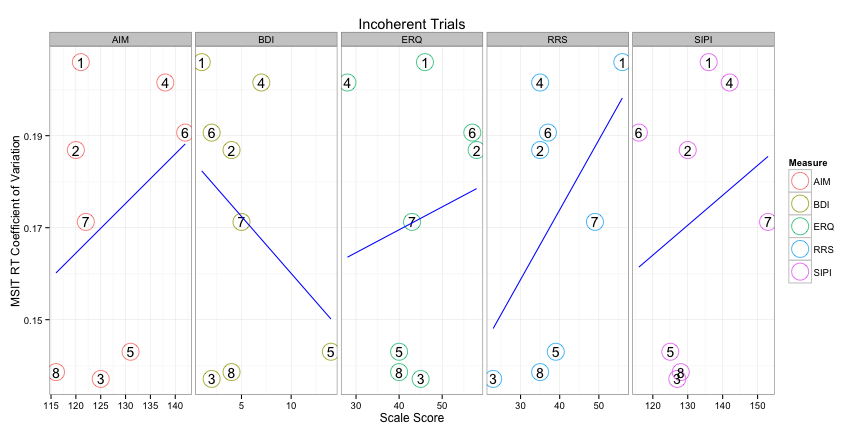
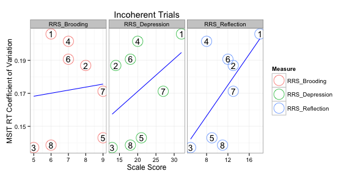

# RT-based Associations

Note that actual code is loaded from a different file.


```r
read_chunk("06_rt_stuff.R")
```


## Overview

Not much to see here :(.

* Connectivity between DN and Executive Control network was significantly related to mean RT across both coherent and incoherent trials.
* Connectivity between DN and Left Frontoparietal network was significantly related to RT CV for incoherent trials (and p=0.1 for coherent trials).
* AIM was positively related to mean RT for coherent and incoherent trials.
* RRS as well as all most of its subscales were positively related to RT CV for coherent and incoherent trials.
* BDI was positively related to mean RT for incoherent trials.
* PANAS negative was positively related to mean RT for incoherent trials.
* PANAS positive was positively related to RT CV for incoherent trials.

## Setup


```r
library(plyr)
library(e1071)
library(ggplot2)
library(RColorBrewer)
library(robustbase)
basedir <- dirname(dirname(getwd()))  # assume running in current direcotry
scriptdir <- file.path(basedir, "scripts")
datadir <- file.path(basedir, "scripts/data")
oldtheme <- theme_set(theme_bw())
```


```r
orig_network_names <- c("Medial Visual", "Occipital Pole Visual", "Lateral Visual", 
    "Default Network", "Cerebellum", "Sensorimotor", "Auditory", "Executive Control", 
    "Right Frontoparietal", "Left Frontoparietal")
network_names <- gsub(" ", ".", tolower(orig_network_names))
dmn <- 4
tps <- 8:10
```


```r
# Phenotypic Info (only 9 subjects in CCD)
phenos <- read.csv(file.path(datadir, "ccd_totals_touse.csv"))[1:9, -1]
colnames(phenos)[1:3] <- c("subject", "age", "sex")
phenos$subject <- toupper(phenos$subject)
# Basic Subject Info for all
subinfo <- read.csv(file.path(datadir, "ccb+ccd_filtered.csv"))
subinfo$scan <- factor(subinfo$scan)
subinfo$run <- factor(subinfo$run)
```


```r
load(file.path(datadir, "ccb+ccd_rts.rda"))  # rts
rts$scan <- factor(rts$scan)
rts$run <- factor(rts$run)
```


```r
# CCB
ccb_waver <- read.table(file.path(scriptdir, "04_msit_task/level1_ccb_template.mat"), 
    skip = 5)
ccb_waver <- as.matrix(ccb_waver)[, c(1, 3)]
ccb_waver <- ccb_waver[, 2] - ccb_waver[, 1]
tmpdf <- data.frame(time = seq(0, by = 1.75, length.out = length(ccb_waver)), 
    predicted_signal = ccb_waver)
ggplot(tmpdf, aes(time, predicted_signal)) + geom_line() + xlab("Time (secs)") + 
    ylab("Predicted Signal") + ggtitle("For CCB Subjects")
```

 

```r
# CCD
ccd_waver <- read.table(file.path(scriptdir, "04_msit_task/level1_ccd_template.mat"), 
    skip = 5)
ccd_waver <- as.matrix(ccd_waver)[, c(1, 3)]
ccd_waver <- ccd_waver[, 2] - ccd_waver[, 1]
tmpdf <- data.frame(time = seq(0, by = 2, length.out = length(ccd_waver)), predicted_signal = ccd_waver)
ggplot(tmpdf, aes(time, predicted_signal)) + geom_line() + xlab("Time (secs)") + 
    ylab("Predicted Signal") + ggtitle("For CCD Subjects")
```

 


```r
# this loads the 'tss' object with attr(tss, 'split_labels') to get how
# stuff should be organized
load(file.path(basedir, "scripts/data/ccb+ccd_time_series.rda"))
splitter <- attr(tss, "split_labels")
splitter$index <- 1:nrow(splitter)
# only look at time-series for MSIT with associated RT info note: there's
# proly a better
splitter <- ddply(splitter, .(study, subject, condition, scan, run), function(x) {
    if (x$condition == "REST") 
        return(x)
    has_any <- any(ddply(rts, .(study, subject, condition, scan, run), function(y) {
        y <- y[1, ]
        as.character(x$subject) == as.character(y$subject) & x$scan == y$scan & 
            x$run == y$run
    })$V1)
    if (has_any) 
        return(x) else return(data.frame())
})
```


## Calculate measures


```r
rts_df <- ddply(rts, .(study, subject, condition), function(sdf) {
    c(mean.rt = mean(sdf$rt), cv.rt = sd(sdf$rt)/mean(sdf$rt))
})
d <- ddply(rts_df, .(study, subject), function(sdf) {
    coh <- sdf$condition == "Coherent"
    incoh <- sdf$condition == "Incoherent"
    data.frame(condition = "Difference", mean.rt = sdf$mean.rt[incoh] - sdf$mean.rt[coh], 
        cv.rt = sdf$cv.rt[incoh] - sdf$cv.rt[coh])
})
rts_df$condition <- factor(rts_df$condition, levels = c("Coherent", "Incoherent", 
    "Difference"))
d$condition <- factor(d$condition, levels = c("Coherent", "Incoherent", "Difference"))
rts_df <- ddply(rbind(rts_df, d), .(study, subject, condition), function(x) x)
# Plot Mean RTs
ggplot(rts_df, aes(x = mean.rt)) + geom_histogram(aes(fill = ..count..)) + facet_grid(condition ~ 
    study) + xlab("Mean Reaction Time (msecs)")
```

 

```r
# Plot RT Coefficient of Variation
ggplot(rts_df, aes(x = cv.rt)) + geom_histogram(aes(fill = ..count..)) + facet_grid(condition ~ 
    study) + xlab("Reaction Time Coefficient of Variation")
```

 


```r
sub_splitter <- subset(splitter, condition == "REST")
kurtosis_rest <- ddply(sub_splitter, .(study, subject, scan, run), function(sdf) {
    ts <- tss[[sdf$index]][, dmn]
    c(kurtosis = kurtosis(ts))
})
# collapse across scan and run
kurtosis_rest <- ddply(kurtosis_rest, .(study, subject), numcolwise(mean))
# plot
ggplot(kurtosis_rest, aes(x = kurtosis)) + geom_histogram(aes(fill = ..count..)) + 
    facet_grid(. ~ study) + xlab("Kurtosis")
```

 


The CCD seems to be slightly positively shifted in its distribution. I hope this is not due to differences in any preprocessing steps.


```r
connectivity_rest <- ddply(sub_splitter, .(study, subject, scan, run), function(sdf) {
    ts <- tss[[sdf$index]][, c(dmn, tps)]
    rs <- cor(ts)[-1, 1]
    zs <- atanh(rs)
    data.frame(network = orig_network_names[tps], r = rs, z = zs)
})
# collapse across scan and run
connectivity_rest <- ddply(connectivity_rest, .(study, subject, network), numcolwise(mean))
# plot
ggplot(connectivity_rest, aes(x = z)) + geom_histogram(aes(fill = ..count..)) + 
    facet_grid(network ~ study) + xlab("Connectivity with DMN (Fischer Z)")
```

 


```r
sub_splitter <- subset(splitter, condition == "MSIT")
correlation_msit_dmn <- ddply(sub_splitter, .(subject, study, scan, run), function(sdf) {
    ts <- tss[[sdf$index]][, dmn]
    if (sdf$study == "CCB") 
        r <- cor(ts, ccb_waver) else r <- cor(ts, ccd_waver)
    z <- atanh(r)
    c(r = r, z = z)
})
# collapse across scan and run
correlation_msit_dmn <- ddply(correlation_msit_dmn, .(subject), numcolwise(mean))
# plot CCB
ggplot(correlation_msit_dmn[1:28, ], aes(x = z, fill = ..count..)) + geom_histogram(binwidth = 0.05) + 
    geom_hline(aes(yintercept = 0)) + geom_vline(aes(xintercept = 0), linetype = "dashed") + 
    xlab("DMN Correlation with Task Design, Incoherent > Coherent (Fischer Z)") + 
    ylab("Number of Subjects") + ggtitle("CCB Dataset")
```

 

```r
# plot CCD
ggplot(correlation_msit_dmn[29:37, ], aes(x = z, fill = ..count..)) + geom_histogram(binwidth = 0.1) + 
    geom_hline(aes(yintercept = 0)) + geom_vline(aes(xintercept = 0), linetype = "dashed") + 
    xlab("DMN Correlation with Task Design, Incoherent > Coherent (Fischer Z)") + 
    ylab("Number of Subjects") + ggtitle("CCD Dataset")
```

 


```r
df_phenos <- merge(rts_df, phenos, by = "subject")
df_kurtosis <- merge(rts_df, kurtosis_rest, by = c("study", "subject"))
df_connectivity <- merge(rts_df, connectivity_rest, by = c("study", "subject"))
df_msit_dn <- merge(rts_df, correlation_msit_dmn, by = c("subject"))
df_kurtosis_phenos <- merge(subset(df_kurtosis, study == "CCD", select = -1), 
    phenos, by = "subject")
df_connectivity_phenos <- merge(subset(df_connectivity, study == "CCD", select = -1), 
    phenos, by = "subject")
```


## Assocations between RT and brain measures


```r
to_outlier <- function(x) factor((x > 0.1) * 1, levels = c(0, 1), labels = c("yes", 
    "no"))
wrap_lmrob <- function(f, df) {
    reg <- summary(lmrob(f, df, maxit.scale = 500))
    print(reg)
    df$outlier <- to_outlier(reg$weights)
    df$weights <- reg$weights
    df
}
get_grid <- function(df, f, y, x) {
    model <- lmrob(f, df, maxit.scale = 500)
    grid <- data.frame(row.names = 1:20)
    grid[[x]] <- seq(min(df[[x]]), max(df[[x]]), length = 20)
    grid[[y]] <- predict(model, newdata = grid)
    grid
}
```


### DN Kurtosis


```r
tmpdf <- ddply(df_kurtosis, .(condition), function(sdf) {
    cat("\nCondition:", as.character(sdf$condition[1]), "\n")
    wrap_lmrob(kurtosis ~ mean.rt, sdf)
})
```

```
## 
## Condition: Coherent 
## 
## Call:
## lmrob(formula = f, data = df, maxit.scale = 500)
## 
## Weighted Residuals:
##      Min       1Q   Median       3Q      Max 
## -0.33567 -0.09381 -0.00591  0.11948  0.78517 
## 
## Coefficients:
##              Estimate Std. Error t value Pr(>|t|)
## (Intercept)  0.126481   0.466777    0.27     0.79
## mean.rt     -0.000239   0.000800   -0.30     0.77
## 
## Robust residual standard error: 0.186 
## Convergence in 27 IRWLS iterations
## 
## Robustness weights: 
##  4 weights are ~= 1. The remaining 32 ones are summarized as
##    Min. 1st Qu.  Median    Mean 3rd Qu.    Max. 
##  0.0344  0.8840  0.9610  0.8600  0.9800  0.9970 
## Algorithmic parameters: 
## tuning.chi         bb tuning.psi refine.tol    rel.tol  solve.tol 
##   1.55e+00   5.00e-01   4.69e+00   1.00e-07   1.00e-07   1.00e-07 
##      nResample         max.it       best.r.s       k.fast.s          k.max 
##            500             50              2              1            200 
##    maxit.scale      trace.lev            mts     compute.rd fast.s.large.n 
##            500              0           1000              0           2000 
##           psi   subsampling        method           cov 
##    "bisquare" "nonsingular"          "MM" ".vcov.avar1" 
## seed : int(0) 
## 
## Condition: Incoherent 
## 
## Call:
## lmrob(formula = f, data = df, maxit.scale = 500)
## 
## Weighted Residuals:
##     Min      1Q  Median      3Q     Max 
## -0.3264 -0.1045 -0.0051  0.1361  0.7433 
## 
## Coefficients:
##              Estimate Std. Error t value Pr(>|t|)
## (Intercept)  0.118377   0.235598     0.5     0.62
## mean.rt     -0.000142   0.000237    -0.6     0.55
## 
## Robust residual standard error: 0.18 
## Convergence in 11 IRWLS iterations
## 
## Robustness weights: 
##  3 weights are ~= 1. The remaining 33 ones are summarized as
##    Min. 1st Qu.  Median    Mean 3rd Qu.    Max. 
##  0.0513  0.8980  0.9490  0.8600  0.9790  0.9980 
## Algorithmic parameters: 
## tuning.chi         bb tuning.psi refine.tol    rel.tol  solve.tol 
##   1.55e+00   5.00e-01   4.69e+00   1.00e-07   1.00e-07   1.00e-07 
##      nResample         max.it       best.r.s       k.fast.s          k.max 
##            500             50              2              1            200 
##    maxit.scale      trace.lev            mts     compute.rd fast.s.large.n 
##            500              0           1000              0           2000 
##           psi   subsampling        method           cov 
##    "bisquare" "nonsingular"          "MM" ".vcov.avar1" 
## seed : int(0) 
## 
## Condition: Difference 
## 
## Call:
## lmrob(formula = f, data = df, maxit.scale = 500)
## 
## Weighted Residuals:
##     Min      1Q  Median      3Q     Max 
## -0.3355 -0.1022 -0.0127  0.1492  0.7096 
## 
## Coefficients:
##              Estimate Std. Error t value Pr(>|t|)
## (Intercept)  0.033639   0.167064    0.20     0.84
## mean.rt     -0.000147   0.000391   -0.38     0.71
## 
## Robust residual standard error: 0.178 
## Convergence in 13 IRWLS iterations
## 
## Robustness weights: 
##  3 weights are ~= 1. The remaining 33 ones are summarized as
##    Min. 1st Qu.  Median    Mean 3rd Qu.    Max. 
##   0.075   0.892   0.938   0.857   0.981   0.999 
## Algorithmic parameters: 
## tuning.chi         bb tuning.psi refine.tol    rel.tol  solve.tol 
##   1.55e+00   5.00e-01   4.69e+00   1.00e-07   1.00e-07   1.00e-07 
##      nResample         max.it       best.r.s       k.fast.s          k.max 
##            500             50              2              1            200 
##    maxit.scale      trace.lev            mts     compute.rd fast.s.large.n 
##            500              0           1000              0           2000 
##           psi   subsampling        method           cov 
##    "bisquare" "nonsingular"          "MM" ".vcov.avar1" 
## seed : int(0)
```

```r
tmpdf$id <- rep(1:length(unique(df_kurtosis$subject)), 3)
grid <- ddply(df_kurtosis, .(condition), get_grid, kurtosis ~ mean.rt, "kurtosis", 
    "mean.rt")
# Plot
p0 <- ggplot(tmpdf, aes(x = mean.rt, y = kurtosis)) + geom_hline(aes(yintercept = 0)) + 
    xlab("Mean MSIT RT (msecs)") + ylab("DN Kurtosis at Rest") + facet_grid(. ~ 
    condition, scales = "free_x")
if (any(tmpdf$outlier == "yes")) {
    p <- p0 + geom_point(data = tmpdf[tmpdf$outlier == "yes", ], size = 8, color = brewer.pal(3, 
        "Pastel1")[1]) + geom_point(aes(color = condition), shape = 1, size = 8) + 
        geom_text(aes(label = id), size = 5) + geom_line(data = grid, color = "blue") + 
        scale_color_discrete(name = "Measure")
} else {
    p <- p0 + geom_point(aes(color = condition), shape = 1, size = 8) + geom_text(aes(label = id), 
        size = 5) + geom_line(data = grid, color = "blue") + scale_color_discrete(name = "Measure")
}
p
```

 


```r
tmpdf <- ddply(df_kurtosis, .(condition), function(sdf) {
    cat("\nCondition:", as.character(sdf$condition[1]), "\n")
    wrap_lmrob(kurtosis ~ cv.rt, sdf)
})
```

```
## 
## Condition: Coherent 
## 
## Call:
## lmrob(formula = f, data = df, maxit.scale = 500)
## 
## Weighted Residuals:
##     Min      1Q  Median      3Q     Max 
## -0.3512 -0.0956 -0.0142  0.1370  0.7139 
## 
## Coefficients:
##             Estimate Std. Error t value Pr(>|t|)
## (Intercept)   -0.054      0.218   -0.25     0.81
## cv.rt          0.161      0.979    0.16     0.87
## 
## Robust residual standard error: 0.185 
## Convergence in 18 IRWLS iterations
## 
## Robustness weights: 
##  5 weights are ~= 1. The remaining 31 ones are summarized as
##    Min. 1st Qu.  Median    Mean 3rd Qu.    Max. 
##   0.106   0.888   0.947   0.857   0.980   0.998 
## Algorithmic parameters: 
## tuning.chi         bb tuning.psi refine.tol    rel.tol  solve.tol 
##   1.55e+00   5.00e-01   4.69e+00   1.00e-07   1.00e-07   1.00e-07 
##      nResample         max.it       best.r.s       k.fast.s          k.max 
##            500             50              2              1            200 
##    maxit.scale      trace.lev            mts     compute.rd fast.s.large.n 
##            500              0           1000              0           2000 
##           psi   subsampling        method           cov 
##    "bisquare" "nonsingular"          "MM" ".vcov.avar1" 
## seed : int(0) 
## 
## Condition: Incoherent 
## 
## Call:
## lmrob(formula = f, data = df, maxit.scale = 500)
## 
## Weighted Residuals:
##     Min      1Q  Median      3Q     Max 
## -0.3559 -0.0922 -0.0140  0.1310  0.7161 
## 
## Coefficients:
##             Estimate Std. Error t value Pr(>|t|)
## (Intercept)  -0.0635     0.1942   -0.33     0.75
## cv.rt         0.2644     1.1904    0.22     0.83
## 
## Robust residual standard error: 0.186 
## Convergence in 14 IRWLS iterations
## 
## Robustness weights: 
##  4 weights are ~= 1. The remaining 32 ones are summarized as
##    Min. 1st Qu.  Median    Mean 3rd Qu.    Max. 
##   0.104   0.884   0.952   0.861   0.985   0.999 
## Algorithmic parameters: 
## tuning.chi         bb tuning.psi refine.tol    rel.tol  solve.tol 
##   1.55e+00   5.00e-01   4.69e+00   1.00e-07   1.00e-07   1.00e-07 
##      nResample         max.it       best.r.s       k.fast.s          k.max 
##            500             50              2              1            200 
##    maxit.scale      trace.lev            mts     compute.rd fast.s.large.n 
##            500              0           1000              0           2000 
##           psi   subsampling        method           cov 
##    "bisquare" "nonsingular"          "MM" ".vcov.avar1" 
## seed : int(0) 
## 
## Condition: Difference 
## 
## Call:
## lmrob(formula = f, data = df, maxit.scale = 500)
## 
## Weighted Residuals:
##     Min      1Q  Median      3Q     Max 
## -0.3520 -0.0963 -0.0151  0.1389  0.7129 
## 
## Coefficients:
##             Estimate Std. Error t value Pr(>|t|)
## (Intercept)  -0.0194     0.0596   -0.33     0.75
## cv.rt        -0.0443     0.8481   -0.05     0.96
## 
## Robust residual standard error: 0.185 
## Convergence in 15 IRWLS iterations
## 
## Robustness weights: 
##  5 weights are ~= 1. The remaining 31 ones are summarized as
##    Min. 1st Qu.  Median    Mean 3rd Qu.    Max. 
##   0.106   0.886   0.947   0.856   0.980   0.998 
## Algorithmic parameters: 
## tuning.chi         bb tuning.psi refine.tol    rel.tol  solve.tol 
##   1.55e+00   5.00e-01   4.69e+00   1.00e-07   1.00e-07   1.00e-07 
##      nResample         max.it       best.r.s       k.fast.s          k.max 
##            500             50              2              1            200 
##    maxit.scale      trace.lev            mts     compute.rd fast.s.large.n 
##            500              0           1000              0           2000 
##           psi   subsampling        method           cov 
##    "bisquare" "nonsingular"          "MM" ".vcov.avar1" 
## seed : int(0)
```

```r
tmpdf$id <- rep(1:length(unique(df_kurtosis$subject)), 3)
grid <- ddply(df_kurtosis, .(condition), get_grid, kurtosis ~ cv.rt, "kurtosis", 
    "cv.rt")
# Plot
p0 <- ggplot(tmpdf, aes(x = cv.rt, y = kurtosis)) + geom_hline(aes(yintercept = 0)) + 
    xlab("MSIT RT Coefficient of Variation") + ylab("DN Kurtosis at Rest") + 
    facet_grid(. ~ condition, scales = "free_x")
if (any(tmpdf$outlier == "yes")) {
    p <- p0 + geom_point(data = tmpdf[tmpdf$outlier == "yes", ], size = 8, color = brewer.pal(3, 
        "Pastel1")[1]) + geom_point(aes(color = condition), shape = 1, size = 8) + 
        geom_text(aes(label = id), size = 5) + geom_line(data = grid, color = "blue") + 
        scale_color_discrete(name = "Measure")
} else {
    p <- p0 + geom_point(aes(color = condition), shape = 1, size = 8) + geom_text(aes(label = id), 
        size = 5) + geom_line(data = grid, color = "blue") + scale_color_discrete(name = "Measure")
}
p
```

 


### TP-DN Connectivity


```r
tmpdf <- ddply(df_connectivity, .(network, condition), function(sdf) {
    cat("\nConnectivity with", as.character(sdf$network[1]), "during", as.character(sdf$condition[1]), 
        "\n")
    tmpdf <- wrap_lmrob(z ~ mean.rt, sdf)
    tmpdf$id <- 1:nrow(tmpdf)
    tmpdf
})
```

```
## 
## Connectivity with Executive Control during Coherent 
## 
## Call:
## lmrob(formula = f, data = df, maxit.scale = 500)
## 
## Weighted Residuals:
##     Min      1Q  Median      3Q     Max 
## -0.3973 -0.1138 -0.0132  0.1211  0.5610 
## 
## Coefficients:
##              Estimate Std. Error t value Pr(>|t|)
## (Intercept) -0.425401   0.282226   -1.51     0.14
## mean.rt      0.000758   0.000471    1.61     0.12
## 
## Robust residual standard error: 0.191 
## Convergence in 12 IRWLS iterations
## 
## Robustness weights: 
##  one weight is ~= 1. The remaining 35 ones are summarized as
##    Min. 1st Qu.  Median    Mean 3rd Qu.    Max. 
##   0.369   0.896   0.967   0.912   0.981   0.998 
## Algorithmic parameters: 
## tuning.chi         bb tuning.psi refine.tol    rel.tol  solve.tol 
##   1.55e+00   5.00e-01   4.69e+00   1.00e-07   1.00e-07   1.00e-07 
##      nResample         max.it       best.r.s       k.fast.s          k.max 
##            500             50              2              1            200 
##    maxit.scale      trace.lev            mts     compute.rd fast.s.large.n 
##            500              0           1000              0           2000 
##           psi   subsampling        method           cov 
##    "bisquare" "nonsingular"          "MM" ".vcov.avar1" 
## seed : int(0) 
## 
## Connectivity with Executive Control during Incoherent 
## 
## Call:
## lmrob(formula = f, data = df, maxit.scale = 500)
## 
## Weighted Residuals:
##     Min      1Q  Median      3Q     Max 
## -0.4536 -0.1026 -0.0105  0.1132  0.5304 
## 
## Coefficients:
##              Estimate Std. Error t value Pr(>|t|)  
## (Intercept) -0.477731   0.230158   -2.08    0.046 *
## mean.rt      0.000532   0.000240    2.21    0.034 *
## ---
## Signif. codes:  0 '***' 0.001 '**' 0.01 '*' 0.05 '.' 0.1 ' ' 1 
## 
## Robust residual standard error: 0.181 
## Convergence in 9 IRWLS iterations
## 
## Robustness weights: 
##  2 weights are ~= 1. The remaining 34 ones are summarized as
##    Min. 1st Qu.  Median    Mean 3rd Qu.    Max. 
##   0.372   0.909   0.965   0.901   0.979   0.999 
## Algorithmic parameters: 
## tuning.chi         bb tuning.psi refine.tol    rel.tol  solve.tol 
##   1.55e+00   5.00e-01   4.69e+00   1.00e-07   1.00e-07   1.00e-07 
##      nResample         max.it       best.r.s       k.fast.s          k.max 
##            500             50              2              1            200 
##    maxit.scale      trace.lev            mts     compute.rd fast.s.large.n 
##            500              0           1000              0           2000 
##           psi   subsampling        method           cov 
##    "bisquare" "nonsingular"          "MM" ".vcov.avar1" 
## seed : int(0) 
## 
## Connectivity with Executive Control during Difference 
## 
## Call:
## lmrob(formula = f, data = df, maxit.scale = 500)
## 
## Weighted Residuals:
##      Min       1Q   Median       3Q      Max 
## -0.44063 -0.11871  0.00545  0.11160  0.51108 
## 
## Coefficients:
##              Estimate Std. Error t value Pr(>|t|)
## (Intercept) -0.159200   0.169656   -0.94     0.35
## mean.rt      0.000536   0.000432    1.24     0.22
## 
## Robust residual standard error: 0.175 
## Convergence in 13 IRWLS iterations
## 
## Robustness weights: 
##  2 weights are ~= 1. The remaining 34 ones are summarized as
##    Min. 1st Qu.  Median    Mean 3rd Qu.    Max. 
##   0.372   0.875   0.956   0.888   0.981   0.998 
## Algorithmic parameters: 
## tuning.chi         bb tuning.psi refine.tol    rel.tol  solve.tol 
##   1.55e+00   5.00e-01   4.69e+00   1.00e-07   1.00e-07   1.00e-07 
##      nResample         max.it       best.r.s       k.fast.s          k.max 
##            500             50              2              1            200 
##    maxit.scale      trace.lev            mts     compute.rd fast.s.large.n 
##            500              0           1000              0           2000 
##           psi   subsampling        method           cov 
##    "bisquare" "nonsingular"          "MM" ".vcov.avar1" 
## seed : int(0) 
## 
## Connectivity with Left Frontoparietal during Coherent 
## 
## Call:
## lmrob(formula = f, data = df, maxit.scale = 500)
## 
## Weighted Residuals:
##      Min       1Q   Median       3Q      Max 
## -0.35010 -0.07783 -0.00482  0.11650  0.49383 
## 
## Coefficients:
##              Estimate Std. Error t value Pr(>|t|)
## (Intercept) -0.198648   0.150915   -1.32     0.20
## mean.rt      0.000343   0.000258    1.33     0.19
## 
## Robust residual standard error: 0.169 
## Convergence in 9 IRWLS iterations
## 
## Robustness weights: 
##  4 weights are ~= 1. The remaining 32 ones are summarized as
##    Min. 1st Qu.  Median    Mean 3rd Qu.    Max. 
##   0.376   0.856   0.952   0.901   0.989   0.999 
## Algorithmic parameters: 
## tuning.chi         bb tuning.psi refine.tol    rel.tol  solve.tol 
##   1.55e+00   5.00e-01   4.69e+00   1.00e-07   1.00e-07   1.00e-07 
##      nResample         max.it       best.r.s       k.fast.s          k.max 
##            500             50              2              1            200 
##    maxit.scale      trace.lev            mts     compute.rd fast.s.large.n 
##            500              0           1000              0           2000 
##           psi   subsampling        method           cov 
##    "bisquare" "nonsingular"          "MM" ".vcov.avar1" 
## seed : int(0) 
## 
## Connectivity with Left Frontoparietal during Incoherent 
## 
## Call:
## lmrob(formula = f, data = df, maxit.scale = 500)
## 
## Weighted Residuals:
##      Min       1Q   Median       3Q      Max 
## -0.35183 -0.07639 -0.00766  0.11743  0.50888 
## 
## Coefficients:
##              Estimate Std. Error t value Pr(>|t|)
## (Intercept) -6.93e-02   2.08e-01   -0.33     0.74
## mean.rt      8.23e-05   2.25e-04    0.37     0.72
## 
## Robust residual standard error: 0.173 
## Convergence in 12 IRWLS iterations
## 
## Robustness weights: 
##  5 weights are ~= 1. The remaining 31 ones are summarized as
##    Min. 1st Qu.  Median    Mean 3rd Qu.    Max. 
##   0.365   0.855   0.940   0.899   0.986   0.998 
## Algorithmic parameters: 
## tuning.chi         bb tuning.psi refine.tol    rel.tol  solve.tol 
##   1.55e+00   5.00e-01   4.69e+00   1.00e-07   1.00e-07   1.00e-07 
##      nResample         max.it       best.r.s       k.fast.s          k.max 
##            500             50              2              1            200 
##    maxit.scale      trace.lev            mts     compute.rd fast.s.large.n 
##            500              0           1000              0           2000 
##           psi   subsampling        method           cov 
##    "bisquare" "nonsingular"          "MM" ".vcov.avar1" 
## seed : int(0) 
## 
## Connectivity with Left Frontoparietal during Difference 
## 
## Call:
## lmrob(formula = f, data = df, maxit.scale = 500)
## 
## Weighted Residuals:
##      Min       1Q   Median       3Q      Max 
## -0.33686 -0.09087 -0.00208  0.10638  0.49308 
## 
## Coefficients:
##              Estimate Std. Error t value Pr(>|t|)
## (Intercept)  0.091355   0.152066    0.60     0.55
## mean.rt     -0.000229   0.000413   -0.55     0.58
## 
## Robust residual standard error: 0.169 
## Convergence in 11 IRWLS iterations
## 
## Robustness weights: 
##  5 weights are ~= 1. The remaining 31 ones are summarized as
##    Min. 1st Qu.  Median    Mean 3rd Qu.    Max. 
##   0.375   0.861   0.928   0.896   0.989   0.998 
## Algorithmic parameters: 
## tuning.chi         bb tuning.psi refine.tol    rel.tol  solve.tol 
##   1.55e+00   5.00e-01   4.69e+00   1.00e-07   1.00e-07   1.00e-07 
##      nResample         max.it       best.r.s       k.fast.s          k.max 
##            500             50              2              1            200 
##    maxit.scale      trace.lev            mts     compute.rd fast.s.large.n 
##            500              0           1000              0           2000 
##           psi   subsampling        method           cov 
##    "bisquare" "nonsingular"          "MM" ".vcov.avar1" 
## seed : int(0) 
## 
## Connectivity with Right Frontoparietal during Coherent 
## 
## Call:
## lmrob(formula = f, data = df, maxit.scale = 500)
## 
## Weighted Residuals:
##      Min       1Q   Median       3Q      Max 
## -0.36542 -0.07421  0.00675  0.08983  0.23152 
## 
## Coefficients:
##              Estimate Std. Error t value Pr(>|t|)  
## (Intercept) -0.427027   0.191304   -2.23    0.032 *
## mean.rt      0.000658   0.000315    2.09    0.044 *
## ---
## Signif. codes:  0 '***' 0.001 '**' 0.01 '*' 0.05 '.' 0.1 ' ' 1 
## 
## Robust residual standard error: 0.153 
## Convergence in 10 IRWLS iterations
## 
## Robustness weights: 
##  3 weights are ~= 1. The remaining 33 ones are summarized as
##    Min. 1st Qu.  Median    Mean 3rd Qu.    Max. 
##   0.548   0.857   0.957   0.914   0.987   0.999 
## Algorithmic parameters: 
## tuning.chi         bb tuning.psi refine.tol    rel.tol  solve.tol 
##   1.55e+00   5.00e-01   4.69e+00   1.00e-07   1.00e-07   1.00e-07 
##      nResample         max.it       best.r.s       k.fast.s          k.max 
##            500             50              2              1            200 
##    maxit.scale      trace.lev            mts     compute.rd fast.s.large.n 
##            500              0           1000              0           2000 
##           psi   subsampling        method           cov 
##    "bisquare" "nonsingular"          "MM" ".vcov.avar1" 
## seed : int(0) 
## 
## Connectivity with Right Frontoparietal during Incoherent 
## 
## Call:
## lmrob(formula = f, data = df, maxit.scale = 500)
## 
## Weighted Residuals:
##      Min       1Q   Median       3Q      Max 
## -0.31265 -0.08650 -0.00386  0.08739  0.27470 
## 
## Coefficients:
##              Estimate Std. Error t value Pr(>|t|)  
## (Intercept) -0.374727   0.192206   -1.95    0.060 .
## mean.rt      0.000361   0.000203    1.78    0.084 .
## ---
## Signif. codes:  0 '***' 0.001 '**' 0.01 '*' 0.05 '.' 0.1 ' ' 1 
## 
## Robust residual standard error: 0.151 
## Convergence in 11 IRWLS iterations
## 
## Robustness weights: 
##  4 weights are ~= 1. The remaining 32 ones are summarized as
##    Min. 1st Qu.  Median    Mean 3rd Qu.    Max. 
##   0.647   0.857   0.950   0.906   0.987   0.998 
## Algorithmic parameters: 
## tuning.chi         bb tuning.psi refine.tol    rel.tol  solve.tol 
##   1.55e+00   5.00e-01   4.69e+00   1.00e-07   1.00e-07   1.00e-07 
##      nResample         max.it       best.r.s       k.fast.s          k.max 
##            500             50              2              1            200 
##    maxit.scale      trace.lev            mts     compute.rd fast.s.large.n 
##            500              0           1000              0           2000 
##           psi   subsampling        method           cov 
##    "bisquare" "nonsingular"          "MM" ".vcov.avar1" 
## seed : int(0) 
## 
## Connectivity with Right Frontoparietal during Difference 
## 
## Call:
## lmrob(formula = f, data = df, maxit.scale = 500)
## 
## Weighted Residuals:
##     Min      1Q  Median      3Q     Max 
## -0.3229 -0.0997 -0.0114  0.0963  0.3653 
## 
## Coefficients:
##              Estimate Std. Error t value Pr(>|t|)
## (Intercept) -0.093952   0.111310   -0.84     0.40
## mean.rt      0.000188   0.000293    0.64     0.53
## 
## Robust residual standard error: 0.16 
## Convergence in 10 IRWLS iterations
## 
## Robustness weights: 
##  4 weights are ~= 1. The remaining 32 ones are summarized as
##    Min. 1st Qu.  Median    Mean 3rd Qu.    Max. 
##   0.581   0.859   0.959   0.910   0.988   0.998 
## Algorithmic parameters: 
## tuning.chi         bb tuning.psi refine.tol    rel.tol  solve.tol 
##   1.55e+00   5.00e-01   4.69e+00   1.00e-07   1.00e-07   1.00e-07 
##      nResample         max.it       best.r.s       k.fast.s          k.max 
##            500             50              2              1            200 
##    maxit.scale      trace.lev            mts     compute.rd fast.s.large.n 
##            500              0           1000              0           2000 
##           psi   subsampling        method           cov 
##    "bisquare" "nonsingular"          "MM" ".vcov.avar1" 
## seed : int(0)
```

```r
grid <- ddply(df_connectivity, .(network, condition), get_grid, z ~ mean.rt, 
    "z", "mean.rt")
# Plot
p0 <- ggplot(tmpdf, aes(x = mean.rt, y = z)) + geom_hline(aes(yintercept = 0)) + 
    xlab("Mean MSIT RT (msecs)") + ylab("Connectivity with DN at Rest (Fischer Z)") + 
    facet_grid(network ~ condition, scales = "free_x")
if (any(tmpdf$outlier == "yes")) {
    p <- p0 + geom_point(data = tmpdf[tmpdf$outlier == "yes", ], size = 8, color = brewer.pal(3, 
        "Pastel1")[1]) + geom_point(aes(color = condition), shape = 1, size = 8) + 
        geom_text(aes(label = id), size = 5) + geom_line(data = grid, color = "blue") + 
        scale_color_discrete(name = "Measure")
} else {
    p <- p0 + geom_point(aes(color = condition), shape = 1, size = 8) + geom_text(aes(label = id), 
        size = 5) + geom_line(data = grid, color = "blue") + scale_color_discrete(name = "Measure")
}
p
```

 


```r
tmpdf <- ddply(df_connectivity, .(network, condition), function(sdf) {
    cat("\nConnectivity with", as.character(sdf$network[1]), "during", as.character(sdf$condition[1]), 
        "\n")
    tmpdf <- wrap_lmrob(z ~ cv.rt, sdf)
    tmpdf$id <- 1:nrow(tmpdf)
    tmpdf
})
```

```
## 
## Connectivity with Executive Control during Coherent 
## 
## Call:
## lmrob(formula = f, data = df, maxit.scale = 500)
## 
## Weighted Residuals:
##     Min      1Q  Median      3Q     Max 
## -0.2911 -0.1380 -0.0147  0.1281  0.6044 
## 
## Coefficients:
##             Estimate Std. Error t value Pr(>|t|)
## (Intercept)    0.282      0.261    1.08     0.29
## cv.rt         -1.073      1.194   -0.90     0.38
## 
## Robust residual standard error: 0.198 
## Convergence in 19 IRWLS iterations
## 
## Robustness weights: 
##  one weight is ~= 1. The remaining 35 ones are summarized as
##    Min. 1st Qu.  Median    Mean 3rd Qu.    Max. 
##   0.330   0.901   0.956   0.913   0.991   0.998 
## Algorithmic parameters: 
## tuning.chi         bb tuning.psi refine.tol    rel.tol  solve.tol 
##   1.55e+00   5.00e-01   4.69e+00   1.00e-07   1.00e-07   1.00e-07 
##      nResample         max.it       best.r.s       k.fast.s          k.max 
##            500             50              2              1            200 
##    maxit.scale      trace.lev            mts     compute.rd fast.s.large.n 
##            500              0           1000              0           2000 
##           psi   subsampling        method           cov 
##    "bisquare" "nonsingular"          "MM" ".vcov.avar1" 
## seed : int(0) 
## 
## Connectivity with Executive Control during Incoherent 
## 
## Call:
## lmrob(formula = f, data = df, maxit.scale = 500)
## 
## Weighted Residuals:
##     Min      1Q  Median      3Q     Max 
## -0.3886 -0.1397  0.0174  0.1081  0.5118 
## 
## Coefficients:
##             Estimate Std. Error t value Pr(>|t|)
## (Intercept)  -0.0431     0.5234   -0.08     0.93
## cv.rt         0.4120     2.7220    0.15     0.88
## 
## Robust residual standard error: 0.172 
## Convergence in 24 IRWLS iterations
## 
## Robustness weights: 
##  one weight is ~= 1. The remaining 35 ones are summarized as
##    Min. 1st Qu.  Median    Mean 3rd Qu.    Max. 
##   0.355   0.872   0.942   0.884   0.980   0.998 
## Algorithmic parameters: 
## tuning.chi         bb tuning.psi refine.tol    rel.tol  solve.tol 
##   1.55e+00   5.00e-01   4.69e+00   1.00e-07   1.00e-07   1.00e-07 
##      nResample         max.it       best.r.s       k.fast.s          k.max 
##            500             50              2              1            200 
##    maxit.scale      trace.lev            mts     compute.rd fast.s.large.n 
##            500              0           1000              0           2000 
##           psi   subsampling        method           cov 
##    "bisquare" "nonsingular"          "MM" ".vcov.avar1" 
## seed : int(0) 
## 
## Connectivity with Executive Control during Difference 
## 
## Call:
## lmrob(formula = f, data = df, maxit.scale = 500)
## 
## Weighted Residuals:
##      Min       1Q   Median       3Q      Max 
## -0.23616 -0.13050 -0.00019  0.12285  0.62966 
## 
## Coefficients:
##             Estimate Std. Error t value Pr(>|t|)  
## (Intercept)   0.0910     0.0382    2.38    0.023 *
## cv.rt         1.3782     1.1781    1.17    0.250  
## ---
## Signif. codes:  0 '***' 0.001 '**' 0.01 '*' 0.05 '.' 0.1 ' ' 1 
## 
## Robust residual standard error: 0.169 
## Convergence in 20 IRWLS iterations
## 
## Robustness weights: 
##  2 weights are ~= 1. The remaining 34 ones are summarized as
##    Min. 1st Qu.  Median    Mean 3rd Qu.    Max. 
##   0.137   0.891   0.946   0.881   0.988   0.999 
## Algorithmic parameters: 
## tuning.chi         bb tuning.psi refine.tol    rel.tol  solve.tol 
##   1.55e+00   5.00e-01   4.69e+00   1.00e-07   1.00e-07   1.00e-07 
##      nResample         max.it       best.r.s       k.fast.s          k.max 
##            500             50              2              1            200 
##    maxit.scale      trace.lev            mts     compute.rd fast.s.large.n 
##            500              0           1000              0           2000 
##           psi   subsampling        method           cov 
##    "bisquare" "nonsingular"          "MM" ".vcov.avar1" 
## seed : int(0) 
## 
## Connectivity with Left Frontoparietal during Coherent 
## 
## Call:
## lmrob(formula = f, data = df, maxit.scale = 500)
## 
## Weighted Residuals:
##     Min      1Q  Median      3Q     Max 
## -0.3295 -0.0847 -0.0201  0.1112  0.5138 
## 
## Coefficients:
##             Estimate Std. Error t value Pr(>|t|)
## (Intercept)  -0.0371     0.1265   -0.29     0.77
## cv.rt         0.1986     0.5318    0.37     0.71
## 
## Robust residual standard error: 0.17 
## Convergence in 10 IRWLS iterations
## 
## Robustness weights: 
##  2 weights are ~= 1. The remaining 34 ones are summarized as
##    Min. 1st Qu.  Median    Mean 3rd Qu.    Max. 
##   0.341   0.863   0.954   0.905   0.989   0.999 
## Algorithmic parameters: 
## tuning.chi         bb tuning.psi refine.tol    rel.tol  solve.tol 
##   1.55e+00   5.00e-01   4.69e+00   1.00e-07   1.00e-07   1.00e-07 
##      nResample         max.it       best.r.s       k.fast.s          k.max 
##            500             50              2              1            200 
##    maxit.scale      trace.lev            mts     compute.rd fast.s.large.n 
##            500              0           1000              0           2000 
##           psi   subsampling        method           cov 
##    "bisquare" "nonsingular"          "MM" ".vcov.avar1" 
## seed : int(0) 
## 
## Connectivity with Left Frontoparietal during Incoherent 
## 
## Call:
## lmrob(formula = f, data = df, maxit.scale = 500)
## 
## Weighted Residuals:
##      Min       1Q   Median       3Q      Max 
## -0.28801 -0.06907 -0.00931  0.08560  0.63536 
## 
## Coefficients:
##             Estimate Std. Error t value Pr(>|t|)  
## (Intercept)   -0.515      0.206   -2.50    0.017 *
## cv.rt          2.863      1.112    2.57    0.015 *
## ---
## Signif. codes:  0 '***' 0.001 '**' 0.01 '*' 0.05 '.' 0.1 ' ' 1 
## 
## Robust residual standard error: 0.148 
## Convergence in 11 IRWLS iterations
## 
## Robustness weights: 
##  one weight is ~= 1. The remaining 35 ones are summarized as
##    Min. 1st Qu.  Median    Mean 3rd Qu.    Max. 
##  0.0272  0.8630  0.9700  0.8940  0.9870  0.9990 
## Algorithmic parameters: 
## tuning.chi         bb tuning.psi refine.tol    rel.tol  solve.tol 
##   1.55e+00   5.00e-01   4.69e+00   1.00e-07   1.00e-07   1.00e-07 
##      nResample         max.it       best.r.s       k.fast.s          k.max 
##            500             50              2              1            200 
##    maxit.scale      trace.lev            mts     compute.rd fast.s.large.n 
##            500              0           1000              0           2000 
##           psi   subsampling        method           cov 
##    "bisquare" "nonsingular"          "MM" ".vcov.avar1" 
## seed : int(0) 
## 
## Connectivity with Left Frontoparietal during Difference 
## 
## Call:
## lmrob(formula = f, data = df, maxit.scale = 500)
## 
## Weighted Residuals:
##      Min       1Q   Median       3Q      Max 
## -0.32942 -0.08946 -0.00352  0.10962  0.51392 
## 
## Coefficients:
##             Estimate Std. Error t value Pr(>|t|)
## (Intercept)   0.0314     0.0367    0.86     0.40
## cv.rt         0.4355     0.6313    0.69     0.49
## 
## Robust residual standard error: 0.162 
## Convergence in 12 IRWLS iterations
## 
## Robustness weights: 
##  4 weights are ~= 1. The remaining 32 ones are summarized as
##    Min. 1st Qu.  Median    Mean 3rd Qu.    Max. 
##   0.291   0.853   0.948   0.890   0.994   0.999 
## Algorithmic parameters: 
## tuning.chi         bb tuning.psi refine.tol    rel.tol  solve.tol 
##   1.55e+00   5.00e-01   4.69e+00   1.00e-07   1.00e-07   1.00e-07 
##      nResample         max.it       best.r.s       k.fast.s          k.max 
##            500             50              2              1            200 
##    maxit.scale      trace.lev            mts     compute.rd fast.s.large.n 
##            500              0           1000              0           2000 
##           psi   subsampling        method           cov 
##    "bisquare" "nonsingular"          "MM" ".vcov.avar1" 
## seed : int(0) 
## 
## Connectivity with Right Frontoparietal during Coherent 
## 
## Call:
## lmrob(formula = f, data = df, maxit.scale = 500)
## 
## Weighted Residuals:
##      Min       1Q   Median       3Q      Max 
## -0.27615 -0.08117  0.00672  0.10032  0.27715 
## 
## Coefficients:
##             Estimate Std. Error t value Pr(>|t|)   
## (Intercept)   -0.363      0.123   -2.96   0.0056 **
## cv.rt          1.427      0.480    2.98   0.0054 **
## ---
## Signif. codes:  0 '***' 0.001 '**' 0.01 '*' 0.05 '.' 0.1 ' ' 1 
## 
## Robust residual standard error: 0.148 
## Convergence in 10 IRWLS iterations
## 
## Robustness weights: 
##  7 weights are ~= 1. The remaining 29 ones are summarized as
##    Min. 1st Qu.  Median    Mean 3rd Qu.    Max. 
##   0.707   0.873   0.925   0.905   0.981   0.999 
## Algorithmic parameters: 
## tuning.chi         bb tuning.psi refine.tol    rel.tol  solve.tol 
##   1.55e+00   5.00e-01   4.69e+00   1.00e-07   1.00e-07   1.00e-07 
##      nResample         max.it       best.r.s       k.fast.s          k.max 
##            500             50              2              1            200 
##    maxit.scale      trace.lev            mts     compute.rd fast.s.large.n 
##            500              0           1000              0           2000 
##           psi   subsampling        method           cov 
##    "bisquare" "nonsingular"          "MM" ".vcov.avar1" 
## seed : int(0) 
## 
## Connectivity with Right Frontoparietal during Incoherent 
## 
## Call:
## lmrob(formula = f, data = df, maxit.scale = 500)
## 
## Weighted Residuals:
##       Min        1Q    Median        3Q       Max 
## -0.304339 -0.067127  0.000313  0.104633  0.309120 
## 
## Coefficients:
##             Estimate Std. Error t value Pr(>|t|)  
## (Intercept)   -0.343      0.200   -1.72    0.095 .
## cv.rt          1.754      1.090    1.61    0.117  
## ---
## Signif. codes:  0 '***' 0.001 '**' 0.01 '*' 0.05 '.' 0.1 ' ' 1 
## 
## Robust residual standard error: 0.151 
## Convergence in 10 IRWLS iterations
## 
## Robustness weights: 
##  3 weights are ~= 1. The remaining 33 ones are summarized as
##    Min. 1st Qu.  Median    Mean 3rd Qu.    Max. 
##   0.656   0.861   0.956   0.909   0.991   0.999 
## Algorithmic parameters: 
## tuning.chi         bb tuning.psi refine.tol    rel.tol  solve.tol 
##   1.55e+00   5.00e-01   4.69e+00   1.00e-07   1.00e-07   1.00e-07 
##      nResample         max.it       best.r.s       k.fast.s          k.max 
##            500             50              2              1            200 
##    maxit.scale      trace.lev            mts     compute.rd fast.s.large.n 
##            500              0           1000              0           2000 
##           psi   subsampling        method           cov 
##    "bisquare" "nonsingular"          "MM" ".vcov.avar1" 
## seed : int(0) 
## 
## Connectivity with Right Frontoparietal during Difference 
## 
## Call:
## lmrob(formula = f, data = df, maxit.scale = 500)
## 
## Weighted Residuals:
##      Min       1Q   Median       3Q      Max 
## -0.33414 -0.10251  0.00539  0.08966  0.25336 
## 
## Coefficients:
##             Estimate Std. Error t value Pr(>|t|)  
## (Intercept)  -0.0822     0.0458   -1.79    0.082 .
## cv.rt        -1.0288     0.6740   -1.53    0.136  
## ---
## Signif. codes:  0 '***' 0.001 '**' 0.01 '*' 0.05 '.' 0.1 ' ' 1 
## 
## Robust residual standard error: 0.16 
## Convergence in 11 IRWLS iterations
## 
## Robustness weights: 
##  3 weights are ~= 1. The remaining 33 ones are summarized as
##    Min. 1st Qu.  Median    Mean 3rd Qu.    Max. 
##   0.642   0.868   0.953   0.919   0.991   0.998 
## Algorithmic parameters: 
## tuning.chi         bb tuning.psi refine.tol    rel.tol  solve.tol 
##   1.55e+00   5.00e-01   4.69e+00   1.00e-07   1.00e-07   1.00e-07 
##      nResample         max.it       best.r.s       k.fast.s          k.max 
##            500             50              2              1            200 
##    maxit.scale      trace.lev            mts     compute.rd fast.s.large.n 
##            500              0           1000              0           2000 
##           psi   subsampling        method           cov 
##    "bisquare" "nonsingular"          "MM" ".vcov.avar1" 
## seed : int(0)
```

```r
grid <- ddply(df_connectivity, .(network, condition), get_grid, z ~ cv.rt, "z", 
    "cv.rt")
# Plot
p0 <- ggplot(tmpdf, aes(x = cv.rt, y = z)) + geom_hline(aes(yintercept = 0)) + 
    xlab("MSIT RT Coefficient of Variation") + ylab("Connectivity with DN at Rest (Fischer Z)") + 
    facet_grid(network ~ condition, scales = "free_x")
if (any(tmpdf$outlier == "yes")) {
    p <- p0 + geom_point(data = tmpdf[tmpdf$outlier == "yes", ], size = 8, color = brewer.pal(3, 
        "Pastel1")[1]) + geom_point(aes(color = condition), shape = 1, size = 8) + 
        geom_text(aes(label = id), size = 5) + geom_line(data = grid, color = "blue") + 
        scale_color_discrete(name = "Measure")
} else {
    p <- p0 + geom_point(aes(color = condition), shape = 1, size = 8) + geom_text(aes(label = id), 
        size = 5) + geom_line(data = grid, color = "blue") + scale_color_discrete(name = "Measure")
}
p
```

 


### MSIT-DN Correlation


```r
tmpdf <- ddply(df_msit_dn, .(condition), function(sdf) {
    cat("\nCondition:", as.character(sdf$condition[1]), "\n")
    wrap_lmrob(z ~ mean.rt, sdf)
})
```

```
## 
## Condition: Coherent 
## 
## Call:
## lmrob(formula = f, data = df, maxit.scale = 500)
## 
## Weighted Residuals:
##     Min      1Q  Median      3Q     Max 
## -0.3007 -0.0681 -0.0141  0.0626  0.1927 
## 
## Coefficients:
##              Estimate Std. Error t value Pr(>|t|)
## (Intercept) -0.364030   0.358524   -1.02     0.32
## mean.rt      0.000264   0.000607    0.43     0.67
## 
## Robust residual standard error: 0.0924 
## Convergence in 26 IRWLS iterations
## 
## Robustness weights: 
##  one weight is ~= 1. The remaining 35 ones are summarized as
##    Min. 1st Qu.  Median    Mean 3rd Qu.    Max. 
##   0.268   0.859   0.948   0.885   0.990   0.999 
## Algorithmic parameters: 
## tuning.chi         bb tuning.psi refine.tol    rel.tol  solve.tol 
##   1.55e+00   5.00e-01   4.69e+00   1.00e-07   1.00e-07   1.00e-07 
##      nResample         max.it       best.r.s       k.fast.s          k.max 
##            500             50              2              1            200 
##    maxit.scale      trace.lev            mts     compute.rd fast.s.large.n 
##            500              0           1000              0           2000 
##           psi   subsampling        method           cov 
##    "bisquare" "nonsingular"          "MM" ".vcov.avar1" 
## seed : int(0) 
## 
## Condition: Incoherent 
## 
## Call:
## lmrob(formula = f, data = df, maxit.scale = 500)
## 
## Weighted Residuals:
##     Min      1Q  Median      3Q     Max 
## -0.2696 -0.0573 -0.0109  0.0690  0.2469 
## 
## Coefficients:
##              Estimate Std. Error t value Pr(>|t|)  
## (Intercept) -2.79e-01   1.55e-01   -1.81     0.08 .
## mean.rt      7.48e-05   1.61e-04    0.46     0.65  
## ---
## Signif. codes:  0 '***' 0.001 '**' 0.01 '*' 0.05 '.' 0.1 ' ' 1 
## 
## Robust residual standard error: 0.104 
## Convergence in 11 IRWLS iterations
## 
## Robustness weights: 
##  2 weights are ~= 1. The remaining 34 ones are summarized as
##    Min. 1st Qu.  Median    Mean 3rd Qu.    Max. 
##   0.481   0.891   0.955   0.904   0.989   0.999 
## Algorithmic parameters: 
## tuning.chi         bb tuning.psi refine.tol    rel.tol  solve.tol 
##   1.55e+00   5.00e-01   4.69e+00   1.00e-07   1.00e-07   1.00e-07 
##      nResample         max.it       best.r.s       k.fast.s          k.max 
##            500             50              2              1            200 
##    maxit.scale      trace.lev            mts     compute.rd fast.s.large.n 
##            500              0           1000              0           2000 
##           psi   subsampling        method           cov 
##    "bisquare" "nonsingular"          "MM" ".vcov.avar1" 
## seed : int(0) 
## 
## Condition: Difference 
## 
## Call:
## lmrob(formula = f, data = df, maxit.scale = 500)
## 
## Weighted Residuals:
##      Min       1Q   Median       3Q      Max 
## -0.26000 -0.05668 -0.00467  0.06612  0.26571 
## 
## Coefficients:
##              Estimate Std. Error t value Pr(>|t|)   
## (Intercept) -2.20e-01   7.97e-02   -2.77   0.0091 **
## mean.rt      3.54e-05   1.94e-04    0.18   0.8560   
## ---
## Signif. codes:  0 '***' 0.001 '**' 0.01 '*' 0.05 '.' 0.1 ' ' 1 
## 
## Robust residual standard error: 0.107 
## Convergence in 11 IRWLS iterations
## 
## Robustness weights: 
##  3 weights are ~= 1. The remaining 33 ones are summarized as
##    Min. 1st Qu.  Median    Mean 3rd Qu.    Max. 
##   0.516   0.898   0.960   0.905   0.982   0.998 
## Algorithmic parameters: 
## tuning.chi         bb tuning.psi refine.tol    rel.tol  solve.tol 
##   1.55e+00   5.00e-01   4.69e+00   1.00e-07   1.00e-07   1.00e-07 
##      nResample         max.it       best.r.s       k.fast.s          k.max 
##            500             50              2              1            200 
##    maxit.scale      trace.lev            mts     compute.rd fast.s.large.n 
##            500              0           1000              0           2000 
##           psi   subsampling        method           cov 
##    "bisquare" "nonsingular"          "MM" ".vcov.avar1" 
## seed : int(0)
```

```r
tmpdf$id <- rep(1:length(unique(df_msit_dn$subject)), 3)
grid <- ddply(df_msit_dn, .(condition), get_grid, z ~ mean.rt, "z", "mean.rt")
# Plot
p0 <- ggplot(tmpdf, aes(x = mean.rt, y = z)) + geom_hline(aes(yintercept = 0)) + 
    xlab("Mean MSIT RT (msecs)") + ylab("Correlation between MSIT Task Design\n& DN Signal (Fischer Z)") + 
    facet_grid(. ~ condition, scales = "free_x")
if (any(tmpdf$outlier == "yes")) {
    p <- p0 + geom_point(data = tmpdf[tmpdf$outlier == "yes", ], size = 8, color = brewer.pal(3, 
        "Pastel1")[1]) + geom_point(aes(color = condition), shape = 1, size = 8) + 
        geom_text(aes(label = id), size = 5) + geom_line(data = grid, color = "blue") + 
        scale_color_discrete(name = "Measure")
} else {
    p <- p0 + geom_point(aes(color = condition), shape = 1, size = 8) + geom_text(aes(label = id), 
        size = 5) + geom_line(data = grid, color = "blue") + scale_color_discrete(name = "Measure")
}
p
```

 


```r
tmpdf <- ddply(df_msit_dn, .(condition), function(sdf) {
    cat("\nCondition:", as.character(sdf$condition[1]), "\n")
    wrap_lmrob(z ~ cv.rt, sdf)
})
```

```
## 
## Condition: Coherent 
## 
## Call:
## lmrob(formula = f, data = df, maxit.scale = 500)
## 
## Weighted Residuals:
##      Min       1Q   Median       3Q      Max 
## -0.23612 -0.07152  0.00837  0.07026  0.19173 
## 
## Coefficients:
##             Estimate Std. Error t value Pr(>|t|)    
## (Intercept)   -0.425      0.114   -3.72  0.00072 ***
## cv.rt          0.930      0.489    1.90  0.06534 .  
## ---
## Signif. codes:  0 '***' 0.001 '**' 0.01 '*' 0.05 '.' 0.1 ' ' 1 
## 
## Robust residual standard error: 0.107 
## Convergence in 12 IRWLS iterations
## 
## Robustness weights: 
##  4 weights are ~= 1. The remaining 32 ones are summarized as
##    Min. 1st Qu.  Median    Mean 3rd Qu.    Max. 
##   0.607   0.866   0.946   0.918   0.984   0.998 
## Algorithmic parameters: 
## tuning.chi         bb tuning.psi refine.tol    rel.tol  solve.tol 
##   1.55e+00   5.00e-01   4.69e+00   1.00e-07   1.00e-07   1.00e-07 
##      nResample         max.it       best.r.s       k.fast.s          k.max 
##            500             50              2              1            200 
##    maxit.scale      trace.lev            mts     compute.rd fast.s.large.n 
##            500              0           1000              0           2000 
##           psi   subsampling        method           cov 
##    "bisquare" "nonsingular"          "MM" ".vcov.avar1" 
## seed : int(0) 
## 
## Condition: Incoherent 
## 
## Call:
## lmrob(formula = f, data = df, maxit.scale = 500)
## 
## Weighted Residuals:
##      Min       1Q   Median       3Q      Max 
## -0.23563 -0.05686  0.00103  0.05057  0.23653 
## 
## Coefficients:
##             Estimate Std. Error t value Pr(>|t|)   
## (Intercept)   -0.413      0.134   -3.09    0.004 **
## cv.rt          1.144      0.741    1.54    0.132   
## ---
## Signif. codes:  0 '***' 0.001 '**' 0.01 '*' 0.05 '.' 0.1 ' ' 1 
## 
## Robust residual standard error: 0.101 
## Convergence in 11 IRWLS iterations
## 
## Robustness weights: 
##  2 weights are ~= 1. The remaining 34 ones are summarized as
##    Min. 1st Qu.  Median    Mean 3rd Qu.    Max. 
##   0.559   0.866   0.971   0.905   0.986   0.999 
## Algorithmic parameters: 
## tuning.chi         bb tuning.psi refine.tol    rel.tol  solve.tol 
##   1.55e+00   5.00e-01   4.69e+00   1.00e-07   1.00e-07   1.00e-07 
##      nResample         max.it       best.r.s       k.fast.s          k.max 
##            500             50              2              1            200 
##    maxit.scale      trace.lev            mts     compute.rd fast.s.large.n 
##            500              0           1000              0           2000 
##           psi   subsampling        method           cov 
##    "bisquare" "nonsingular"          "MM" ".vcov.avar1" 
## seed : int(0) 
## 
## Condition: Difference 
## 
## Call:
## lmrob(formula = f, data = df, maxit.scale = 500)
## 
## Weighted Residuals:
##      Min       1Q   Median       3Q      Max 
## -0.26608 -0.06890  0.00235  0.06679  0.19393 
## 
## Coefficients:
##             Estimate Std. Error t value Pr(>|t|)    
## (Intercept)  -0.2389     0.0304   -7.85  3.9e-09 ***
## cv.rt        -0.5966     0.5377   -1.11     0.28    
## ---
## Signif. codes:  0 '***' 0.001 '**' 0.01 '*' 0.05 '.' 0.1 ' ' 1 
## 
## Robust residual standard error: 0.107 
## Convergence in 13 IRWLS iterations
## 
## Robustness weights: 
##  6 weights are ~= 1. The remaining 30 ones are summarized as
##    Min. 1st Qu.  Median    Mean 3rd Qu.    Max. 
##   0.515   0.884   0.926   0.903   0.979   0.999 
## Algorithmic parameters: 
## tuning.chi         bb tuning.psi refine.tol    rel.tol  solve.tol 
##   1.55e+00   5.00e-01   4.69e+00   1.00e-07   1.00e-07   1.00e-07 
##      nResample         max.it       best.r.s       k.fast.s          k.max 
##            500             50              2              1            200 
##    maxit.scale      trace.lev            mts     compute.rd fast.s.large.n 
##            500              0           1000              0           2000 
##           psi   subsampling        method           cov 
##    "bisquare" "nonsingular"          "MM" ".vcov.avar1" 
## seed : int(0)
```

```r
tmpdf$id <- rep(1:length(unique(df_msit_dn$subject)), 3)
grid <- ddply(df_msit_dn, .(condition), get_grid, z ~ cv.rt, "z", "cv.rt")
# Plot
p0 <- ggplot(tmpdf, aes(x = cv.rt, y = z)) + geom_hline(aes(yintercept = 0)) + 
    xlab("MSIT RT Coefficient of Variation") + ylab("Correlation between MSIT Task Design\n& DN Signal (Fischer Z)") + 
    facet_grid(. ~ condition, scales = "free_x")
if (any(tmpdf$outlier == "yes")) {
    p <- p0 + geom_point(data = tmpdf[tmpdf$outlier == "yes", ], size = 8, color = brewer.pal(3, 
        "Pastel1")[1]) + geom_point(aes(color = condition), shape = 1, size = 8) + 
        geom_text(aes(label = id), size = 5) + geom_line(data = grid, color = "blue") + 
        scale_color_discrete(name = "Measure")
} else {
    p <- p0 + geom_point(aes(color = condition), shape = 1, size = 8) + geom_text(aes(label = id), 
        size = 5) + geom_line(data = grid, color = "blue") + scale_color_discrete(name = "Measure")
}
p
```

 


## Associations between RT and phenotypic measures


```r
meanrt.single <- function(df, names, title) {
    # Significance
    bb.df <- ldply(names, function(name) {
        cat("\nRunning regression for", name, "\n")
        f <- paste("mean.rt ~", name)
        f <- as.formula(f)
        tdf <- wrap_lmrob(f, df)
        tdf$id <- 1:nrow(tdf)
        tdf$measure <- name
        tdf$behavior <- tdf[[name]]
        cat("\n")
        tdf[, c("id", "subject", "measure", "behavior", "mean.rt", "outlier", 
            "weights")]
    })
    bb.df$measure <- factor(bb.df$measure)
    bb.df$outlier <- factor(bb.df$outlier)
    
    # Get best fit line
    grid <- ddply(bb.df[bb.df$outlier == "no", ], .(measure), function(sdf) {
        model <- lmrob(mean.rt ~ behavior, sdf, maxit.scale = 500)
        sgrid <- data.frame(behavior = seq(min(sdf$behavior), max(sdf$behavior), 
            length = 20))
        sgrid$mean.rt <- predict(model, newdata = sgrid)
        sgrid$measure <- sdf$measure[1]
        sgrid
    })
    
    # Plot
    p0 <- ggplot(bb.df, aes(x = behavior, y = mean.rt)) + xlab("Scale Score") + 
        ylab("Mean MSIT RT (secs)") + facet_grid(. ~ measure, scales = "free_x") + 
        ggtitle(title)
    if (any(bb.df$outlier == "yes")) {
        p <- p0 + geom_point(data = bb.df[bb.df$outlier == "yes", ], size = 8, 
            color = brewer.pal(3, "Pastel1")[1]) + geom_point(aes(color = measure), 
            shape = 1, size = 8) + geom_text(aes(label = id), size = 5) + geom_line(data = grid, 
            color = "blue") + scale_color_discrete(name = "Measure")
    } else {
        p <- p0 + geom_point(aes(color = measure), shape = 1, size = 8) + geom_text(aes(label = id), 
            size = 5) + geom_line(data = grid, color = "blue") + scale_color_discrete(name = "Measure")
    }
    p
}
cvrt.single <- function(df, names, title) {
    # Significance
    bb.df <- ldply(names, function(name) {
        cat("\nRunning regression for", name, "\n")
        f <- paste("cv.rt ~", name)
        f <- as.formula(f)
        tdf <- wrap_lmrob(f, df)
        tdf$id <- 1:nrow(tdf)
        tdf$measure <- name
        tdf$behavior <- tdf[[name]]
        cat("\n")
        tdf[, c("id", "subject", "measure", "behavior", "cv.rt", "outlier", 
            "weights")]
    })
    bb.df$measure <- factor(bb.df$measure)
    bb.df$outlier <- factor(bb.df$outlier)
    
    # Get best fit line
    grid <- ddply(bb.df[bb.df$outlier == "no", ], .(measure), function(sdf) {
        model <- lmrob(cv.rt ~ behavior, sdf, maxit.scale = 500)
        sgrid <- data.frame(behavior = seq(min(sdf$behavior), max(sdf$behavior), 
            length = 20))
        sgrid$cv.rt <- predict(model, newdata = sgrid)
        sgrid$measure <- sdf$measure[1]
        sgrid
    })
    
    # Plot
    p0 <- ggplot(bb.df, aes(x = behavior, y = cv.rt)) + xlab("Scale Score") + 
        ylab("MSIT RT Coefficient of Variation") + facet_grid(. ~ measure, scales = "free_x") + 
        ggtitle(title)
    if (any(bb.df$outlier == "yes")) {
        p <- p0 + geom_point(data = bb.df[bb.df$outlier == "yes", ], size = 8, 
            color = brewer.pal(3, "Pastel1")[1]) + geom_point(aes(color = measure), 
            shape = 1, size = 8) + geom_text(aes(label = id), size = 5) + geom_line(data = grid, 
            color = "blue") + scale_color_discrete(name = "Measure")
    } else {
        p <- p0 + geom_point(aes(color = measure), shape = 1, size = 8) + geom_text(aes(label = id), 
            size = 5) + geom_line(data = grid, color = "blue") + scale_color_discrete(name = "Measure")
    }
    p
}
```


All of these regression analyses were done individually (i.e., each phenotypic measure was associated with RT in an individual/seperate model).

### Incoherent-Coherent (Difference) Trials


```r
title <- "Difference Trials"
df_phenos_difference <- subset(df_phenos, condition == "Difference")
```


#### Mean RT


```r
names <- c("SIPI", "RRS", "ERQ", "BDI", "AIM")
meanrt.single(df_phenos_difference, names, title)
```

```
## 
## Running regression for SIPI 
## 
## Call:
## lmrob(formula = f, data = df, maxit.scale = 500)
## 
## Weighted Residuals:
##    Min     1Q Median     3Q    Max 
## -95.24 -42.33  -5.53  41.87 108.71 
## 
## Coefficients:
##             Estimate Std. Error t value Pr(>|t|)   
## (Intercept)   872.42     224.36    3.89   0.0081 **
## SIPI           -3.77       1.63   -2.32   0.0596 . 
## ---
## Signif. codes:  0 '***' 0.001 '**' 0.01 '*' 0.05 '.' 0.1 ' ' 1 
## 
## Robust residual standard error: 98.4 
## Convergence in 7 IRWLS iterations
## 
## Robustness weights: 
## [1] 0.999 0.939 0.997 0.945 0.892 0.991 0.992 0.916
## Algorithmic parameters: 
## tuning.chi         bb tuning.psi refine.tol    rel.tol  solve.tol 
##   1.55e+00   5.00e-01   4.69e+00   1.00e-07   1.00e-07   1.00e-07 
##      nResample         max.it       best.r.s       k.fast.s          k.max 
##            500             50              2              1            200 
##    maxit.scale      trace.lev            mts     compute.rd fast.s.large.n 
##            500              0           1000              0           2000 
##           psi   subsampling        method           cov 
##    "bisquare" "nonsingular"          "MM" ".vcov.avar1" 
## seed : int(0) 
## 
## 
## Running regression for RRS 
## 
## Call:
## lmrob(formula = f, data = df, maxit.scale = 500)
## 
## Weighted Residuals:
##     Min      1Q  Median      3Q     Max 
## -115.71  -54.08   -2.48   44.24  136.06 
## 
## Coefficients:
##             Estimate Std. Error t value Pr(>|t|)    
## (Intercept)  390.358     61.840    6.31  0.00074 ***
## RRS           -0.432      1.109   -0.39  0.71000    
## ---
## Signif. codes:  0 '***' 0.001 '**' 0.01 '*' 0.05 '.' 0.1 ' ' 1 
## 
## Robust residual standard error: 116 
## Convergence in 7 IRWLS iterations
## 
## Robustness weights: 
## [1] 1.000 0.948 1.000 0.911 0.878 0.994 0.986 0.956
## Algorithmic parameters: 
## tuning.chi         bb tuning.psi refine.tol    rel.tol  solve.tol 
##   1.55e+00   5.00e-01   4.69e+00   1.00e-07   1.00e-07   1.00e-07 
##      nResample         max.it       best.r.s       k.fast.s          k.max 
##            500             50              2              1            200 
##    maxit.scale      trace.lev            mts     compute.rd fast.s.large.n 
##            500              0           1000              0           2000 
##           psi   subsampling        method           cov 
##    "bisquare" "nonsingular"          "MM" ".vcov.avar1" 
## seed : int(0) 
## 
## 
## Running regression for ERQ 
## 
## Call:
## lmrob(formula = f, data = df, maxit.scale = 500)
## 
## Weighted Residuals:
##    Min     1Q Median     3Q    Max 
##  -27.7  -18.9   10.2   22.7  187.6 
## 
## Coefficients:
##             Estimate Std. Error t value Pr(>|t|)    
## (Intercept)   69.626     37.192    1.87  0.11036    
## ERQ            6.309      0.873    7.23  0.00036 ***
## ---
## Signif. codes:  0 '***' 0.001 '**' 0.01 '*' 0.05 '.' 0.1 ' ' 1 
## 
## Robust residual standard error: 40.8 
## Convergence in 6 IRWLS iterations
## 
## Robustness weights: 
## [1] 0.99722 0.95905 0.97567 0.99040 0.00122 0.96564 0.98447 0.95840
## Algorithmic parameters: 
## tuning.chi         bb tuning.psi refine.tol    rel.tol  solve.tol 
##   1.55e+00   5.00e-01   4.69e+00   1.00e-07   1.00e-07   1.00e-07 
##      nResample         max.it       best.r.s       k.fast.s          k.max 
##            500             50              2              1            200 
##    maxit.scale      trace.lev            mts     compute.rd fast.s.large.n 
##            500              0           1000              0           2000 
##           psi   subsampling        method           cov 
##    "bisquare" "nonsingular"          "MM" ".vcov.avar1" 
## seed : int(0) 
## 
## 
## Running regression for BDI 
## 
## Call:
## lmrob(formula = f, data = df, maxit.scale = 500)
## 
## Weighted Residuals:
##    Min     1Q Median     3Q    Max 
## -47.06 -25.37  -1.88  47.85 365.62 
## 
## Coefficients:
##             Estimate Std. Error t value Pr(>|t|)    
## (Intercept)   420.33      24.54   17.13  2.5e-06 ***
## BDI           -19.74       5.43   -3.64    0.011 *  
## ---
## Signif. codes:  0 '***' 0.001 '**' 0.01 '*' 0.05 '.' 0.1 ' ' 1 
## 
## Robust residual standard error: 59.9 
## Convergence in 8 IRWLS iterations
## 
## Robustness weights: 
## [1] 0.972 0.660 0.999 0.987 0.000 0.986 1.000 0.945
## Algorithmic parameters: 
## tuning.chi         bb tuning.psi refine.tol    rel.tol  solve.tol 
##   1.55e+00   5.00e-01   4.69e+00   1.00e-07   1.00e-07   1.00e-07 
##      nResample         max.it       best.r.s       k.fast.s          k.max 
##            500             50              2              1            200 
##    maxit.scale      trace.lev            mts     compute.rd fast.s.large.n 
##            500              0           1000              0           2000 
##           psi   subsampling        method           cov 
##    "bisquare" "nonsingular"          "MM" ".vcov.avar1" 
## seed : int(0) 
## 
## 
## Running regression for AIM 
## 
## Call:
## lmrob(formula = f, data = df, maxit.scale = 500)
## 
## Weighted Residuals:
##      Min       1Q   Median       3Q      Max 
## -120.772  -53.296   -0.586   39.422  133.420 
## 
## Coefficients:
##             Estimate Std. Error t value Pr(>|t|)
## (Intercept)  298.412    407.375    0.73     0.49
## AIM            0.593      3.265    0.18     0.86
## 
## Robust residual standard error: 112 
## Convergence in 8 IRWLS iterations
## 
## Robustness weights: 
## [1] 1.000 0.938 1.000 0.897 0.875 0.997 0.984 0.962
## Algorithmic parameters: 
## tuning.chi         bb tuning.psi refine.tol    rel.tol  solve.tol 
##   1.55e+00   5.00e-01   4.69e+00   1.00e-07   1.00e-07   1.00e-07 
##      nResample         max.it       best.r.s       k.fast.s          k.max 
##            500             50              2              1            200 
##    maxit.scale      trace.lev            mts     compute.rd fast.s.large.n 
##            500              0           1000              0           2000 
##           psi   subsampling        method           cov 
##    "bisquare" "nonsingular"          "MM" ".vcov.avar1" 
## seed : int(0)
```

 


```r
names <- c("SIPI_PAC", "SIPI_GFFD", "SIPI_PCD")
meanrt.single(df_phenos_difference, names, title)
```

```
## 
## Running regression for SIPI_PAC 
## 
## Call:
## lmrob(formula = f, data = df, maxit.scale = 500)
## 
## Weighted Residuals:
##    Min     1Q Median     3Q    Max 
## -80.27 -57.22   1.29  28.91 114.75 
## 
## Coefficients:
##             Estimate Std. Error t value Pr(>|t|)   
## (Intercept)   684.92     176.36    3.88   0.0081 **
## SIPI_PAC       -6.75       3.59   -1.88   0.1090   
## ---
## Signif. codes:  0 '***' 0.001 '**' 0.01 '*' 0.05 '.' 0.1 ' ' 1 
## 
## Robust residual standard error: 93.3 
## Convergence in 8 IRWLS iterations
## 
## Robustness weights: 
## [1] 1.000 0.908 1.000 0.943 0.867 0.973 1.000 0.934
## Algorithmic parameters: 
## tuning.chi         bb tuning.psi refine.tol    rel.tol  solve.tol 
##   1.55e+00   5.00e-01   4.69e+00   1.00e-07   1.00e-07   1.00e-07 
##      nResample         max.it       best.r.s       k.fast.s          k.max 
##            500             50              2              1            200 
##    maxit.scale      trace.lev            mts     compute.rd fast.s.large.n 
##            500              0           1000              0           2000 
##           psi   subsampling        method           cov 
##    "bisquare" "nonsingular"          "MM" ".vcov.avar1" 
## seed : int(0) 
## 
## 
## Running regression for SIPI_GFFD 
## 
## Call:
## lmrob(formula = f, data = df, maxit.scale = 500)
## 
## Weighted Residuals:
##    Min     1Q Median     3Q    Max 
## -99.09 -39.64   1.07  35.78 162.00 
## 
## Coefficients:
##             Estimate Std. Error t value Pr(>|t|)  
## (Intercept)   541.08     149.91    3.61    0.011 *
## SIPI_GFFD      -5.09       4.94   -1.03    0.343  
## ---
## Signif. codes:  0 '***' 0.001 '**' 0.01 '*' 0.05 '.' 0.1 ' ' 1 
## 
## Robust residual standard error: 72 
## Convergence in 10 IRWLS iterations
## 
## Robustness weights: 
## [1] 0.979 0.973 0.997 0.943 0.592 0.996 0.980 0.835
## Algorithmic parameters: 
## tuning.chi         bb tuning.psi refine.tol    rel.tol  solve.tol 
##   1.55e+00   5.00e-01   4.69e+00   1.00e-07   1.00e-07   1.00e-07 
##      nResample         max.it       best.r.s       k.fast.s          k.max 
##            500             50              2              1            200 
##    maxit.scale      trace.lev            mts     compute.rd fast.s.large.n 
##            500              0           1000              0           2000 
##           psi   subsampling        method           cov 
##    "bisquare" "nonsingular"          "MM" ".vcov.avar1" 
## seed : int(0) 
## 
## 
## Running regression for SIPI_PCD 
## 
## Call:
## lmrob(formula = f, data = df, maxit.scale = 500)
## 
## Weighted Residuals:
##     Min      1Q  Median      3Q     Max 
## -119.96  -49.34   -5.88   46.80  128.21 
## 
## Coefficients:
##             Estimate Std. Error t value Pr(>|t|)
## (Intercept)  422.390    300.702    1.40     0.21
## SIPI_PCD      -0.933      5.528   -0.17     0.87
## 
## Robust residual standard error: 115 
## Convergence in 9 IRWLS iterations
## 
## Robustness weights: 
## [1] 0.999 0.937 1.000 0.903 0.890 0.994 0.989 0.958
## Algorithmic parameters: 
## tuning.chi         bb tuning.psi refine.tol    rel.tol  solve.tol 
##   1.55e+00   5.00e-01   4.69e+00   1.00e-07   1.00e-07   1.00e-07 
##      nResample         max.it       best.r.s       k.fast.s          k.max 
##            500             50              2              1            200 
##    maxit.scale      trace.lev            mts     compute.rd fast.s.large.n 
##            500              0           1000              0           2000 
##           psi   subsampling        method           cov 
##    "bisquare" "nonsingular"          "MM" ".vcov.avar1" 
## seed : int(0)
```

 


```r
names <- c("ERQ_Reappraisal", "ERQ_Suppression")
meanrt.single(df_phenos_difference, names, title)
```

```
## 
## Running regression for ERQ_Reappraisal 
## 
## Call:
## lmrob(formula = f, data = df, maxit.scale = 500)
## 
## Weighted Residuals:
##    Min     1Q Median     3Q    Max 
## -66.32 -53.07   1.63  26.88 175.32 
## 
## Coefficients:
##                 Estimate Std. Error t value Pr(>|t|)
## (Intercept)       230.60     138.60    1.66     0.15
## ERQ_Reappraisal     4.32       3.72    1.16     0.29
## 
## Robust residual standard error: 75.1 
## Convergence in 12 IRWLS iterations
## 
## Robustness weights: 
## [1] 0.998 0.958 0.994 0.962 0.565 0.999 0.930 0.931
## Algorithmic parameters: 
## tuning.chi         bb tuning.psi refine.tol    rel.tol  solve.tol 
##   1.55e+00   5.00e-01   4.69e+00   1.00e-07   1.00e-07   1.00e-07 
##      nResample         max.it       best.r.s       k.fast.s          k.max 
##            500             50              2              1            200 
##    maxit.scale      trace.lev            mts     compute.rd fast.s.large.n 
##            500              0           1000              0           2000 
##           psi   subsampling        method           cov 
##    "bisquare" "nonsingular"          "MM" ".vcov.avar1" 
## seed : int(0) 
## 
## 
## Running regression for ERQ_Suppression 
## 
## Call:
## lmrob(formula = f, data = df, maxit.scale = 500)
## 
## Weighted Residuals:
##    Min     1Q Median     3Q    Max 
##  -67.9  -43.6  -13.8   51.1   96.8 
## 
## Coefficients:
##                 Estimate Std. Error t value Pr(>|t|)  
## (Intercept)       185.04      76.97    2.40    0.053 .
## ERQ_Suppression    14.23       5.81    2.45    0.050 *
## ---
## Signif. codes:  0 '***' 0.001 '**' 0.01 '*' 0.05 '.' 0.1 ' ' 1 
## 
## Robust residual standard error: 84.5 
## Convergence in 8 IRWLS iterations
## 
## Robustness weights: 
## [1] 0.954 0.968 0.982 0.942 0.884 1.000 0.964 0.986
## Algorithmic parameters: 
## tuning.chi         bb tuning.psi refine.tol    rel.tol  solve.tol 
##   1.55e+00   5.00e-01   4.69e+00   1.00e-07   1.00e-07   1.00e-07 
##      nResample         max.it       best.r.s       k.fast.s          k.max 
##            500             50              2              1            200 
##    maxit.scale      trace.lev            mts     compute.rd fast.s.large.n 
##            500              0           1000              0           2000 
##           psi   subsampling        method           cov 
##    "bisquare" "nonsingular"          "MM" ".vcov.avar1" 
## seed : int(0)
```

 


```r
names <- c("RRS_Brooding", "RRS_Depression", "RRS_Reflection")
meanrt.single(df_phenos_difference, names, title)
```

```
## 
## Running regression for RRS_Brooding 
## 
## Call:
## lmrob(formula = f, data = df, maxit.scale = 500)
## 
## Weighted Residuals:
##    Min     1Q Median     3Q    Max 
## -114.0  -66.0   23.6   52.1   89.9 
## 
## Coefficients:
##              Estimate Std. Error t value Pr(>|t|)
## (Intercept)     211.7      141.2    1.50     0.18
## RRS_Brooding     23.1       22.0    1.05     0.33
## 
## Robust residual standard error: 89.9 
## Convergence in 11 IRWLS iterations
## 
## Robustness weights: 
## [1] 0.997 0.951 0.975 0.859 0.911 0.989 0.899 0.965
## Algorithmic parameters: 
## tuning.chi         bb tuning.psi refine.tol    rel.tol  solve.tol 
##   1.55e+00   5.00e-01   4.69e+00   1.00e-07   1.00e-07   1.00e-07 
##      nResample         max.it       best.r.s       k.fast.s          k.max 
##            500             50              2              1            200 
##    maxit.scale      trace.lev            mts     compute.rd fast.s.large.n 
##            500              0           1000              0           2000 
##           psi   subsampling        method           cov 
##    "bisquare" "nonsingular"          "MM" ".vcov.avar1" 
## seed : int(0) 
## 
## 
## Running regression for RRS_Depression 
## 
## Call:
## lmrob(formula = f, data = df, maxit.scale = 500)
## 
## Weighted Residuals:
##     Min      1Q  Median      3Q     Max 
## -115.30  -45.79    2.52   36.15  137.35 
## 
## Coefficients:
##                Estimate Std. Error t value Pr(>|t|)    
## (Intercept)      427.13      60.87    7.02  0.00042 ***
## RRS_Depression    -2.62       2.26   -1.16  0.29023    
## ---
## Signif. codes:  0 '***' 0.001 '**' 0.01 '*' 0.05 '.' 0.1 ' ' 1 
## 
## Robust residual standard error: 112 
## Convergence in 7 IRWLS iterations
## 
## Robustness weights: 
## [1] 0.996 0.962 0.998 0.906 0.868 0.996 0.992 0.948
## Algorithmic parameters: 
## tuning.chi         bb tuning.psi refine.tol    rel.tol  solve.tol 
##   1.55e+00   5.00e-01   4.69e+00   1.00e-07   1.00e-07   1.00e-07 
##      nResample         max.it       best.r.s       k.fast.s          k.max 
##            500             50              2              1            200 
##    maxit.scale      trace.lev            mts     compute.rd fast.s.large.n 
##            500              0           1000              0           2000 
##           psi   subsampling        method           cov 
##    "bisquare" "nonsingular"          "MM" ".vcov.avar1" 
## seed : int(0) 
## 
## 
## Running regression for RRS_Reflection 
## 
## Call:
## lmrob(formula = f, data = df, maxit.scale = 500)
## 
## Weighted Residuals:
##     Min      1Q  Median      3Q     Max 
## -110.06  -58.41   -3.01   44.10  138.77 
## 
## Coefficients:
##                Estimate Std. Error t value Pr(>|t|)   
## (Intercept)      359.88      72.79    4.94   0.0026 **
## RRS_Reflection     1.21       4.70    0.26   0.8054   
## ---
## Signif. codes:  0 '***' 0.001 '**' 0.01 '*' 0.05 '.' 0.1 ' ' 1 
## 
## Robust residual standard error: 115 
## Convergence in 8 IRWLS iterations
## 
## Robustness weights: 
## [1] 0.998 0.948 0.999 0.918 0.871 0.994 0.982 0.957
## Algorithmic parameters: 
## tuning.chi         bb tuning.psi refine.tol    rel.tol  solve.tol 
##   1.55e+00   5.00e-01   4.69e+00   1.00e-07   1.00e-07   1.00e-07 
##      nResample         max.it       best.r.s       k.fast.s          k.max 
##            500             50              2              1            200 
##    maxit.scale      trace.lev            mts     compute.rd fast.s.large.n 
##            500              0           1000              0           2000 
##           psi   subsampling        method           cov 
##    "bisquare" "nonsingular"          "MM" ".vcov.avar1" 
## seed : int(0)
```

 


```r
names <- c("PANAS_Positive", "PANAS_Negative")
meanrt.single(df_phenos_difference, names, title)
```

```
## 
## Running regression for PANAS_Positive 
## 
## Call:
## lmrob(formula = f, data = df, maxit.scale = 500)
## 
## Weighted Residuals:
##     Min      1Q  Median      3Q     Max 
## -110.38  -54.34    1.97   41.00  146.00 
## 
## Coefficients:
##                Estimate Std. Error t value Pr(>|t|)
## (Intercept)      331.84     277.11    1.20     0.28
## PANAS_Positive     1.06       6.88    0.15     0.88
## 
## Robust residual standard error: 79.1 
## Convergence in 14 IRWLS iterations
## 
## Robustness weights: 
## [1] 0.999 0.908 0.998 0.831 0.714 0.989 0.970 0.909
## Algorithmic parameters: 
## tuning.chi         bb tuning.psi refine.tol    rel.tol  solve.tol 
##   1.55e+00   5.00e-01   4.69e+00   1.00e-07   1.00e-07   1.00e-07 
##      nResample         max.it       best.r.s       k.fast.s          k.max 
##            500             50              2              1            200 
##    maxit.scale      trace.lev            mts     compute.rd fast.s.large.n 
##            500              0           1000              0           2000 
##           psi   subsampling        method           cov 
##    "bisquare" "nonsingular"          "MM" ".vcov.avar1" 
## seed : int(0) 
## 
## 
## Running regression for PANAS_Negative 
## 
## Call:
## lmrob(formula = f, data = df, maxit.scale = 500)
## 
## Weighted Residuals:
##      Min       1Q   Median       3Q      Max 
## -122.248  -56.479   -0.192   52.014  120.611 
## 
## Coefficients:
##                Estimate Std. Error t value Pr(>|t|)  
## (Intercept)      353.04     117.41    3.01    0.024 *
## PANAS_Negative     1.20       8.18    0.15    0.888  
## ---
## Signif. codes:  0 '***' 0.001 '**' 0.01 '*' 0.05 '.' 0.1 ' ' 1 
## 
## Robust residual standard error: 81.6 
## Convergence in 17 IRWLS iterations
## 
## Robustness weights: 
## [1] 0.999 0.882 0.999 0.806 0.811 0.980 0.967 0.919
## Algorithmic parameters: 
## tuning.chi         bb tuning.psi refine.tol    rel.tol  solve.tol 
##   1.55e+00   5.00e-01   4.69e+00   1.00e-07   1.00e-07   1.00e-07 
##      nResample         max.it       best.r.s       k.fast.s          k.max 
##            500             50              2              1            200 
##    maxit.scale      trace.lev            mts     compute.rd fast.s.large.n 
##            500              0           1000              0           2000 
##           psi   subsampling        method           cov 
##    "bisquare" "nonsingular"          "MM" ".vcov.avar1" 
## seed : int(0)
```

 


#### RT CV


```r
names <- c("SIPI", "RRS", "ERQ", "BDI", "AIM")
cvrt.single(df_phenos_difference, names, title)
```

```
## 
## Running regression for SIPI 
## 
## Call:
## lmrob(formula = f, data = df, maxit.scale = 500)
## 
## Weighted Residuals:
##      Min       1Q   Median       3Q      Max 
## -0.10805 -0.01741  0.00139  0.01938  0.02739 
## 
## Coefficients:
##              Estimate Std. Error t value Pr(>|t|)
## (Intercept)  0.039670   0.277126    0.14     0.89
## SIPI        -0.000692   0.002206   -0.31     0.76
## 
## Robust residual standard error: 0.0339 
## Convergence in 17 IRWLS iterations
## 
## Robustness weights: 
## [1] 0.972 0.972 0.970 0.290 0.978 0.942 0.967 0.980
## Algorithmic parameters: 
## tuning.chi         bb tuning.psi refine.tol    rel.tol  solve.tol 
##   1.55e+00   5.00e-01   4.69e+00   1.00e-07   1.00e-07   1.00e-07 
##      nResample         max.it       best.r.s       k.fast.s          k.max 
##            500             50              2              1            200 
##    maxit.scale      trace.lev            mts     compute.rd fast.s.large.n 
##            500              0           1000              0           2000 
##           psi   subsampling        method           cov 
##    "bisquare" "nonsingular"          "MM" ".vcov.avar1" 
## seed : int(0) 
## 
## 
## Running regression for RRS 
## 
## Call:
## lmrob(formula = f, data = df, maxit.scale = 500)
## 
## Weighted Residuals:
##      Min       1Q   Median       3Q      Max 
## -0.11615 -0.01488 -0.00704  0.00416  0.03576 
## 
## Coefficients:
##              Estimate Std. Error t value Pr(>|t|)    
## (Intercept) -0.076873   0.004788  -16.05  3.7e-06 ***
## RRS          0.000755   0.000205    3.67     0.01 *  
## ---
## Signif. codes:  0 '***' 0.001 '**' 0.01 '*' 0.05 '.' 0.1 ' ' 1 
## 
## Robust residual standard error: 0.0276 
## Convergence in 10 IRWLS iterations
## 
## Robustness weights: 
## [1] 0.9999 0.9569 0.9918 0.0367 0.9694 0.8526 0.9960 0.9750
## Algorithmic parameters: 
## tuning.chi         bb tuning.psi refine.tol    rel.tol  solve.tol 
##   1.55e+00   5.00e-01   4.69e+00   1.00e-07   1.00e-07   1.00e-07 
##      nResample         max.it       best.r.s       k.fast.s          k.max 
##            500             50              2              1            200 
##    maxit.scale      trace.lev            mts     compute.rd fast.s.large.n 
##            500              0           1000              0           2000 
##           psi   subsampling        method           cov 
##    "bisquare" "nonsingular"          "MM" ".vcov.avar1" 
## seed : int(0) 
## 
## 
## Running regression for ERQ 
## 
## Call:
## lmrob(formula = f, data = df, maxit.scale = 500)
## 
## Weighted Residuals:
##      Min       1Q   Median       3Q      Max 
## -0.04232 -0.01373  0.00492  0.01496  0.01986 
## 
## Coefficients:
##             Estimate Std. Error t value Pr(>|t|)
## (Intercept) -0.23396    0.12264   -1.91     0.11
## ERQ          0.00392    0.00250    1.57     0.17
## 
## Robust residual standard error: 0.0198 
## Convergence in 27 IRWLS iterations
## 
## Robustness weights: 
## [1] 0.923 0.864 0.976 0.627 0.956 0.999 0.910 0.965
## Algorithmic parameters: 
## tuning.chi         bb tuning.psi refine.tol    rel.tol  solve.tol 
##   1.55e+00   5.00e-01   4.69e+00   1.00e-07   1.00e-07   1.00e-07 
##      nResample         max.it       best.r.s       k.fast.s          k.max 
##            500             50              2              1            200 
##    maxit.scale      trace.lev            mts     compute.rd fast.s.large.n 
##            500              0           1000              0           2000 
##           psi   subsampling        method           cov 
##    "bisquare" "nonsingular"          "MM" ".vcov.avar1" 
## seed : int(0) 
## 
## 
## Running regression for BDI 
## 
## Call:
## lmrob(formula = f, data = df, maxit.scale = 500)
## 
## Weighted Residuals:
##      Min       1Q   Median       3Q      Max 
## -0.11174 -0.01916  0.00478  0.01016  0.02974 
## 
## Coefficients:
##             Estimate Std. Error t value Pr(>|t|)  
## (Intercept) -0.03814    0.01188   -3.21    0.018 *
## BDI         -0.00239    0.00161   -1.49    0.188  
## ---
## Signif. codes:  0 '***' 0.001 '**' 0.01 '*' 0.05 '.' 0.1 ' ' 1 
## 
## Robust residual standard error: 0.0316 
## Convergence in 10 IRWLS iterations
## 
## Robustness weights: 
## [1] 0.998 0.976 0.944 0.185 0.994 0.921 0.998 0.973
## Algorithmic parameters: 
## tuning.chi         bb tuning.psi refine.tol    rel.tol  solve.tol 
##   1.55e+00   5.00e-01   4.69e+00   1.00e-07   1.00e-07   1.00e-07 
##      nResample         max.it       best.r.s       k.fast.s          k.max 
##            500             50              2              1            200 
##    maxit.scale      trace.lev            mts     compute.rd fast.s.large.n 
##            500              0           1000              0           2000 
##           psi   subsampling        method           cov 
##    "bisquare" "nonsingular"          "MM" ".vcov.avar1" 
## seed : int(0) 
## 
## 
## Running regression for AIM
```

```
## Warning: find_scale() did not converge in 'maxit.scale' (= 500) iterations
```

```
## 
## Call:
## lmrob(formula = f, data = df, maxit.scale = 500)
## 
## Weighted Residuals:
##      Min       1Q   Median       3Q      Max 
## -0.13118 -0.02082 -0.00258  0.01629  0.02043 
## 
## Coefficients:
##              Estimate Std. Error t value Pr(>|t|)
## (Intercept) -0.161107   0.239404   -0.67     0.53
## AIM          0.000911   0.001990    0.46     0.66
## 
## Robust residual standard error: 0.032 
## Convergence in 18 IRWLS iterations
## 
## Robustness weights: 
## [1] 0.9787 0.9633 0.9629 0.0555 0.9587 0.9695 0.9983 0.9920
## Algorithmic parameters: 
## tuning.chi         bb tuning.psi refine.tol    rel.tol  solve.tol 
##   1.55e+00   5.00e-01   4.69e+00   1.00e-07   1.00e-07   1.00e-07 
##      nResample         max.it       best.r.s       k.fast.s          k.max 
##            500             50              2              1            200 
##    maxit.scale      trace.lev            mts     compute.rd fast.s.large.n 
##            500              0           1000              0           2000 
##           psi   subsampling        method           cov 
##    "bisquare" "nonsingular"          "MM" ".vcov.avar1" 
## seed : int(0)
```

 


```r
names <- c("SIPI_PAC", "SIPI_GFFD", "SIPI_PCD")
cvrt.single(df_phenos_difference, names, title)
```

```
## 
## Running regression for SIPI_PAC 
## 
## Call:
## lmrob(formula = f, data = df, maxit.scale = 500)
## 
## Weighted Residuals:
##      Min       1Q   Median       3Q      Max 
## -0.09683 -0.01344 -0.00229  0.02163  0.02960 
## 
## Coefficients:
##             Estimate Std. Error t value Pr(>|t|)
## (Intercept)  0.07322    0.11720    0.62     0.56
## SIPI_PAC    -0.00275    0.00289   -0.95     0.38
## 
## Robust residual standard error: 0.0334 
## Convergence in 17 IRWLS iterations
## 
## Robustness weights: 
## [1] 0.965 0.951 0.989 0.380 0.972 0.996 0.930 0.989
## Algorithmic parameters: 
## tuning.chi         bb tuning.psi refine.tol    rel.tol  solve.tol 
##   1.55e+00   5.00e-01   4.69e+00   1.00e-07   1.00e-07   1.00e-07 
##      nResample         max.it       best.r.s       k.fast.s          k.max 
##            500             50              2              1            200 
##    maxit.scale      trace.lev            mts     compute.rd fast.s.large.n 
##            500              0           1000              0           2000 
##           psi   subsampling        method           cov 
##    "bisquare" "nonsingular"          "MM" ".vcov.avar1" 
## seed : int(0) 
## 
## 
## Running regression for SIPI_GFFD 
## 
## Call:
## lmrob(formula = f, data = df, maxit.scale = 500)
## 
## Weighted Residuals:
##       Min        1Q    Median        3Q       Max 
## -0.077008 -0.021442  0.000534  0.022753  0.044949 
## 
## Coefficients:
##             Estimate Std. Error t value Pr(>|t|)
## (Intercept)  0.04611    0.12815    0.36     0.73
## SIPI_GFFD   -0.00308    0.00433   -0.71     0.50
## 
## Robust residual standard error: 0.0355 
## Convergence in 22 IRWLS iterations
## 
## Robustness weights: 
## [1] 0.859 0.997 0.967 0.616 0.996 0.922 0.973 0.966
## Algorithmic parameters: 
## tuning.chi         bb tuning.psi refine.tol    rel.tol  solve.tol 
##   1.55e+00   5.00e-01   4.69e+00   1.00e-07   1.00e-07   1.00e-07 
##      nResample         max.it       best.r.s       k.fast.s          k.max 
##            500             50              2              1            200 
##    maxit.scale      trace.lev            mts     compute.rd fast.s.large.n 
##            500              0           1000              0           2000 
##           psi   subsampling        method           cov 
##    "bisquare" "nonsingular"          "MM" ".vcov.avar1" 
## seed : int(0) 
## 
## 
## Running regression for SIPI_PCD 
## 
## Call:
## lmrob(formula = f, data = df, maxit.scale = 500)
## 
## Weighted Residuals:
##      Min       1Q   Median       3Q      Max 
## -0.10378 -0.01262 -0.00453  0.01150  0.03932 
## 
## Coefficients:
##             Estimate Std. Error t value Pr(>|t|)
## (Intercept) -0.14201    0.11557   -1.23     0.27
## SIPI_PCD     0.00172    0.00202    0.85     0.43
## 
## Robust residual standard error: 0.0324 
## Convergence in 14 IRWLS iterations
## 
## Robustness weights: 
## [1] 0.951 0.995 0.988 0.285 0.999 0.871 0.987 0.983
## Algorithmic parameters: 
## tuning.chi         bb tuning.psi refine.tol    rel.tol  solve.tol 
##   1.55e+00   5.00e-01   4.69e+00   1.00e-07   1.00e-07   1.00e-07 
##      nResample         max.it       best.r.s       k.fast.s          k.max 
##            500             50              2              1            200 
##    maxit.scale      trace.lev            mts     compute.rd fast.s.large.n 
##            500              0           1000              0           2000 
##           psi   subsampling        method           cov 
##    "bisquare" "nonsingular"          "MM" ".vcov.avar1" 
## seed : int(0)
```

 


```r
names <- c("ERQ_Reappraisal", "ERQ_Suppression")
cvrt.single(df_phenos_difference, names, title)
```

```
## 
## Running regression for ERQ_Reappraisal 
## 
## Call:
## lmrob(formula = f, data = df, maxit.scale = 500)
## 
## Weighted Residuals:
##      Min       1Q   Median       3Q      Max 
## -0.05833 -0.01011 -0.00142  0.00906  0.03144 
## 
## Coefficients:
##                 Estimate Std. Error t value Pr(>|t|)
## (Intercept)     -0.17608    0.19071   -0.92     0.39
## ERQ_Reappraisal  0.00377    0.00524    0.72     0.50
## 
## Robust residual standard error: 0.0214 
## Convergence in 44 IRWLS iterations
## 
## Robustness weights: 
## [1] 0.814 0.964 1.000 0.439 0.905 0.996 0.984 0.999
## Algorithmic parameters: 
## tuning.chi         bb tuning.psi refine.tol    rel.tol  solve.tol 
##   1.55e+00   5.00e-01   4.69e+00   1.00e-07   1.00e-07   1.00e-07 
##      nResample         max.it       best.r.s       k.fast.s          k.max 
##            500             50              2              1            200 
##    maxit.scale      trace.lev            mts     compute.rd fast.s.large.n 
##            500              0           1000              0           2000 
##           psi   subsampling        method           cov 
##    "bisquare" "nonsingular"          "MM" ".vcov.avar1" 
## seed : int(0) 
## 
## 
## Running regression for ERQ_Suppression 
## 
## Call:
## lmrob(formula = f, data = df, maxit.scale = 500)
## 
## Weighted Residuals:
##      Min       1Q   Median       3Q      Max 
## -0.10668 -0.01805  0.00192  0.01713  0.03555 
## 
## Coefficients:
##                 Estimate Std. Error t value Pr(>|t|)
## (Intercept)     -0.08230    0.06193   -1.33     0.23
## ERQ_Suppression  0.00224    0.00379    0.59     0.58
## 
## Robust residual standard error: 0.0352 
## Convergence in 14 IRWLS iterations
## 
## Robustness weights: 
## [1] 0.994 0.983 0.967 0.338 0.979 0.909 0.961 0.998
## Algorithmic parameters: 
## tuning.chi         bb tuning.psi refine.tol    rel.tol  solve.tol 
##   1.55e+00   5.00e-01   4.69e+00   1.00e-07   1.00e-07   1.00e-07 
##      nResample         max.it       best.r.s       k.fast.s          k.max 
##            500             50              2              1            200 
##    maxit.scale      trace.lev            mts     compute.rd fast.s.large.n 
##            500              0           1000              0           2000 
##           psi   subsampling        method           cov 
##    "bisquare" "nonsingular"          "MM" ".vcov.avar1" 
## seed : int(0)
```

 


```r
names <- c("RRS_Brooding", "RRS_Depression", "RRS_Reflection")
cvrt.single(df_phenos_difference, names, title)
```

```
## 
## Running regression for RRS_Brooding 
## 
## Call:
## lmrob(formula = f, data = df, maxit.scale = 500)
## 
## Weighted Residuals:
##      Min       1Q   Median       3Q      Max 
## -0.11565 -0.01324 -0.00561  0.01731  0.03778 
## 
## Coefficients:
##              Estimate Std. Error t value Pr(>|t|)  
## (Intercept)  -0.06858    0.02669   -2.57    0.042 *
## RRS_Brooding  0.00252    0.00342    0.74    0.490  
## ---
## Signif. codes:  0 '***' 0.001 '**' 0.01 '*' 0.05 '.' 0.1 ' ' 1 
## 
## Robust residual standard error: 0.0347 
## Convergence in 9 IRWLS iterations
## 
## Robustness weights: 
## [1] 0.975 0.978 0.989 0.244 0.977 0.895 1.000 0.990
## Algorithmic parameters: 
## tuning.chi         bb tuning.psi refine.tol    rel.tol  solve.tol 
##   1.55e+00   5.00e-01   4.69e+00   1.00e-07   1.00e-07   1.00e-07 
##      nResample         max.it       best.r.s       k.fast.s          k.max 
##            500             50              2              1            200 
##    maxit.scale      trace.lev            mts     compute.rd fast.s.large.n 
##            500              0           1000              0           2000 
##           psi   subsampling        method           cov 
##    "bisquare" "nonsingular"          "MM" ".vcov.avar1" 
## seed : int(0) 
## 
## 
## Running regression for RRS_Depression 
## 
## Call:
## lmrob(formula = f, data = df, maxit.scale = 500)
## 
## Weighted Residuals:
##      Min       1Q   Median       3Q      Max 
## -0.11740 -0.01463 -0.00753  0.01034  0.03721 
## 
## Coefficients:
##                 Estimate Std. Error t value Pr(>|t|)    
## (Intercept)    -0.061105   0.004337  -14.09    8e-06 ***
## RRS_Depression  0.000595   0.000607    0.98     0.36    
## ---
## Signif. codes:  0 '***' 0.001 '**' 0.01 '*' 0.05 '.' 0.1 ' ' 1 
## 
## Robust residual standard error: 0.0316 
## Convergence in 11 IRWLS iterations
## 
## Robustness weights: 
## [1] 0.996 0.959 0.981 0.138 0.980 0.878 1.000 0.981
## Algorithmic parameters: 
## tuning.chi         bb tuning.psi refine.tol    rel.tol  solve.tol 
##   1.55e+00   5.00e-01   4.69e+00   1.00e-07   1.00e-07   1.00e-07 
##      nResample         max.it       best.r.s       k.fast.s          k.max 
##            500             50              2              1            200 
##    maxit.scale      trace.lev            mts     compute.rd fast.s.large.n 
##            500              0           1000              0           2000 
##           psi   subsampling        method           cov 
##    "bisquare" "nonsingular"          "MM" ".vcov.avar1" 
## seed : int(0) 
## 
## 
## Running regression for RRS_Reflection 
## 
## Call:
## lmrob(formula = f, data = df, maxit.scale = 500)
## 
## Weighted Residuals:
##      Min       1Q   Median       3Q      Max 
## -0.10865 -0.01065 -0.00600  0.00238  0.03226 
## 
## Coefficients:
##                 Estimate Std. Error t value Pr(>|t|)    
## (Intercept)    -0.082979   0.008203  -10.12  5.4e-05 ***
## RRS_Reflection  0.003129   0.000705    4.44   0.0044 ** 
## ---
## Signif. codes:  0 '***' 0.001 '**' 0.01 '*' 0.05 '.' 0.1 ' ' 1 
## 
## Robust residual standard error: 0.0211 
## Convergence in 7 IRWLS iterations
## 
## Robustness weights: 
## [1] 0.984 0.976 1.000 0.000 0.985 0.799 0.998 0.946
## Algorithmic parameters: 
## tuning.chi         bb tuning.psi refine.tol    rel.tol  solve.tol 
##   1.55e+00   5.00e-01   4.69e+00   1.00e-07   1.00e-07   1.00e-07 
##      nResample         max.it       best.r.s       k.fast.s          k.max 
##            500             50              2              1            200 
##    maxit.scale      trace.lev            mts     compute.rd fast.s.large.n 
##            500              0           1000              0           2000 
##           psi   subsampling        method           cov 
##    "bisquare" "nonsingular"          "MM" ".vcov.avar1" 
## seed : int(0)
```

 


```r
names <- c("PANAS_Positive", "PANAS_Negative")
cvrt.single(df_phenos_difference, names, title)
```

```
## 
## Running regression for PANAS_Positive 
## 
## Call:
## lmrob(formula = f, data = df, maxit.scale = 500)
## 
## Weighted Residuals:
##      Min       1Q   Median       3Q      Max 
## -0.11626 -0.01106 -0.00124  0.00427  0.02419 
## 
## Coefficients:
##                 Estimate Std. Error t value Pr(>|t|)    
## (Intercept)    -0.128183   0.014619   -8.77  0.00012 ***
## PANAS_Positive  0.002162   0.000494    4.37  0.00470 ** 
## ---
## Signif. codes:  0 '***' 0.001 '**' 0.01 '*' 0.05 '.' 0.1 ' ' 1 
## 
## Robust residual standard error: 0.0214 
## Convergence in 7 IRWLS iterations
## 
## Robustness weights: 
## [1] 0.997 0.990 0.999 0.000 1.000 0.886 0.996 0.895
## Algorithmic parameters: 
## tuning.chi         bb tuning.psi refine.tol    rel.tol  solve.tol 
##   1.55e+00   5.00e-01   4.69e+00   1.00e-07   1.00e-07   1.00e-07 
##      nResample         max.it       best.r.s       k.fast.s          k.max 
##            500             50              2              1            200 
##    maxit.scale      trace.lev            mts     compute.rd fast.s.large.n 
##            500              0           1000              0           2000 
##           psi   subsampling        method           cov 
##    "bisquare" "nonsingular"          "MM" ".vcov.avar1" 
## seed : int(0) 
## 
## 
## Running regression for PANAS_Negative 
## 
## Call:
## lmrob(formula = f, data = df, maxit.scale = 500)
## 
## Weighted Residuals:
##      Min       1Q   Median       3Q      Max 
## -0.10269 -0.01929  0.00842  0.01444  0.02673 
## 
## Coefficients:
##                Estimate Std. Error t value Pr(>|t|)
## (Intercept)    -0.01960    0.02906   -0.67     0.53
## PANAS_Negative -0.00185    0.00234   -0.79     0.46
## 
## Robust residual standard error: 0.0327 
## Convergence in 15 IRWLS iterations
## 
## Robustness weights: 
## [1] 0.962 0.987 0.926 0.304 0.989 0.940 0.998 0.979
## Algorithmic parameters: 
## tuning.chi         bb tuning.psi refine.tol    rel.tol  solve.tol 
##   1.55e+00   5.00e-01   4.69e+00   1.00e-07   1.00e-07   1.00e-07 
##      nResample         max.it       best.r.s       k.fast.s          k.max 
##            500             50              2              1            200 
##    maxit.scale      trace.lev            mts     compute.rd fast.s.large.n 
##            500              0           1000              0           2000 
##           psi   subsampling        method           cov 
##    "bisquare" "nonsingular"          "MM" ".vcov.avar1" 
## seed : int(0)
```

 


### Coherent Trials


```r
title <- "Coherent Trials"
df_phenos_coherent <- subset(df_phenos, condition == "Coherent")
```


#### Mean RT


```r
names <- c("SIPI", "RRS", "ERQ", "BDI", "AIM")
meanrt.single(df_phenos_coherent, names, title)
```

```
## 
## Running regression for SIPI 
## 
## Call:
## lmrob(formula = f, data = df, maxit.scale = 500)
## 
## Weighted Residuals:
##    Min     1Q Median     3Q    Max 
## -132.2  -10.3   10.1   30.8  239.2 
## 
## Coefficients:
##             Estimate Std. Error t value Pr(>|t|)
## (Intercept)   488.36     375.28    1.30     0.24
## SIPI            1.24       2.84    0.44     0.68
## 
## Robust residual standard error: 64.3 
## Convergence in 13 IRWLS iterations
## 
## Robustness weights: 
## [1] 0.965 0.988 0.652 0.136 0.999 0.941 0.996 1.000
## Algorithmic parameters: 
## tuning.chi         bb tuning.psi refine.tol    rel.tol  solve.tol 
##   1.55e+00   5.00e-01   4.69e+00   1.00e-07   1.00e-07   1.00e-07 
##      nResample         max.it       best.r.s       k.fast.s          k.max 
##            500             50              2              1            200 
##    maxit.scale      trace.lev            mts     compute.rd fast.s.large.n 
##            500              0           1000              0           2000 
##           psi   subsampling        method           cov 
##    "bisquare" "nonsingular"          "MM" ".vcov.avar1" 
## seed : int(0) 
## 
## 
## Running regression for RRS 
## 
## Call:
## lmrob(formula = f, data = df, maxit.scale = 500)
## 
## Weighted Residuals:
##    Min     1Q Median     3Q    Max 
##  -86.2  -11.2   19.2   43.3  272.3 
## 
## Coefficients:
##             Estimate Std. Error t value Pr(>|t|)  
## (Intercept)   539.59     147.05    3.67     0.01 *
## RRS             2.64       3.61    0.73     0.49  
## ---
## Signif. codes:  0 '***' 0.001 '**' 0.01 '*' 0.05 '.' 0.1 ' ' 1 
## 
## Robust residual standard error: 59.8 
## Convergence in 14 IRWLS iterations
## 
## Robustness weights: 
## [1] 0.87982 0.95565 0.81955 0.00296 0.99821 0.94329 0.98654 0.99402
## Algorithmic parameters: 
## tuning.chi         bb tuning.psi refine.tol    rel.tol  solve.tol 
##   1.55e+00   5.00e-01   4.69e+00   1.00e-07   1.00e-07   1.00e-07 
##      nResample         max.it       best.r.s       k.fast.s          k.max 
##            500             50              2              1            200 
##    maxit.scale      trace.lev            mts     compute.rd fast.s.large.n 
##            500              0           1000              0           2000 
##           psi   subsampling        method           cov 
##    "bisquare" "nonsingular"          "MM" ".vcov.avar1" 
## seed : int(0) 
## 
## 
## Running regression for ERQ 
## 
## Call:
## lmrob(formula = f, data = df, maxit.scale = 500)
## 
## Weighted Residuals:
##     Min      1Q  Median      3Q     Max 
## -128.90   -2.95   15.88   26.70  294.72 
## 
## Coefficients:
##             Estimate Std. Error t value Pr(>|t|)    
## (Intercept)   554.23      84.67    6.55  0.00061 ***
## ERQ             1.97       1.35    1.46  0.19331    
## ---
## Signif. codes:  0 '***' 0.001 '**' 0.01 '*' 0.05 '.' 0.1 ' ' 1 
## 
## Robust residual standard error: 57.4 
## Convergence in 9 IRWLS iterations
## 
## Robustness weights: 
## [1] 0.979 0.999 0.593 0.000 0.991 0.991 0.925 0.995
## Algorithmic parameters: 
## tuning.chi         bb tuning.psi refine.tol    rel.tol  solve.tol 
##   1.55e+00   5.00e-01   4.69e+00   1.00e-07   1.00e-07   1.00e-07 
##      nResample         max.it       best.r.s       k.fast.s          k.max 
##            500             50              2              1            200 
##    maxit.scale      trace.lev            mts     compute.rd fast.s.large.n 
##            500              0           1000              0           2000 
##           psi   subsampling        method           cov 
##    "bisquare" "nonsingular"          "MM" ".vcov.avar1" 
## seed : int(0) 
## 
## 
## Running regression for BDI 
## 
## Call:
## lmrob(formula = f, data = df, maxit.scale = 500)
## 
## Weighted Residuals:
##    Min     1Q Median     3Q    Max 
## -127.3  -22.6   12.8   41.6  247.1 
## 
## Coefficients:
##             Estimate Std. Error t value Pr(>|t|)    
## (Intercept)   635.08      34.93   18.18  1.8e-06 ***
## BDI             3.13       6.94    0.45     0.67    
## ---
## Signif. codes:  0 '***' 0.001 '**' 0.01 '*' 0.05 '.' 0.1 ' ' 1 
## 
## Robust residual standard error: 64.9 
## Convergence in 10 IRWLS iterations
## 
## Robustness weights: 
## [1] 0.991 0.985 0.680 0.115 0.983 0.960 0.964 1.000
## Algorithmic parameters: 
## tuning.chi         bb tuning.psi refine.tol    rel.tol  solve.tol 
##   1.55e+00   5.00e-01   4.69e+00   1.00e-07   1.00e-07   1.00e-07 
##      nResample         max.it       best.r.s       k.fast.s          k.max 
##            500             50              2              1            200 
##    maxit.scale      trace.lev            mts     compute.rd fast.s.large.n 
##            500              0           1000              0           2000 
##           psi   subsampling        method           cov 
##    "bisquare" "nonsingular"          "MM" ".vcov.avar1" 
## seed : int(0) 
## 
## 
## Running regression for AIM 
## 
## Call:
## lmrob(formula = f, data = df, maxit.scale = 500)
## 
## Weighted Residuals:
##     Min      1Q  Median      3Q     Max 
## -137.14  -15.55    6.93   35.85  227.68 
## 
## Coefficients:
##             Estimate Std. Error t value Pr(>|t|)
## (Intercept)   407.97     585.07    0.70     0.51
## AIM             1.95       4.73    0.41     0.69
## 
## Robust residual standard error: 60.5 
## Convergence in 17 IRWLS iterations
## 
## Robustness weights: 
## [1] 0.983 0.974 0.587 0.126 0.996 1.000 0.947 0.995
## Algorithmic parameters: 
## tuning.chi         bb tuning.psi refine.tol    rel.tol  solve.tol 
##   1.55e+00   5.00e-01   4.69e+00   1.00e-07   1.00e-07   1.00e-07 
##      nResample         max.it       best.r.s       k.fast.s          k.max 
##            500             50              2              1            200 
##    maxit.scale      trace.lev            mts     compute.rd fast.s.large.n 
##            500              0           1000              0           2000 
##           psi   subsampling        method           cov 
##    "bisquare" "nonsingular"          "MM" ".vcov.avar1" 
## seed : int(0)
```

 


```r
names <- c("SIPI_PAC", "SIPI_GFFD", "SIPI_PCD")
meanrt.single(df_phenos_coherent, names, title)
```

```
## 
## Running regression for SIPI_PAC 
## 
## Call:
## lmrob(formula = f, data = df, maxit.scale = 500)
## 
## Weighted Residuals:
##     Min      1Q  Median      3Q     Max 
## -135.30   -9.78   12.46   35.17  255.99 
## 
## Coefficients:
##             Estimate Std. Error t value Pr(>|t|)  
## (Intercept)  660.420    207.621    3.18    0.019 *
## SIPI_PAC      -0.236      4.713   -0.05    0.962  
## ---
## Signif. codes:  0 '***' 0.001 '**' 0.01 '*' 0.05 '.' 0.1 ' ' 1 
## 
## Robust residual standard error: 65.2 
## Convergence in 17 IRWLS iterations
## 
## Robustness weights: 
## [1] 0.9783 0.9872 0.6460 0.0884 1.0000 0.9779 0.9588 0.9999
## Algorithmic parameters: 
## tuning.chi         bb tuning.psi refine.tol    rel.tol  solve.tol 
##   1.55e+00   5.00e-01   4.69e+00   1.00e-07   1.00e-07   1.00e-07 
##      nResample         max.it       best.r.s       k.fast.s          k.max 
##            500             50              2              1            200 
##    maxit.scale      trace.lev            mts     compute.rd fast.s.large.n 
##            500              0           1000              0           2000 
##           psi   subsampling        method           cov 
##    "bisquare" "nonsingular"          "MM" ".vcov.avar1" 
## seed : int(0) 
## 
## 
## Running regression for SIPI_GFFD 
## 
## Call:
## lmrob(formula = f, data = df, maxit.scale = 500)
## 
## Weighted Residuals:
##     Min      1Q  Median      3Q     Max 
## -136.91   -9.04   11.86   37.08  268.44 
## 
## Coefficients:
##             Estimate Std. Error t value Pr(>|t|)    
## (Intercept)   683.61      88.75     7.7  0.00025 ***
## SIPI_GFFD      -1.09       2.20    -0.5  0.63786    
## ---
## Signif. codes:  0 '***' 0.001 '**' 0.01 '*' 0.05 '.' 0.1 ' ' 1 
## 
## Robust residual standard error: 57.1 
## Convergence in 9 IRWLS iterations
## 
## Robustness weights: 
## [1] 0.987 0.994 0.544 0.000 0.998 0.969 0.938 0.999
## Algorithmic parameters: 
## tuning.chi         bb tuning.psi refine.tol    rel.tol  solve.tol 
##   1.55e+00   5.00e-01   4.69e+00   1.00e-07   1.00e-07   1.00e-07 
##      nResample         max.it       best.r.s       k.fast.s          k.max 
##            500             50              2              1            200 
##    maxit.scale      trace.lev            mts     compute.rd fast.s.large.n 
##            500              0           1000              0           2000 
##           psi   subsampling        method           cov 
##    "bisquare" "nonsingular"          "MM" ".vcov.avar1" 
## seed : int(0) 
## 
## 
## Running regression for SIPI_PCD 
## 
## Call:
## lmrob(formula = f, data = df, maxit.scale = 500)
## 
## Weighted Residuals:
##     Min      1Q  Median      3Q     Max 
## -124.95   -5.37    3.58   34.22  279.14 
## 
## Coefficients:
##             Estimate Std. Error t value Pr(>|t|)  
## (Intercept)   464.20     138.91    3.34    0.016 *
## SIPI_PCD        3.50       2.21    1.58    0.165  
## ---
## Signif. codes:  0 '***' 0.001 '**' 0.01 '*' 0.05 '.' 0.1 ' ' 1 
## 
## Robust residual standard error: 47.3 
## Convergence in 11 IRWLS iterations
## 
## Robustness weights: 
## [1] 0.991 1.000 0.465 0.000 0.957 0.940 0.998 1.000
## Algorithmic parameters: 
## tuning.chi         bb tuning.psi refine.tol    rel.tol  solve.tol 
##   1.55e+00   5.00e-01   4.69e+00   1.00e-07   1.00e-07   1.00e-07 
##      nResample         max.it       best.r.s       k.fast.s          k.max 
##            500             50              2              1            200 
##    maxit.scale      trace.lev            mts     compute.rd fast.s.large.n 
##            500              0           1000              0           2000 
##           psi   subsampling        method           cov 
##    "bisquare" "nonsingular"          "MM" ".vcov.avar1" 
## seed : int(0)
```

 


```r
names <- c("ERQ_Reappraisal", "ERQ_Suppression")
meanrt.single(df_phenos_coherent, names, title)
```

```
## 
## Running regression for ERQ_Reappraisal 
## 
## Call:
## lmrob(formula = f, data = df, maxit.scale = 500)
## 
## Weighted Residuals:
##     Min      1Q  Median      3Q     Max 
## -118.82   -9.68    6.81   30.85  312.49 
## 
## Coefficients:
##                 Estimate Std. Error t value Pr(>|t|)   
## (Intercept)       524.22     121.95    4.30   0.0051 **
## ERQ_Reappraisal     3.75       2.94    1.27   0.2499   
## ---
## Signif. codes:  0 '***' 0.001 '**' 0.01 '*' 0.05 '.' 0.1 ' ' 1 
## 
## Robust residual standard error: 43.9 
## Convergence in 12 IRWLS iterations
## 
## Robustness weights: 
## [1] 0.989 0.997 0.444 0.000 0.938 1.000 0.961 0.995
## Algorithmic parameters: 
## tuning.chi         bb tuning.psi refine.tol    rel.tol  solve.tol 
##   1.55e+00   5.00e-01   4.69e+00   1.00e-07   1.00e-07   1.00e-07 
##      nResample         max.it       best.r.s       k.fast.s          k.max 
##            500             50              2              1            200 
##    maxit.scale      trace.lev            mts     compute.rd fast.s.large.n 
##            500              0           1000              0           2000 
##           psi   subsampling        method           cov 
##    "bisquare" "nonsingular"          "MM" ".vcov.avar1" 
## seed : int(0) 
## 
## 
## Running regression for ERQ_Suppression 
## 
## Call:
## lmrob(formula = f, data = df, maxit.scale = 500)
## 
## Weighted Residuals:
##     Min      1Q  Median      3Q     Max 
## -120.13  -13.69    7.74   40.85  234.76 
## 
## Coefficients:
##                 Estimate Std. Error t value Pr(>|t|)    
## (Intercept)       728.07      79.15    9.20  9.3e-05 ***
## ERQ_Suppression    -5.87       6.36   -0.92     0.39    
## ---
## Signif. codes:  0 '***' 0.001 '**' 0.01 '*' 0.05 '.' 0.1 ' ' 1 
## 
## Robust residual standard error: 57.9 
## Convergence in 10 IRWLS iterations
## 
## Robustness weights: 
## [1] 0.9968 0.9579 0.6467 0.0636 0.9925 0.9468 1.0000 0.9866
## Algorithmic parameters: 
## tuning.chi         bb tuning.psi refine.tol    rel.tol  solve.tol 
##   1.55e+00   5.00e-01   4.69e+00   1.00e-07   1.00e-07   1.00e-07 
##      nResample         max.it       best.r.s       k.fast.s          k.max 
##            500             50              2              1            200 
##    maxit.scale      trace.lev            mts     compute.rd fast.s.large.n 
##            500              0           1000              0           2000 
##           psi   subsampling        method           cov 
##    "bisquare" "nonsingular"          "MM" ".vcov.avar1" 
## seed : int(0)
```

 


```r
names <- c("RRS_Brooding", "RRS_Depression", "RRS_Reflection")
meanrt.single(df_phenos_coherent, names, title)
```

```
## 
## Running regression for RRS_Brooding 
## 
## Call:
## lmrob(formula = f, data = df, maxit.scale = 500)
## 
## Weighted Residuals:
##    Min     1Q Median     3Q    Max 
## -67.27 -10.96   8.73  40.48 267.26 
## 
## Coefficients:
##              Estimate Std. Error t value Pr(>|t|)   
## (Intercept)     442.3      108.6    4.07   0.0066 **
## RRS_Brooding     27.8       13.6    2.04   0.0879 . 
## ---
## Signif. codes:  0 '***' 0.001 '**' 0.01 '*' 0.05 '.' 0.1 ' ' 1 
## 
## Robust residual standard error: 53.6 
## Convergence in 10 IRWLS iterations
## 
## Robustness weights: 
## [1] 0.998 0.997 0.861 0.000 0.946 0.929 1.000 0.954
## Algorithmic parameters: 
## tuning.chi         bb tuning.psi refine.tol    rel.tol  solve.tol 
##   1.55e+00   5.00e-01   4.69e+00   1.00e-07   1.00e-07   1.00e-07 
##      nResample         max.it       best.r.s       k.fast.s          k.max 
##            500             50              2              1            200 
##    maxit.scale      trace.lev            mts     compute.rd fast.s.large.n 
##            500              0           1000              0           2000 
##           psi   subsampling        method           cov 
##    "bisquare" "nonsingular"          "MM" ".vcov.avar1" 
## seed : int(0) 
## 
## 
## Running regression for RRS_Depression 
## 
## Call:
## lmrob(formula = f, data = df, maxit.scale = 500)
## 
## Weighted Residuals:
##     Min      1Q  Median      3Q     Max 
## -122.88   -8.21   19.72   38.05  258.29 
## 
## Coefficients:
##                Estimate Std. Error t value Pr(>|t|)   
## (Intercept)      620.31     140.69    4.41   0.0045 **
## RRS_Depression     1.28       5.96    0.21   0.8374   
## ---
## Signif. codes:  0 '***' 0.001 '**' 0.01 '*' 0.05 '.' 0.1 ' ' 1 
## 
## Robust residual standard error: 57.3 
## Convergence in 14 IRWLS iterations
## 
## Robustness weights: 
## [1] 0.94758 0.96512 0.62440 0.00533 0.99963 0.95314 0.96240 0.99959
## Algorithmic parameters: 
## tuning.chi         bb tuning.psi refine.tol    rel.tol  solve.tol 
##   1.55e+00   5.00e-01   4.69e+00   1.00e-07   1.00e-07   1.00e-07 
##      nResample         max.it       best.r.s       k.fast.s          k.max 
##            500             50              2              1            200 
##    maxit.scale      trace.lev            mts     compute.rd fast.s.large.n 
##            500              0           1000              0           2000 
##           psi   subsampling        method           cov 
##    "bisquare" "nonsingular"          "MM" ".vcov.avar1" 
## seed : int(0) 
## 
## 
## Running regression for RRS_Reflection 
## 
## Call:
## lmrob(formula = f, data = df, maxit.scale = 500)
## 
## Weighted Residuals:
##    Min     1Q Median     3Q    Max 
##  -82.0  -12.5   23.0   35.7  290.7 
## 
## Coefficients:
##                Estimate Std. Error t value Pr(>|t|)  
## (Intercept)       544.7      158.7    3.43    0.014 *
## RRS_Reflection      8.6       14.4    0.60    0.571  
## ---
## Signif. codes:  0 '***' 0.001 '**' 0.01 '*' 0.05 '.' 0.1 ' ' 1 
## 
## Robust residual standard error: 48.8 
## Convergence in 21 IRWLS iterations
## 
## Robustness weights: 
## [1] 0.759 0.989 0.803 0.000 0.969 0.949 0.953 0.998
## Algorithmic parameters: 
## tuning.chi         bb tuning.psi refine.tol    rel.tol  solve.tol 
##   1.55e+00   5.00e-01   4.69e+00   1.00e-07   1.00e-07   1.00e-07 
##      nResample         max.it       best.r.s       k.fast.s          k.max 
##            500             50              2              1            200 
##    maxit.scale      trace.lev            mts     compute.rd fast.s.large.n 
##            500              0           1000              0           2000 
##           psi   subsampling        method           cov 
##    "bisquare" "nonsingular"          "MM" ".vcov.avar1" 
## seed : int(0)
```

 


```r
names <- c("PANAS_Positive", "PANAS_Negative")
meanrt.single(df_phenos_coherent, names, title)
```

```
## 
## Running regression for PANAS_Positive 
## 
## Call:
## lmrob(formula = f, data = df, maxit.scale = 500)
## 
## Weighted Residuals:
##    Min     1Q Median     3Q    Max 
## -86.71 -21.20   9.38  48.64 270.87 
## 
## Coefficients:
##                Estimate Std. Error t value Pr(>|t|)  
## (Intercept)      466.00     133.90    3.48    0.013 *
## PANAS_Positive     4.65       3.34    1.39    0.213  
## ---
## Signif. codes:  0 '***' 0.001 '**' 0.01 '*' 0.05 '.' 0.1 ' ' 1 
## 
## Robust residual standard error: 64.3 
## Convergence in 13 IRWLS iterations
## 
## Robustness weights: 
## [1] 0.9667 0.9949 0.8411 0.0365 0.9551 0.9879 0.9260 0.9995
## Algorithmic parameters: 
## tuning.chi         bb tuning.psi refine.tol    rel.tol  solve.tol 
##   1.55e+00   5.00e-01   4.69e+00   1.00e-07   1.00e-07   1.00e-07 
##      nResample         max.it       best.r.s       k.fast.s          k.max 
##            500             50              2              1            200 
##    maxit.scale      trace.lev            mts     compute.rd fast.s.large.n 
##            500              0           1000              0           2000 
##           psi   subsampling        method           cov 
##    "bisquare" "nonsingular"          "MM" ".vcov.avar1" 
## seed : int(0) 
## 
## 
## Running regression for PANAS_Negative 
## 
## Call:
## lmrob(formula = f, data = df, maxit.scale = 500)
## 
## Weighted Residuals:
##    Min     1Q Median     3Q    Max 
## -127.4  -13.9   15.2   42.8  250.8 
## 
## Coefficients:
##                Estimate Std. Error t value Pr(>|t|)   
## (Intercept)     632.888    129.926    4.87   0.0028 **
## PANAS_Negative    0.853      6.317    0.14   0.8970   
## ---
## Signif. codes:  0 '***' 0.001 '**' 0.01 '*' 0.05 '.' 0.1 ' ' 1 
## 
## Robust residual standard error: 56.9 
## Convergence in 13 IRWLS iterations
## 
## Robustness weights: 
## [1] 0.9704 0.9751 0.5948 0.0129 0.9983 0.9501 0.9453 1.0000
## Algorithmic parameters: 
## tuning.chi         bb tuning.psi refine.tol    rel.tol  solve.tol 
##   1.55e+00   5.00e-01   4.69e+00   1.00e-07   1.00e-07   1.00e-07 
##      nResample         max.it       best.r.s       k.fast.s          k.max 
##            500             50              2              1            200 
##    maxit.scale      trace.lev            mts     compute.rd fast.s.large.n 
##            500              0           1000              0           2000 
##           psi   subsampling        method           cov 
##    "bisquare" "nonsingular"          "MM" ".vcov.avar1" 
## seed : int(0)
```

 


#### RT CV


```r
names <- c("SIPI", "RRS", "ERQ", "BDI", "AIM")
cvrt.single(df_phenos_coherent, names, title)
```

```
## 
## Running regression for SIPI 
## 
## Call:
## lmrob(formula = f, data = df, maxit.scale = 500)
## 
## Weighted Residuals:
##      Min       1Q   Median       3Q      Max 
## -0.00674 -0.00505 -0.00147  0.01204  0.15103 
## 
## Coefficients:
##             Estimate Std. Error t value Pr(>|t|)   
## (Intercept) 0.147871   0.038788    3.81   0.0088 **
## SIPI        0.000488   0.000342    1.43   0.2040   
## ---
## Signif. codes:  0 '***' 0.001 '**' 0.01 '*' 0.05 '.' 0.1 ' ' 1 
## 
## Robust residual standard error: 0.0104 
## Convergence in 11 IRWLS iterations
## 
## Robustness weights: 
## [1] 0.475 0.959 0.980 0.000 0.995 1.000 0.974 0.962
## Algorithmic parameters: 
## tuning.chi         bb tuning.psi refine.tol    rel.tol  solve.tol 
##   1.55e+00   5.00e-01   4.69e+00   1.00e-07   1.00e-07   1.00e-07 
##      nResample         max.it       best.r.s       k.fast.s          k.max 
##            500             50              2              1            200 
##    maxit.scale      trace.lev            mts     compute.rd fast.s.large.n 
##            500              0           1000              0           2000 
##           psi   subsampling        method           cov 
##    "bisquare" "nonsingular"          "MM" ".vcov.avar1" 
## seed : int(0) 
## 
## 
## Running regression for RRS 
## 
## Call:
## lmrob(formula = f, data = df, maxit.scale = 500)
## 
## Weighted Residuals:
##       Min        1Q    Median        3Q       Max 
## -0.007558 -0.006571  0.000821  0.009398  0.158748 
## 
## Coefficients:
##             Estimate Std. Error t value Pr(>|t|)    
## (Intercept) 0.174484   0.014523    12.0    2e-05 ***
## RRS         0.000998   0.000383     2.6     0.04 *  
## ---
## Signif. codes:  0 '***' 0.001 '**' 0.01 '*' 0.05 '.' 0.1 ' ' 1 
## 
## Robust residual standard error: 0.0136 
## Convergence in 7 IRWLS iterations
## 
## Robustness weights: 
## [1] 0.941 0.962 0.972 0.000 0.977 0.972 0.980 0.983
## Algorithmic parameters: 
## tuning.chi         bb tuning.psi refine.tol    rel.tol  solve.tol 
##   1.55e+00   5.00e-01   4.69e+00   1.00e-07   1.00e-07   1.00e-07 
##      nResample         max.it       best.r.s       k.fast.s          k.max 
##            500             50              2              1            200 
##    maxit.scale      trace.lev            mts     compute.rd fast.s.large.n 
##            500              0           1000              0           2000 
##           psi   subsampling        method           cov 
##    "bisquare" "nonsingular"          "MM" ".vcov.avar1" 
## seed : int(0) 
## 
## 
## Running regression for ERQ 
## 
## Call:
## lmrob(formula = f, data = df, maxit.scale = 500)
## 
## Weighted Residuals:
##       Min        1Q    Median        3Q       Max 
## -0.010432 -0.007295 -0.000451  0.011154  0.159128 
## 
## Coefficients:
##             Estimate Std. Error t value Pr(>|t|)    
## (Intercept) 0.203959   0.021240    9.60  7.3e-05 ***
## ERQ         0.000181   0.000417    0.43     0.68    
## ---
## Signif. codes:  0 '***' 0.001 '**' 0.01 '*' 0.05 '.' 0.1 ' ' 1 
## 
## Robust residual standard error: 0.0153 
## Convergence in 7 IRWLS iterations
## 
## Robustness weights: 
## [1] 0.696 0.994 0.980 0.000 0.991 0.958 0.990 0.977
## Algorithmic parameters: 
## tuning.chi         bb tuning.psi refine.tol    rel.tol  solve.tol 
##   1.55e+00   5.00e-01   4.69e+00   1.00e-07   1.00e-07   1.00e-07 
##      nResample         max.it       best.r.s       k.fast.s          k.max 
##            500             50              2              1            200 
##    maxit.scale      trace.lev            mts     compute.rd fast.s.large.n 
##            500              0           1000              0           2000 
##           psi   subsampling        method           cov 
##    "bisquare" "nonsingular"          "MM" ".vcov.avar1" 
## seed : int(0) 
## 
## 
## Running regression for BDI 
## 
## Call:
## lmrob(formula = f, data = df, maxit.scale = 500)
## 
## Weighted Residuals:
##      Min       1Q   Median       3Q      Max 
## -0.01133 -0.01002  0.00284  0.00992  0.15718 
## 
## Coefficients:
##              Estimate Std. Error t value Pr(>|t|)    
## (Intercept)  0.216859   0.010260    21.1  7.3e-07 ***
## BDI         -0.000841   0.001049    -0.8     0.45    
## ---
## Signif. codes:  0 '***' 0.001 '**' 0.01 '*' 0.05 '.' 0.1 ' ' 1 
## 
## Robust residual standard error: 0.016 
## Convergence in 8 IRWLS iterations
## 
## Robustness weights: 
## [1] 0.785 0.992 0.963 0.000 0.999 0.955 0.994 0.965
## Algorithmic parameters: 
## tuning.chi         bb tuning.psi refine.tol    rel.tol  solve.tol 
##   1.55e+00   5.00e-01   4.69e+00   1.00e-07   1.00e-07   1.00e-07 
##      nResample         max.it       best.r.s       k.fast.s          k.max 
##            500             50              2              1            200 
##    maxit.scale      trace.lev            mts     compute.rd fast.s.large.n 
##            500              0           1000              0           2000 
##           psi   subsampling        method           cov 
##    "bisquare" "nonsingular"          "MM" ".vcov.avar1" 
## seed : int(0) 
## 
## 
## Running regression for AIM 
## 
## Call:
## lmrob(formula = f, data = df, maxit.scale = 500)
## 
## Weighted Residuals:
##      Min       1Q   Median       3Q      Max 
## -0.01421 -0.00446  0.00115  0.00854  0.16213 
## 
## Coefficients:
##              Estimate Std. Error t value Pr(>|t|)   
## (Intercept)  0.279685   0.058626    4.77   0.0031 **
## AIM         -0.000534   0.000430   -1.24   0.2608   
## ---
## Signif. codes:  0 '***' 0.001 '**' 0.01 '*' 0.05 '.' 0.1 ' ' 1 
## 
## Robust residual standard error: 0.0147 
## Convergence in 9 IRWLS iterations
## 
## Robustness weights: 
## [1] 0.730 0.997 0.973 0.000 0.995 1.000 0.998 0.917
## Algorithmic parameters: 
## tuning.chi         bb tuning.psi refine.tol    rel.tol  solve.tol 
##   1.55e+00   5.00e-01   4.69e+00   1.00e-07   1.00e-07   1.00e-07 
##      nResample         max.it       best.r.s       k.fast.s          k.max 
##            500             50              2              1            200 
##    maxit.scale      trace.lev            mts     compute.rd fast.s.large.n 
##            500              0           1000              0           2000 
##           psi   subsampling        method           cov 
##    "bisquare" "nonsingular"          "MM" ".vcov.avar1" 
## seed : int(0)
```

 


```r
names <- c("SIPI_PAC", "SIPI_GFFD", "SIPI_PCD")
cvrt.single(df_phenos_coherent, names, title)
```

```
## 
## Running regression for SIPI_PAC 
## 
## Call:
## lmrob(formula = f, data = df, maxit.scale = 500)
## 
## Weighted Residuals:
##       Min        1Q    Median        3Q       Max 
## -0.008965 -0.004849 -0.000567  0.010736  0.150916 
## 
## Coefficients:
##             Estimate Std. Error t value Pr(>|t|)    
## (Intercept) 0.176352   0.007765   22.71  4.8e-07 ***
## SIPI_PAC    0.000786   0.000270    2.91    0.027 *  
## ---
## Signif. codes:  0 '***' 0.001 '**' 0.01 '*' 0.05 '.' 0.1 ' ' 1 
## 
## Robust residual standard error: 0.0124 
## Convergence in 8 IRWLS iterations
## 
## Robustness weights: 
## [1] 0.587 0.985 0.959 0.000 0.992 1.000 0.998 0.953
## Algorithmic parameters: 
## tuning.chi         bb tuning.psi refine.tol    rel.tol  solve.tol 
##   1.55e+00   5.00e-01   4.69e+00   1.00e-07   1.00e-07   1.00e-07 
##      nResample         max.it       best.r.s       k.fast.s          k.max 
##            500             50              2              1            200 
##    maxit.scale      trace.lev            mts     compute.rd fast.s.large.n 
##            500              0           1000              0           2000 
##           psi   subsampling        method           cov 
##    "bisquare" "nonsingular"          "MM" ".vcov.avar1" 
## seed : int(0) 
## 
## 
## Running regression for SIPI_GFFD 
## 
## Call:
## lmrob(formula = f, data = df, maxit.scale = 500)
## 
## Weighted Residuals:
##      Min       1Q   Median       3Q      Max 
## -0.01253 -0.00632 -0.00291  0.01591  0.14292 
## 
## Coefficients:
##             Estimate Std. Error t value Pr(>|t|)   
## (Intercept)  0.17963    0.03801    4.73   0.0032 **
## SIPI_GFFD    0.00104    0.00122    0.85   0.4272   
## ---
## Signif. codes:  0 '***' 0.001 '**' 0.01 '*' 0.05 '.' 0.1 ' ' 1 
## 
## Robust residual standard error: 0.0158 
## Convergence in 10 IRWLS iterations
## 
## Robustness weights: 
## [1] 0.870 0.922 0.988 0.000 0.944 0.983 1.000 0.986
## Algorithmic parameters: 
## tuning.chi         bb tuning.psi refine.tol    rel.tol  solve.tol 
##   1.55e+00   5.00e-01   4.69e+00   1.00e-07   1.00e-07   1.00e-07 
##      nResample         max.it       best.r.s       k.fast.s          k.max 
##            500             50              2              1            200 
##    maxit.scale      trace.lev            mts     compute.rd fast.s.large.n 
##            500              0           1000              0           2000 
##           psi   subsampling        method           cov 
##    "bisquare" "nonsingular"          "MM" ".vcov.avar1" 
## seed : int(0) 
## 
## 
## Running regression for SIPI_PCD 
## 
## Call:
## lmrob(formula = f, data = df, maxit.scale = 500)
## 
## Weighted Residuals:
##      Min       1Q   Median       3Q      Max 
## -0.00617 -0.00353  0.00167  0.01185  0.16274 
## 
## Coefficients:
##             Estimate Std. Error t value Pr(>|t|)   
## (Intercept) 0.177065   0.039292    4.51   0.0041 **
## SIPI_PCD    0.000616   0.000650    0.95   0.3798   
## ---
## Signif. codes:  0 '***' 0.001 '**' 0.01 '*' 0.05 '.' 0.1 ' ' 1 
## 
## Robust residual standard error: 0.00985 
## Convergence in 12 IRWLS iterations
## 
## Robustness weights: 
## [1] 0.188 0.983 0.992 0.000 0.995 0.974 0.999 0.965
## Algorithmic parameters: 
## tuning.chi         bb tuning.psi refine.tol    rel.tol  solve.tol 
##   1.55e+00   5.00e-01   4.69e+00   1.00e-07   1.00e-07   1.00e-07 
##      nResample         max.it       best.r.s       k.fast.s          k.max 
##            500             50              2              1            200 
##    maxit.scale      trace.lev            mts     compute.rd fast.s.large.n 
##            500              0           1000              0           2000 
##           psi   subsampling        method           cov 
##    "bisquare" "nonsingular"          "MM" ".vcov.avar1" 
## seed : int(0)
```

 


```r
names <- c("ERQ_Reappraisal", "ERQ_Suppression")
cvrt.single(df_phenos_coherent, names, title)
```

```
## 
## Running regression for ERQ_Reappraisal 
## 
## Call:
## lmrob(formula = f, data = df, maxit.scale = 500)
## 
## Weighted Residuals:
##       Min        1Q    Median        3Q       Max 
## -0.009266 -0.007087 -0.000107  0.011300  0.157756 
## 
## Coefficients:
##                 Estimate Std. Error t value Pr(>|t|)    
## (Intercept)     0.208365   0.027962    7.45   0.0003 ***
## ERQ_Reappraisal 0.000113   0.000707    0.16   0.8782    
## ---
## Signif. codes:  0 '***' 0.001 '**' 0.01 '*' 0.05 '.' 0.1 ' ' 1 
## 
## Robust residual standard error: 0.0138 
## Convergence in 9 IRWLS iterations
## 
## Robustness weights: 
## [1] 0.623 0.987 0.979 0.000 0.990 0.959 0.991 0.968
## Algorithmic parameters: 
## tuning.chi         bb tuning.psi refine.tol    rel.tol  solve.tol 
##   1.55e+00   5.00e-01   4.69e+00   1.00e-07   1.00e-07   1.00e-07 
##      nResample         max.it       best.r.s       k.fast.s          k.max 
##            500             50              2              1            200 
##    maxit.scale      trace.lev            mts     compute.rd fast.s.large.n 
##            500              0           1000              0           2000 
##           psi   subsampling        method           cov 
##    "bisquare" "nonsingular"          "MM" ".vcov.avar1" 
## seed : int(0) 
## 
## 
## Running regression for ERQ_Suppression 
## 
## Call:
## lmrob(formula = f, data = df, maxit.scale = 500)
## 
## Weighted Residuals:
##      Min       1Q   Median       3Q      Max 
## -0.00927 -0.00781 -0.00115  0.01244  0.15706 
## 
## Coefficients:
##                 Estimate Std. Error t value Pr(>|t|)    
## (Intercept)     0.207051   0.015874   13.04  1.3e-05 ***
## ERQ_Suppression 0.000405   0.001445    0.28     0.79    
## ---
## Signif. codes:  0 '***' 0.001 '**' 0.01 '*' 0.05 '.' 0.1 ' ' 1 
## 
## Robust residual standard error: 0.0149 
## Convergence in 9 IRWLS iterations
## 
## Robustness weights: 
## [1] 0.713 0.991 0.970 0.000 0.980 0.965 0.977 0.977
## Algorithmic parameters: 
## tuning.chi         bb tuning.psi refine.tol    rel.tol  solve.tol 
##   1.55e+00   5.00e-01   4.69e+00   1.00e-07   1.00e-07   1.00e-07 
##      nResample         max.it       best.r.s       k.fast.s          k.max 
##            500             50              2              1            200 
##    maxit.scale      trace.lev            mts     compute.rd fast.s.large.n 
##            500              0           1000              0           2000 
##           psi   subsampling        method           cov 
##    "bisquare" "nonsingular"          "MM" ".vcov.avar1" 
## seed : int(0)
```

 


```r
names <- c("RRS_Brooding", "RRS_Depression", "RRS_Reflection")
cvrt.single(df_phenos_coherent, names, title)
```

```
## 
## Running regression for RRS_Brooding 
## 
## Call:
## lmrob(formula = f, data = df, maxit.scale = 500)
## 
## Weighted Residuals:
##       Min        1Q    Median        3Q       Max 
## -0.007704 -0.006861 -0.000628  0.012067  0.156605 
## 
## Coefficients:
##              Estimate Std. Error t value Pr(>|t|)    
## (Intercept)  0.205563   0.031220    6.58  0.00059 ***
## RRS_Brooding 0.000855   0.003570    0.24  0.81861    
## ---
## Signif. codes:  0 '***' 0.001 '**' 0.01 '*' 0.05 '.' 0.1 ' ' 1 
## 
## Robust residual standard error: 0.0127 
## Convergence in 11 IRWLS iterations
## 
## Robustness weights: 
## [1] 0.536 0.981 0.986 0.000 0.974 0.966 0.992 0.971
## Algorithmic parameters: 
## tuning.chi         bb tuning.psi refine.tol    rel.tol  solve.tol 
##   1.55e+00   5.00e-01   4.69e+00   1.00e-07   1.00e-07   1.00e-07 
##      nResample         max.it       best.r.s       k.fast.s          k.max 
##            500             50              2              1            200 
##    maxit.scale      trace.lev            mts     compute.rd fast.s.large.n 
##            500              0           1000              0           2000 
##           psi   subsampling        method           cov 
##    "bisquare" "nonsingular"          "MM" ".vcov.avar1" 
## seed : int(0) 
## 
## 
## Running regression for RRS_Depression 
## 
## Call:
## lmrob(formula = f, data = df, maxit.scale = 500)
## 
## Weighted Residuals:
##      Min       1Q   Median       3Q      Max 
## -0.00781 -0.00628 -0.00175  0.01166  0.15534 
## 
## Coefficients:
##                Estimate Std. Error t value Pr(>|t|)    
## (Intercept)    0.183141   0.012594   14.54  6.6e-06 ***
## RRS_Depression 0.001484   0.000603    2.46    0.049 *  
## ---
## Signif. codes:  0 '***' 0.001 '**' 0.01 '*' 0.05 '.' 0.1 ' ' 1 
## 
## Robust residual standard error: 0.0148 
## Convergence in 7 IRWLS iterations
## 
## Robustness weights: 
## [1] 0.952 0.916 0.997 0.000 0.975 0.985 0.984 0.984
## Algorithmic parameters: 
## tuning.chi         bb tuning.psi refine.tol    rel.tol  solve.tol 
##   1.55e+00   5.00e-01   4.69e+00   1.00e-07   1.00e-07   1.00e-07 
##      nResample         max.it       best.r.s       k.fast.s          k.max 
##            500             50              2              1            200 
##    maxit.scale      trace.lev            mts     compute.rd fast.s.large.n 
##            500              0           1000              0           2000 
##           psi   subsampling        method           cov 
##    "bisquare" "nonsingular"          "MM" ".vcov.avar1" 
## seed : int(0) 
## 
## 
## Running regression for RRS_Reflection 
## 
## Call:
## lmrob(formula = f, data = df, maxit.scale = 500)
## 
## Weighted Residuals:
##       Min        1Q    Median        3Q       Max 
## -0.010982 -0.002644  0.000338  0.009664  0.164477 
## 
## Coefficients:
##                Estimate Std. Error t value Pr(>|t|)    
## (Intercept)     0.18138    0.01217   14.91  5.7e-06 ***
## RRS_Reflection  0.00279    0.00103    2.72    0.035 *  
## ---
## Signif. codes:  0 '***' 0.001 '**' 0.01 '*' 0.05 '.' 0.1 ' ' 1 
## 
## Robust residual standard error: 0.013 
## Convergence in 8 IRWLS iterations
## 
## Robustness weights: 
## [1] 0.948 1.000 0.950 0.000 1.000 0.936 1.000 0.961
## Algorithmic parameters: 
## tuning.chi         bb tuning.psi refine.tol    rel.tol  solve.tol 
##   1.55e+00   5.00e-01   4.69e+00   1.00e-07   1.00e-07   1.00e-07 
##      nResample         max.it       best.r.s       k.fast.s          k.max 
##            500             50              2              1            200 
##    maxit.scale      trace.lev            mts     compute.rd fast.s.large.n 
##            500              0           1000              0           2000 
##           psi   subsampling        method           cov 
##    "bisquare" "nonsingular"          "MM" ".vcov.avar1" 
## seed : int(0)
```

 


```r
names <- c("PANAS_Positive", "PANAS_Negative")
cvrt.single(df_phenos_coherent, names, title)
```

```
## 
## Running regression for PANAS_Positive 
## 
## Call:
## lmrob(formula = f, data = df, maxit.scale = 500)
## 
## Weighted Residuals:
##       Min        1Q    Median        3Q       Max 
## -0.011441 -0.004063 -0.000964  0.010824  0.156756 
## 
## Coefficients:
##                Estimate Std. Error t value Pr(>|t|)    
## (Intercept)    0.188077   0.010037   18.74  1.5e-06 ***
## PANAS_Positive 0.000648   0.000385    1.68     0.14    
## ---
## Signif. codes:  0 '***' 0.001 '**' 0.01 '*' 0.05 '.' 0.1 ' ' 1 
## 
## Robust residual standard error: 0.0146 
## Convergence in 8 IRWLS iterations
## 
## Robustness weights: 
## [1] 0.717 1.000 0.998 0.000 1.000 0.945 0.987 0.954
## Algorithmic parameters: 
## tuning.chi         bb tuning.psi refine.tol    rel.tol  solve.tol 
##   1.55e+00   5.00e-01   4.69e+00   1.00e-07   1.00e-07   1.00e-07 
##      nResample         max.it       best.r.s       k.fast.s          k.max 
##            500             50              2              1            200 
##    maxit.scale      trace.lev            mts     compute.rd fast.s.large.n 
##            500              0           1000              0           2000 
##           psi   subsampling        method           cov 
##    "bisquare" "nonsingular"          "MM" ".vcov.avar1" 
## seed : int(0) 
## 
## 
## Running regression for PANAS_Negative 
## 
## Call:
## lmrob(formula = f, data = df, maxit.scale = 500)
## 
## Weighted Residuals:
##       Min        1Q    Median        3Q       Max 
## -0.010150 -0.007633 -0.000853  0.011901  0.153283 
## 
## Coefficients:
##                Estimate Std. Error t value Pr(>|t|)    
## (Intercept)    0.207794   0.009402   22.10  5.6e-07 ***
## PANAS_Negative 0.000295   0.000714    0.41     0.69    
## ---
## Signif. codes:  0 '***' 0.001 '**' 0.01 '*' 0.05 '.' 0.1 ' ' 1 
## 
## Robust residual standard error: 0.016 
## Convergence in 8 IRWLS iterations
## 
## Robustness weights: 
## [1] 0.747 0.984 0.988 0.000 0.964 0.982 0.994 0.972
## Algorithmic parameters: 
## tuning.chi         bb tuning.psi refine.tol    rel.tol  solve.tol 
##   1.55e+00   5.00e-01   4.69e+00   1.00e-07   1.00e-07   1.00e-07 
##      nResample         max.it       best.r.s       k.fast.s          k.max 
##            500             50              2              1            200 
##    maxit.scale      trace.lev            mts     compute.rd fast.s.large.n 
##            500              0           1000              0           2000 
##           psi   subsampling        method           cov 
##    "bisquare" "nonsingular"          "MM" ".vcov.avar1" 
## seed : int(0)
```

 


### Incoherent Trials


```r
title <- "Incoherent Trials"
df_phenos_incoherent <- subset(df_phenos, condition == "Incoherent")
```


#### Mean RT


```r
names <- c("SIPI", "ERQ", "BDI", "AIM")  # RRS won't work
meanrt.single(df_phenos_incoherent, names, title)
```

```
## 
## Running regression for SIPI 
## 
## Call:
## lmrob(formula = f, data = df, maxit.scale = 500)
## 
## Weighted Residuals:
##     Min      1Q  Median      3Q     Max 
## -161.35  -74.19    4.55   93.17  118.29 
## 
## Coefficients:
##             Estimate Std. Error t value Pr(>|t|)  
## (Intercept) 1089.498    296.489    3.67     0.01 *
## SIPI          -0.311      2.143   -0.15     0.89  
## ---
## Signif. codes:  0 '***' 0.001 '**' 0.01 '*' 0.05 '.' 0.1 ' ' 1 
## 
## Robust residual standard error: 152 
## Convergence in 7 IRWLS iterations
## 
## Robustness weights: 
## [1] 0.985 0.970 0.900 0.946 0.953 0.995 0.997 0.954
## Algorithmic parameters: 
## tuning.chi         bb tuning.psi refine.tol    rel.tol  solve.tol 
##   1.55e+00   5.00e-01   4.69e+00   1.00e-07   1.00e-07   1.00e-07 
##      nResample         max.it       best.r.s       k.fast.s          k.max 
##            500             50              2              1            200 
##    maxit.scale      trace.lev            mts     compute.rd fast.s.large.n 
##            500              0           1000              0           2000 
##           psi   subsampling        method           cov 
##    "bisquare" "nonsingular"          "MM" ".vcov.avar1" 
## seed : int(0) 
## 
## 
## Running regression for ERQ 
## 
## Call:
## lmrob(formula = f, data = df, maxit.scale = 500)
## 
## Weighted Residuals:
##     Min      1Q  Median      3Q     Max 
## -160.66  -75.89    5.04   96.51  108.83 
## 
## Coefficients:
##             Estimate Std. Error t value Pr(>|t|)   
## (Intercept) 1068.613    203.735    5.25   0.0019 **
## ERQ           -0.428      4.271   -0.10   0.9234   
## ---
## Signif. codes:  0 '***' 0.001 '**' 0.01 '*' 0.05 '.' 0.1 ' ' 1 
## 
## Robust residual standard error: 112 
## Convergence in 11 IRWLS iterations
## 
## Robustness weights: 
## [1] 0.970 0.938 0.820 0.918 0.915 0.986 0.991 0.913
## Algorithmic parameters: 
## tuning.chi         bb tuning.psi refine.tol    rel.tol  solve.tol 
##   1.55e+00   5.00e-01   4.69e+00   1.00e-07   1.00e-07   1.00e-07 
##      nResample         max.it       best.r.s       k.fast.s          k.max 
##            500             50              2              1            200 
##    maxit.scale      trace.lev            mts     compute.rd fast.s.large.n 
##            500              0           1000              0           2000 
##           psi   subsampling        method           cov 
##    "bisquare" "nonsingular"          "MM" ".vcov.avar1" 
## seed : int(0) 
## 
## 
## Running regression for BDI 
## 
## Call:
## lmrob(formula = f, data = df, maxit.scale = 500)
## 
## Weighted Residuals:
##    Min     1Q Median     3Q    Max 
## -114.8  -48.4  -15.3   84.0  102.6 
## 
## Coefficients:
##             Estimate Std. Error t value Pr(>|t|)    
## (Intercept)   972.91      44.35   21.94  5.9e-07 ***
## BDI            15.30       4.45    3.44    0.014 *  
## ---
## Signif. codes:  0 '***' 0.001 '**' 0.01 '*' 0.05 '.' 0.1 ' ' 1 
## 
## Robust residual standard error: 124 
## Convergence in 6 IRWLS iterations
## 
## Robustness weights: 
## [1] 1.000 0.939 0.923 0.959 0.996 0.957 0.993 0.950
## Algorithmic parameters: 
## tuning.chi         bb tuning.psi refine.tol    rel.tol  solve.tol 
##   1.55e+00   5.00e-01   4.69e+00   1.00e-07   1.00e-07   1.00e-07 
##      nResample         max.it       best.r.s       k.fast.s          k.max 
##            500             50              2              1            200 
##    maxit.scale      trace.lev            mts     compute.rd fast.s.large.n 
##            500              0           1000              0           2000 
##           psi   subsampling        method           cov 
##    "bisquare" "nonsingular"          "MM" ".vcov.avar1" 
## seed : int(0) 
## 
## 
## Running regression for AIM 
## 
## Call:
## lmrob(formula = f, data = df, maxit.scale = 500)
## 
## Weighted Residuals:
##    Min     1Q Median     3Q    Max 
## -147.1  -41.6  -13.4   55.4  132.8 
## 
## Coefficients:
##             Estimate Std. Error t value Pr(>|t|)  
## (Intercept)   240.38     331.18    0.73    0.495  
## AIM             6.36       2.55    2.50    0.047 *
## ---
## Signif. codes:  0 '***' 0.001 '**' 0.01 '*' 0.05 '.' 0.1 ' ' 1 
## 
## Robust residual standard error: 116 
## Convergence in 7 IRWLS iterations
## 
## Robustness weights: 
## [1] 0.995 0.884 0.859 0.986 0.950 0.979 1.000 0.991
## Algorithmic parameters: 
## tuning.chi         bb tuning.psi refine.tol    rel.tol  solve.tol 
##   1.55e+00   5.00e-01   4.69e+00   1.00e-07   1.00e-07   1.00e-07 
##      nResample         max.it       best.r.s       k.fast.s          k.max 
##            500             50              2              1            200 
##    maxit.scale      trace.lev            mts     compute.rd fast.s.large.n 
##            500              0           1000              0           2000 
##           psi   subsampling        method           cov 
##    "bisquare" "nonsingular"          "MM" ".vcov.avar1" 
## seed : int(0)
```

 


```r
names <- c("SIPI_PAC", "SIPI_GFFD", "SIPI_PCD")
meanrt.single(df_phenos_incoherent, names, title)
```

```
## 
## Running regression for SIPI_PAC 
## 
## Call:
## lmrob(formula = f, data = df, maxit.scale = 500)
## 
## Weighted Residuals:
##      Min       1Q   Median       3Q      Max 
## -157.846  -73.394   -0.674   94.001  127.780 
## 
## Coefficients:
##             Estimate Std. Error t value Pr(>|t|)    
## (Intercept)  1146.66     143.52    7.99   0.0002 ***
## SIPI_PAC       -2.13       3.31   -0.64   0.5438    
## ---
## Signif. codes:  0 '***' 0.001 '**' 0.01 '*' 0.05 '.' 0.1 ' ' 1 
## 
## Robust residual standard error: 154 
## Convergence in 6 IRWLS iterations
## 
## Robustness weights: 
## [1] 0.985 0.969 0.906 0.938 0.958 0.999 0.999 0.956
## Algorithmic parameters: 
## tuning.chi         bb tuning.psi refine.tol    rel.tol  solve.tol 
##   1.55e+00   5.00e-01   4.69e+00   1.00e-07   1.00e-07   1.00e-07 
##      nResample         max.it       best.r.s       k.fast.s          k.max 
##            500             50              2              1            200 
##    maxit.scale      trace.lev            mts     compute.rd fast.s.large.n 
##            500              0           1000              0           2000 
##           psi   subsampling        method           cov 
##    "bisquare" "nonsingular"          "MM" ".vcov.avar1" 
## seed : int(0) 
## 
## 
## Running regression for SIPI_GFFD 
## 
## Call:
## lmrob(formula = f, data = df, maxit.scale = 500)
## 
## Weighted Residuals:
##     Min      1Q  Median      3Q     Max 
## -146.67  -87.72    7.13   86.79  124.21 
## 
## Coefficients:
##             Estimate Std. Error t value Pr(>|t|)   
## (Intercept)   937.71     217.43    4.31    0.005 **
## SIPI_GFFD       3.25       6.02    0.54    0.608   
## ---
## Signif. codes:  0 '***' 0.001 '**' 0.01 '*' 0.05 '.' 0.1 ' ' 1 
## 
## Robust residual standard error: 150 
## Convergence in 8 IRWLS iterations
## 
## Robustness weights: 
## [1] 0.970 0.939 0.915 0.973 0.961 0.989 0.994 0.967
## Algorithmic parameters: 
## tuning.chi         bb tuning.psi refine.tol    rel.tol  solve.tol 
##   1.55e+00   5.00e-01   4.69e+00   1.00e-07   1.00e-07   1.00e-07 
##      nResample         max.it       best.r.s       k.fast.s          k.max 
##            500             50              2              1            200 
##    maxit.scale      trace.lev            mts     compute.rd fast.s.large.n 
##            500              0           1000              0           2000 
##           psi   subsampling        method           cov 
##    "bisquare" "nonsingular"          "MM" ".vcov.avar1" 
## seed : int(0) 
## 
## 
## Running regression for SIPI_PCD 
## 
## Call:
## lmrob(formula = f, data = df, maxit.scale = 500)
## 
## Weighted Residuals:
##    Min     1Q Median     3Q    Max 
## -165.6  -82.6   17.7   92.4  108.8 
## 
## Coefficients:
##             Estimate Std. Error t value Pr(>|t|)   
## (Intercept)  1185.58     256.95    4.61   0.0036 **
## SIPI_PCD       -2.63       4.66   -0.56   0.5937   
## ---
## Signif. codes:  0 '***' 0.001 '**' 0.01 '*' 0.05 '.' 0.1 ' ' 1 
## 
## Robust residual standard error: 147 
## Convergence in 7 IRWLS iterations
## 
## Robustness weights: 
## [1] 0.976 0.951 0.888 0.959 0.966 0.993 1.000 0.954
## Algorithmic parameters: 
## tuning.chi         bb tuning.psi refine.tol    rel.tol  solve.tol 
##   1.55e+00   5.00e-01   4.69e+00   1.00e-07   1.00e-07   1.00e-07 
##      nResample         max.it       best.r.s       k.fast.s          k.max 
##            500             50              2              1            200 
##    maxit.scale      trace.lev            mts     compute.rd fast.s.large.n 
##            500              0           1000              0           2000 
##           psi   subsampling        method           cov 
##    "bisquare" "nonsingular"          "MM" ".vcov.avar1" 
## seed : int(0)
```

 


```r
names <- c("ERQ_Reappraisal", "ERQ_Suppression")
meanrt.single(df_phenos_incoherent, names, title)
```

```
## 
## Running regression for ERQ_Reappraisal 
## 
## Call:
## lmrob(formula = f, data = df, maxit.scale = 500)
## 
## Weighted Residuals:
##     Min      1Q  Median      3Q     Max 
## -166.49  -81.22    8.71   96.09   99.60 
## 
## Coefficients:
##                 Estimate Std. Error t value Pr(>|t|)    
## (Intercept)      1087.30     165.72    6.56   0.0006 ***
## ERQ_Reappraisal    -1.11       4.70   -0.24   0.8216    
## ---
## Signif. codes:  0 '***' 0.001 '**' 0.01 '*' 0.05 '.' 0.1 ' ' 1 
## 
## Robust residual standard error: 84.3 
## Convergence in 17 IRWLS iterations
## 
## Robustness weights: 
## [1] 0.937 0.885 0.676 0.885 0.877 0.971 0.988 0.844
## Algorithmic parameters: 
## tuning.chi         bb tuning.psi refine.tol    rel.tol  solve.tol 
##   1.55e+00   5.00e-01   4.69e+00   1.00e-07   1.00e-07   1.00e-07 
##      nResample         max.it       best.r.s       k.fast.s          k.max 
##            500             50              2              1            200 
##    maxit.scale      trace.lev            mts     compute.rd fast.s.large.n 
##            500              0           1000              0           2000 
##           psi   subsampling        method           cov 
##    "bisquare" "nonsingular"          "MM" ".vcov.avar1" 
## seed : int(0) 
## 
## 
## Running regression for ERQ_Suppression 
## 
## Call:
## lmrob(formula = f, data = df, maxit.scale = 500)
## 
## Weighted Residuals:
##     Min      1Q  Median      3Q     Max 
## -164.62  -78.35    8.37   89.36  120.64 
## 
## Coefficients:
##                 Estimate Std. Error t value Pr(>|t|)    
## (Intercept)      1025.87      97.33   10.54  4.3e-05 ***
## ERQ_Suppression     1.71       7.76    0.22     0.83    
## ---
## Signif. codes:  0 '***' 0.001 '**' 0.01 '*' 0.05 '.' 0.1 ' ' 1 
## 
## Robust residual standard error: 149 
## Convergence in 7 IRWLS iterations
## 
## Robustness weights: 
## [1] 0.980 0.971 0.891 0.941 0.953 0.994 0.998 0.958
## Algorithmic parameters: 
## tuning.chi         bb tuning.psi refine.tol    rel.tol  solve.tol 
##   1.55e+00   5.00e-01   4.69e+00   1.00e-07   1.00e-07   1.00e-07 
##      nResample         max.it       best.r.s       k.fast.s          k.max 
##            500             50              2              1            200 
##    maxit.scale      trace.lev            mts     compute.rd fast.s.large.n 
##            500              0           1000              0           2000 
##           psi   subsampling        method           cov 
##    "bisquare" "nonsingular"          "MM" ".vcov.avar1" 
## seed : int(0)
```

 


```r
names <- c("RRS_Brooding", "RRS_Depression", "RRS_Reflection")
meanrt.single(df_phenos_incoherent, names, title)
```

```
## 
## Running regression for RRS_Brooding 
## 
## Call:
## lmrob(formula = f, data = df, maxit.scale = 500)
## 
## Weighted Residuals:
##     Min      1Q  Median      3Q     Max 
## -135.95  -44.27    2.85   41.54  121.56 
## 
## Coefficients:
##              Estimate Std. Error t value Pr(>|t|)   
## (Intercept)     658.3      169.1    3.89   0.0081 **
## RRS_Brooding     54.8       25.7    2.13   0.0769 . 
## ---
## Signif. codes:  0 '***' 0.001 '**' 0.01 '*' 0.05 '.' 0.1 ' ' 1 
## 
## Robust residual standard error: 70.3 
## Convergence in 12 IRWLS iterations
## 
## Robustness weights: 
## [1] 1.000 0.971 0.965 0.746 0.999 0.960 0.688 0.962
## Algorithmic parameters: 
## tuning.chi         bb tuning.psi refine.tol    rel.tol  solve.tol 
##   1.55e+00   5.00e-01   4.69e+00   1.00e-07   1.00e-07   1.00e-07 
##      nResample         max.it       best.r.s       k.fast.s          k.max 
##            500             50              2              1            200 
##    maxit.scale      trace.lev            mts     compute.rd fast.s.large.n 
##            500              0           1000              0           2000 
##           psi   subsampling        method           cov 
##    "bisquare" "nonsingular"          "MM" ".vcov.avar1" 
## seed : int(0) 
## 
## 
## Running regression for RRS_Depression 
## 
## Call:
## lmrob(formula = f, data = df, maxit.scale = 500)
## 
## Weighted Residuals:
##     Min      1Q  Median      3Q     Max 
## -173.78  -64.33    4.78   84.54  112.24 
## 
## Coefficients:
##                Estimate Std. Error t value Pr(>|t|)   
## (Intercept)     1082.97     187.86    5.76   0.0012 **
## RRS_Depression    -1.58       7.35   -0.21   0.8371   
## ---
## Signif. codes:  0 '***' 0.001 '**' 0.01 '*' 0.05 '.' 0.1 ' ' 1 
## 
## Robust residual standard error: 106 
## Convergence in 12 IRWLS iterations
## 
## Robustness weights: 
## [1] 0.981 0.954 0.770 0.900 0.903 0.991 0.995 0.899
## Algorithmic parameters: 
## tuning.chi         bb tuning.psi refine.tol    rel.tol  solve.tol 
##   1.55e+00   5.00e-01   4.69e+00   1.00e-07   1.00e-07   1.00e-07 
##      nResample         max.it       best.r.s       k.fast.s          k.max 
##            500             50              2              1            200 
##    maxit.scale      trace.lev            mts     compute.rd fast.s.large.n 
##            500              0           1000              0           2000 
##           psi   subsampling        method           cov 
##    "bisquare" "nonsingular"          "MM" ".vcov.avar1" 
## seed : int(0) 
## 
## 
## Running regression for RRS_Reflection 
## 
## Call:
## lmrob(formula = f, data = df, maxit.scale = 500)
## 
## Weighted Residuals:
##     Min      1Q  Median      3Q     Max 
## -175.22  -69.65    2.07   91.57  105.24 
## 
## Coefficients:
##                Estimate Std. Error t value Pr(>|t|)  
## (Intercept)     1073.04     355.69    3.02    0.023 *
## RRS_Reflection    -1.83      25.84   -0.07    0.946  
## ---
## Signif. codes:  0 '***' 0.001 '**' 0.01 '*' 0.05 '.' 0.1 ' ' 1 
## 
## Robust residual standard error: 87.6 
## Convergence in 22 IRWLS iterations
## 
## Robustness weights: 
## [1] 0.963 0.911 0.668 0.873 0.876 0.983 0.987 0.858
## Algorithmic parameters: 
## tuning.chi         bb tuning.psi refine.tol    rel.tol  solve.tol 
##   1.55e+00   5.00e-01   4.69e+00   1.00e-07   1.00e-07   1.00e-07 
##      nResample         max.it       best.r.s       k.fast.s          k.max 
##            500             50              2              1            200 
##    maxit.scale      trace.lev            mts     compute.rd fast.s.large.n 
##            500              0           1000              0           2000 
##           psi   subsampling        method           cov 
##    "bisquare" "nonsingular"          "MM" ".vcov.avar1" 
## seed : int(0)
```

 


```r
names <- c("PANAS_Positive", "PANAS_Negative")
meanrt.single(df_phenos_incoherent, names, title)
```

```
## 
## Running regression for PANAS_Positive 
## 
## Call:
## lmrob(formula = f, data = df, maxit.scale = 500)
## 
## Weighted Residuals:
##     Min      1Q  Median      3Q     Max 
## -123.84  -84.54    0.84   68.76  143.91 
## 
## Coefficients:
##                Estimate Std. Error t value Pr(>|t|)  
## (Intercept)      899.74     312.45    2.88    0.028 *
## PANAS_Positive     3.89       7.51    0.52    0.623  
## ---
## Signif. codes:  0 '***' 0.001 '**' 0.01 '*' 0.05 '.' 0.1 ' ' 1 
## 
## Robust residual standard error: 119 
## Convergence in 11 IRWLS iterations
## 
## Robustness weights: 
## [1] 0.964 0.984 0.904 0.904 0.872 0.996 0.996 0.919
## Algorithmic parameters: 
## tuning.chi         bb tuning.psi refine.tol    rel.tol  solve.tol 
##   1.55e+00   5.00e-01   4.69e+00   1.00e-07   1.00e-07   1.00e-07 
##      nResample         max.it       best.r.s       k.fast.s          k.max 
##            500             50              2              1            200 
##    maxit.scale      trace.lev            mts     compute.rd fast.s.large.n 
##            500              0           1000              0           2000 
##           psi   subsampling        method           cov 
##    "bisquare" "nonsingular"          "MM" ".vcov.avar1" 
## seed : int(0) 
## 
## 
## Running regression for PANAS_Negative 
## 
## Call:
## lmrob(formula = f, data = df, maxit.scale = 500)
## 
## Weighted Residuals:
##    Min     1Q Median     3Q    Max 
## -92.39 -84.17  -8.16  72.15 130.12 
## 
## Coefficients:
##                Estimate Std. Error t value Pr(>|t|)    
## (Intercept)      895.76     110.05    8.14  0.00018 ***
## PANAS_Negative     8.53       4.56    1.87  0.11073    
## ---
## Signif. codes:  0 '***' 0.001 '**' 0.01 '*' 0.05 '.' 0.1 ' ' 1 
## 
## Robust residual standard error: 102 
## Convergence in 10 IRWLS iterations
## 
## Robustness weights: 
## [1] 0.943 0.858 0.927 0.966 0.999 0.917 0.995 0.930
## Algorithmic parameters: 
## tuning.chi         bb tuning.psi refine.tol    rel.tol  solve.tol 
##   1.55e+00   5.00e-01   4.69e+00   1.00e-07   1.00e-07   1.00e-07 
##      nResample         max.it       best.r.s       k.fast.s          k.max 
##            500             50              2              1            200 
##    maxit.scale      trace.lev            mts     compute.rd fast.s.large.n 
##            500              0           1000              0           2000 
##           psi   subsampling        method           cov 
##    "bisquare" "nonsingular"          "MM" ".vcov.avar1" 
## seed : int(0)
```

 


#### RT CV


```r
names <- c("SIPI", "RRS", "ERQ", "BDI", "AIM")
cvrt.single(df_phenos_incoherent, names, title)
```

```
## 
## Running regression for SIPI 
## 
## Call:
## lmrob(formula = f, data = df, maxit.scale = 500)
## 
## Weighted Residuals:
##      Min       1Q   Median       3Q      Max 
## -0.03145 -0.02584  0.00105  0.02472  0.03155 
## 
## Coefficients:
##             Estimate Std. Error t value Pr(>|t|)
## (Intercept) 0.085959   0.105748    0.81     0.45
## SIPI        0.000651   0.000773    0.84     0.43
## 
## Robust residual standard error: 0.0407 
## Convergence in 9 IRWLS iterations
## 
## Robustness weights: 
## [1] 0.946 0.985 0.946 0.971 0.968 0.954 0.989 0.949
## Algorithmic parameters: 
## tuning.chi         bb tuning.psi refine.tol    rel.tol  solve.tol 
##   1.55e+00   5.00e-01   4.69e+00   1.00e-07   1.00e-07   1.00e-07 
##      nResample         max.it       best.r.s       k.fast.s          k.max 
##            500             50              2              1            200 
##    maxit.scale      trace.lev            mts     compute.rd fast.s.large.n 
##            500              0           1000              0           2000 
##           psi   subsampling        method           cov 
##    "bisquare" "nonsingular"          "MM" ".vcov.avar1" 
## seed : int(0) 
## 
## 
## Running regression for RRS 
## 
## Call:
## lmrob(formula = f, data = df, maxit.scale = 500)
## 
## Weighted Residuals:
##      Min       1Q   Median       3Q      Max 
## -0.02934 -0.01915 -0.00158  0.02077  0.03526 
## 
## Coefficients:
##             Estimate Std. Error t value Pr(>|t|)   
## (Intercept) 0.113152   0.023382    4.84   0.0029 **
## RRS         0.001519   0.000487    3.11   0.0207 * 
## ---
## Signif. codes:  0 '***' 0.001 '**' 0.01 '*' 0.05 '.' 0.1 ' ' 1 
## 
## Robust residual standard error: 0.0368 
## Convergence in 7 IRWLS iterations
## 
## Robustness weights: 
## [1] 0.996 0.972 0.992 0.918 0.943 0.970 0.982 0.949
## Algorithmic parameters: 
## tuning.chi         bb tuning.psi refine.tol    rel.tol  solve.tol 
##   1.55e+00   5.00e-01   4.69e+00   1.00e-07   1.00e-07   1.00e-07 
##      nResample         max.it       best.r.s       k.fast.s          k.max 
##            500             50              2              1            200 
##    maxit.scale      trace.lev            mts     compute.rd fast.s.large.n 
##            500              0           1000              0           2000 
##           psi   subsampling        method           cov 
##    "bisquare" "nonsingular"          "MM" ".vcov.avar1" 
## seed : int(0) 
## 
## 
## Running regression for ERQ 
## 
## Call:
## lmrob(formula = f, data = df, maxit.scale = 500)
## 
## Weighted Residuals:
##     Min      1Q  Median      3Q     Max 
## -0.0349 -0.0276  0.0043  0.0179  0.0380 
## 
## Coefficients:
##             Estimate Std. Error t value Pr(>|t|)  
## (Intercept) 0.149665   0.072122    2.08    0.083 .
## ERQ         0.000497   0.001416    0.35    0.738  
## ---
## Signif. codes:  0 '***' 0.001 '**' 0.01 '*' 0.05 '.' 0.1 ' ' 1 
## 
## Robust residual standard error: 0.029 
## Convergence in 13 IRWLS iterations
## 
## Robustness weights: 
## [1] 0.882 0.992 0.872 0.849 0.925 0.983 1.000 0.899
## Algorithmic parameters: 
## tuning.chi         bb tuning.psi refine.tol    rel.tol  solve.tol 
##   1.55e+00   5.00e-01   4.69e+00   1.00e-07   1.00e-07   1.00e-07 
##      nResample         max.it       best.r.s       k.fast.s          k.max 
##            500             50              2              1            200 
##    maxit.scale      trace.lev            mts     compute.rd fast.s.large.n 
##            500              0           1000              0           2000 
##           psi   subsampling        method           cov 
##    "bisquare" "nonsingular"          "MM" ".vcov.avar1" 
## seed : int(0) 
## 
## 
## Running regression for BDI 
## 
## Call:
## lmrob(formula = f, data = df, maxit.scale = 500)
## 
## Weighted Residuals:
##     Min      1Q  Median      3Q     Max 
## -0.0428 -0.0144  0.0048  0.0149  0.0341 
## 
## Coefficients:
##             Estimate Std. Error t value Pr(>|t|)    
## (Intercept)  0.18483    0.01864    9.91  6.1e-05 ***
## BDI         -0.00248    0.00196   -1.27     0.25    
## ---
## Signif. codes:  0 '***' 0.001 '**' 0.01 '*' 0.05 '.' 0.1 ' ' 1 
## 
## Robust residual standard error: 0.0296 
## Convergence in 9 IRWLS iterations
## 
## Robustness weights: 
## [1] 0.943 0.985 0.819 0.883 0.995 0.988 1.000 0.867
## Algorithmic parameters: 
## tuning.chi         bb tuning.psi refine.tol    rel.tol  solve.tol 
##   1.55e+00   5.00e-01   4.69e+00   1.00e-07   1.00e-07   1.00e-07 
##      nResample         max.it       best.r.s       k.fast.s          k.max 
##            500             50              2              1            200 
##    maxit.scale      trace.lev            mts     compute.rd fast.s.large.n 
##            500              0           1000              0           2000 
##           psi   subsampling        method           cov 
##    "bisquare" "nonsingular"          "MM" ".vcov.avar1" 
## seed : int(0) 
## 
## 
## Running regression for AIM 
## 
## Call:
## lmrob(formula = f, data = df, maxit.scale = 500)
## 
## Weighted Residuals:
##      Min       1Q   Median       3Q      Max 
## -0.03330 -0.02435  0.00355  0.01886  0.04044 
## 
## Coefficients:
##             Estimate Std. Error t value Pr(>|t|)
## (Intercept) 0.035081   0.103193    0.34     0.75
## AIM         0.001078   0.000779    1.38     0.22
## 
## Robust residual standard error: 0.0395 
## Convergence in 8 IRWLS iterations
## 
## Robustness weights: 
## [1] 0.907 0.971 0.938 0.982 0.936 1.000 0.999 0.973
## Algorithmic parameters: 
## tuning.chi         bb tuning.psi refine.tol    rel.tol  solve.tol 
##   1.55e+00   5.00e-01   4.69e+00   1.00e-07   1.00e-07   1.00e-07 
##      nResample         max.it       best.r.s       k.fast.s          k.max 
##            500             50              2              1            200 
##    maxit.scale      trace.lev            mts     compute.rd fast.s.large.n 
##            500              0           1000              0           2000 
##           psi   subsampling        method           cov 
##    "bisquare" "nonsingular"          "MM" ".vcov.avar1" 
## seed : int(0)
```

 


```r
names <- c("SIPI_PAC", "SIPI_GFFD", "SIPI_PCD")
cvrt.single(df_phenos_incoherent, names, title)
```

```
## 
## Running regression for SIPI_PAC 
## 
## Call:
## lmrob(formula = f, data = df, maxit.scale = 500)
## 
## Weighted Residuals:
##      Min       1Q   Median       3Q      Max 
## -0.03506 -0.02971  0.00628  0.02264  0.03380 
## 
## Coefficients:
##             Estimate Std. Error t value Pr(>|t|)  
## (Intercept)  0.16422    0.06133    2.68    0.037 *
## SIPI_PAC     0.00017    0.00129    0.13    0.900  
## ---
## Signif. codes:  0 '***' 0.001 '**' 0.01 '*' 0.05 '.' 0.1 ' ' 1 
## 
## Robust residual standard error: 0.0437 
## Convergence in 6 IRWLS iterations
## 
## Robustness weights: 
## [1] 0.946 0.990 0.942 0.961 0.962 0.980 1.000 0.947
## Algorithmic parameters: 
## tuning.chi         bb tuning.psi refine.tol    rel.tol  solve.tol 
##   1.55e+00   5.00e-01   4.69e+00   1.00e-07   1.00e-07   1.00e-07 
##      nResample         max.it       best.r.s       k.fast.s          k.max 
##            500             50              2              1            200 
##    maxit.scale      trace.lev            mts     compute.rd fast.s.large.n 
##            500              0           1000              0           2000 
##           psi   subsampling        method           cov 
##    "bisquare" "nonsingular"          "MM" ".vcov.avar1" 
## seed : int(0) 
## 
## 
## Running regression for SIPI_GFFD 
## 
## Call:
## lmrob(formula = f, data = df, maxit.scale = 500)
## 
## Weighted Residuals:
##      Min       1Q   Median       3Q      Max 
## -0.03505 -0.02724  0.00545  0.02372  0.03040 
## 
## Coefficients:
##             Estimate Std. Error t value Pr(>|t|)  
## (Intercept)  0.12337    0.05595    2.20     0.07 .
## SIPI_GFFD    0.00144    0.00155    0.93     0.39  
## ---
## Signif. codes:  0 '***' 0.001 '**' 0.01 '*' 0.05 '.' 0.1 ' ' 1 
## 
## Robust residual standard error: 0.0358 
## Convergence in 9 IRWLS iterations
## 
## Robustness weights: 
## [1] 0.961 0.935 0.939 0.984 0.914 0.959 0.999 0.951
## Algorithmic parameters: 
## tuning.chi         bb tuning.psi refine.tol    rel.tol  solve.tol 
##   1.55e+00   5.00e-01   4.69e+00   1.00e-07   1.00e-07   1.00e-07 
##      nResample         max.it       best.r.s       k.fast.s          k.max 
##            500             50              2              1            200 
##    maxit.scale      trace.lev            mts     compute.rd fast.s.large.n 
##            500              0           1000              0           2000 
##           psi   subsampling        method           cov 
##    "bisquare" "nonsingular"          "MM" ".vcov.avar1" 
## seed : int(0) 
## 
## 
## Running regression for SIPI_PCD 
## 
## Call:
## lmrob(formula = f, data = df, maxit.scale = 500)
## 
## Weighted Residuals:
##      Min       1Q   Median       3Q      Max 
## -0.03440 -0.02872  0.00484  0.02175  0.03493 
## 
## Coefficients:
##             Estimate Std. Error t value Pr(>|t|)  
## (Intercept) 0.159783   0.068782    2.32    0.059 .
## SIPI_PCD    0.000235   0.001181    0.20    0.849  
## ---
## Signif. codes:  0 '***' 0.001 '**' 0.01 '*' 0.05 '.' 0.1 ' ' 1 
## 
## Robust residual standard error: 0.0432 
## Convergence in 8 IRWLS iterations
## 
## Robustness weights: 
## [1] 0.941 0.992 0.943 0.954 0.964 0.983 0.999 0.946
## Algorithmic parameters: 
## tuning.chi         bb tuning.psi refine.tol    rel.tol  solve.tol 
##   1.55e+00   5.00e-01   4.69e+00   1.00e-07   1.00e-07   1.00e-07 
##      nResample         max.it       best.r.s       k.fast.s          k.max 
##            500             50              2              1            200 
##    maxit.scale      trace.lev            mts     compute.rd fast.s.large.n 
##            500              0           1000              0           2000 
##           psi   subsampling        method           cov 
##    "bisquare" "nonsingular"          "MM" ".vcov.avar1" 
## seed : int(0)
```

 


```r
names <- c("ERQ_Reappraisal", "ERQ_Suppression")
cvrt.single(df_phenos_incoherent, names, title)
```

```
## 
## Running regression for ERQ_Reappraisal 
## 
## Call:
## lmrob(formula = f, data = df, maxit.scale = 500)
## 
## Weighted Residuals:
##      Min       1Q   Median       3Q      Max 
## -0.03144 -0.02384  0.00212  0.01815  0.04177 
## 
## Coefficients:
##                 Estimate Std. Error t value Pr(>|t|)
## (Intercept)     0.145419   0.150327    0.97     0.37
## ERQ_Reappraisal 0.000798   0.003877    0.21     0.84
## 
## Robust residual standard error: 0.0198 
## Convergence in 38 IRWLS iterations
## 
## Robustness weights: 
## [1] 0.701 0.985 0.783 0.635 0.895 0.968 0.997 0.792
## Algorithmic parameters: 
## tuning.chi         bb tuning.psi refine.tol    rel.tol  solve.tol 
##   1.55e+00   5.00e-01   4.69e+00   1.00e-07   1.00e-07   1.00e-07 
##      nResample         max.it       best.r.s       k.fast.s          k.max 
##            500             50              2              1            200 
##    maxit.scale      trace.lev            mts     compute.rd fast.s.large.n 
##            500              0           1000              0           2000 
##           psi   subsampling        method           cov 
##    "bisquare" "nonsingular"          "MM" ".vcov.avar1" 
## seed : int(0) 
## 
## 
## Running regression for ERQ_Suppression 
## 
## Call:
## lmrob(formula = f, data = df, maxit.scale = 500)
## 
## Weighted Residuals:
##      Min       1Q   Median       3Q      Max 
## -0.03609 -0.03069  0.00786  0.02108  0.03237 
## 
## Coefficients:
##                 Estimate Std. Error t value Pr(>|t|)    
## (Intercept)     0.166789   0.026957    6.19  0.00082 ***
## ERQ_Suppression 0.000402   0.002136    0.19  0.85703    
## ---
## Signif. codes:  0 '***' 0.001 '**' 0.01 '*' 0.05 '.' 0.1 ' ' 1 
## 
## Robust residual standard error: 0.043 
## Convergence in 7 IRWLS iterations
## 
## Robustness weights: 
## [1] 0.949 0.991 0.937 0.954 0.956 0.984 1.000 0.950
## Algorithmic parameters: 
## tuning.chi         bb tuning.psi refine.tol    rel.tol  solve.tol 
##   1.55e+00   5.00e-01   4.69e+00   1.00e-07   1.00e-07   1.00e-07 
##      nResample         max.it       best.r.s       k.fast.s          k.max 
##            500             50              2              1            200 
##    maxit.scale      trace.lev            mts     compute.rd fast.s.large.n 
##            500              0           1000              0           2000 
##           psi   subsampling        method           cov 
##    "bisquare" "nonsingular"          "MM" ".vcov.avar1" 
## seed : int(0)
```

 


```r
names <- c("RRS_Brooding", "RRS_Depression", "RRS_Reflection")
cvrt.single(df_phenos_incoherent, names, title)
```

```
## 
## Running regression for RRS_Brooding 
## 
## Call:
## lmrob(formula = f, data = df, maxit.scale = 500)
## 
## Weighted Residuals:
##      Min       1Q   Median       3Q      Max 
## -0.03257 -0.03120  0.00439  0.02147  0.03591 
## 
## Coefficients:
##              Estimate Std. Error t value Pr(>|t|)  
## (Intercept)   0.15902    0.07303    2.18    0.072 .
## RRS_Brooding  0.00184    0.00920    0.20    0.848  
## ---
## Signif. codes:  0 '***' 0.001 '**' 0.01 '*' 0.05 '.' 0.1 ' ' 1 
## 
## Robust residual standard error: 0.0251 
## Convergence in 15 IRWLS iterations
## 
## Robustness weights: 
## [1] 0.823 0.975 0.865 0.877 0.853 0.950 0.997 0.862
## Algorithmic parameters: 
## tuning.chi         bb tuning.psi refine.tol    rel.tol  solve.tol 
##   1.55e+00   5.00e-01   4.69e+00   1.00e-07   1.00e-07   1.00e-07 
##      nResample         max.it       best.r.s       k.fast.s          k.max 
##            500             50              2              1            200 
##    maxit.scale      trace.lev            mts     compute.rd fast.s.large.n 
##            500              0           1000              0           2000 
##           psi   subsampling        method           cov 
##    "bisquare" "nonsingular"          "MM" ".vcov.avar1" 
## seed : int(0) 
## 
## 
## Running regression for RRS_Depression 
## 
## Call:
## lmrob(formula = f, data = df, maxit.scale = 500)
## 
## Weighted Residuals:
##      Min       1Q   Median       3Q      Max 
## -0.03007 -0.02233 -0.00121  0.02449  0.03042 
## 
## Coefficients:
##                Estimate Std. Error t value Pr(>|t|)   
## (Intercept)     0.13179    0.02735    4.82   0.0029 **
## RRS_Depression  0.00197    0.00108    1.83   0.1176   
## ---
## Signif. codes:  0 '***' 0.001 '**' 0.01 '*' 0.05 '.' 0.1 ' ' 1 
## 
## Robust residual standard error: 0.04 
## Convergence in 7 IRWLS iterations
## 
## Robustness weights: 
## [1] 0.993 0.957 0.977 0.948 0.949 0.969 0.989 0.954
## Algorithmic parameters: 
## tuning.chi         bb tuning.psi refine.tol    rel.tol  solve.tol 
##   1.55e+00   5.00e-01   4.69e+00   1.00e-07   1.00e-07   1.00e-07 
##      nResample         max.it       best.r.s       k.fast.s          k.max 
##            500             50              2              1            200 
##    maxit.scale      trace.lev            mts     compute.rd fast.s.large.n 
##            500              0           1000              0           2000 
##           psi   subsampling        method           cov 
##    "bisquare" "nonsingular"          "MM" ".vcov.avar1" 
## seed : int(0) 
## 
## 
## Running regression for RRS_Reflection 
## 
## Call:
## lmrob(formula = f, data = df, maxit.scale = 500)
## 
## Weighted Residuals:
##      Min       1Q   Median       3Q      Max 
## -0.03172 -0.01081 -0.00111  0.00931  0.04527 
## 
## Coefficients:
##                Estimate Std. Error t value Pr(>|t|)   
## (Intercept)     0.11884    0.02419    4.91   0.0027 **
## RRS_Reflection  0.00468    0.00154    3.03   0.0230 * 
## ---
## Signif. codes:  0 '***' 0.001 '**' 0.01 '*' 0.05 '.' 0.1 ' ' 1 
## 
## Robust residual standard error: 0.0248 
## Convergence in 9 IRWLS iterations
## 
## Robustness weights: 
## [1] 0.999 0.992 0.996 0.719 0.953 0.964 0.989 0.856
## Algorithmic parameters: 
## tuning.chi         bb tuning.psi refine.tol    rel.tol  solve.tol 
##   1.55e+00   5.00e-01   4.69e+00   1.00e-07   1.00e-07   1.00e-07 
##      nResample         max.it       best.r.s       k.fast.s          k.max 
##            500             50              2              1            200 
##    maxit.scale      trace.lev            mts     compute.rd fast.s.large.n 
##            500              0           1000              0           2000 
##           psi   subsampling        method           cov 
##    "bisquare" "nonsingular"          "MM" ".vcov.avar1" 
## seed : int(0)
```

 


```r
names <- c("PANAS_Positive", "PANAS_Negative")
cvrt.single(df_phenos_incoherent, names, title)
```

```
## 
## Running regression for PANAS_Positive 
## 
## Call:
## lmrob(formula = f, data = df, maxit.scale = 500)
## 
## Weighted Residuals:
##      Min       1Q   Median       3Q      Max 
## -0.03946 -0.01160 -0.00199  0.01169  0.03431 
## 
## Coefficients:
##                Estimate Std. Error t value Pr(>|t|)  
## (Intercept)    0.069842   0.029945    2.33    0.058 .
## PANAS_Positive 0.002706   0.000832    3.25    0.017 *
## ---
## Signif. codes:  0 '***' 0.001 '**' 0.01 '*' 0.05 '.' 0.1 ' ' 1 
## 
## Robust residual standard error: 0.0304 
## Convergence in 7 IRWLS iterations
## 
## Robustness weights: 
## [1] 0.938 0.984 0.988 0.887 0.994 0.995 0.998 0.852
## Algorithmic parameters: 
## tuning.chi         bb tuning.psi refine.tol    rel.tol  solve.tol 
##   1.55e+00   5.00e-01   4.69e+00   1.00e-07   1.00e-07   1.00e-07 
##      nResample         max.it       best.r.s       k.fast.s          k.max 
##            500             50              2              1            200 
##    maxit.scale      trace.lev            mts     compute.rd fast.s.large.n 
##            500              0           1000              0           2000 
##           psi   subsampling        method           cov 
##    "bisquare" "nonsingular"          "MM" ".vcov.avar1" 
## seed : int(0) 
## 
## 
## Running regression for PANAS_Negative 
## 
## Call:
## lmrob(formula = f, data = df, maxit.scale = 500)
## 
## Weighted Residuals:
##     Min      1Q  Median      3Q     Max 
## -0.0343 -0.0309  0.0072  0.0216  0.0337 
## 
## Coefficients:
##                Estimate Std. Error t value Pr(>|t|)   
## (Intercept)    1.71e-01   3.07e-02    5.55   0.0014 **
## PANAS_Negative 8.52e-05   1.74e-03    0.05   0.9625   
## ---
## Signif. codes:  0 '***' 0.001 '**' 0.01 '*' 0.05 '.' 0.1 ' ' 1 
## 
## Robust residual standard error: 0.0415 
## Convergence in 8 IRWLS iterations
## 
## Robustness weights: 
## [1] 0.941 0.988 0.939 0.956 0.953 0.981 1.000 0.942
## Algorithmic parameters: 
## tuning.chi         bb tuning.psi refine.tol    rel.tol  solve.tol 
##   1.55e+00   5.00e-01   4.69e+00   1.00e-07   1.00e-07   1.00e-07 
##      nResample         max.it       best.r.s       k.fast.s          k.max 
##            500             50              2              1            200 
##    maxit.scale      trace.lev            mts     compute.rd fast.s.large.n 
##            500              0           1000              0           2000 
##           psi   subsampling        method           cov 
##    "bisquare" "nonsingular"          "MM" ".vcov.avar1" 
## seed : int(0)
```

 

