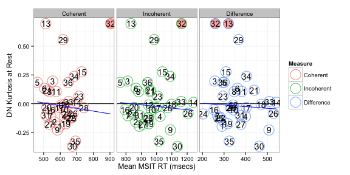
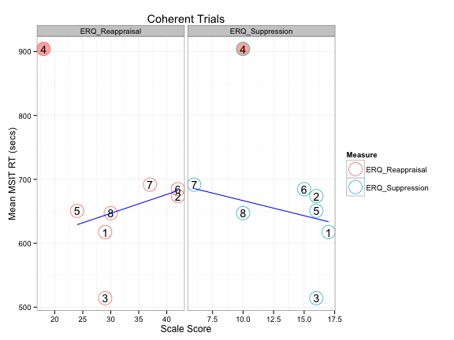
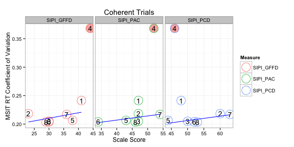
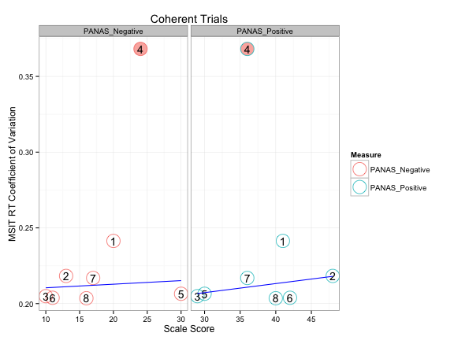
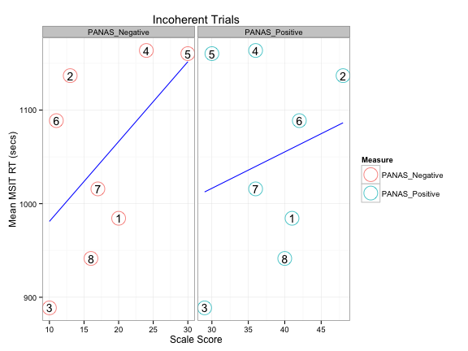
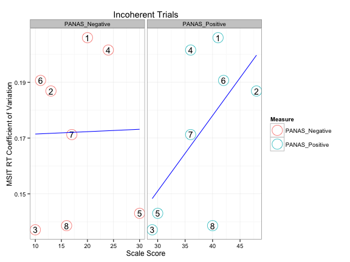

# RT-based Associations

Note that actual code is loaded from a different file.


```r
read_chunk("06_rt_stuff.R")
```


## Overview

Not much to see here :(.

* Connectivity between DN and Executive Control network was significantly related to mean RT across both coherent and incoherent trials.
* Connectivity between DN and Left Frontoparietal network was significantly related to RT CV for incoherent trials (and p=0.1 for coherent trials).
* AIM was positively related to mean RT for coherent and incoherent trials.
* RRS as well as all most of its subscales were positively related to RT CV for coherent and incoherent trials.
* BDI was positively related to mean RT for incoherent trials.
* PANAS negative was positively related to mean RT for incoherent trials.
* PANAS positive was positively related to RT CV for incoherent trials.

## Setup


```r
library(plyr)
library(e1071)
library(ggplot2)
library(RColorBrewer)
library(robustbase)
basedir <- dirname(dirname(getwd()))  # assume running in current direcotry
scriptdir <- file.path(basedir, "scripts")
datadir <- file.path(basedir, "scripts/data")
oldtheme <- theme_set(theme_bw())
```


```r
orig_network_names <- c("Medial Visual", "Occipital Pole Visual", "Lateral Visual", 
    "Default Network", "Cerebellum", "Sensorimotor", "Auditory", "Executive Control", 
    "Right Frontoparietal", "Left Frontoparietal")
network_names <- gsub(" ", ".", tolower(orig_network_names))
dmn <- 4
tps <- 8:10
```


```r
# Phenotypic Info (only 9 subjects in CCD)
phenos <- read.csv(file.path(datadir, "ccd_totals_touse.csv"))[1:9, -1]
colnames(phenos)[1:3] <- c("subject", "age", "sex")
phenos$subject <- toupper(phenos$subject)
# Basic Subject Info for all
subinfo <- read.csv(file.path(datadir, "ccb+ccd_filtered.csv"))
subinfo$scan <- factor(subinfo$scan)
subinfo$run <- factor(subinfo$run)
```


```r
load(file.path(datadir, "ccb+ccd_rts.rda"))  # rts
rts <- rts[rts$rt > 200, ]  # remove trials with RT < 200ms
rts$scan <- factor(rts$scan)
rts$run <- factor(rts$run)
```


```r
# this loads the 'tss' object with attr(tss, 'split_labels') to get how
# stuff should be organized
load(file.path(basedir, "scripts/data/ccb+ccd_time_series.rda"))
splitter <- attr(tss, "split_labels")
splitter$index <- 1:nrow(splitter)
```


## Calculate measures


```r
rts_df <- ddply(rts, .(study, subject, condition), function(sdf) {
    c(mean.rt = mean(sdf$rt), cv.rt = sd(sdf$rt)/mean(sdf$rt))
})
rts_df
```

```
##    study subject  condition mean.rt  cv.rt
## 1    CCB  CCB002   Coherent   597.0 0.2781
## 2    CCB  CCB002 Incoherent   887.8 0.2285
## 3    CCB  CCB003   Coherent   569.0 0.2321
## 4    CCB  CCB003 Incoherent   889.1 0.1981
## 5    CCB  CCB004   Coherent   553.9 0.3230
## 6    CCB  CCB004 Incoherent   811.0 0.1936
## 7    CCB  CCB005   Coherent   624.3 0.2339
## 8    CCB  CCB005 Incoherent  1023.3 0.1552
## 9    CCB  CCB006   Coherent   461.7 0.2103
## 10   CCB  CCB006 Incoherent   762.5 0.1500
## 11   CCB  CCB007   Coherent   504.7 0.2768
## 12   CCB  CCB007 Incoherent   866.4 0.2056
## 13   CCB  CCB009   Coherent   542.8 0.2448
## 14   CCB  CCB009 Incoherent   813.0 0.1695
## 15   CCB  CCB010   Coherent   535.2 0.2376
## 16   CCB  CCB010 Incoherent   881.8 0.1876
## 17   CCB  CCB012   Coherent   583.4 0.2305
## 18   CCB  CCB012 Incoherent  1090.7 0.2054
## 19   CCB  CCB013   Coherent   622.2 0.2842
## 20   CCB  CCB013 Incoherent   966.7 0.1851
## 21   CCB  CCB014   Coherent   623.8 0.2107
## 22   CCB  CCB014 Incoherent  1022.7 0.2182
## 23   CCB  CCB015   Coherent   606.5 0.1867
## 24   CCB  CCB015 Incoherent   948.5 0.1651
## 25   CCB  CCB016   Coherent   512.9 0.2241
## 26   CCB  CCB016 Incoherent   833.0 0.1645
## 27   CCB  CCB017   Coherent   665.4 0.3075
## 28   CCB  CCB017 Incoherent  1127.2 0.1958
## 29   CCB  CCB018   Coherent   729.2 0.1572
## 30   CCB  CCB018 Incoherent  1037.9 0.1906
## 31   CCB  CCB019   Coherent   571.6 0.2265
## 32   CCB  CCB019 Incoherent   826.3 0.1839
## 33   CCB  CCB020   Coherent   590.9 0.2178
## 34   CCB  CCB020 Incoherent   996.1 0.2041
## 35   CCB  CCB021   Coherent   627.6 0.3519
## 36   CCB  CCB021 Incoherent  1098.9 0.2053
## 37   CCB  CCB022   Coherent   633.3 0.1791
## 38   CCB  CCB022 Incoherent   950.7 0.1599
## 39   CCB  CCB025   Coherent   518.9 0.2166
## 40   CCB  CCB025 Incoherent   854.3 0.1833
## 41   CCB  CCB026   Coherent   607.4 0.3475
## 42   CCB  CCB026 Incoherent  1059.6 0.2191
## 43   CCB  CCB027   Coherent   662.9 0.2103
## 44   CCB  CCB027 Incoherent   946.8 0.1832
## 45   CCB  CCB029   Coherent   712.7 0.2396
## 46   CCB  CCB029 Incoherent  1007.9 0.2001
## 47   CCB  CCB031   Coherent   592.0 0.3053
## 48   CCB  CCB031 Incoherent   847.0 0.1671
## 49   CCB  CCB032   Coherent   690.0 0.2525
## 50   CCB  CCB032 Incoherent   958.4 0.1899
## 51   CCB  CCB035   Coherent   677.5 0.3367
## 52   CCB  CCB035 Incoherent  1205.8 0.1940
## 53   CCB  CCB037   Coherent   534.4 0.1892
## 54   CCB  CCB037 Incoherent   912.3 0.2094
## 55   CCB  CCB038   Coherent   743.2 0.2064
## 56   CCB  CCB038 Incoherent  1072.7 0.1458
## 57   CCD  CCD003   Coherent   651.3 0.2851
## 58   CCD  CCD003 Incoherent  1074.2 0.1978
## 59   CCD  CCD004   Coherent   636.0 0.2326
## 60   CCD  CCD004 Incoherent   880.4 0.2473
## 61   CCD  CCD005   Coherent   530.7 0.2193
## 62   CCD  CCD005 Incoherent   925.6 0.1419
## 63   CCD  CCD007   Coherent   866.3 0.3397
## 64   CCD  CCD007 Incoherent  1260.7 0.1538
## 65   CCD  CCD008   Coherent   705.9 0.2421
## 66   CCD  CCD008 Incoherent  1276.2 0.1725
## 67   CCD  CCD009   Coherent   780.7 0.2145
## 68   CCD  CCD009 Incoherent  1187.2 0.2133
## 69   CCD  CCD010   Coherent   735.9 0.2403
## 70   CCD  CCD010 Incoherent  1088.9 0.1713
## 71   CCD  CCD011   Coherent   663.6 0.2236
## 72   CCD  CCD011 Incoherent   992.4 0.1487
```

```r
# Plot Mean RTs
ggplot(rts_df, aes(x = mean.rt)) + geom_histogram(aes(fill = ..count..)) + facet_grid(condition ~ 
    study) + xlab("Mean Reaction Time (msecs)")
```

 

```r
# Plot RT Coefficient of Variation
ggplot(rts_df, aes(x = cv.rt)) + geom_histogram(aes(fill = ..count..)) + facet_grid(condition ~ 
    study) + xlab("Reaction Time Coefficient of Variation")
```

 


```r
sub_splitter <- subset(splitter, condition == "REST")
kurtosis_rest <- ddply(sub_splitter, .(study, subject, scan, run), function(sdf) {
    ts <- tss[[sdf$index]][, dmn]
    c(kurtosis = kurtosis(ts))
})
# collapse across scan and run
kurtosis_rest <- ddply(kurtosis_rest, .(study, subject), numcolwise(mean))
# plot
ggplot(kurtosis_rest, aes(x = kurtosis)) + geom_histogram(aes(fill = ..count..)) + 
    facet_grid(. ~ study) + xlab("Kurtosis")
```

 


The CCD seems to be slightly positively shifted in its distribution. I hope this is not due to differences in any preprocessing steps.


```r
connectivity_rest <- ddply(sub_splitter, .(study, subject, scan, run), function(sdf) {
    ts <- tss[[sdf$index]][, c(dmn, tps)]
    rs <- cor(ts)[-1, 1]
    zs <- atanh(rs)
    data.frame(network = orig_network_names[tps], r = rs, z = zs)
})
# collapse across scan and run
connectivity_rest <- ddply(connectivity_rest, .(study, subject, network), numcolwise(mean))
# plot
ggplot(connectivity_rest, aes(x = z)) + geom_histogram(aes(fill = ..count..)) + 
    facet_grid(network ~ study) + xlab("Connectivity with DMN (Fischer Z)")
```

 


```r
df_phenos <- merge(rts_df, phenos, by = "subject")
df_kurtosis <- merge(rts_df, kurtosis_rest, by = c("study", "subject"))
df_connectivity <- merge(rts_df, connectivity_rest, by = c("study", "subject"))
df_kurtosis_phenos <- merge(subset(df_kurtosis, study == "CCD", select = -1), 
    phenos, by = "subject")
df_connectivity_phenos <- merge(subset(df_connectivity, study == "CCD", select = -1), 
    phenos, by = "subject")
```


## Assocations between RT and brain measures


```r
to_outlier <- function(x) factor((x > 0.1) * 1, levels = c(0, 1), labels = c("yes", 
    "no"))
wrap_lmrob <- function(f, df) {
    reg <- summary(lmrob(f, df, maxit.scale = 500))
    print(reg)
    df$outlier <- to_outlier(reg$weights)
    df$weights <- reg$weights
    df
}
get_grid <- function(df, f, y, x) {
    model <- lmrob(f, df, maxit.scale = 500)
    grid <- data.frame(row.names = 1:20)
    grid[[x]] <- seq(min(df[[x]]), max(df[[x]]), length = 20)
    grid[[y]] <- predict(model, newdata = grid)
    grid
}
```


### DN Kurtosis


```r
tmpdf <- ddply(df_kurtosis, .(condition), function(sdf) {
    cat("\nCondition:", as.character(sdf$condition[1]), "\n")
    wrap_lmrob(kurtosis ~ mean.rt, sdf)
})
```

```
## 
## Condition: Coherent 
## 
## Call:
## lmrob(formula = f, data = df, maxit.scale = 500)
## 
## Weighted Residuals:
##      Min       1Q   Median       3Q      Max 
## -0.35919 -0.10140 -0.00107  0.15472  0.74313 
## 
## Coefficients:
##              Estimate Std. Error t value Pr(>|t|)
## (Intercept) -0.197871   0.589679   -0.34     0.74
## mean.rt      0.000294   0.000990    0.30     0.77
## 
## Robust residual standard error: 0.181 
## Convergence in 27 IRWLS iterations
## 
## Robustness weights: 
##  6 weights are ~= 1. The remaining 30 ones are summarized as
##    Min. 1st Qu.  Median    Mean 3rd Qu.    Max. 
##   0.054   0.864   0.945   0.848   0.978   0.999 
## Algorithmic parameters: 
## tuning.chi         bb tuning.psi refine.tol    rel.tol  solve.tol 
##   1.55e+00   5.00e-01   4.69e+00   1.00e-07   1.00e-07   1.00e-07 
##      nResample         max.it       best.r.s       k.fast.s          k.max 
##            500             50              2              1            200 
##    maxit.scale      trace.lev            mts     compute.rd fast.s.large.n 
##            500              0           1000              0           2000 
##           psi   subsampling        method           cov 
##    "bisquare" "nonsingular"          "MM" ".vcov.avar1" 
## seed : int(0) 
## 
## Condition: Incoherent 
## 
## Call:
## lmrob(formula = f, data = df, maxit.scale = 500)
## 
## Weighted Residuals:
##     Min      1Q  Median      3Q     Max 
## -0.3340 -0.1004 -0.0117  0.1485  0.7406 
## 
## Coefficients:
##              Estimate Std. Error t value Pr(>|t|)
## (Intercept) -0.192663   0.309005   -0.62     0.54
## mean.rt      0.000178   0.000328    0.54     0.59
## 
## Robust residual standard error: 0.177 
## Convergence in 16 IRWLS iterations
## 
## Robustness weights: 
##  7 weights are ~= 1. The remaining 29 ones are summarized as
##    Min. 1st Qu.  Median    Mean 3rd Qu.    Max. 
##  0.0408  0.8360  0.9370  0.8380  0.9710  0.9970 
## Algorithmic parameters: 
## tuning.chi         bb tuning.psi refine.tol    rel.tol  solve.tol 
##   1.55e+00   5.00e-01   4.69e+00   1.00e-07   1.00e-07   1.00e-07 
##      nResample         max.it       best.r.s       k.fast.s          k.max 
##            500             50              2              1            200 
##    maxit.scale      trace.lev            mts     compute.rd fast.s.large.n 
##            500              0           1000              0           2000 
##           psi   subsampling        method           cov 
##    "bisquare" "nonsingular"          "MM" ".vcov.avar1" 
## seed : int(0)
```

```r
tmpdf$id <- rep(1:length(unique(df_kurtosis$subject)), 2)
grid <- ddply(df_kurtosis, .(condition), get_grid, kurtosis ~ mean.rt, "kurtosis", 
    "mean.rt")
# Plot
p0 <- ggplot(tmpdf, aes(x = mean.rt, y = kurtosis)) + geom_hline(aes(yintercept = 0)) + 
    xlab("Mean MSIT RT (msecs)") + ylab("DN Kurtosis at Rest") + facet_grid(. ~ 
    condition, scales = "free_x")
if (any(tmpdf$outlier == "yes")) {
    p <- p0 + geom_point(data = tmpdf[tmpdf$outlier == "yes", ], size = 8, color = brewer.pal(3, 
        "Pastel1")[1]) + geom_point(aes(color = condition), shape = 1, size = 8) + 
        geom_text(aes(label = id), size = 5) + geom_line(data = grid, color = "blue") + 
        scale_color_discrete(name = "Measure")
} else {
    p <- p0 + geom_point(aes(color = condition), shape = 1, size = 8) + geom_text(aes(label = id), 
        size = 5) + geom_line(data = grid, color = "blue") + scale_color_discrete(name = "Measure")
}
p
```

 


```r
tmpdf <- ddply(df_kurtosis, .(condition), function(sdf) {
    cat("\nCondition:", as.character(sdf$condition[1]), "\n")
    wrap_lmrob(kurtosis ~ cv.rt, sdf)
})
```

```
## 
## Condition: Coherent 
## 
## Call:
## lmrob(formula = f, data = df, maxit.scale = 500)
## 
## Weighted Residuals:
##      Min       1Q   Median       3Q      Max 
## -0.34584 -0.09447 -0.00341  0.13904  0.72347 
## 
## Coefficients:
##             Estimate Std. Error t value Pr(>|t|)
## (Intercept)   -0.112      0.164   -0.68     0.50
## cv.rt          0.379      0.657    0.58     0.57
## 
## Robust residual standard error: 0.178 
## Convergence in 12 IRWLS iterations
## 
## Robustness weights: 
##  4 weights are ~= 1. The remaining 32 ones are summarized as
##    Min. 1st Qu.  Median    Mean 3rd Qu.    Max. 
##  0.0622  0.8740  0.9500  0.8540  0.9790  0.9980 
## Algorithmic parameters: 
## tuning.chi         bb tuning.psi refine.tol    rel.tol  solve.tol 
##   1.55e+00   5.00e-01   4.69e+00   1.00e-07   1.00e-07   1.00e-07 
##      nResample         max.it       best.r.s       k.fast.s          k.max 
##            500             50              2              1            200 
##    maxit.scale      trace.lev            mts     compute.rd fast.s.large.n 
##            500              0           1000              0           2000 
##           psi   subsampling        method           cov 
##    "bisquare" "nonsingular"          "MM" ".vcov.avar1" 
## seed : int(0) 
## 
## Condition: Incoherent 
## 
## Call:
## lmrob(formula = f, data = df, maxit.scale = 500)
## 
## Weighted Residuals:
##      Min       1Q   Median       3Q      Max 
## -0.31597 -0.10225 -0.00843  0.15783  0.70523 
## 
## Coefficients:
##             Estimate Std. Error t value Pr(>|t|)
## (Intercept)   0.0802     0.3861    0.21     0.84
## cv.rt        -0.5426     2.0244   -0.27     0.79
## 
## Robust residual standard error: 0.174 
## Convergence in 16 IRWLS iterations
## 
## Robustness weights: 
##  3 weights are ~= 1. The remaining 33 ones are summarized as
##    Min. 1st Qu.  Median    Mean 3rd Qu.    Max. 
##  0.0647  0.8860  0.9390  0.8530  0.9740  0.9980 
## Algorithmic parameters: 
## tuning.chi         bb tuning.psi refine.tol    rel.tol  solve.tol 
##   1.55e+00   5.00e-01   4.69e+00   1.00e-07   1.00e-07   1.00e-07 
##      nResample         max.it       best.r.s       k.fast.s          k.max 
##            500             50              2              1            200 
##    maxit.scale      trace.lev            mts     compute.rd fast.s.large.n 
##            500              0           1000              0           2000 
##           psi   subsampling        method           cov 
##    "bisquare" "nonsingular"          "MM" ".vcov.avar1" 
## seed : int(0)
```

```r
tmpdf$id <- rep(1:length(unique(df_kurtosis$subject)), 2)
grid <- ddply(df_kurtosis, .(condition), get_grid, kurtosis ~ cv.rt, "kurtosis", 
    "cv.rt")
# Plot
p0 <- ggplot(tmpdf, aes(x = cv.rt, y = kurtosis)) + geom_hline(aes(yintercept = 0)) + 
    xlab("MSIT RT Coefficient of Variation") + ylab("DN Kurtosis at Rest") + 
    facet_grid(. ~ condition, scales = "free_x")
if (any(tmpdf$outlier == "yes")) {
    p <- p0 + geom_point(data = tmpdf[tmpdf$outlier == "yes", ], size = 8, color = brewer.pal(3, 
        "Pastel1")[1]) + geom_point(aes(color = condition), shape = 1, size = 8) + 
        geom_text(aes(label = id), size = 5) + geom_line(data = grid, color = "blue") + 
        scale_color_discrete(name = "Measure")
} else {
    p <- p0 + geom_point(aes(color = condition), shape = 1, size = 8) + geom_text(aes(label = id), 
        size = 5) + geom_line(data = grid, color = "blue") + scale_color_discrete(name = "Measure")
}
p
```

 


### TP-DN Connectivity


```r
tmpdf <- ddply(df_connectivity, .(network, condition), function(sdf) {
    cat("\nConnectivity with", as.character(sdf$network[1]), "during", as.character(sdf$condition[1]), 
        "\n")
    tmpdf <- wrap_lmrob(z ~ mean.rt, sdf)
    tmpdf$id <- 1:nrow(tmpdf)
    tmpdf
})
```

```
## 
## Connectivity with Executive Control during Coherent 
## 
## Call:
## lmrob(formula = f, data = df, maxit.scale = 500)
## 
## Weighted Residuals:
##      Min       1Q   Median       3Q      Max 
## -0.39034 -0.09888 -0.00482  0.13271  0.57281 
## 
## Coefficients:
##              Estimate Std. Error t value Pr(>|t|)  
## (Intercept) -0.545436   0.276068   -1.98    0.056 .
## mean.rt      0.000938   0.000445    2.11    0.042 *
## ---
## Signif. codes:  0 '***' 0.001 '**' 0.01 '*' 0.05 '.' 0.1 ' ' 1 
## 
## Robust residual standard error: 0.179 
## Convergence in 11 IRWLS iterations
## 
## Robustness weights: 
##  one weight is ~= 1. The remaining 35 ones are summarized as
##    Min. 1st Qu.  Median    Mean 3rd Qu.    Max. 
##   0.285   0.882   0.962   0.905   0.983   0.998 
## Algorithmic parameters: 
## tuning.chi         bb tuning.psi refine.tol    rel.tol  solve.tol 
##   1.55e+00   5.00e-01   4.69e+00   1.00e-07   1.00e-07   1.00e-07 
##      nResample         max.it       best.r.s       k.fast.s          k.max 
##            500             50              2              1            200 
##    maxit.scale      trace.lev            mts     compute.rd fast.s.large.n 
##            500              0           1000              0           2000 
##           psi   subsampling        method           cov 
##    "bisquare" "nonsingular"          "MM" ".vcov.avar1" 
## seed : int(0) 
## 
## Connectivity with Executive Control during Incoherent 
## 
## Call:
## lmrob(formula = f, data = df, maxit.scale = 500)
## 
## Weighted Residuals:
##     Min      1Q  Median      3Q     Max 
## -0.4599 -0.1024 -0.0186  0.1158  0.5178 
## 
## Coefficients:
##              Estimate Std. Error t value Pr(>|t|)  
## (Intercept) -0.555856   0.212455   -2.62    0.013 *
## mean.rt      0.000609   0.000223    2.73    0.010 *
## ---
## Signif. codes:  0 '***' 0.001 '**' 0.01 '*' 0.05 '.' 0.1 ' ' 1 
## 
## Robust residual standard error: 0.185 
## Convergence in 9 IRWLS iterations
## 
## Robustness weights: 
##  3 weights are ~= 1. The remaining 33 ones are summarized as
##    Min. 1st Qu.  Median    Mean 3rd Qu.    Max. 
##   0.415   0.909   0.965   0.908   0.977   0.999 
## Algorithmic parameters: 
## tuning.chi         bb tuning.psi refine.tol    rel.tol  solve.tol 
##   1.55e+00   5.00e-01   4.69e+00   1.00e-07   1.00e-07   1.00e-07 
##      nResample         max.it       best.r.s       k.fast.s          k.max 
##            500             50              2              1            200 
##    maxit.scale      trace.lev            mts     compute.rd fast.s.large.n 
##            500              0           1000              0           2000 
##           psi   subsampling        method           cov 
##    "bisquare" "nonsingular"          "MM" ".vcov.avar1" 
## seed : int(0) 
## 
## Connectivity with Left Frontoparietal during Coherent 
## 
## Call:
## lmrob(formula = f, data = df, maxit.scale = 500)
## 
## Weighted Residuals:
##      Min       1Q   Median       3Q      Max 
## -0.36453 -0.07505 -0.00343  0.11918  0.49188 
## 
## Coefficients:
##              Estimate Std. Error t value Pr(>|t|)
## (Intercept) -0.190404   0.165806   -1.15     0.26
## mean.rt      0.000325   0.000282    1.15     0.26
## 
## Robust residual standard error: 0.166 
## Convergence in 10 IRWLS iterations
## 
## Robustness weights: 
##  4 weights are ~= 1. The remaining 32 ones are summarized as
##    Min. 1st Qu.  Median    Mean 3rd Qu.    Max. 
##   0.363   0.852   0.949   0.897   0.989   0.998 
## Algorithmic parameters: 
## tuning.chi         bb tuning.psi refine.tol    rel.tol  solve.tol 
##   1.55e+00   5.00e-01   4.69e+00   1.00e-07   1.00e-07   1.00e-07 
##      nResample         max.it       best.r.s       k.fast.s          k.max 
##            500             50              2              1            200 
##    maxit.scale      trace.lev            mts     compute.rd fast.s.large.n 
##            500              0           1000              0           2000 
##           psi   subsampling        method           cov 
##    "bisquare" "nonsingular"          "MM" ".vcov.avar1" 
## seed : int(0) 
## 
## Connectivity with Left Frontoparietal during Incoherent 
## 
## Call:
## lmrob(formula = f, data = df, maxit.scale = 500)
## 
## Weighted Residuals:
##     Min      1Q  Median      3Q     Max 
## -0.3314 -0.0870 -0.0143  0.1108  0.5074 
## 
## Coefficients:
##              Estimate Std. Error t value Pr(>|t|)
## (Intercept)  2.33e-02   2.46e-01    0.09     0.93
## mean.rt     -1.37e-05   2.58e-04   -0.05     0.96
## 
## Robust residual standard error: 0.173 
## Convergence in 13 IRWLS iterations
## 
## Robustness weights: 
##  6 weights are ~= 1. The remaining 30 ones are summarized as
##    Min. 1st Qu.  Median    Mean 3rd Qu.    Max. 
##   0.370   0.856   0.938   0.895   0.986   0.997 
## Algorithmic parameters: 
## tuning.chi         bb tuning.psi refine.tol    rel.tol  solve.tol 
##   1.55e+00   5.00e-01   4.69e+00   1.00e-07   1.00e-07   1.00e-07 
##      nResample         max.it       best.r.s       k.fast.s          k.max 
##            500             50              2              1            200 
##    maxit.scale      trace.lev            mts     compute.rd fast.s.large.n 
##            500              0           1000              0           2000 
##           psi   subsampling        method           cov 
##    "bisquare" "nonsingular"          "MM" ".vcov.avar1" 
## seed : int(0) 
## 
## Connectivity with Right Frontoparietal during Coherent 
## 
## Call:
## lmrob(formula = f, data = df, maxit.scale = 500)
## 
## Weighted Residuals:
##      Min       1Q   Median       3Q      Max 
## -0.34267 -0.09164  0.00384  0.09981  0.22907 
## 
## Coefficients:
##              Estimate Std. Error t value Pr(>|t|)
## (Intercept) -0.336540   0.223611   -1.51     0.14
## mean.rt      0.000503   0.000369    1.36     0.18
## 
## Robust residual standard error: 0.158 
## Convergence in 12 IRWLS iterations
## 
## Robustness weights: 
##  4 weights are ~= 1. The remaining 32 ones are summarized as
##    Min. 1st Qu.  Median    Mean 3rd Qu.    Max. 
##   0.616   0.859   0.957   0.912   0.991   0.999 
## Algorithmic parameters: 
## tuning.chi         bb tuning.psi refine.tol    rel.tol  solve.tol 
##   1.55e+00   5.00e-01   4.69e+00   1.00e-07   1.00e-07   1.00e-07 
##      nResample         max.it       best.r.s       k.fast.s          k.max 
##            500             50              2              1            200 
##    maxit.scale      trace.lev            mts     compute.rd fast.s.large.n 
##            500              0           1000              0           2000 
##           psi   subsampling        method           cov 
##    "bisquare" "nonsingular"          "MM" ".vcov.avar1" 
## seed : int(0) 
## 
## Connectivity with Right Frontoparietal during Incoherent 
## 
## Call:
## lmrob(formula = f, data = df, maxit.scale = 500)
## 
## Weighted Residuals:
##     Min      1Q  Median      3Q     Max 
## -0.3080 -0.0829 -0.0145  0.0955  0.2784 
## 
## Coefficients:
##              Estimate Std. Error t value Pr(>|t|)
## (Intercept) -0.259970   0.220495   -1.18     0.25
## mean.rt      0.000239   0.000230    1.04     0.31
## 
## Robust residual standard error: 0.16 
## Convergence in 11 IRWLS iterations
## 
## Robustness weights: 
##  2 weights are ~= 1. The remaining 34 ones are summarized as
##    Min. 1st Qu.  Median    Mean 3rd Qu.    Max. 
##   0.691   0.856   0.966   0.918   0.992   0.999 
## Algorithmic parameters: 
## tuning.chi         bb tuning.psi refine.tol    rel.tol  solve.tol 
##   1.55e+00   5.00e-01   4.69e+00   1.00e-07   1.00e-07   1.00e-07 
##      nResample         max.it       best.r.s       k.fast.s          k.max 
##            500             50              2              1            200 
##    maxit.scale      trace.lev            mts     compute.rd fast.s.large.n 
##            500              0           1000              0           2000 
##           psi   subsampling        method           cov 
##    "bisquare" "nonsingular"          "MM" ".vcov.avar1" 
## seed : int(0)
```

```r
grid <- ddply(df_connectivity, .(network, condition), get_grid, z ~ mean.rt, 
    "z", "mean.rt")
# Plot
p0 <- ggplot(tmpdf, aes(x = mean.rt, y = z)) + geom_hline(aes(yintercept = 0)) + 
    xlab("Mean MSIT RT (msecs)") + ylab("Connectivity with DN at Rest (Fischer Z)") + 
    facet_grid(network ~ condition, scales = "free_x")
if (any(tmpdf$outlier == "yes")) {
    p <- p0 + geom_point(data = tmpdf[tmpdf$outlier == "yes", ], size = 8, color = brewer.pal(3, 
        "Pastel1")[1]) + geom_point(aes(color = condition), shape = 1, size = 8) + 
        geom_text(aes(label = id), size = 5) + geom_line(data = grid, color = "blue") + 
        scale_color_discrete(name = "Measure")
} else {
    p <- p0 + geom_point(aes(color = condition), shape = 1, size = 8) + geom_text(aes(label = id), 
        size = 5) + geom_line(data = grid, color = "blue") + scale_color_discrete(name = "Measure")
}
p
```

 


```r
tmpdf <- ddply(df_connectivity, .(network, condition), function(sdf) {
    cat("\nConnectivity with", as.character(sdf$network[1]), "during", as.character(sdf$condition[1]), 
        "\n")
    tmpdf <- wrap_lmrob(z ~ cv.rt, sdf)
    tmpdf$id <- 1:nrow(tmpdf)
    tmpdf
})
```

```
## 
## Connectivity with Executive Control during Coherent 
## 
## Call:
## lmrob(formula = f, data = df, maxit.scale = 500)
## 
## Weighted Residuals:
##     Min      1Q  Median      3Q     Max 
## -0.3117 -0.1355 -0.0203  0.0946  0.5183 
## 
## Coefficients:
##             Estimate Std. Error t value Pr(>|t|)
## (Intercept)    0.199      0.188    1.05     0.30
## cv.rt         -0.665      0.800   -0.83     0.41
## 
## Robust residual standard error: 0.205 
## Convergence in 12 IRWLS iterations
## 
## Robustness weights: 
##  one weight is ~= 1. The remaining 35 ones are summarized as
##    Min. 1st Qu.  Median    Mean 3rd Qu.    Max. 
##   0.501   0.899   0.962   0.918   0.987   0.998 
## Algorithmic parameters: 
## tuning.chi         bb tuning.psi refine.tol    rel.tol  solve.tol 
##   1.55e+00   5.00e-01   4.69e+00   1.00e-07   1.00e-07   1.00e-07 
##      nResample         max.it       best.r.s       k.fast.s          k.max 
##            500             50              2              1            200 
##    maxit.scale      trace.lev            mts     compute.rd fast.s.large.n 
##            500              0           1000              0           2000 
##           psi   subsampling        method           cov 
##    "bisquare" "nonsingular"          "MM" ".vcov.avar1" 
## seed : int(0) 
## 
## Connectivity with Executive Control during Incoherent 
## 
## Call:
## lmrob(formula = f, data = df, maxit.scale = 500)
## 
## Weighted Residuals:
##    Min     1Q Median     3Q    Max 
## -0.386 -0.142  0.016  0.105  0.505 
## 
## Coefficients:
##             Estimate Std. Error t value Pr(>|t|)
## (Intercept)  -0.0205     0.4562   -0.05     0.96
## cv.rt         0.2887     2.2650    0.13     0.90
## 
## Robust residual standard error: 0.184 
## Convergence in 21 IRWLS iterations
## 
## Robustness weights: 
##  one weight is ~= 1. The remaining 35 ones are summarized as
##    Min. 1st Qu.  Median    Mean 3rd Qu.    Max. 
##   0.433   0.893   0.947   0.898   0.982   0.998 
## Algorithmic parameters: 
## tuning.chi         bb tuning.psi refine.tol    rel.tol  solve.tol 
##   1.55e+00   5.00e-01   4.69e+00   1.00e-07   1.00e-07   1.00e-07 
##      nResample         max.it       best.r.s       k.fast.s          k.max 
##            500             50              2              1            200 
##    maxit.scale      trace.lev            mts     compute.rd fast.s.large.n 
##            500              0           1000              0           2000 
##           psi   subsampling        method           cov 
##    "bisquare" "nonsingular"          "MM" ".vcov.avar1" 
## seed : int(0) 
## 
## Connectivity with Left Frontoparietal during Coherent 
## 
## Call:
## lmrob(formula = f, data = df, maxit.scale = 500)
## 
## Weighted Residuals:
##     Min      1Q  Median      3Q     Max 
## -0.3351 -0.0826 -0.0201  0.1100  0.5093 
## 
## Coefficients:
##             Estimate Std. Error t value Pr(>|t|)
## (Intercept)  -0.0135     0.1130   -0.12     0.91
## cv.rt         0.0949     0.4601    0.21     0.84
## 
## Robust residual standard error: 0.173 
## Convergence in 10 IRWLS iterations
## 
## Robustness weights: 
##  3 weights are ~= 1. The remaining 33 ones are summarized as
##    Min. 1st Qu.  Median    Mean 3rd Qu.    Max. 
##   0.366   0.862   0.952   0.905   0.988   0.999 
## Algorithmic parameters: 
## tuning.chi         bb tuning.psi refine.tol    rel.tol  solve.tol 
##   1.55e+00   5.00e-01   4.69e+00   1.00e-07   1.00e-07   1.00e-07 
##      nResample         max.it       best.r.s       k.fast.s          k.max 
##            500             50              2              1            200 
##    maxit.scale      trace.lev            mts     compute.rd fast.s.large.n 
##            500              0           1000              0           2000 
##           psi   subsampling        method           cov 
##    "bisquare" "nonsingular"          "MM" ".vcov.avar1" 
## seed : int(0) 
## 
## Connectivity with Left Frontoparietal during Incoherent 
## 
## Call:
## lmrob(formula = f, data = df, maxit.scale = 500)
## 
## Weighted Residuals:
##      Min       1Q   Median       3Q      Max 
## -0.28827 -0.05916 -0.00215  0.08605  0.61730 
## 
## Coefficients:
##             Estimate Std. Error t value Pr(>|t|)  
## (Intercept)   -0.493      0.245   -2.01    0.052 .
## cv.rt          2.641      1.263    2.09    0.044 *
## ---
## Signif. codes:  0 '***' 0.001 '**' 0.01 '*' 0.05 '.' 0.1 ' ' 1 
## 
## Robust residual standard error: 0.133 
## Convergence in 13 IRWLS iterations
## 
## Robustness weights: 
##  observation 36 is an outlier with |weight| <= 0.00049 ( < 0.0028); 
##  3 weights are ~= 1. The remaining 32 ones are summarized as
##    Min. 1st Qu.  Median    Mean 3rd Qu.    Max. 
##   0.480   0.832   0.964   0.888   0.983   0.997 
## Algorithmic parameters: 
## tuning.chi         bb tuning.psi refine.tol    rel.tol  solve.tol 
##   1.55e+00   5.00e-01   4.69e+00   1.00e-07   1.00e-07   1.00e-07 
##      nResample         max.it       best.r.s       k.fast.s          k.max 
##            500             50              2              1            200 
##    maxit.scale      trace.lev            mts     compute.rd fast.s.large.n 
##            500              0           1000              0           2000 
##           psi   subsampling        method           cov 
##    "bisquare" "nonsingular"          "MM" ".vcov.avar1" 
## seed : int(0) 
## 
## Connectivity with Right Frontoparietal during Coherent 
## 
## Call:
## lmrob(formula = f, data = df, maxit.scale = 500)
## 
## Weighted Residuals:
##       Min        1Q    Median        3Q       Max 
## -0.292910 -0.098565 -0.000617  0.128278  0.260228 
## 
## Coefficients:
##             Estimate Std. Error t value Pr(>|t|)  
## (Intercept)   -0.260      0.144   -1.80     0.08 .
## cv.rt          0.942      0.561    1.68     0.10  
## ---
## Signif. codes:  0 '***' 0.001 '**' 0.01 '*' 0.05 '.' 0.1 ' ' 1 
## 
## Robust residual standard error: 0.16 
## Convergence in 10 IRWLS iterations
## 
## Robustness weights: 
##  4 weights are ~= 1. The remaining 32 ones are summarized as
##    Min. 1st Qu.  Median    Mean 3rd Qu.    Max. 
##   0.718   0.862   0.951   0.917   0.980   0.998 
## Algorithmic parameters: 
## tuning.chi         bb tuning.psi refine.tol    rel.tol  solve.tol 
##   1.55e+00   5.00e-01   4.69e+00   1.00e-07   1.00e-07   1.00e-07 
##      nResample         max.it       best.r.s       k.fast.s          k.max 
##            500             50              2              1            200 
##    maxit.scale      trace.lev            mts     compute.rd fast.s.large.n 
##            500              0           1000              0           2000 
##           psi   subsampling        method           cov 
##    "bisquare" "nonsingular"          "MM" ".vcov.avar1" 
## seed : int(0) 
## 
## Connectivity with Right Frontoparietal during Incoherent 
## 
## Call:
## lmrob(formula = f, data = df, maxit.scale = 500)
## 
## Weighted Residuals:
##      Min       1Q   Median       3Q      Max 
## -0.28718 -0.08234 -0.00923  0.09603  0.40846 
## 
## Coefficients:
##             Estimate Std. Error t value Pr(>|t|)
## (Intercept)   -0.352      0.275   -1.28     0.21
## cv.rt          1.712      1.381    1.24     0.22
## 
## Robust residual standard error: 0.144 
## Convergence in 15 IRWLS iterations
## 
## Robustness weights: 
##  2 weights are ~= 1. The remaining 34 ones are summarized as
##    Min. 1st Qu.  Median    Mean 3rd Qu.    Max. 
##   0.400   0.867   0.953   0.901   0.991   0.999 
## Algorithmic parameters: 
## tuning.chi         bb tuning.psi refine.tol    rel.tol  solve.tol 
##   1.55e+00   5.00e-01   4.69e+00   1.00e-07   1.00e-07   1.00e-07 
##      nResample         max.it       best.r.s       k.fast.s          k.max 
##            500             50              2              1            200 
##    maxit.scale      trace.lev            mts     compute.rd fast.s.large.n 
##            500              0           1000              0           2000 
##           psi   subsampling        method           cov 
##    "bisquare" "nonsingular"          "MM" ".vcov.avar1" 
## seed : int(0)
```

```r
grid <- ddply(df_connectivity, .(network, condition), get_grid, z ~ cv.rt, "z", 
    "cv.rt")
# Plot
p0 <- ggplot(tmpdf, aes(x = cv.rt, y = z)) + geom_hline(aes(yintercept = 0)) + 
    xlab("MSIT RT Coefficient of Variation") + ylab("Connectivity with DN at Rest (Fischer Z)") + 
    facet_grid(network ~ condition, scales = "free_x")
if (any(tmpdf$outlier == "yes")) {
    p <- p0 + geom_point(data = tmpdf[tmpdf$outlier == "yes", ], size = 8, color = brewer.pal(3, 
        "Pastel1")[1]) + geom_point(aes(color = condition), shape = 1, size = 8) + 
        geom_text(aes(label = id), size = 5) + geom_line(data = grid, color = "blue") + 
        scale_color_discrete(name = "Measure")
} else {
    p <- p0 + geom_point(aes(color = condition), shape = 1, size = 8) + geom_text(aes(label = id), 
        size = 5) + geom_line(data = grid, color = "blue") + scale_color_discrete(name = "Measure")
}
p
```

 


## Associations between RT and phenotypic measures


```r
meanrt.single <- function(df, names, title) {
    # Significance
    bb.df <- ldply(names, function(name) {
        cat("\nRunning regression for", name, "\n")
        f <- paste("mean.rt ~", name)
        f <- as.formula(f)
        tdf <- wrap_lmrob(f, df)
        tdf$id <- 1:nrow(tdf)
        tdf$measure <- name
        tdf$behavior <- tdf[[name]]
        cat("\n")
        tdf[, c("id", "subject", "measure", "behavior", "mean.rt", "outlier", 
            "weights")]
    })
    bb.df$measure <- factor(bb.df$measure)
    bb.df$outlier <- factor(bb.df$outlier)
    
    # Get best fit line
    grid <- ddply(bb.df, .(measure), function(sdf) {
        model <- lmrob(mean.rt ~ behavior, sdf, maxit.scale = 500)
        sgrid <- data.frame(behavior = seq(min(sdf$behavior), max(sdf$behavior), 
            length = 20))
        sgrid$mean.rt <- predict(model, newdata = sgrid)
        sgrid$measure <- sdf$measure[1]
        sgrid
    })
    
    # Plot
    p0 <- ggplot(bb.df, aes(x = behavior, y = mean.rt)) + xlab("Scale Score") + 
        ylab("Mean MSIT RT (secs)") + facet_grid(. ~ measure, scales = "free_x") + 
        ggtitle(title)
    if (any(bb.df$outlier == "yes")) {
        p <- p0 + geom_point(data = bb.df[bb.df$outlier == "yes", ], size = 8, 
            color = brewer.pal(3, "Pastel1")[1]) + geom_point(aes(color = measure), 
            shape = 1, size = 8) + geom_text(aes(label = id), size = 5) + geom_line(data = grid, 
            color = "blue") + scale_color_discrete(name = "Measure")
    } else {
        p <- p0 + geom_point(aes(color = measure), shape = 1, size = 8) + geom_text(aes(label = id), 
            size = 5) + geom_line(data = grid, color = "blue") + scale_color_discrete(name = "Measure")
    }
    p
}
cvrt.single <- function(df, names, title) {
    # Significance
    bb.df <- ldply(names, function(name) {
        cat("\nRunning regression for", name, "\n")
        f <- paste("cv.rt ~", name)
        f <- as.formula(f)
        tdf <- wrap_lmrob(f, df)
        tdf$id <- 1:nrow(tdf)
        tdf$measure <- name
        tdf$behavior <- tdf[[name]]
        cat("\n")
        tdf[, c("id", "subject", "measure", "behavior", "cv.rt", "outlier", 
            "weights")]
    })
    bb.df$measure <- factor(bb.df$measure)
    bb.df$outlier <- factor(bb.df$outlier)
    
    # Get best fit line
    grid <- ddply(bb.df, .(measure), function(sdf) {
        model <- lmrob(cv.rt ~ behavior, sdf, maxit.scale = 500)
        sgrid <- data.frame(behavior = seq(min(sdf$behavior), max(sdf$behavior), 
            length = 20))
        sgrid$cv.rt <- predict(model, newdata = sgrid)
        sgrid$measure <- sdf$measure[1]
        sgrid
    })
    
    # Plot
    p0 <- ggplot(bb.df, aes(x = behavior, y = cv.rt)) + xlab("Scale Score") + 
        ylab("MSIT RT Coefficient of Variation") + facet_grid(. ~ measure, scales = "free_x") + 
        ggtitle(title)
    if (any(bb.df$outlier == "yes")) {
        p <- p0 + geom_point(data = bb.df[bb.df$outlier == "yes", ], size = 8, 
            color = brewer.pal(3, "Pastel1")[1]) + geom_point(aes(color = measure), 
            shape = 1, size = 8) + geom_text(aes(label = id), size = 5) + geom_line(data = grid, 
            color = "blue") + scale_color_discrete(name = "Measure")
    } else {
        p <- p0 + geom_point(aes(color = measure), shape = 1, size = 8) + geom_text(aes(label = id), 
            size = 5) + geom_line(data = grid, color = "blue") + scale_color_discrete(name = "Measure")
    }
    p
}
```


All of these regression analyses were done individually (i.e., each phenotypic measure was associated with RT in an individual/seperate model).

### Coherent Trials


```r
title <- "Coherent Trials"
df_phenos_coherent <- subset(df_phenos, condition == "Coherent")
```


#### Mean RT


```r
names <- c("SIPI", "RRS", "ERQ", "BDI", "AIM")
meanrt.single(df_phenos_coherent, names, title)
```

```
## 
## Running regression for SIPI 
## 
## Call:
## lmrob(formula = f, data = df, maxit.scale = 500)
## 
## Weighted Residuals:
##    Min     1Q Median     3Q    Max 
## -154.2  -53.0  -13.1   48.4  150.3 
## 
## Coefficients:
##             Estimate Std. Error t value Pr(>|t|)
## (Intercept)   421.94     401.78    1.05     0.33
## SIPI            2.07       2.97    0.70     0.51
## 
## Robust residual standard error: 128 
## Convergence in 8 IRWLS iterations
## 
## Robustness weights: 
## [1] 0.985 0.983 0.871 0.878 0.996 0.923 1.000 0.997
## Algorithmic parameters: 
## tuning.chi         bb tuning.psi refine.tol    rel.tol  solve.tol 
##   1.55e+00   5.00e-01   4.69e+00   1.00e-07   1.00e-07   1.00e-07 
##      nResample         max.it       best.r.s       k.fast.s          k.max 
##            500             50              2              1            200 
##    maxit.scale      trace.lev            mts     compute.rd fast.s.large.n 
##            500              0           1000              0           2000 
##           psi   subsampling        method           cov 
##    "bisquare" "nonsingular"          "MM" ".vcov.avar1" 
## seed : int(0) 
## 
## 
## Running regression for RRS 
## 
## Call:
## lmrob(formula = f, data = df, maxit.scale = 500)
## 
## Weighted Residuals:
##    Min     1Q Median     3Q    Max 
## -120.5  -57.3   -3.7   34.7  183.1 
## 
## Coefficients:
##             Estimate Std. Error t value Pr(>|t|)  
## (Intercept)   590.10     189.50    3.11    0.021 *
## RRS             2.66       4.31    0.62    0.560  
## ---
## Signif. codes:  0 '***' 0.001 '**' 0.01 '*' 0.05 '.' 0.1 ' ' 1 
## 
## Robust residual standard error: 115 
## Convergence in 10 IRWLS iterations
## 
## Robustness weights: 
## [1] 0.947 0.985 0.902 0.781 0.999 0.942 0.998 0.997
## Algorithmic parameters: 
## tuning.chi         bb tuning.psi refine.tol    rel.tol  solve.tol 
##   1.55e+00   5.00e-01   4.69e+00   1.00e-07   1.00e-07   1.00e-07 
##      nResample         max.it       best.r.s       k.fast.s          k.max 
##            500             50              2              1            200 
##    maxit.scale      trace.lev            mts     compute.rd fast.s.large.n 
##            500              0           1000              0           2000 
##           psi   subsampling        method           cov 
##    "bisquare" "nonsingular"          "MM" ".vcov.avar1" 
## seed : int(0) 
## 
## 
## Running regression for ERQ 
## 
## Call:
## lmrob(formula = f, data = df, maxit.scale = 500)
## 
## Weighted Residuals:
##     Min      1Q  Median      3Q     Max 
## -165.03  -43.47   -7.94   48.51  135.61 
## 
## Coefficients:
##             Estimate Std. Error t value Pr(>|t|)   
## (Intercept)   885.47     181.89    4.87   0.0028 **
## ERQ            -4.22       4.07   -1.04   0.3397   
## ---
## Signif. codes:  0 '***' 0.001 '**' 0.01 '*' 0.05 '.' 0.1 ' ' 1 
## 
## Robust residual standard error: 111 
## Convergence in 8 IRWLS iterations
## 
## Robustness weights: 
## [1] 0.988 1.000 0.808 0.929 0.999 0.868 0.993 0.979
## Algorithmic parameters: 
## tuning.chi         bb tuning.psi refine.tol    rel.tol  solve.tol 
##   1.55e+00   5.00e-01   4.69e+00   1.00e-07   1.00e-07   1.00e-07 
##      nResample         max.it       best.r.s       k.fast.s          k.max 
##            500             50              2              1            200 
##    maxit.scale      trace.lev            mts     compute.rd fast.s.large.n 
##            500              0           1000              0           2000 
##           psi   subsampling        method           cov 
##    "bisquare" "nonsingular"          "MM" ".vcov.avar1" 
## seed : int(0) 
## 
## 
## Running regression for BDI 
## 
## Call:
## lmrob(formula = f, data = df, maxit.scale = 500)
## 
## Weighted Residuals:
##    Min     1Q Median     3Q    Max 
## -143.5  -53.3  -20.4   56.6  155.9 
## 
## Coefficients:
##             Estimate Std. Error t value Pr(>|t|)    
## (Intercept)   659.72      48.90   13.49    1e-05 ***
## BDI             7.24       7.00    1.04     0.34    
## ---
## Signif. codes:  0 '***' 0.001 '**' 0.01 '*' 0.05 '.' 0.1 ' ' 1 
## 
## Robust residual standard error: 124 
## Convergence in 7 IRWLS iterations
## 
## Robustness weights: 
## [1] 0.999 0.983 0.881 0.860 0.982 0.933 0.990 0.996
## Algorithmic parameters: 
## tuning.chi         bb tuning.psi refine.tol    rel.tol  solve.tol 
##   1.55e+00   5.00e-01   4.69e+00   1.00e-07   1.00e-07   1.00e-07 
##      nResample         max.it       best.r.s       k.fast.s          k.max 
##            500             50              2              1            200 
##    maxit.scale      trace.lev            mts     compute.rd fast.s.large.n 
##            500              0           1000              0           2000 
##           psi   subsampling        method           cov 
##    "bisquare" "nonsingular"          "MM" ".vcov.avar1" 
## seed : int(0) 
## 
## 
## Running regression for AIM 
## 
## Call:
## lmrob(formula = f, data = df, maxit.scale = 500)
## 
## Weighted Residuals:
##    Min     1Q Median     3Q    Max 
## -157.7  -25.0  -13.2   45.8   86.9 
## 
## Coefficients:
##             Estimate Std. Error t value Pr(>|t|)  
## (Intercept)  -186.28     303.97   -0.61    0.562  
## AIM             7.00       2.38    2.94    0.026 *
## ---
## Signif. codes:  0 '***' 0.001 '**' 0.01 '*' 0.05 '.' 0.1 ' ' 1 
## 
## Robust residual standard error: 74.8 
## Convergence in 8 IRWLS iterations
## 
## Robustness weights: 
## [1] 0.999 0.995 0.636 0.881 0.990 0.989 0.925 0.976
## Algorithmic parameters: 
## tuning.chi         bb tuning.psi refine.tol    rel.tol  solve.tol 
##   1.55e+00   5.00e-01   4.69e+00   1.00e-07   1.00e-07   1.00e-07 
##      nResample         max.it       best.r.s       k.fast.s          k.max 
##            500             50              2              1            200 
##    maxit.scale      trace.lev            mts     compute.rd fast.s.large.n 
##            500              0           1000              0           2000 
##           psi   subsampling        method           cov 
##    "bisquare" "nonsingular"          "MM" ".vcov.avar1" 
## seed : int(0)
```

 


```r
names <- c("SIPI_PAC", "SIPI_GFFD", "SIPI_PCD")
meanrt.single(df_phenos_coherent, names, title)
```

```
## 
## Running regression for SIPI_PAC 
## 
## Call:
## lmrob(formula = f, data = df, maxit.scale = 500)
## 
## Weighted Residuals:
##    Min     1Q Median     3Q    Max 
## -163.7  -46.9  -11.4   54.2  175.4 
## 
## Coefficients:
##             Estimate Std. Error t value Pr(>|t|)  
## (Intercept)  727.464    371.539    1.96    0.098 .
## SIPI_PAC      -0.704      8.430   -0.08    0.936  
## ---
## Signif. codes:  0 '***' 0.001 '**' 0.01 '*' 0.05 '.' 0.1 ' ' 1 
## 
## Robust residual standard error: 96.1 
## Convergence in 12 IRWLS iterations
## 
## Robustness weights: 
## [1] 0.982 0.967 0.753 0.719 0.999 0.942 0.979 0.990
## Algorithmic parameters: 
## tuning.chi         bb tuning.psi refine.tol    rel.tol  solve.tol 
##   1.55e+00   5.00e-01   4.69e+00   1.00e-07   1.00e-07   1.00e-07 
##      nResample         max.it       best.r.s       k.fast.s          k.max 
##            500             50              2              1            200 
##    maxit.scale      trace.lev            mts     compute.rd fast.s.large.n 
##            500              0           1000              0           2000 
##           psi   subsampling        method           cov 
##    "bisquare" "nonsingular"          "MM" ".vcov.avar1" 
## seed : int(0) 
## 
## 
## Running regression for SIPI_GFFD 
## 
## Call:
## lmrob(formula = f, data = df, maxit.scale = 500)
## 
## Weighted Residuals:
##    Min     1Q Median     3Q    Max 
## -137.4  -42.0   11.9   40.0  112.6 
## 
## Coefficients:
##             Estimate Std. Error t value Pr(>|t|)  
## (Intercept)   441.59     139.53    3.16    0.019 *
## SIPI_GFFD       7.55       4.17    1.81    0.120  
## ---
## Signif. codes:  0 '***' 0.001 '**' 0.01 '*' 0.05 '.' 0.1 ' ' 1 
## 
## Robust residual standard error: 117 
## Convergence in 7 IRWLS iterations
## 
## Robustness weights: 
## [1] 0.935 0.997 0.878 0.944 0.997 0.917 0.997 1.000
## Algorithmic parameters: 
## tuning.chi         bb tuning.psi refine.tol    rel.tol  solve.tol 
##   1.55e+00   5.00e-01   4.69e+00   1.00e-07   1.00e-07   1.00e-07 
##      nResample         max.it       best.r.s       k.fast.s          k.max 
##            500             50              2              1            200 
##    maxit.scale      trace.lev            mts     compute.rd fast.s.large.n 
##            500              0           1000              0           2000 
##           psi   subsampling        method           cov 
##    "bisquare" "nonsingular"          "MM" ".vcov.avar1" 
## seed : int(0) 
## 
## 
## Running regression for SIPI_PCD 
## 
## Call:
## lmrob(formula = f, data = df, maxit.scale = 500)
## 
## Weighted Residuals:
##    Min     1Q Median     3Q    Max 
## -169.8  -46.9  -18.7   66.8  157.9 
## 
## Coefficients:
##             Estimate Std. Error t value Pr(>|t|)  
## (Intercept)   798.92     247.26    3.23    0.018 *
## SIPI_PCD       -1.97       4.39   -0.45    0.670  
## ---
## Signif. codes:  0 '***' 0.001 '**' 0.01 '*' 0.05 '.' 0.1 ' ' 1 
## 
## Robust residual standard error: 127 
## Convergence in 8 IRWLS iterations
## 
## Robustness weights: 
## [1] 0.984 0.989 0.845 0.865 1.000 0.961 0.979 0.995
## Algorithmic parameters: 
## tuning.chi         bb tuning.psi refine.tol    rel.tol  solve.tol 
##   1.55e+00   5.00e-01   4.69e+00   1.00e-07   1.00e-07   1.00e-07 
##      nResample         max.it       best.r.s       k.fast.s          k.max 
##            500             50              2              1            200 
##    maxit.scale      trace.lev            mts     compute.rd fast.s.large.n 
##            500              0           1000              0           2000 
##           psi   subsampling        method           cov 
##    "bisquare" "nonsingular"          "MM" ".vcov.avar1" 
## seed : int(0)
```

 


```r
names <- c("ERQ_Reappraisal", "ERQ_Suppression")
meanrt.single(df_phenos_coherent, names, title)
```

```
## 
## Running regression for ERQ_Reappraisal 
## 
## Call:
## lmrob(formula = f, data = df, maxit.scale = 500)
## 
## Weighted Residuals:
##    Min     1Q Median     3Q    Max 
## -172.6  -40.9  -22.2   67.4  134.8 
## 
## Coefficients:
##                 Estimate Std. Error t value Pr(>|t|)   
## (Intercept)       777.46     170.55    4.56   0.0039 **
## ERQ_Reappraisal    -2.56       4.98   -0.51   0.6264   
## ---
## Signif. codes:  0 '***' 0.001 '**' 0.01 '*' 0.05 '.' 0.1 ' ' 1 
## 
## Robust residual standard error: 123 
## Convergence in 9 IRWLS iterations
## 
## Robustness weights: 
## [1] 0.984 0.993 0.829 0.894 0.999 0.928 0.983 0.992
## Algorithmic parameters: 
## tuning.chi         bb tuning.psi refine.tol    rel.tol  solve.tol 
##   1.55e+00   5.00e-01   4.69e+00   1.00e-07   1.00e-07   1.00e-07 
##      nResample         max.it       best.r.s       k.fast.s          k.max 
##            500             50              2              1            200 
##    maxit.scale      trace.lev            mts     compute.rd fast.s.large.n 
##            500              0           1000              0           2000 
##           psi   subsampling        method           cov 
##    "bisquare" "nonsingular"          "MM" ".vcov.avar1" 
## seed : int(0) 
## 
## 
## Running regression for ERQ_Suppression 
## 
## Call:
## lmrob(formula = f, data = df, maxit.scale = 500)
## 
## Weighted Residuals:
##    Min     1Q Median     3Q    Max 
## -133.9  -48.4  -15.3   57.1  133.9 
## 
## Coefficients:
##                 Estimate Std. Error t value Pr(>|t|)    
## (Intercept)       845.22      99.12    8.53  0.00014 ***
## ERQ_Suppression   -11.29       6.81   -1.66  0.14840    
## ---
## Signif. codes:  0 '***' 0.001 '**' 0.01 '*' 0.05 '.' 0.1 ' ' 1 
## 
## Robust residual standard error: 117 
## Convergence in 7 IRWLS iterations
## 
## Robustness weights: 
## [1] 1.000 0.995 0.885 0.885 0.989 0.929 0.989 0.969
## Algorithmic parameters: 
## tuning.chi         bb tuning.psi refine.tol    rel.tol  solve.tol 
##   1.55e+00   5.00e-01   4.69e+00   1.00e-07   1.00e-07   1.00e-07 
##      nResample         max.it       best.r.s       k.fast.s          k.max 
##            500             50              2              1            200 
##    maxit.scale      trace.lev            mts     compute.rd fast.s.large.n 
##            500              0           1000              0           2000 
##           psi   subsampling        method           cov 
##    "bisquare" "nonsingular"          "MM" ".vcov.avar1" 
## seed : int(0)
```

 


```r
names <- c("RRS_Brooding", "RRS_Depression", "RRS_Reflection")
meanrt.single(df_phenos_coherent, names, title)
```

```
## 
## Running regression for RRS_Brooding 
## 
## Call:
## lmrob(formula = f, data = df, maxit.scale = 500)
## 
## Weighted Residuals:
##    Min     1Q Median     3Q    Max 
## -97.16 -50.84  -8.52  27.92 179.01 
## 
## Coefficients:
##              Estimate Std. Error t value Pr(>|t|)  
## (Intercept)     479.4      131.7    3.64    0.011 *
## RRS_Brooding     29.7       16.4    1.81    0.121  
## ---
## Signif. codes:  0 '***' 0.001 '**' 0.01 '*' 0.05 '.' 0.1 ' ' 1 
## 
## Robust residual standard error: 99.5 
## Convergence in 9 IRWLS iterations
## 
## Robustness weights: 
## [1] 1.000 0.941 0.915 0.727 0.985 0.921 0.999 1.000
## Algorithmic parameters: 
## tuning.chi         bb tuning.psi refine.tol    rel.tol  solve.tol 
##   1.55e+00   5.00e-01   4.69e+00   1.00e-07   1.00e-07   1.00e-07 
##      nResample         max.it       best.r.s       k.fast.s          k.max 
##            500             50              2              1            200 
##    maxit.scale      trace.lev            mts     compute.rd fast.s.large.n 
##            500              0           1000              0           2000 
##           psi   subsampling        method           cov 
##    "bisquare" "nonsingular"          "MM" ".vcov.avar1" 
## seed : int(0) 
## 
## 
## Running regression for RRS_Depression 
## 
## Call:
## lmrob(formula = f, data = df, maxit.scale = 500)
## 
## Weighted Residuals:
##     Min      1Q  Median      3Q     Max 
## -134.38  -47.01   -6.04   35.57  173.52 
## 
## Coefficients:
##                Estimate Std. Error t value Pr(>|t|)   
## (Intercept)      613.69     125.37    4.90   0.0027 **
## RRS_Depression     3.95       5.55    0.71   0.5030   
## ---
## Signif. codes:  0 '***' 0.001 '**' 0.01 '*' 0.05 '.' 0.1 ' ' 1 
## 
## Robust residual standard error: 124 
## Convergence in 8 IRWLS iterations
## 
## Robustness weights: 
## [1] 0.953 0.994 0.895 0.829 1.000 0.946 0.999 0.997
## Algorithmic parameters: 
## tuning.chi         bb tuning.psi refine.tol    rel.tol  solve.tol 
##   1.55e+00   5.00e-01   4.69e+00   1.00e-07   1.00e-07   1.00e-07 
##      nResample         max.it       best.r.s       k.fast.s          k.max 
##            500             50              2              1            200 
##    maxit.scale      trace.lev            mts     compute.rd fast.s.large.n 
##            500              0           1000              0           2000 
##           psi   subsampling        method           cov 
##    "bisquare" "nonsingular"          "MM" ".vcov.avar1" 
## seed : int(0) 
## 
## 
## Running regression for RRS_Reflection 
## 
## Call:
## lmrob(formula = f, data = df, maxit.scale = 500)
## 
## Weighted Residuals:
##    Min     1Q Median     3Q    Max 
## -154.8  -55.7   -8.3   49.9  176.2 
## 
## Coefficients:
##                Estimate Std. Error t value Pr(>|t|)  
## (Intercept)      677.98     184.82    3.67     0.01 *
## RRS_Reflection     1.51      13.74    0.11     0.92  
## ---
## Signif. codes:  0 '***' 0.001 '**' 0.01 '*' 0.05 '.' 0.1 ' ' 1 
## 
## Robust residual standard error: 117 
## Convergence in 12 IRWLS iterations
## 
## Robustness weights: 
## [1] 0.981 0.975 0.846 0.803 0.999 0.953 0.990 0.994
## Algorithmic parameters: 
## tuning.chi         bb tuning.psi refine.tol    rel.tol  solve.tol 
##   1.55e+00   5.00e-01   4.69e+00   1.00e-07   1.00e-07   1.00e-07 
##      nResample         max.it       best.r.s       k.fast.s          k.max 
##            500             50              2              1            200 
##    maxit.scale      trace.lev            mts     compute.rd fast.s.large.n 
##            500              0           1000              0           2000 
##           psi   subsampling        method           cov 
##    "bisquare" "nonsingular"          "MM" ".vcov.avar1" 
## seed : int(0)
```

 


```r
names <- c("PANAS_Positive", "PANAS_Negative")
meanrt.single(df_phenos_coherent, names, title)
```

```
## 
## Running regression for PANAS_Positive 
## 
## Call:
## lmrob(formula = f, data = df, maxit.scale = 500)
## 
## Weighted Residuals:
##     Min      1Q  Median      3Q     Max 
## -151.50  -54.61   -6.13   52.62  173.96 
## 
## Coefficients:
##                Estimate Std. Error t value Pr(>|t|)  
## (Intercept)      640.30     272.34    2.35    0.057 .
## PANAS_Positive     1.44       6.82    0.21    0.839  
## ---
## Signif. codes:  0 '***' 0.001 '**' 0.01 '*' 0.05 '.' 0.1 ' ' 1 
## 
## Robust residual standard error: 115 
## Convergence in 10 IRWLS iterations
## 
## Robustness weights: 
## [1] 0.984 0.963 0.849 0.804 0.997 0.957 0.987 0.992
## Algorithmic parameters: 
## tuning.chi         bb tuning.psi refine.tol    rel.tol  solve.tol 
##   1.55e+00   5.00e-01   4.69e+00   1.00e-07   1.00e-07   1.00e-07 
##      nResample         max.it       best.r.s       k.fast.s          k.max 
##            500             50              2              1            200 
##    maxit.scale      trace.lev            mts     compute.rd fast.s.large.n 
##            500              0           1000              0           2000 
##           psi   subsampling        method           cov 
##    "bisquare" "nonsingular"          "MM" ".vcov.avar1" 
## seed : int(0) 
## 
## 
## Running regression for PANAS_Negative 
## 
## Call:
## lmrob(formula = f, data = df, maxit.scale = 500)
## 
## Weighted Residuals:
##    Min     1Q Median     3Q    Max 
## -115.7  -60.1  -24.9   66.1  131.8 
## 
## Coefficients:
##                Estimate Std. Error t value Pr(>|t|)   
## (Intercept)      583.43     109.56    5.33   0.0018 **
## PANAS_Negative     6.29       5.52    1.14   0.2975   
## ---
## Signif. codes:  0 '***' 0.001 '**' 0.01 '*' 0.05 '.' 0.1 ' ' 1 
## 
## Robust residual standard error: 117 
## Convergence in 9 IRWLS iterations
## 
## Robustness weights: 
## [1] 0.978 0.994 0.913 0.888 0.971 0.894 0.986 0.997
## Algorithmic parameters: 
## tuning.chi         bb tuning.psi refine.tol    rel.tol  solve.tol 
##   1.55e+00   5.00e-01   4.69e+00   1.00e-07   1.00e-07   1.00e-07 
##      nResample         max.it       best.r.s       k.fast.s          k.max 
##            500             50              2              1            200 
##    maxit.scale      trace.lev            mts     compute.rd fast.s.large.n 
##            500              0           1000              0           2000 
##           psi   subsampling        method           cov 
##    "bisquare" "nonsingular"          "MM" ".vcov.avar1" 
## seed : int(0)
```

 


#### RT CV


```r
names <- c("SIPI", "RRS", "ERQ", "BDI", "AIM")
cvrt.single(df_phenos_coherent, names, title)
```

```
## 
## Running regression for SIPI 
## 
## Call:
## lmrob(formula = f, data = df, maxit.scale = 500)
## 
## Weighted Residuals:
##      Min       1Q   Median       3Q      Max 
## -0.01160 -0.00878 -0.00414  0.02139  0.09697 
## 
## Coefficients:
##             Estimate Std. Error t value Pr(>|t|)
## (Intercept) 0.130579   0.068076    1.92     0.10
## SIPI        0.000790   0.000579    1.36     0.22
## 
## Robust residual standard error: 0.0197 
## Convergence in 10 IRWLS iterations
## 
## Robustness weights: 
## [1] 0.546 1.000 0.969 0.000 0.962 0.986 0.971 0.985
## Algorithmic parameters: 
## tuning.chi         bb tuning.psi refine.tol    rel.tol  solve.tol 
##   1.55e+00   5.00e-01   4.69e+00   1.00e-07   1.00e-07   1.00e-07 
##      nResample         max.it       best.r.s       k.fast.s          k.max 
##            500             50              2              1            200 
##    maxit.scale      trace.lev            mts     compute.rd fast.s.large.n 
##            500              0           1000              0           2000 
##           psi   subsampling        method           cov 
##    "bisquare" "nonsingular"          "MM" ".vcov.avar1" 
## seed : int(0) 
## 
## 
## Running regression for RRS 
## 
## Call:
## lmrob(formula = f, data = df, maxit.scale = 500)
## 
## Weighted Residuals:
##      Min       1Q   Median       3Q      Max 
## -0.01841 -0.00788  0.00438  0.01323  0.11037 
## 
## Coefficients:
##             Estimate Std. Error t value Pr(>|t|)    
## (Intercept) 0.165573   0.023807    6.95  0.00044 ***
## RRS         0.001821   0.000645    2.82  0.03016 *  
## ---
## Signif. codes:  0 '***' 0.001 '**' 0.01 '*' 0.05 '.' 0.1 ' ' 1 
## 
## Robust residual standard error: 0.0201 
## Convergence in 8 IRWLS iterations
## 
## Robustness weights: 
## [1] 0.932 0.998 0.969 0.000 0.993 0.925 0.953 0.993
## Algorithmic parameters: 
## tuning.chi         bb tuning.psi refine.tol    rel.tol  solve.tol 
##   1.55e+00   5.00e-01   4.69e+00   1.00e-07   1.00e-07   1.00e-07 
##      nResample         max.it       best.r.s       k.fast.s          k.max 
##            500             50              2              1            200 
##    maxit.scale      trace.lev            mts     compute.rd fast.s.large.n 
##            500              0           1000              0           2000 
##           psi   subsampling        method           cov 
##    "bisquare" "nonsingular"          "MM" ".vcov.avar1" 
## seed : int(0) 
## 
## 
## Running regression for ERQ 
## 
## Call:
## lmrob(formula = f, data = df, maxit.scale = 500)
## 
## Weighted Residuals:
##      Min       1Q   Median       3Q      Max 
## -0.03733 -0.02113 -0.00593  0.02615  0.04556 
## 
## Coefficients:
##             Estimate Std. Error t value Pr(>|t|)  
## (Intercept)  0.37145    0.11874    3.13     0.02 *
## ERQ         -0.00276    0.00231   -1.20     0.28  
## ---
## Signif. codes:  0 '***' 0.001 '**' 0.01 '*' 0.05 '.' 0.1 ' ' 1 
## 
## Robust residual standard error: 0.0253 
## Convergence in 21 IRWLS iterations
## 
## Robustness weights: 
## [1] 0.778 0.936 0.892 0.726 0.950 1.000 0.978 0.812
## Algorithmic parameters: 
## tuning.chi         bb tuning.psi refine.tol    rel.tol  solve.tol 
##   1.55e+00   5.00e-01   4.69e+00   1.00e-07   1.00e-07   1.00e-07 
##      nResample         max.it       best.r.s       k.fast.s          k.max 
##            500             50              2              1            200 
##    maxit.scale      trace.lev            mts     compute.rd fast.s.large.n 
##            500              0           1000              0           2000 
##           psi   subsampling        method           cov 
##    "bisquare" "nonsingular"          "MM" ".vcov.avar1" 
## seed : int(0) 
## 
## 
## Running regression for BDI 
## 
## Call:
## lmrob(formula = f, data = df, maxit.scale = 500)
## 
## Weighted Residuals:
##      Min       1Q   Median       3Q      Max 
## -0.01198 -0.00604  0.00118  0.02223  0.10628 
## 
## Coefficients:
##             Estimate Std. Error t value Pr(>|t|)    
## (Intercept)  0.22378    0.02288    9.78  6.6e-05 ***
## BDI          0.00138    0.00235    0.59     0.58    
## ---
## Signif. codes:  0 '***' 0.001 '**' 0.01 '*' 0.05 '.' 0.1 ' ' 1 
## 
## Robust residual standard error: 0.0173 
## Convergence in 13 IRWLS iterations
## 
## Robustness weights: 
## [1] 0.208 0.997 0.984 0.000 1.000 0.957 0.972 0.990
## Algorithmic parameters: 
## tuning.chi         bb tuning.psi refine.tol    rel.tol  solve.tol 
##   1.55e+00   5.00e-01   4.69e+00   1.00e-07   1.00e-07   1.00e-07 
##      nResample         max.it       best.r.s       k.fast.s          k.max 
##            500             50              2              1            200 
##    maxit.scale      trace.lev            mts     compute.rd fast.s.large.n 
##            500              0           1000              0           2000 
##           psi   subsampling        method           cov 
##    "bisquare" "nonsingular"          "MM" ".vcov.avar1" 
## seed : int(0) 
## 
## 
## Running regression for AIM 
## 
## Call:
## lmrob(formula = f, data = df, maxit.scale = 500)
## 
## Weighted Residuals:
##      Min       1Q   Median       3Q      Max 
## -0.01881 -0.00995 -0.00216  0.02004  0.11420 
## 
## Coefficients:
##              Estimate Std. Error t value Pr(>|t|)   
## (Intercept)  0.331951   0.071736    4.63   0.0036 **
## AIM         -0.000772   0.000568   -1.36   0.2231   
## ---
## Signif. codes:  0 '***' 0.001 '**' 0.01 '*' 0.05 '.' 0.1 ' ' 1 
## 
## Robust residual standard error: 0.0256 
## Convergence in 9 IRWLS iterations
## 
## Robustness weights: 
## [1] 0.72217 0.99359 0.96365 0.00877 0.98257 0.99146 0.99914 0.95144
## Algorithmic parameters: 
## tuning.chi         bb tuning.psi refine.tol    rel.tol  solve.tol 
##   1.55e+00   5.00e-01   4.69e+00   1.00e-07   1.00e-07   1.00e-07 
##      nResample         max.it       best.r.s       k.fast.s          k.max 
##            500             50              2              1            200 
##    maxit.scale      trace.lev            mts     compute.rd fast.s.large.n 
##            500              0           1000              0           2000 
##           psi   subsampling        method           cov 
##    "bisquare" "nonsingular"          "MM" ".vcov.avar1" 
## seed : int(0)
```

 


```r
names <- c("SIPI_PAC", "SIPI_GFFD", "SIPI_PCD")
cvrt.single(df_phenos_coherent, names, title)
```

```
## 
## Running regression for SIPI_PAC 
## 
## Call:
## lmrob(formula = f, data = df, maxit.scale = 500)
## 
## Weighted Residuals:
##      Min       1Q   Median       3Q      Max 
## -0.01657 -0.00641 -0.00380  0.02080  0.09755 
## 
## Coefficients:
##             Estimate Std. Error t value Pr(>|t|)    
## (Intercept) 0.176627   0.020726    8.52  0.00014 ***
## SIPI_PAC    0.001260   0.000625    2.01  0.09057 .  
## ---
## Signif. codes:  0 '***' 0.001 '**' 0.01 '*' 0.05 '.' 0.1 ' ' 1 
## 
## Robust residual standard error: 0.021 
## Convergence in 9 IRWLS iterations
## 
## Robustness weights: 
## [1] 0.562523 0.997814 0.944230 0.000376 0.973810 0.995044 0.996123 0.975556
## Algorithmic parameters: 
## tuning.chi         bb tuning.psi refine.tol    rel.tol  solve.tol 
##   1.55e+00   5.00e-01   4.69e+00   1.00e-07   1.00e-07   1.00e-07 
##      nResample         max.it       best.r.s       k.fast.s          k.max 
##            500             50              2              1            200 
##    maxit.scale      trace.lev            mts     compute.rd fast.s.large.n 
##            500              0           1000              0           2000 
##           psi   subsampling        method           cov 
##    "bisquare" "nonsingular"          "MM" ".vcov.avar1" 
## seed : int(0) 
## 
## 
## Running regression for SIPI_GFFD 
## 
## Call:
## lmrob(formula = f, data = df, maxit.scale = 500)
## 
## Weighted Residuals:
##      Min       1Q   Median       3Q      Max 
## -0.02482 -0.01533 -0.00544  0.01210  0.04450 
## 
## Coefficients:
##             Estimate Std. Error t value Pr(>|t|)
## (Intercept)  0.08798    0.08975    0.98     0.36
## SIPI_GFFD    0.00471    0.00278    1.69     0.14
## 
## Robust residual standard error: 0.0232 
## Convergence in 19 IRWLS iterations
## 
## Robustness weights: 
## [1] 0.997 0.790 0.983 0.693 0.899 0.964 0.951 1.000
## Algorithmic parameters: 
## tuning.chi         bb tuning.psi refine.tol    rel.tol  solve.tol 
##   1.55e+00   5.00e-01   4.69e+00   1.00e-07   1.00e-07   1.00e-07 
##      nResample         max.it       best.r.s       k.fast.s          k.max 
##            500             50              2              1            200 
##    maxit.scale      trace.lev            mts     compute.rd fast.s.large.n 
##            500              0           1000              0           2000 
##           psi   subsampling        method           cov 
##    "bisquare" "nonsingular"          "MM" ".vcov.avar1" 
## seed : int(0) 
## 
## 
## Running regression for SIPI_PCD 
## 
## Call:
## lmrob(formula = f, data = df, maxit.scale = 500)
## 
## Weighted Residuals:
##      Min       1Q   Median       3Q      Max 
## -0.02474 -0.01647 -0.00195  0.02006  0.09390 
## 
## Coefficients:
##             Estimate Std. Error t value Pr(>|t|)
## (Intercept)  0.29554    0.22593    1.31     0.24
## SIPI_PCD    -0.00108    0.00381   -0.28     0.79
## 
## Robust residual standard error: 0.0263 
## Convergence in 19 IRWLS iterations
## 
## Robustness weights: 
## [1] 0.786 1.000 0.936 0.174 0.995 0.921 0.978 0.972
## Algorithmic parameters: 
## tuning.chi         bb tuning.psi refine.tol    rel.tol  solve.tol 
##   1.55e+00   5.00e-01   4.69e+00   1.00e-07   1.00e-07   1.00e-07 
##      nResample         max.it       best.r.s       k.fast.s          k.max 
##            500             50              2              1            200 
##    maxit.scale      trace.lev            mts     compute.rd fast.s.large.n 
##            500              0           1000              0           2000 
##           psi   subsampling        method           cov 
##    "bisquare" "nonsingular"          "MM" ".vcov.avar1" 
## seed : int(0)
```

 


```r
names <- c("ERQ_Reappraisal", "ERQ_Suppression")
cvrt.single(df_phenos_coherent, names, title)
```

```
## 
## Running regression for ERQ_Reappraisal 
## 
## Call:
## lmrob(formula = f, data = df, maxit.scale = 500)
## 
## Weighted Residuals:
##      Min       1Q   Median       3Q      Max 
## -0.03752 -0.03011  0.00401  0.01990  0.04795 
## 
## Coefficients:
##                 Estimate Std. Error t value Pr(>|t|)  
## (Intercept)      0.34892    0.10121    3.45    0.014 *
## ERQ_Reappraisal -0.00318    0.00268   -1.18    0.281  
## ---
## Signif. codes:  0 '***' 0.001 '**' 0.01 '*' 0.05 '.' 0.1 ' ' 1 
## 
## Robust residual standard error: 0.0264 
## Convergence in 20 IRWLS iterations
## 
## Robustness weights: 
## [1] 0.898 0.962 0.824 0.722 0.882 1.000 0.990 0.886
## Algorithmic parameters: 
## tuning.chi         bb tuning.psi refine.tol    rel.tol  solve.tol 
##   1.55e+00   5.00e-01   4.69e+00   1.00e-07   1.00e-07   1.00e-07 
##      nResample         max.it       best.r.s       k.fast.s          k.max 
##            500             50              2              1            200 
##    maxit.scale      trace.lev            mts     compute.rd fast.s.large.n 
##            500              0           1000              0           2000 
##           psi   subsampling        method           cov 
##    "bisquare" "nonsingular"          "MM" ".vcov.avar1" 
## seed : int(0) 
## 
## 
## Running regression for ERQ_Suppression 
## 
## Call:
## lmrob(formula = f, data = df, maxit.scale = 500)
## 
## Weighted Residuals:
##       Min        1Q    Median        3Q       Max 
## -0.022130 -0.012328  0.000146  0.018038  0.105574 
## 
## Coefficients:
##                 Estimate Std. Error t value Pr(>|t|)    
## (Intercept)     0.228968   0.013231   17.31  2.4e-06 ***
## ERQ_Suppression 0.000514   0.000905    0.57     0.59    
## ---
## Signif. codes:  0 '***' 0.001 '**' 0.01 '*' 0.05 '.' 0.1 ' ' 1 
## 
## Robust residual standard error: 0.0257 
## Convergence in 10 IRWLS iterations
## 
## Robustness weights: 
## [1] 0.7151 0.9971 0.9563 0.0546 0.9967 0.9338 0.9906 0.9850
## Algorithmic parameters: 
## tuning.chi         bb tuning.psi refine.tol    rel.tol  solve.tol 
##   1.55e+00   5.00e-01   4.69e+00   1.00e-07   1.00e-07   1.00e-07 
##      nResample         max.it       best.r.s       k.fast.s          k.max 
##            500             50              2              1            200 
##    maxit.scale      trace.lev            mts     compute.rd fast.s.large.n 
##            500              0           1000              0           2000 
##           psi   subsampling        method           cov 
##    "bisquare" "nonsingular"          "MM" ".vcov.avar1" 
## seed : int(0)
```

 


```r
names <- c("RRS_Brooding", "RRS_Depression", "RRS_Reflection")
cvrt.single(df_phenos_coherent, names, title)
```

```
## 
## Running regression for RRS_Brooding 
## 
## Call:
## lmrob(formula = f, data = df, maxit.scale = 500)
## 
## Weighted Residuals:
##      Min       1Q   Median       3Q      Max 
## -0.01243  0.00123  0.00299  0.01890  0.11270 
## 
## Coefficients:
##              Estimate Std. Error t value Pr(>|t|)    
## (Intercept)   0.18634    0.00855   21.79  6.1e-07 ***
## RRS_Brooding  0.00581    0.00096    6.04  0.00093 ***
## ---
## Signif. codes:  0 '***' 0.001 '**' 0.01 '*' 0.05 '.' 0.1 ' ' 1 
## 
## Robust residual standard error: 0.0124 
## Convergence in 5 IRWLS iterations
## 
## Robustness weights: 
## [1] 0.000 1.000 0.991 0.000 0.993 0.910 0.998 0.996
## Algorithmic parameters: 
## tuning.chi         bb tuning.psi refine.tol    rel.tol  solve.tol 
##   1.55e+00   5.00e-01   4.69e+00   1.00e-07   1.00e-07   1.00e-07 
##      nResample         max.it       best.r.s       k.fast.s          k.max 
##            500             50              2              1            200 
##    maxit.scale      trace.lev            mts     compute.rd fast.s.large.n 
##            500              0           1000              0           2000 
##           psi   subsampling        method           cov 
##    "bisquare" "nonsingular"          "MM" ".vcov.avar1" 
## seed : int(0) 
## 
## 
## Running regression for RRS_Depression 
## 
## Call:
## lmrob(formula = f, data = df, maxit.scale = 500)
## 
## Weighted Residuals:
##      Min       1Q   Median       3Q      Max 
## -0.01556 -0.00842  0.00379  0.01446  0.10410 
## 
## Coefficients:
##                Estimate Std. Error t value Pr(>|t|)    
## (Intercept)     0.17763    0.01642   10.82  3.7e-05 ***
## RRS_Depression  0.00290    0.00085    3.41    0.014 *  
## ---
## Signif. codes:  0 '***' 0.001 '**' 0.01 '*' 0.05 '.' 0.1 ' ' 1 
## 
## Robust residual standard error: 0.0211 
## Convergence in 7 IRWLS iterations
## 
## Robustness weights: 
## [1] 0.956 0.958 0.997 0.000 0.997 0.953 0.951 0.992
## Algorithmic parameters: 
## tuning.chi         bb tuning.psi refine.tol    rel.tol  solve.tol 
##   1.55e+00   5.00e-01   4.69e+00   1.00e-07   1.00e-07   1.00e-07 
##      nResample         max.it       best.r.s       k.fast.s          k.max 
##            500             50              2              1            200 
##    maxit.scale      trace.lev            mts     compute.rd fast.s.large.n 
##            500              0           1000              0           2000 
##           psi   subsampling        method           cov 
##    "bisquare" "nonsingular"          "MM" ".vcov.avar1" 
## seed : int(0) 
## 
## 
## Running regression for RRS_Reflection 
## 
## Call:
## lmrob(formula = f, data = df, maxit.scale = 500)
## 
## Weighted Residuals:
##      Min       1Q   Median       3Q      Max 
## -0.02410 -0.01042  0.00378  0.01736  0.11789 
## 
## Coefficients:
##                Estimate Std. Error t value Pr(>|t|)    
## (Intercept)     0.18807    0.01641   11.46  2.7e-05 ***
## RRS_Reflection  0.00422    0.00154    2.73    0.034 *  
## ---
## Signif. codes:  0 '***' 0.001 '**' 0.01 '*' 0.05 '.' 0.1 ' ' 1 
## 
## Robust residual standard error: 0.0256 
## Convergence in 8 IRWLS iterations
## 
## Robustness weights: 
## [1] 0.9390 0.9854 0.9859 0.0014 0.9644 0.9211 0.9991 0.9839
## Algorithmic parameters: 
## tuning.chi         bb tuning.psi refine.tol    rel.tol  solve.tol 
##   1.55e+00   5.00e-01   4.69e+00   1.00e-07   1.00e-07   1.00e-07 
##      nResample         max.it       best.r.s       k.fast.s          k.max 
##            500             50              2              1            200 
##    maxit.scale      trace.lev            mts     compute.rd fast.s.large.n 
##            500              0           1000              0           2000 
##           psi   subsampling        method           cov 
##    "bisquare" "nonsingular"          "MM" ".vcov.avar1" 
## seed : int(0)
```

 


```r
names <- c("PANAS_Positive", "PANAS_Negative")
cvrt.single(df_phenos_coherent, names, title)
```

```
## 
## Running regression for PANAS_Positive 
## 
## Call:
## lmrob(formula = f, data = df, maxit.scale = 500)
## 
## Weighted Residuals:
##      Min       1Q   Median       3Q      Max 
## -0.02291 -0.01428 -0.00102  0.01662  0.10302 
## 
## Coefficients:
##                Estimate Std. Error t value Pr(>|t|)    
## (Intercept)    0.231896   0.028765    8.06  0.00019 ***
## PANAS_Positive 0.000132   0.000775    0.17  0.86988    
## ---
## Signif. codes:  0 '***' 0.001 '**' 0.01 '*' 0.05 '.' 0.1 ' ' 1 
## 
## Robust residual standard error: 0.0269 
## Convergence in 10 IRWLS iterations
## 
## Robustness weights: 
## [1] 0.733 0.996 0.966 0.110 0.995 0.935 0.998 0.977
## Algorithmic parameters: 
## tuning.chi         bb tuning.psi refine.tol    rel.tol  solve.tol 
##   1.55e+00   5.00e-01   4.69e+00   1.00e-07   1.00e-07   1.00e-07 
##      nResample         max.it       best.r.s       k.fast.s          k.max 
##            500             50              2              1            200 
##    maxit.scale      trace.lev            mts     compute.rd fast.s.large.n 
##            500              0           1000              0           2000 
##           psi   subsampling        method           cov 
##    "bisquare" "nonsingular"          "MM" ".vcov.avar1" 
## seed : int(0) 
## 
## 
## Running regression for PANAS_Negative 
## 
## Call:
## lmrob(formula = f, data = df, maxit.scale = 500)
## 
## Weighted Residuals:
##       Min        1Q    Median        3Q       Max 
## -0.011019 -0.008899  0.000516  0.016736  0.095550 
## 
## Coefficients:
##                Estimate Std. Error t value Pr(>|t|)    
## (Intercept)     0.20817    0.01076   19.34  1.2e-06 ***
## PANAS_Negative  0.00150    0.00101    1.49     0.19    
## ---
## Signif. codes:  0 '***' 0.001 '**' 0.01 '*' 0.05 '.' 0.1 ' ' 1 
## 
## Robust residual standard error: 0.0175 
## Convergence in 10 IRWLS iterations
## 
## Robustness weights: 
## [1] 0.450 0.993 0.995 0.000 0.964 0.970 0.987 0.979
## Algorithmic parameters: 
## tuning.chi         bb tuning.psi refine.tol    rel.tol  solve.tol 
##   1.55e+00   5.00e-01   4.69e+00   1.00e-07   1.00e-07   1.00e-07 
##      nResample         max.it       best.r.s       k.fast.s          k.max 
##            500             50              2              1            200 
##    maxit.scale      trace.lev            mts     compute.rd fast.s.large.n 
##            500              0           1000              0           2000 
##           psi   subsampling        method           cov 
##    "bisquare" "nonsingular"          "MM" ".vcov.avar1" 
## seed : int(0)
```

 


### Incoherent Trials


```r
title <- "Incoherent Trials"
df_phenos_incoherent <- subset(df_phenos, condition == "Incoherent")
```


#### Mean RT


```r
names <- c("SIPI", "RRS", "ERQ", "BDI", "AIM")
meanrt.single(df_phenos_incoherent, names, title)
```

```
## 
## Running regression for SIPI 
## 
## Call:
## lmrob(formula = f, data = df, maxit.scale = 500)
## 
## Weighted Residuals:
##     Min      1Q  Median      3Q     Max 
## -204.42 -108.19   -9.03  123.80  193.43 
## 
## Coefficients:
##             Estimate Std. Error t value Pr(>|t|)  
## (Intercept) 1032.642    467.392    2.21    0.069 .
## SIPI           0.401      3.357    0.12    0.909  
## ---
## Signif. codes:  0 '***' 0.001 '**' 0.01 '*' 0.05 '.' 0.1 ' ' 1 
## 
## Robust residual standard error: 220 
## Convergence in 6 IRWLS iterations
## 
## Robustness weights: 
## [1] 1.000 0.923 0.954 0.946 0.931 0.978 1.000 0.984
## Algorithmic parameters: 
## tuning.chi         bb tuning.psi refine.tol    rel.tol  solve.tol 
##   1.55e+00   5.00e-01   4.69e+00   1.00e-07   1.00e-07   1.00e-07 
##      nResample         max.it       best.r.s       k.fast.s          k.max 
##            500             50              2              1            200 
##    maxit.scale      trace.lev            mts     compute.rd fast.s.large.n 
##            500              0           1000              0           2000 
##           psi   subsampling        method           cov 
##    "bisquare" "nonsingular"          "MM" ".vcov.avar1" 
## seed : int(0) 
## 
## 
## Running regression for RRS 
## 
## Call:
## lmrob(formula = f, data = df, maxit.scale = 500)
## 
## Weighted Residuals:
##    Min     1Q Median     3Q    Max 
## -189.7  -82.9  -55.7  129.7  190.8 
## 
## Coefficients:
##             Estimate Std. Error t value Pr(>|t|)   
## (Intercept)   935.66     161.35    5.80   0.0012 **
## RRS             3.84       3.45    1.11   0.3085   
## ---
## Signif. codes:  0 '***' 0.001 '**' 0.01 '*' 0.05 '.' 0.1 ' ' 1 
## 
## Robust residual standard error: 205 
## Convergence in 7 IRWLS iterations
## 
## Robustness weights: 
## [1] 0.987 0.924 0.979 0.923 0.923 0.974 0.997 0.987
## Algorithmic parameters: 
## tuning.chi         bb tuning.psi refine.tol    rel.tol  solve.tol 
##   1.55e+00   5.00e-01   4.69e+00   1.00e-07   1.00e-07   1.00e-07 
##      nResample         max.it       best.r.s       k.fast.s          k.max 
##            500             50              2              1            200 
##    maxit.scale      trace.lev            mts     compute.rd fast.s.large.n 
##            500              0           1000              0           2000 
##           psi   subsampling        method           cov 
##    "bisquare" "nonsingular"          "MM" ".vcov.avar1" 
## seed : int(0) 
## 
## 
## Running regression for ERQ 
## 
## Call:
## lmrob(formula = f, data = df, maxit.scale = 500)
## 
## Weighted Residuals:
##     Min      1Q  Median      3Q     Max 
## -154.86 -104.65   -2.82   73.17  201.92 
## 
## Coefficients:
##             Estimate Std. Error t value Pr(>|t|)    
## (Intercept)  1437.23     215.82    6.66  0.00055 ***
## ERQ            -7.93       5.29   -1.50  0.18491    
## ---
## Signif. codes:  0 '***' 0.001 '**' 0.01 '*' 0.05 '.' 0.1 ' ' 1 
## 
## Robust residual standard error: 160 
## Convergence in 9 IRWLS iterations
## 
## Robustness weights: 
## [1] 1.000 0.967 0.916 0.993 0.915 0.860 1.000 0.943
## Algorithmic parameters: 
## tuning.chi         bb tuning.psi refine.tol    rel.tol  solve.tol 
##   1.55e+00   5.00e-01   4.69e+00   1.00e-07   1.00e-07   1.00e-07 
##      nResample         max.it       best.r.s       k.fast.s          k.max 
##            500             50              2              1            200 
##    maxit.scale      trace.lev            mts     compute.rd fast.s.large.n 
##            500              0           1000              0           2000 
##           psi   subsampling        method           cov 
##    "bisquare" "nonsingular"          "MM" ".vcov.avar1" 
## seed : int(0) 
## 
## 
## Running regression for BDI 
## 
## Call:
## lmrob(formula = f, data = df, maxit.scale = 500)
## 
## Weighted Residuals:
##     Min      1Q  Median      3Q     Max 
## -187.03  -81.01   -2.49   85.54  162.58 
## 
## Coefficients:
##             Estimate Std. Error t value Pr(>|t|)    
## (Intercept)   981.82      63.45   15.48  4.6e-06 ***
## BDI            21.39       5.87    3.65    0.011 *  
## ---
## Signif. codes:  0 '***' 0.001 '**' 0.01 '*' 0.05 '.' 0.1 ' ' 1 
## 
## Robust residual standard error: 170 
## Convergence in 6 IRWLS iterations
## 
## Robustness weights: 
## [1] 0.984 0.893 0.969 0.948 1.000 0.918 1.000 0.982
## Algorithmic parameters: 
## tuning.chi         bb tuning.psi refine.tol    rel.tol  solve.tol 
##   1.55e+00   5.00e-01   4.69e+00   1.00e-07   1.00e-07   1.00e-07 
##      nResample         max.it       best.r.s       k.fast.s          k.max 
##            500             50              2              1            200 
##    maxit.scale      trace.lev            mts     compute.rd fast.s.large.n 
##            500              0           1000              0           2000 
##           psi   subsampling        method           cov 
##    "bisquare" "nonsingular"          "MM" ".vcov.avar1" 
## seed : int(0) 
## 
## 
## Running regression for AIM 
## 
## Call:
## lmrob(formula = f, data = df, maxit.scale = 500)
## 
## Weighted Residuals:
##    Min     1Q Median     3Q    Max 
## -139.3  -88.2   38.4   56.6  141.5 
## 
## Coefficients:
##             Estimate Std. Error t value Pr(>|t|)   
## (Intercept)  -389.65     392.55   -0.99   0.3592   
## AIM            11.64       3.07    3.79   0.0091 **
## ---
## Signif. codes:  0 '***' 0.001 '**' 0.01 '*' 0.05 '.' 0.1 ' ' 1 
## 
## Robust residual standard error: 141 
## Convergence in 7 IRWLS iterations
## 
## Robustness weights: 
## [1] 0.986 0.928 0.913 0.991 0.911 0.974 0.984 0.995
## Algorithmic parameters: 
## tuning.chi         bb tuning.psi refine.tol    rel.tol  solve.tol 
##   1.55e+00   5.00e-01   4.69e+00   1.00e-07   1.00e-07   1.00e-07 
##      nResample         max.it       best.r.s       k.fast.s          k.max 
##            500             50              2              1            200 
##    maxit.scale      trace.lev            mts     compute.rd fast.s.large.n 
##            500              0           1000              0           2000 
##           psi   subsampling        method           cov 
##    "bisquare" "nonsingular"          "MM" ".vcov.avar1" 
## seed : int(0)
```

 


```r
names <- c("SIPI_PAC", "SIPI_GFFD", "SIPI_PCD")
meanrt.single(df_phenos_incoherent, names, title)
```

```
## 
## Running regression for SIPI_PAC 
## 
## Call:
## lmrob(formula = f, data = df, maxit.scale = 500)
## 
## Weighted Residuals:
##    Min     1Q Median     3Q    Max 
## -201.8 -109.8   14.8   79.8  200.6 
## 
## Coefficients:
##             Estimate Std. Error t value Pr(>|t|)   
## (Intercept)  1289.58     252.84    5.10   0.0022 **
## SIPI_PAC       -4.41       5.71   -0.77   0.4689   
## ---
## Signif. codes:  0 '***' 0.001 '**' 0.01 '*' 0.05 '.' 0.1 ' ' 1 
## 
## Robust residual standard error: 213 
## Convergence in 6 IRWLS iterations
## 
## Robustness weights: 
## [1] 1.000 0.920 0.951 0.921 0.938 0.995 0.997 0.982
## Algorithmic parameters: 
## tuning.chi         bb tuning.psi refine.tol    rel.tol  solve.tol 
##   1.55e+00   5.00e-01   4.69e+00   1.00e-07   1.00e-07   1.00e-07 
##      nResample         max.it       best.r.s       k.fast.s          k.max 
##            500             50              2              1            200 
##    maxit.scale      trace.lev            mts     compute.rd fast.s.large.n 
##            500              0           1000              0           2000 
##           psi   subsampling        method           cov 
##    "bisquare" "nonsingular"          "MM" ".vcov.avar1" 
## seed : int(0) 
## 
## 
## Running regression for SIPI_GFFD 
## 
## Call:
## lmrob(formula = f, data = df, maxit.scale = 500)
## 
## Weighted Residuals:
##    Min     1Q Median     3Q    Max 
## -121.7  -46.5  -20.4   44.9  165.8 
## 
## Coefficients:
##             Estimate Std. Error t value Pr(>|t|)   
## (Intercept)   545.53     134.20    4.07   0.0066 **
## SIPI_GFFD      15.86       3.85    4.12   0.0062 **
## ---
## Signif. codes:  0 '***' 0.001 '**' 0.01 '*' 0.05 '.' 0.1 ' ' 1 
## 
## Robust residual standard error: 123 
## Convergence in 7 IRWLS iterations
## 
## Robustness weights: 
## [1] 0.913 0.995 0.946 0.998 0.904 0.842 0.995 0.999
## Algorithmic parameters: 
## tuning.chi         bb tuning.psi refine.tol    rel.tol  solve.tol 
##   1.55e+00   5.00e-01   4.69e+00   1.00e-07   1.00e-07   1.00e-07 
##      nResample         max.it       best.r.s       k.fast.s          k.max 
##            500             50              2              1            200 
##    maxit.scale      trace.lev            mts     compute.rd fast.s.large.n 
##            500              0           1000              0           2000 
##           psi   subsampling        method           cov 
##    "bisquare" "nonsingular"          "MM" ".vcov.avar1" 
## seed : int(0) 
## 
## 
## Running regression for SIPI_PCD 
## 
## Call:
## lmrob(formula = f, data = df, maxit.scale = 500)
## 
## Weighted Residuals:
##     Min      1Q  Median      3Q     Max 
## -187.46  -86.46    9.83   96.60  146.05 
## 
## Coefficients:
##             Estimate Std. Error t value Pr(>|t|)   
## (Intercept)  1767.45     390.74    4.52    0.004 **
## SIPI_PCD      -13.09       7.65   -1.71    0.138   
## ---
## Signif. codes:  0 '***' 0.001 '**' 0.01 '*' 0.05 '.' 0.1 ' ' 1 
## 
## Robust residual standard error: 164 
## Convergence in 8 IRWLS iterations
## 
## Robustness weights: 
## [1] 0.986 0.965 0.885 0.970 0.976 0.966 0.929 0.978
## Algorithmic parameters: 
## tuning.chi         bb tuning.psi refine.tol    rel.tol  solve.tol 
##   1.55e+00   5.00e-01   4.69e+00   1.00e-07   1.00e-07   1.00e-07 
##      nResample         max.it       best.r.s       k.fast.s          k.max 
##            500             50              2              1            200 
##    maxit.scale      trace.lev            mts     compute.rd fast.s.large.n 
##            500              0           1000              0           2000 
##           psi   subsampling        method           cov 
##    "bisquare" "nonsingular"          "MM" ".vcov.avar1" 
## seed : int(0)
```

 


```r
names <- c("ERQ_Reappraisal", "ERQ_Suppression")
meanrt.single(df_phenos_incoherent, names, title)
```

```
## 
## Running regression for ERQ_Reappraisal 
## 
## Call:
## lmrob(formula = f, data = df, maxit.scale = 500)
## 
## Weighted Residuals:
##    Min     1Q Median     3Q    Max 
## -180.8 -106.2   10.9   73.5  196.9 
## 
## Coefficients:
##                 Estimate Std. Error t value Pr(>|t|)    
## (Intercept)      1365.17     177.87    7.68  0.00026 ***
## ERQ_Reappraisal    -8.93       6.08   -1.47  0.19244    
## ---
## Signif. codes:  0 '***' 0.001 '**' 0.01 '*' 0.05 '.' 0.1 ' ' 1 
## 
## Robust residual standard error: 170 
## Convergence in 8 IRWLS iterations
## 
## Robustness weights: 
## [1] 0.997 0.962 0.900 0.990 0.951 0.882 0.991 0.966
## Algorithmic parameters: 
## tuning.chi         bb tuning.psi refine.tol    rel.tol  solve.tol 
##   1.55e+00   5.00e-01   4.69e+00   1.00e-07   1.00e-07   1.00e-07 
##      nResample         max.it       best.r.s       k.fast.s          k.max 
##            500             50              2              1            200 
##    maxit.scale      trace.lev            mts     compute.rd fast.s.large.n 
##            500              0           1000              0           2000 
##           psi   subsampling        method           cov 
##    "bisquare" "nonsingular"          "MM" ".vcov.avar1" 
## seed : int(0) 
## 
## 
## Running regression for ERQ_Suppression 
## 
## Call:
## lmrob(formula = f, data = df, maxit.scale = 500)
## 
## Weighted Residuals:
##    Min     1Q Median     3Q    Max 
##   -190   -119    -13    123    206 
## 
## Coefficients:
##                 Estimate Std. Error t value Pr(>|t|)    
## (Intercept)      1157.33     122.31    9.46  7.9e-05 ***
## ERQ_Suppression    -5.46      10.13   -0.54     0.61    
## ---
## Signif. codes:  0 '***' 0.001 '**' 0.01 '*' 0.05 '.' 0.1 ' ' 1 
## 
## Robust residual standard error: 219 
## Convergence in 6 IRWLS iterations
## 
## Robustness weights: 
## [1] 1.000 0.933 0.961 0.953 0.921 0.976 0.998 0.977
## Algorithmic parameters: 
## tuning.chi         bb tuning.psi refine.tol    rel.tol  solve.tol 
##   1.55e+00   5.00e-01   4.69e+00   1.00e-07   1.00e-07   1.00e-07 
##      nResample         max.it       best.r.s       k.fast.s          k.max 
##            500             50              2              1            200 
##    maxit.scale      trace.lev            mts     compute.rd fast.s.large.n 
##            500              0           1000              0           2000 
##           psi   subsampling        method           cov 
##    "bisquare" "nonsingular"          "MM" ".vcov.avar1" 
## seed : int(0)
```

 


```r
names <- c("RRS_Brooding", "RRS_Depression", "RRS_Reflection")
meanrt.single(df_phenos_incoherent, names, title)
```

```
## 
## Running regression for RRS_Brooding 
## 
## Call:
## lmrob(formula = f, data = df, maxit.scale = 500)
## 
## Weighted Residuals:
##     Min      1Q  Median      3Q     Max 
## -246.84  -73.70   -6.79  104.02  177.08 
## 
## Coefficients:
##              Estimate Std. Error t value Pr(>|t|)   
## (Intercept)     778.8      183.0    4.26   0.0053 **
## RRS_Brooding     43.6       29.4    1.48   0.1890   
## ---
## Signif. codes:  0 '***' 0.001 '**' 0.01 '*' 0.05 '.' 0.1 ' ' 1 
## 
## Robust residual standard error: 159 
## Convergence in 9 IRWLS iterations
## 
## Robustness weights: 
## [1] 0.996 0.792 0.982 0.890 0.960 0.962 0.976 0.992
## Algorithmic parameters: 
## tuning.chi         bb tuning.psi refine.tol    rel.tol  solve.tol 
##   1.55e+00   5.00e-01   4.69e+00   1.00e-07   1.00e-07   1.00e-07 
##      nResample         max.it       best.r.s       k.fast.s          k.max 
##            500             50              2              1            200 
##    maxit.scale      trace.lev            mts     compute.rd fast.s.large.n 
##            500              0           1000              0           2000 
##           psi   subsampling        method           cov 
##    "bisquare" "nonsingular"          "MM" ".vcov.avar1" 
## seed : int(0) 
## 
## 
## Running regression for RRS_Depression 
## 
## Call:
## lmrob(formula = f, data = df, maxit.scale = 500)
## 
## Weighted Residuals:
##    Min     1Q Median     3Q    Max 
## -148.9  -97.7  -59.2  138.9  188.8 
## 
## Coefficients:
##                Estimate Std. Error t value Pr(>|t|)   
## (Intercept)      912.93     153.89    5.93    0.001 **
## RRS_Depression     8.31       6.50    1.28    0.248   
## ---
## Signif. codes:  0 '***' 0.001 '**' 0.01 '*' 0.05 '.' 0.1 ' ' 1 
## 
## Robust residual standard error: 168 
## Convergence in 9 IRWLS iterations
## 
## Robustness weights: 
## [1] 0.965 0.930 0.971 0.897 0.888 0.951 0.992 0.984
## Algorithmic parameters: 
## tuning.chi         bb tuning.psi refine.tol    rel.tol  solve.tol 
##   1.55e+00   5.00e-01   4.69e+00   1.00e-07   1.00e-07   1.00e-07 
##      nResample         max.it       best.r.s       k.fast.s          k.max 
##            500             50              2              1            200 
##    maxit.scale      trace.lev            mts     compute.rd fast.s.large.n 
##            500              0           1000              0           2000 
##           psi   subsampling        method           cov 
##    "bisquare" "nonsingular"          "MM" ".vcov.avar1" 
## seed : int(0) 
## 
## 
## Running regression for RRS_Reflection 
## 
## Call:
## lmrob(formula = f, data = df, maxit.scale = 500)
## 
## Weighted Residuals:
##     Min      1Q  Median      3Q     Max 
## -200.64 -115.61    7.92  118.69  183.44 
## 
## Coefficients:
##                Estimate Std. Error t value Pr(>|t|)   
## (Intercept)     1119.25     189.91    5.89   0.0011 **
## RRS_Reflection    -2.94      13.56   -0.22   0.8355   
## ---
## Signif. codes:  0 '***' 0.001 '**' 0.01 '*' 0.05 '.' 0.1 ' ' 1 
## 
## Robust residual standard error: 196 
## Convergence in 9 IRWLS iterations
## 
## Robustness weights: 
## [1] 1.000 0.907 0.926 0.937 0.922 0.975 1.000 0.979
## Algorithmic parameters: 
## tuning.chi         bb tuning.psi refine.tol    rel.tol  solve.tol 
##   1.55e+00   5.00e-01   4.69e+00   1.00e-07   1.00e-07   1.00e-07 
##      nResample         max.it       best.r.s       k.fast.s          k.max 
##            500             50              2              1            200 
##    maxit.scale      trace.lev            mts     compute.rd fast.s.large.n 
##            500              0           1000              0           2000 
##           psi   subsampling        method           cov 
##    "bisquare" "nonsingular"          "MM" ".vcov.avar1" 
## seed : int(0)
```

 


```r
names <- c("PANAS_Positive", "PANAS_Negative")
meanrt.single(df_phenos_incoherent, names, title)
```

```
## 
## Running regression for PANAS_Positive 
## 
## Call:
## lmrob(formula = f, data = df, maxit.scale = 500)
## 
## Weighted Residuals:
##    Min     1Q Median     3Q    Max 
## -251.4  -84.2   -1.6  116.5  152.9 
## 
## Coefficients:
##                Estimate Std. Error t value Pr(>|t|)  
## (Intercept)     1463.15     546.91    2.68    0.037 *
## PANAS_Positive    -9.87      13.54   -0.73    0.494  
## ---
## Signif. codes:  0 '***' 0.001 '**' 0.01 '*' 0.05 '.' 0.1 ' ' 1 
## 
## Robust residual standard error: 146 
## Convergence in 13 IRWLS iterations
## 
## Robustness weights: 
## [1] 0.999 0.950 0.749 0.903 0.950 0.920 0.998 0.976
## Algorithmic parameters: 
## tuning.chi         bb tuning.psi refine.tol    rel.tol  solve.tol 
##   1.55e+00   5.00e-01   4.69e+00   1.00e-07   1.00e-07   1.00e-07 
##      nResample         max.it       best.r.s       k.fast.s          k.max 
##            500             50              2              1            200 
##    maxit.scale      trace.lev            mts     compute.rd fast.s.large.n 
##            500              0           1000              0           2000 
##           psi   subsampling        method           cov 
##    "bisquare" "nonsingular"          "MM" ".vcov.avar1" 
## seed : int(0) 
## 
## 
## Running regression for PANAS_Negative 
## 
## Call:
## lmrob(formula = f, data = df, maxit.scale = 500)
## 
## Weighted Residuals:
##    Min     1Q Median     3Q    Max 
## -111.8  -43.9  -14.3   38.6  230.1 
## 
## Coefficients:
##                Estimate Std. Error t value Pr(>|t|)   
## (Intercept)      763.73     138.14    5.53   0.0015 **
## PANAS_Negative    17.57       5.65    3.11   0.0208 * 
## ---
## Signif. codes:  0 '***' 0.001 '**' 0.01 '*' 0.05 '.' 0.1 ' ' 1 
## 
## Robust residual standard error: 93.4 
## Convergence in 13 IRWLS iterations
## 
## Robustness weights: 
## [1] 0.983 0.874 0.998 0.942 0.998 0.524 0.993 0.971
## Algorithmic parameters: 
## tuning.chi         bb tuning.psi refine.tol    rel.tol  solve.tol 
##   1.55e+00   5.00e-01   4.69e+00   1.00e-07   1.00e-07   1.00e-07 
##      nResample         max.it       best.r.s       k.fast.s          k.max 
##            500             50              2              1            200 
##    maxit.scale      trace.lev            mts     compute.rd fast.s.large.n 
##            500              0           1000              0           2000 
##           psi   subsampling        method           cov 
##    "bisquare" "nonsingular"          "MM" ".vcov.avar1" 
## seed : int(0)
```

 


#### RT CV


```r
names <- c("SIPI", "RRS", "ERQ", "BDI", "AIM")
cvrt.single(df_phenos_incoherent, names, title)
```

```
## 
## Running regression for SIPI 
## 
## Call:
## lmrob(formula = f, data = df, maxit.scale = 500)
## 
## Weighted Residuals:
##      Min       1Q   Median       3Q      Max 
## -0.04168 -0.02265 -0.00289  0.02099  0.06590 
## 
## Coefficients:
##              Estimate Std. Error t value Pr(>|t|)  
## (Intercept)  0.276489   0.088603    3.12    0.021 *
## SIPI        -0.000731   0.000610   -1.20    0.276  
## ---
## Signif. codes:  0 '***' 0.001 '**' 0.01 '*' 0.05 '.' 0.1 ' ' 1 
## 
## Robust residual standard error: 0.0445 
## Convergence in 8 IRWLS iterations
## 
## Robustness weights: 
## [1] 0.980 0.810 0.922 0.984 0.993 0.978 0.998 0.947
## Algorithmic parameters: 
## tuning.chi         bb tuning.psi refine.tol    rel.tol  solve.tol 
##   1.55e+00   5.00e-01   4.69e+00   1.00e-07   1.00e-07   1.00e-07 
##      nResample         max.it       best.r.s       k.fast.s          k.max 
##            500             50              2              1            200 
##    maxit.scale      trace.lev            mts     compute.rd fast.s.large.n 
##            500              0           1000              0           2000 
##           psi   subsampling        method           cov 
##    "bisquare" "nonsingular"          "MM" ".vcov.avar1" 
## seed : int(0) 
## 
## 
## Running regression for RRS 
## 
## Call:
## lmrob(formula = f, data = df, maxit.scale = 500)
## 
## Weighted Residuals:
##      Min       1Q   Median       3Q      Max 
## -0.01261 -0.00854  0.00155  0.01599  0.08598 
## 
## Coefficients:
##             Estimate Std. Error t value Pr(>|t|)    
## (Intercept) 0.107135   0.016994    6.30  0.00074 ***
## RRS         0.001548   0.000279    5.54  0.00146 ** 
## ---
## Signif. codes:  0 '***' 0.001 '**' 0.01 '*' 0.05 '.' 0.1 ' ' 1 
## 
## Robust residual standard error: 0.0185 
## Convergence in 9 IRWLS iterations
## 
## Robustness weights: 
## [1] 0.995880 0.000162 0.999816 0.985010 0.993324 0.462714 0.964050 0.957966
## Algorithmic parameters: 
## tuning.chi         bb tuning.psi refine.tol    rel.tol  solve.tol 
##   1.55e+00   5.00e-01   4.69e+00   1.00e-07   1.00e-07   1.00e-07 
##      nResample         max.it       best.r.s       k.fast.s          k.max 
##            500             50              2              1            200 
##    maxit.scale      trace.lev            mts     compute.rd fast.s.large.n 
##            500              0           1000              0           2000 
##           psi   subsampling        method           cov 
##    "bisquare" "nonsingular"          "MM" ".vcov.avar1" 
## seed : int(0) 
## 
## 
## Running regression for ERQ 
## 
## Call:
## lmrob(formula = f, data = df, maxit.scale = 500)
## 
## Weighted Residuals:
##       Min        1Q    Median        3Q       Max 
## -4.07e-02 -8.75e-03 -4.20e-07  1.46e-02  2.62e-02 
## 
## Coefficients:
##             Estimate Std. Error t value Pr(>|t|)  
## (Intercept) 0.049315   0.039285    1.26    0.256  
## ERQ         0.002961   0.000858    3.45    0.014 *
## ---
## Signif. codes:  0 '***' 0.001 '**' 0.01 '*' 0.05 '.' 0.1 ' ' 1 
## 
## Robust residual standard error: 0.0276 
## Convergence in 8 IRWLS iterations
## 
## Robustness weights: 
## [1] 0.982 0.919 0.812 0.945 0.997 0.997 0.997 0.957
## Algorithmic parameters: 
## tuning.chi         bb tuning.psi refine.tol    rel.tol  solve.tol 
##   1.55e+00   5.00e-01   4.69e+00   1.00e-07   1.00e-07   1.00e-07 
##      nResample         max.it       best.r.s       k.fast.s          k.max 
##            500             50              2              1            200 
##    maxit.scale      trace.lev            mts     compute.rd fast.s.large.n 
##            500              0           1000              0           2000 
##           psi   subsampling        method           cov 
##    "bisquare" "nonsingular"          "MM" ".vcov.avar1" 
## seed : int(0) 
## 
## 
## Running regression for BDI 
## 
## Call:
## lmrob(formula = f, data = df, maxit.scale = 500)
## 
## Weighted Residuals:
##       Min        1Q    Median        3Q       Max 
## -4.29e-02 -2.49e-02  5.92e-05  1.56e-02  6.60e-02 
## 
## Coefficients:
##             Estimate Std. Error t value Pr(>|t|)    
## (Intercept)  0.18823    0.01927    9.77  6.6e-05 ***
## BDI         -0.00172    0.00165   -1.04     0.34    
## ---
## Signif. codes:  0 '***' 0.001 '**' 0.01 '*' 0.05 '.' 0.1 ' ' 1 
## 
## Robust residual standard error: 0.0445 
## Convergence in 8 IRWLS iterations
## 
## Robustness weights: 
## [1] 0.994 0.810 0.917 0.977 0.997 0.963 0.997 0.952
## Algorithmic parameters: 
## tuning.chi         bb tuning.psi refine.tol    rel.tol  solve.tol 
##   1.55e+00   5.00e-01   4.69e+00   1.00e-07   1.00e-07   1.00e-07 
##      nResample         max.it       best.r.s       k.fast.s          k.max 
##            500             50              2              1            200 
##    maxit.scale      trace.lev            mts     compute.rd fast.s.large.n 
##            500              0           1000              0           2000 
##           psi   subsampling        method           cov 
##    "bisquare" "nonsingular"          "MM" ".vcov.avar1" 
## seed : int(0) 
## 
## 
## Running regression for AIM 
## 
## Call:
## lmrob(formula = f, data = df, maxit.scale = 500)
## 
## Weighted Residuals:
##      Min       1Q   Median       3Q      Max 
## -0.03672 -0.02770 -0.00711  0.02269  0.07002 
## 
## Coefficients:
##             Estimate Std. Error t value Pr(>|t|)
## (Intercept)  0.14490    0.19896    0.73     0.49
## AIM          0.00027    0.00153    0.18     0.87
## 
## Robust residual standard error: 0.0421 
## Convergence in 10 IRWLS iterations
## 
## Robustness weights: 
## [1] 0.979 0.764 0.932 0.959 0.997 0.954 0.998 0.961
## Algorithmic parameters: 
## tuning.chi         bb tuning.psi refine.tol    rel.tol  solve.tol 
##   1.55e+00   5.00e-01   4.69e+00   1.00e-07   1.00e-07   1.00e-07 
##      nResample         max.it       best.r.s       k.fast.s          k.max 
##            500             50              2              1            200 
##    maxit.scale      trace.lev            mts     compute.rd fast.s.large.n 
##            500              0           1000              0           2000 
##           psi   subsampling        method           cov 
##    "bisquare" "nonsingular"          "MM" ".vcov.avar1" 
## seed : int(0)
```

 


```r
names <- c("SIPI_PAC", "SIPI_GFFD", "SIPI_PCD")
cvrt.single(df_phenos_incoherent, names, title)
```

```
## 
## Running regression for SIPI_PAC 
## 
## Call:
## lmrob(formula = f, data = df, maxit.scale = 500)
## 
## Weighted Residuals:
##      Min       1Q   Median       3Q      Max 
## -0.03513 -0.01778 -0.00245  0.01268  0.07025 
## 
## Coefficients:
##              Estimate Std. Error t value Pr(>|t|)    
## (Intercept)  0.282560   0.026388   10.71  3.9e-05 ***
## SIPI_PAC    -0.002245   0.000622   -3.61    0.011 *  
## ---
## Signif. codes:  0 '***' 0.001 '**' 0.01 '*' 0.05 '.' 0.1 ' ' 1 
## 
## Robust residual standard error: 0.037 
## Convergence in 6 IRWLS iterations
## 
## Robustness weights: 
## [1] 0.972 0.699 0.920 0.990 0.988 0.997 0.993 0.939
## Algorithmic parameters: 
## tuning.chi         bb tuning.psi refine.tol    rel.tol  solve.tol 
##   1.55e+00   5.00e-01   4.69e+00   1.00e-07   1.00e-07   1.00e-07 
##      nResample         max.it       best.r.s       k.fast.s          k.max 
##            500             50              2              1            200 
##    maxit.scale      trace.lev            mts     compute.rd fast.s.large.n 
##            500              0           1000              0           2000 
##           psi   subsampling        method           cov 
##    "bisquare" "nonsingular"          "MM" ".vcov.avar1" 
## seed : int(0) 
## 
## 
## Running regression for SIPI_GFFD 
## 
## Call:
## lmrob(formula = f, data = df, maxit.scale = 500)
## 
## Weighted Residuals:
##      Min       1Q   Median       3Q      Max 
## -0.04810 -0.01497 -0.00263  0.02550  0.04188 
## 
## Coefficients:
##             Estimate Std. Error t value Pr(>|t|)  
## (Intercept)  0.25607    0.08691    2.95    0.026 *
## SIPI_GFFD   -0.00220    0.00222   -0.99    0.360  
## ---
## Signif. codes:  0 '***' 0.001 '**' 0.01 '*' 0.05 '.' 0.1 ' ' 1 
## 
## Robust residual standard error: 0.0354 
## Convergence in 12 IRWLS iterations
## 
## Robustness weights: 
## [1] 0.927 0.877 0.839 0.998 1.000 0.961 0.998 0.867
## Algorithmic parameters: 
## tuning.chi         bb tuning.psi refine.tol    rel.tol  solve.tol 
##   1.55e+00   5.00e-01   4.69e+00   1.00e-07   1.00e-07   1.00e-07 
##      nResample         max.it       best.r.s       k.fast.s          k.max 
##            500             50              2              1            200 
##    maxit.scale      trace.lev            mts     compute.rd fast.s.large.n 
##            500              0           1000              0           2000 
##           psi   subsampling        method           cov 
##    "bisquare" "nonsingular"          "MM" ".vcov.avar1" 
## seed : int(0) 
## 
## 
## Running regression for SIPI_PCD 
## 
## Call:
## lmrob(formula = f, data = df, maxit.scale = 500)
## 
## Weighted Residuals:
##      Min       1Q   Median       3Q      Max 
## -0.03459 -0.03144 -0.00352  0.02712  0.05117 
## 
## Coefficients:
##             Estimate Std. Error t value Pr(>|t|)
## (Intercept)  0.07833    0.10096    0.78     0.47
## SIPI_PCD     0.00196    0.00208    0.94     0.38
## 
## Robust residual standard error: 0.0445 
## Convergence in 10 IRWLS iterations
## 
## Robustness weights: 
## [1] 0.971 0.883 0.946 0.990 0.997 0.951 0.957 0.949
## Algorithmic parameters: 
## tuning.chi         bb tuning.psi refine.tol    rel.tol  solve.tol 
##   1.55e+00   5.00e-01   4.69e+00   1.00e-07   1.00e-07   1.00e-07 
##      nResample         max.it       best.r.s       k.fast.s          k.max 
##            500             50              2              1            200 
##    maxit.scale      trace.lev            mts     compute.rd fast.s.large.n 
##            500              0           1000              0           2000 
##           psi   subsampling        method           cov 
##    "bisquare" "nonsingular"          "MM" ".vcov.avar1" 
## seed : int(0)
```

 


```r
names <- c("ERQ_Reappraisal", "ERQ_Suppression")
cvrt.single(df_phenos_incoherent, names, title)
```

```
## 
## Running regression for ERQ_Reappraisal 
## 
## Call:
## lmrob(formula = f, data = df, maxit.scale = 500)
## 
## Weighted Residuals:
##      Min       1Q   Median       3Q      Max 
## -0.03198 -0.02675  0.00672  0.01605  0.03486 
## 
## Coefficients:
##                 Estimate Std. Error t value Pr(>|t|)  
## (Intercept)     0.087891   0.028437    3.09    0.021 *
## ERQ_Reappraisal 0.002966   0.000947    3.13    0.020 *
## ---
## Signif. codes:  0 '***' 0.001 '**' 0.01 '*' 0.05 '.' 0.1 ' ' 1 
## 
## Robust residual standard error: 0.0382 
## Convergence in 7 IRWLS iterations
## 
## Robustness weights: 
## [1] 0.965 0.925 0.937 0.990 0.989 1.000 0.957 0.951
## Algorithmic parameters: 
## tuning.chi         bb tuning.psi refine.tol    rel.tol  solve.tol 
##   1.55e+00   5.00e-01   4.69e+00   1.00e-07   1.00e-07   1.00e-07 
##      nResample         max.it       best.r.s       k.fast.s          k.max 
##            500             50              2              1            200 
##    maxit.scale      trace.lev            mts     compute.rd fast.s.large.n 
##            500              0           1000              0           2000 
##           psi   subsampling        method           cov 
##    "bisquare" "nonsingular"          "MM" ".vcov.avar1" 
## seed : int(0) 
## 
## 
## Running regression for ERQ_Suppression 
## 
## Call:
## lmrob(formula = f, data = df, maxit.scale = 500)
## 
## Weighted Residuals:
##      Min       1Q   Median       3Q      Max 
## -0.04879 -0.01852 -0.00554  0.02018  0.05660 
## 
## Coefficients:
##                 Estimate Std. Error t value Pr(>|t|)   
## (Intercept)      0.13074    0.02749    4.76   0.0031 **
## ERQ_Suppression  0.00375    0.00249    1.51   0.1826   
## ---
## Signif. codes:  0 '***' 0.001 '**' 0.01 '*' 0.05 '.' 0.1 ' ' 1 
## 
## Robust residual standard error: 0.0422 
## Convergence in 8 IRWLS iterations
## 
## Robustness weights: 
## [1] 0.999 0.842 0.882 0.989 0.983 0.965 0.983 0.981
## Algorithmic parameters: 
## tuning.chi         bb tuning.psi refine.tol    rel.tol  solve.tol 
##   1.55e+00   5.00e-01   4.69e+00   1.00e-07   1.00e-07   1.00e-07 
##      nResample         max.it       best.r.s       k.fast.s          k.max 
##            500             50              2              1            200 
##    maxit.scale      trace.lev            mts     compute.rd fast.s.large.n 
##            500              0           1000              0           2000 
##           psi   subsampling        method           cov 
##    "bisquare" "nonsingular"          "MM" ".vcov.avar1" 
## seed : int(0)
```

 


```r
names <- c("RRS_Brooding", "RRS_Depression", "RRS_Reflection")
cvrt.single(df_phenos_incoherent, names, title)
```

```
## 
## Running regression for RRS_Brooding
```

```
## Warning: find_scale() did not converge in 'maxit.scale' (= 500) iterations
```

```
## Warning: find_scale() did not converge in 'maxit.scale' (= 500) iterations
```

```
## Warning: find_scale() did not converge in 'maxit.scale' (= 500) iterations
```

```
## Warning: find_scale() did not converge in 'maxit.scale' (= 500) iterations
```

```
## 
## Call:
## lmrob(formula = f, data = df, maxit.scale = 500)
## 
## Weighted Residuals:
##     Min      1Q  Median      3Q     Max 
## -0.0239 -0.0215 -0.0205  0.0296  0.0620 
## 
## Coefficients:
##              Estimate Std. Error t value Pr(>|t|)  
## (Intercept)   0.12506    0.05430    2.30    0.061 .
## RRS_Brooding  0.00753    0.01158    0.65    0.540  
## ---
## Signif. codes:  0 '***' 0.001 '**' 0.01 '*' 0.05 '.' 0.1 ' ' 1 
## 
## Robust residual standard error: 0.0353 
## Convergence in 9 IRWLS iterations
## 
## Robustness weights: 
## [1] 0.945 0.738 0.969 0.959 0.970 0.909 0.967 0.966
## Algorithmic parameters: 
## tuning.chi         bb tuning.psi refine.tol    rel.tol  solve.tol 
##   1.55e+00   5.00e-01   4.69e+00   1.00e-07   1.00e-07   1.00e-07 
##      nResample         max.it       best.r.s       k.fast.s          k.max 
##            500             50              2              1            200 
##    maxit.scale      trace.lev            mts     compute.rd fast.s.large.n 
##            500              0           1000              0           2000 
##           psi   subsampling        method           cov 
##    "bisquare" "nonsingular"          "MM" ".vcov.avar1" 
## seed : int(0) 
## 
## 
## Running regression for RRS_Depression 
## 
## Call:
## lmrob(formula = f, data = df, maxit.scale = 500)
## 
## Weighted Residuals:
##      Min       1Q   Median       3Q      Max 
## -0.00878 -0.00771  0.00159  0.02041  0.10148 
## 
## Coefficients:
##                Estimate Std. Error t value Pr(>|t|)   
## (Intercept)     0.10889    0.02577    4.23   0.0055 **
## RRS_Depression  0.00264    0.00084    3.14   0.0201 * 
## ---
## Signif. codes:  0 '***' 0.001 '**' 0.01 '*' 0.05 '.' 0.1 ' ' 1 
## 
## Robust residual standard error: 0.0167 
## Convergence in 11 IRWLS iterations
## 
## Robustness weights: 
## [1] 0.994 0.000 0.999 0.980 0.978 0.221 0.975 0.981
## Algorithmic parameters: 
## tuning.chi         bb tuning.psi refine.tol    rel.tol  solve.tol 
##   1.55e+00   5.00e-01   4.69e+00   1.00e-07   1.00e-07   1.00e-07 
##      nResample         max.it       best.r.s       k.fast.s          k.max 
##            500             50              2              1            200 
##    maxit.scale      trace.lev            mts     compute.rd fast.s.large.n 
##            500              0           1000              0           2000 
##           psi   subsampling        method           cov 
##    "bisquare" "nonsingular"          "MM" ".vcov.avar1" 
## seed : int(0) 
## 
## 
## Running regression for RRS_Reflection 
## 
## Call:
## lmrob(formula = f, data = df, maxit.scale = 500)
## 
## Weighted Residuals:
##      Min       1Q   Median       3Q      Max 
## -0.02730 -0.01356 -0.00568  0.01296  0.06131 
## 
## Coefficients:
##                Estimate Std. Error t value Pr(>|t|)    
## (Intercept)     0.12109    0.01192   10.16  5.3e-05 ***
## RRS_Reflection  0.00499    0.00211    2.36    0.056 .  
## ---
## Signif. codes:  0 '***' 0.001 '**' 0.01 '*' 0.05 '.' 0.1 ' ' 1 
## 
## Robust residual standard error: 0.0234 
## Convergence in 11 IRWLS iterations
## 
## Robustness weights: 
## [1] 0.971 0.470 0.997 0.991 0.993 0.833 0.964 0.879
## Algorithmic parameters: 
## tuning.chi         bb tuning.psi refine.tol    rel.tol  solve.tol 
##   1.55e+00   5.00e-01   4.69e+00   1.00e-07   1.00e-07   1.00e-07 
##      nResample         max.it       best.r.s       k.fast.s          k.max 
##            500             50              2              1            200 
##    maxit.scale      trace.lev            mts     compute.rd fast.s.large.n 
##            500              0           1000              0           2000 
##           psi   subsampling        method           cov 
##    "bisquare" "nonsingular"          "MM" ".vcov.avar1" 
## seed : int(0)
```

```
## Warning: find_scale() did not converge in 'maxit.scale' (= 500) iterations
```

```
## Warning: find_scale() did not converge in 'maxit.scale' (= 500) iterations
```

```
## Warning: find_scale() did not converge in 'maxit.scale' (= 500) iterations
```

```
## Warning: find_scale() did not converge in 'maxit.scale' (= 500) iterations
```

```
## Warning: find_scale() did not converge in 'maxit.scale' (= 500) iterations
```

```
## Warning: find_scale() did not converge in 'maxit.scale' (= 500) iterations
```

 


```r
names <- c("PANAS_Positive", "PANAS_Negative")
cvrt.single(df_phenos_incoherent, names, title)
```

```
## 
## Running regression for PANAS_Positive 
## 
## Call:
## lmrob(formula = f, data = df, maxit.scale = 500)
## 
## Weighted Residuals:
##       Min        1Q    Median        3Q       Max 
## -0.043925 -0.007027  0.000514  0.012889  0.026504 
## 
## Coefficients:
##                Estimate Std. Error t value Pr(>|t|)  
## (Intercept)     0.00615    0.04615    0.13     0.90  
## PANAS_Positive  0.00466    0.00127    3.67     0.01 *
## ---
## Signif. codes:  0 '***' 0.001 '**' 0.01 '*' 0.05 '.' 0.1 ' ' 1 
## 
## Robust residual standard error: 0.0231 
## Convergence in 9 IRWLS iterations
## 
## Robustness weights: 
## [1] 1.000 0.949 1.000 0.932 0.884 0.978 0.999 0.698
## Algorithmic parameters: 
## tuning.chi         bb tuning.psi refine.tol    rel.tol  solve.tol 
##   1.55e+00   5.00e-01   4.69e+00   1.00e-07   1.00e-07   1.00e-07 
##      nResample         max.it       best.r.s       k.fast.s          k.max 
##            500             50              2              1            200 
##    maxit.scale      trace.lev            mts     compute.rd fast.s.large.n 
##            500              0           1000              0           2000 
##           psi   subsampling        method           cov 
##    "bisquare" "nonsingular"          "MM" ".vcov.avar1" 
## seed : int(0) 
## 
## 
## Running regression for PANAS_Negative 
## 
## Call:
## lmrob(formula = f, data = df, maxit.scale = 500)
## 
## Weighted Residuals:
##      Min       1Q   Median       3Q      Max 
## -0.04731 -0.02245 -0.00128  0.02163  0.06164 
## 
## Coefficients:
##                Estimate Std. Error t value Pr(>|t|)   
## (Intercept)     0.20109    0.04563    4.41   0.0045 **
## PANAS_Negative -0.00119    0.00187   -0.64   0.5488   
## ---
## Signif. codes:  0 '***' 0.001 '**' 0.01 '*' 0.05 '.' 0.1 ' ' 1 
## 
## Robust residual standard error: 0.0416 
## Convergence in 10 IRWLS iterations
## 
## Robustness weights: 
## [1] 0.978 0.810 0.886 0.982 0.997 0.967 0.995 0.942
## Algorithmic parameters: 
## tuning.chi         bb tuning.psi refine.tol    rel.tol  solve.tol 
##   1.55e+00   5.00e-01   4.69e+00   1.00e-07   1.00e-07   1.00e-07 
##      nResample         max.it       best.r.s       k.fast.s          k.max 
##            500             50              2              1            200 
##    maxit.scale      trace.lev            mts     compute.rd fast.s.large.n 
##            500              0           1000              0           2000 
##           psi   subsampling        method           cov 
##    "bisquare" "nonsingular"          "MM" ".vcov.avar1" 
## seed : int(0)
```

 

